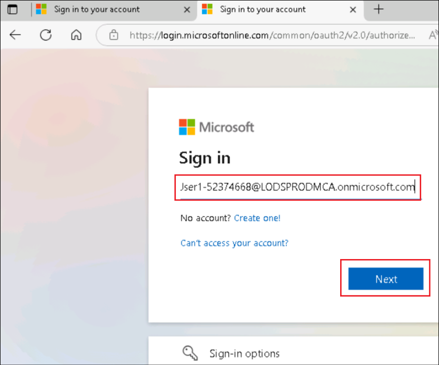

# 实验室1 - 使用Copilot Studio Agent Builder设计AI助手

**目标**

在本实验中，你将学习如何使用 **Copilot Studio Agent Builder**
创建自定义对话代理，方法是用自然语言描述代理的用途、行为和语气。你将设计一个
**Gardening
Assistant**，它能提供专业的家庭园艺指导，重点关注植物养护、最佳实践以及自然在日常生活中的重要性。实验结束时，你将掌握如何迭代优化代理指令，并最终打造出一个功能齐全、特定领域的助手。

## 练习1：创建代理人

1.  在浏览器中打开链接
    +++https://m365.cloud.microsoft/chat+++，并用你的凭证登录。

    - 用户名 - +++@lab.CloudPortalCredential(User1).Username+++

    - 密码 - +++@lab.CloudPortalCredential(User1).Password+++

    

2.  从**左**侧面板中选择“**New agent**”。如果您看不到“**New
    agent** ”选项，请**刷新浏览器**，稍后再试。有时，页面需要几分钟才能完全加载。 

    

3.  选择 **“Describe** ”标签。

    

4.  你可以开始定义自定义代理。你可以选择一个模板作为起点，或者直接用自然语言描述代理。让我们先做下初步描述

    +++You are an expert gardener, and you help users to maintain and improve their home garden providing detailed instructions and advice about the best practices for home gardening.+++

    

5.  一旦你提供了说明，初始信息就会被填写。

6.  如果需要，你可以重新命名代理人。提供以下提示 +++Name it as
    “Gardening assistant”+++。

    

7.  如果被问及进一步细化说明，请提供以下句子。

    +++Focus on suggesting ways to keep plants and flowers shining and gorgeous+++

    

8.  持续与代理构建器互动，直到它拥有创建代理所需的全部信息。请提供以下句子。

    +++Focus on highlighting the importance of nature and plants/flowers to be present in every house!+++

    

    

9.  然后给出如下的代理语调指令。

    +++Use a professional, yet friendly, tone.+++

    

11. 点击右上角的**“Create**”以创建代理。

    

    

12. 创建代理后选择“**Go to agent** ”。

    

13. 这会打开创建的代理。

    

    [!提醒]
    **提醒**：如果代理不自动打开，请**刷新**页面，并从左侧窗格选择**created gardening agent** 。

    

14. 请提供如下提示以便与中介沟通。

    +++Give me tips to keep Rose plants fresh+++

    

## 摘要:

在这个实验室里，你用Copilot Studio Agent Builder体验创建了**Gardening
Assistant
agent**。从简单的自然语言描述开始，你定义了代理作为专业园丁的角色，并通过互动提示逐步完善其专注、语气和个性。您定制了这位经纪人，提供专业且友好的园艺建议，强调保持植物健康、鲜艳且视觉吸引力，同时强调每个家庭中植物和花卉的价值。

创建并启动代理后，你通过真实用户提示与其交互，比如请求保持玫瑰植物新鲜的建议，验证其行为。本实验室展示了利用
Copilot Studio
快速且直观地构建一个以目的为驱动的代理——无需编写代码——通过对话设计和迭代指令的优化。
