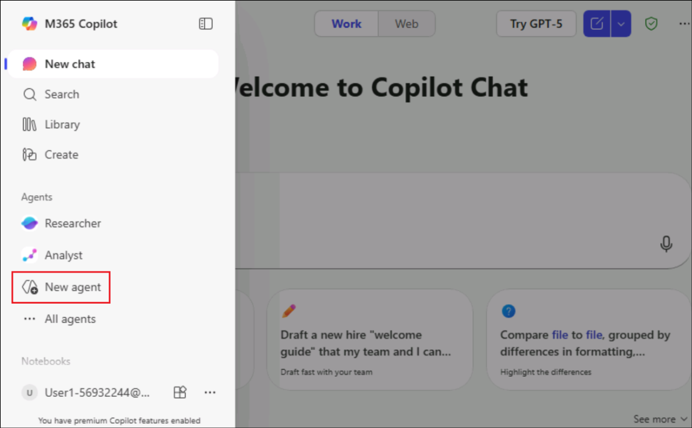

# Lab 01 - Create a gardening assistant agent using Copilot Studio lite experience

## Objective

In this lab you will start out building a gardening agent using Copilot
Studio agent builder by providing a sample set of instructions.

## Exercise 1: Creating the agent

1.  Open the link +++https://m365.cloud.microsoft/chat+++ from a browser and login
    with your credentials.
    
    - Username - +++@lab.CloudPortalCredential(User1).Username+++
    
    - Password - +++@lab.CloudPortalCredential(User1).Password+++

    

    >[!Alert] **Alert:** If you get a screen stating that the site is unsafe, click on More information and select Continue to the site.
    >
    >

4.  Select **New agent** from the **left** pane. If you are **not** able to see the **New agent** option, **refresh** the **browser** and try again in few minutes. At times, it takes few minutes to get loaded completely.

    

5.  The Copilot Studio lite experience pops up and you can start defining
    the custom agent. You can choose a template to start from, or you
    can simply *describe* the agent by providing a description in
    natural language. Let's provide the following initial description

    +++You are an expert gardener, and you help users to maintain and improve their home garden providing detailed instructions and advice about the best practices for home gardening.+++

    

6.  Once you have provided the instructions, you will be asked about the name for the new agent.

7.  Provide the name: +++Gardening assistant+++.

    

8.  If you are asked about refining instructions further, provide the following sentence.

    +++Suggest ways to keep plants and flowers shining and gorgeous+++

    

9.  Keep on interacting with the agent builder until it does have all
    the information needed to create the agent. Provide the following
    sentence.

    +++Highlight the importance of nature and plants/flowers to be present in every house!+++

    

10. Then give an instruction of the agent tone as below.

    +++Use a professional, yet friendly, tone.+++

    

11.  Click on **Create** on the top right to create the agent.

     

     

12. Select **Go to agent** once the agent is created.

    

13. This opens the created agent.

    

    >[!Alert] **Alert:** If the agent does not open automatically, **refresh** the page and select the **created gardening agent** from the left pane.
    >
    >
    
14. Select any prompt in the agent and click on **Send** and observe the
    response.

    

    

## Summary:

In this lab, you have learnt to create an agent from the Copilot Studio
Agent Builder.

