# 實驗室1 - 使用Copilot Studio Agent Builder設計AI助手

**目標**

在本實驗中，你將學習如何使用 **Copilot Studio Agent Builder**
創建自定義對話代理，方法是用自然語言描述代理的用途、行為和語氣。你將設計一個
**Gardening
Assistant**，它能提供專業的家庭園藝指導，重點關注植物養護、最佳實踐以及自然在日常生活中的重要性。實驗結束時，你將掌握如何迭代優化代理指令，並最終打造出一個功能齊全、特定領域的助手。

## 練習1：創建代理人

1.  在瀏覽器中打開鏈接
    +++<https://m365.cloud.microsoft/chat+++>，並用你的憑證登錄。

    - 用戶名 - <+++@lab.CloudPortalCredential>(User1).Username+++

    - 密碼 - <+++@lab.CloudPortalCredential>(User1).Password+++

> 

2.  從**左**側面板中選擇“**New agent**”。如果您看不到“**New
    agent** ”選項，請**刷新瀏覽器**，稍後再試。有時，頁面需要幾分鐘才能完全加載。 

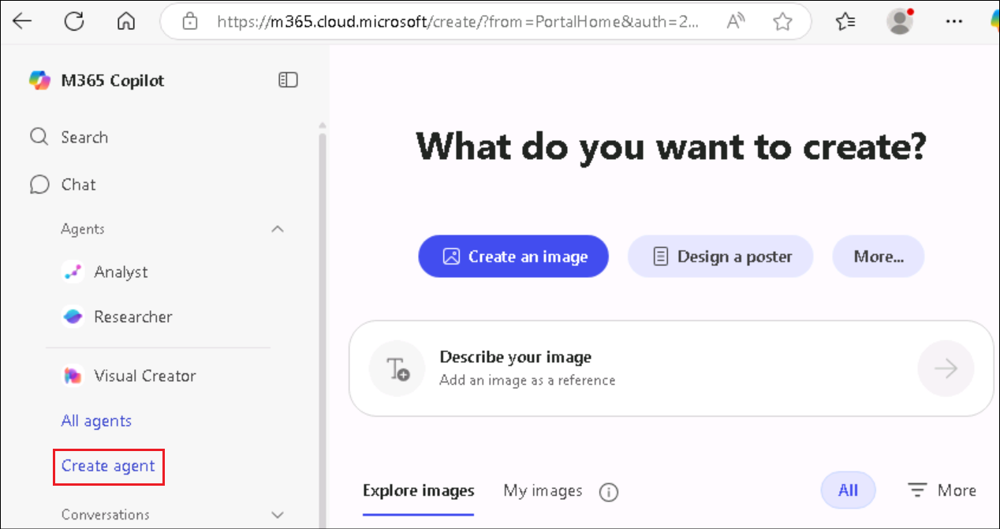

3.  選擇 **“Describe** ”標簽。

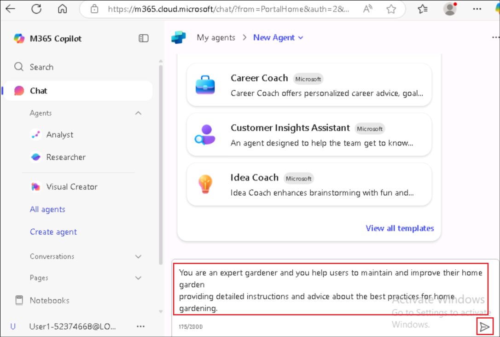

4.  你可以開始定義自定義代理。你可以選擇一個模板作為起點，或者直接用自然語言描述代理。讓我們先做下初步描述

> +++You are an expert gardener, and you help users to maintain and
> improve their home garden providing detailed instructions and advice
> about the best practices for home gardening.+++

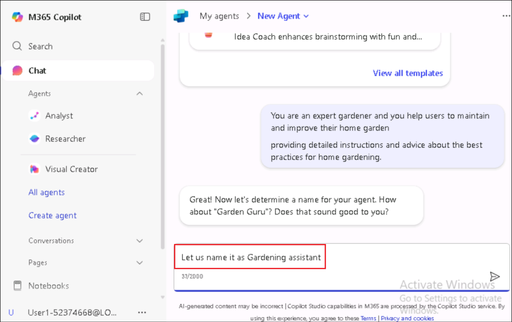

5.  一旦你提供了說明，初始信息就會被填寫。

6.  如果需要，你可以重新命名代理人。提供以下提示 +++Name it as
    “Gardening assistant”+++。

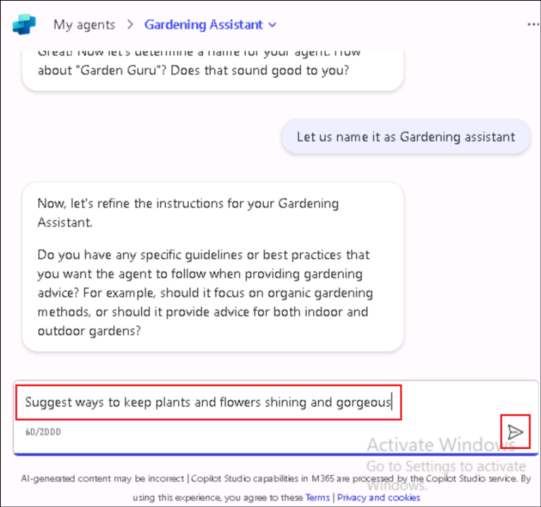

7.  如果被問及進一步細化說明，請提供以下句子。

+++Focus on suggesting ways to keep plants and flowers shining and
gorgeous+++

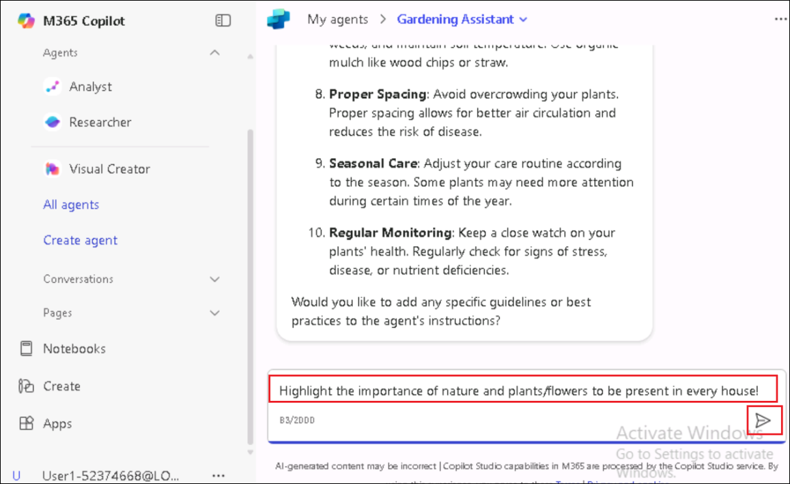

8.  持續與代理構建器互動，直到它擁有創建代理所需的全部信息。請提供以下句子。

> +++Focus on highlighting the importance of nature and plants/flowers
> to be present in every house!+++
>
> 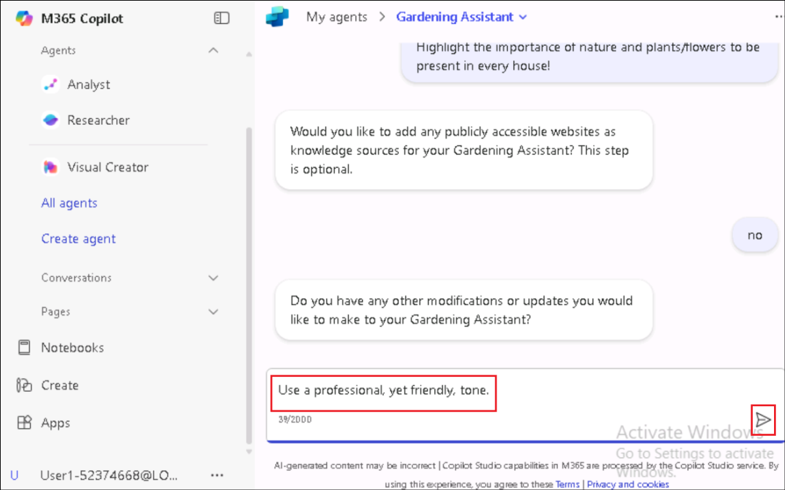
>
> 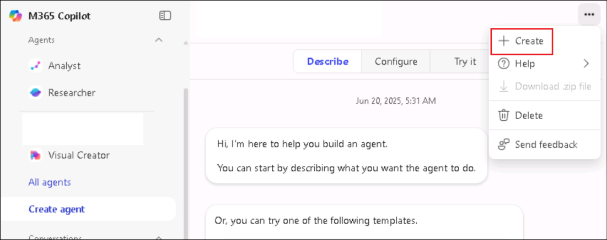

9.  然後給出如下的代理語調指令。

+++Use a professional, yet friendly, tone.+++

> 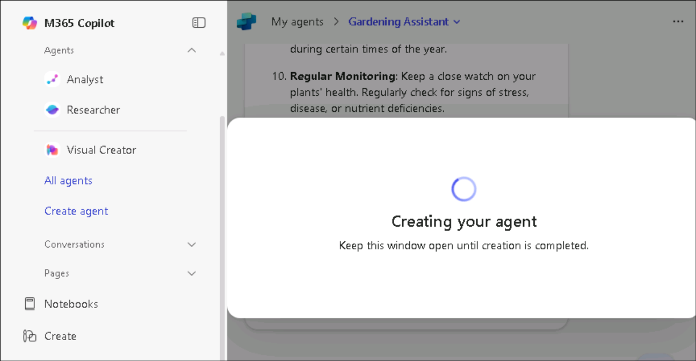

11. 點擊右上角的**“Create**”以創建代理。

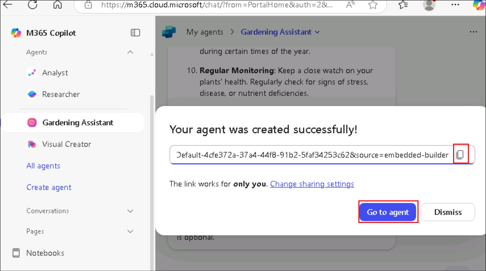

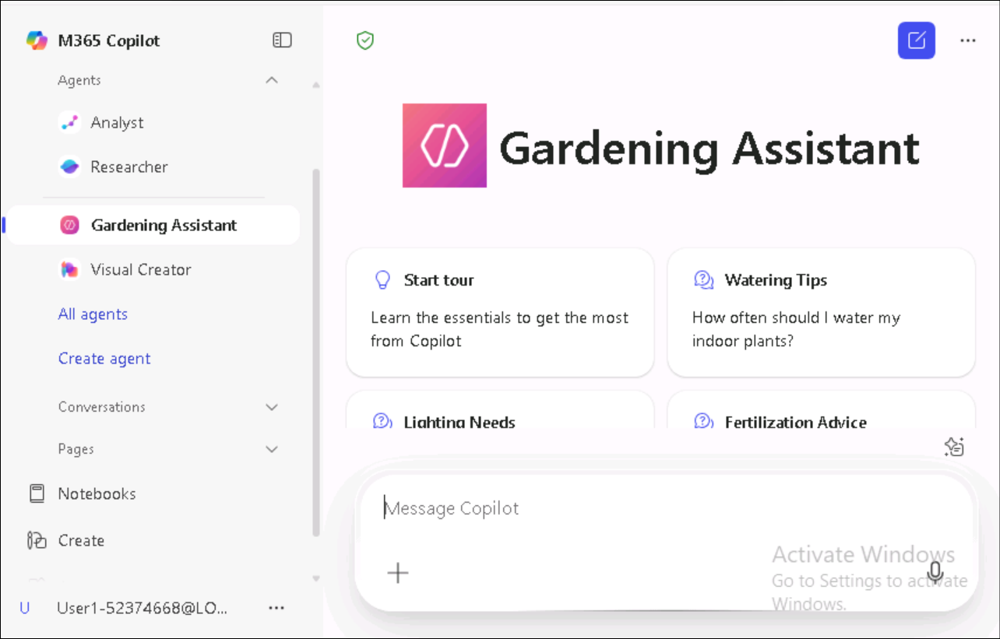

12. 創建代理後選擇“**Go to agent** ”。

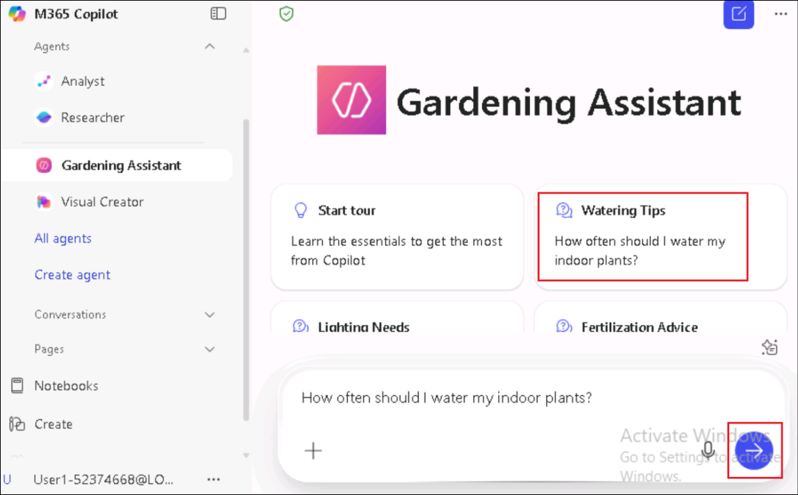

13. 這會打開創建的代理。

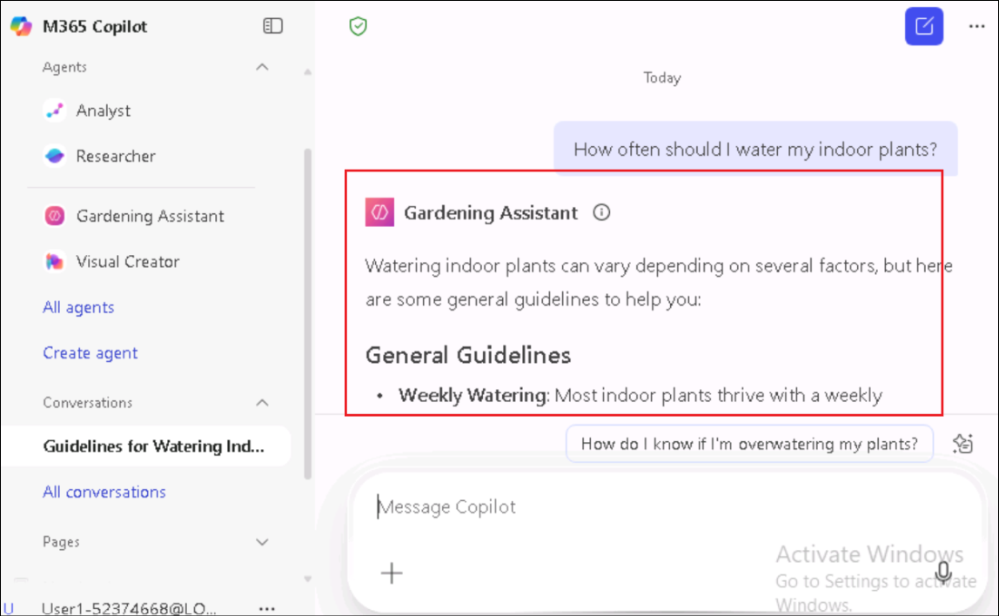

> \[!提醒\]
> **提醒**：如果代理不自動打開，請**刷新**頁面，並從左側窗格選擇**created
> gardening agent** 。
>
> 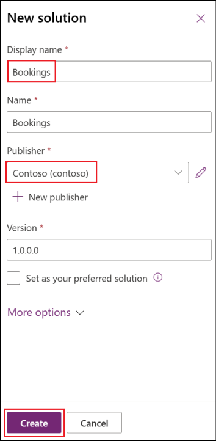

14. 請提供如下提示以便與中介溝通。

> +++Give me tips to keep Rose plants fresh+++

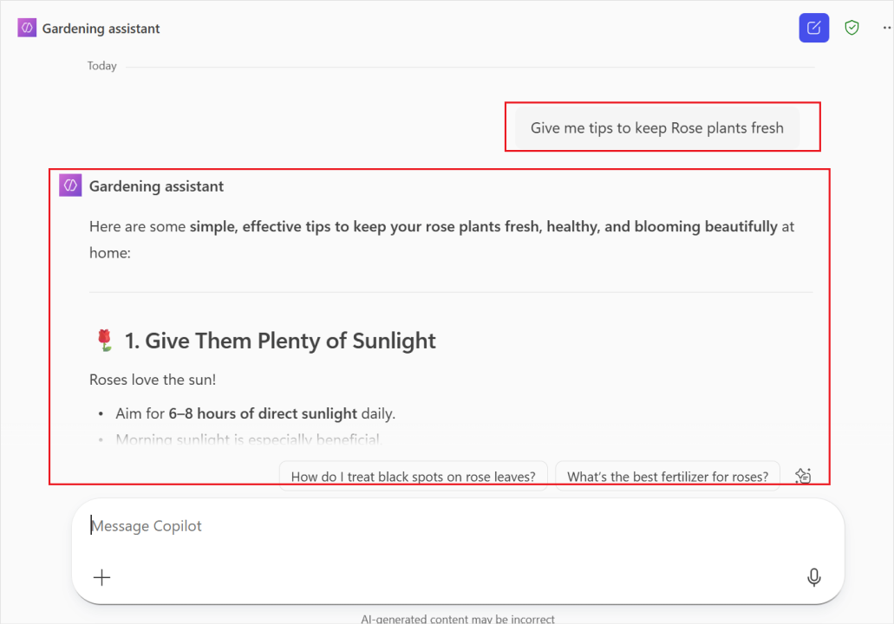

## 摘要:

在這個實驗室裡，你用Copilot Studio Agent Builder體驗創建了**Gardening
Assistant
agent**。從簡單的自然語言描述開始，你定義了代理作為專業園丁的角色，並通過互動提示逐步完善其專注、語氣和個性。您定制了這位經紀人，提供專業且友好的園藝建議，強調保持植物健康、鮮豔且視覺吸引力，同時強調每個家庭中植物和花卉的價值。

創建並啟動代理後，你通過真實用戶提示與其交互，比如請求保持玫瑰植物新鮮的建議，驗證其行為。本實驗室展示了利用
Copilot Studio
快速且直觀地構建一個以目的為驅動的代理——無需編寫代碼——通過對話設計和迭代指令的優化。
