# 실습 01:부동산 애플리케이션(Real Estate Application) 관리를 위한 Copilot Studio 에이전트 생성 및 활용

**실습 소요 시간** – 90분

**소개**

Contoso Real Estate은 상업용 및 주거용 부동산의 판매와 관리를 전문으로
하며, 현재 고객 정보는 Dataverse 인스턴스에 효율적으로 저장되어 있어
데이터 관리는 원활하게 이루어지고 있습니다. 그러나 예약 프로세스는
여전히 큰 과제로 남아 있습니다.

현재 고객은 전화로만 예약을 요청할 수 있어, 전화 문의가 폭주하고 대기
시간도 길어지고 있습니다. 이로 인해 고객들은 불만을 가지게 되고, 많은
잠재 고객이 사무실과 연결되지 못해 서비스를 요청하지 못하는 상황이
발생하며 비즈니스 손실로 이어질 위험이 있습니다.

이러한 문제를 해결하기 위해 Contoso Real Estate은 종합적인 디지털 솔루션
개발에 착수했습니다. 이 솔루션은 고객이 예약 절차에 대한 정보를 쉽게
확인하고 온라인으로 예약 요청을 제출할 수 있도록 지원할 것입니다..

**목표**

- Copilot Studio에서 Contoso Real Estate를 위한 독립형 에이전트를
  구축(이 에이전트를 통해 고객은 부동산 예약 절차에 대한 정보를
  확인하고, 사무실에서 검토할 수 있도록 예약 요청을 생성할 수 있음)

- 예약 절차의 논리를 설정하기 위해 토픽(Topics)을 생성

- 예약에 필요한 Dataverse 테이블을 생성

- Copilot을 게시

:::danger **Lab 03**은 Day 2의 실습을 진행하기 위해 반드시 Day 1이
끝나기 전까지 완료되어야 합니다. Lab 01과 02가 완료되지 않았더라도,
반드시 Lab 03은 Day 1 내에 완료해 주시기 바랍니다. :::

## 연습 0: 환경 설정

### 작업 1: VM에 로그인

1.  **Home** 탭에서 **Username** 및 **Password**를 사용해 VM에
    로그인하세요.

### 작업 2: VM clock 동기화

1.  VM에 로그인한 후, 화면 오른쪽 하단에 있는 시계를 마우스 오른쪽
    버튼으로 클릭하세요.

2.  **Adjust date and time**를 선택하세요.

3.  열린 설정 화면에서 추가 설정 아래에 있는 **Sync now**를 클릭하세요.

4.  자동 동기화가 제대로 작동하지 않을 경우를 대비해, 이 단계는 시간을
    수동으로 동기화하는 역할을 합니다.

5.  Settings 창을 **Close**(닫으세요).

6.  Sign in required 알림이 표시되면, Sign In을 클릭한 후 Sign in with a
    different account을 선택하고, VM의 Home 탭에 있는 admin
    credentials을 사용하여 로그인하세요.

7.  **sign in to this app only** 선택하세요.

8.  로그인한 후**Teams** 앱을 **close**(닫으세요). Day 3 실습에서 사용할
    것입니다.

## 연습 1: Power Apps 및 Dataverse 설정

### 작업 1: Microsoft Power Apps 개발자 플랜 등록

1.  브로우저를 열고 다음 링크를 이동한 후, **Start free** 또는 **Try for
    free** 를 선택하세요: !\!<https://powerapps.microsoft.com/free/>!!

2.  메시지가 표시되면 Home 탭에 제공된Office Tenant
    Credentials **Username** 및 **Password**로 로그인하세요. 이 자격
    증명은 모든 실습에서 Microsoft 사이트 및 앱에 로그인할 때 사용되는
    **login credentials** (로그인 자격 증명)입니다.

3.  Under **Let's get started**화면에서, 텍스트 상자에 **Home** 탭에
    **Administrative Username**를 입력하고**,**  동의 확인란을 체크한
    후**Start free**를 선택하세요.

4.  기존 Microsoft 계정이 있다는 알림이 표시되면, Sign in을 선택하고
    비밀번호를 입력하세요.

5.  메시지가 표시되면  **Yes**를 선택하여 로그인 상태를 유지하세요.

6.  화면 오른쪽 상단에 있는 **Environment(환경)** 를 클릭하고 **Dev
    One** 이 선택되어 있는지 확인하세요. 선택되어 있지 않다면 **Dev
    One** 을 선택하세요.

### 작업 2: 솔루션 만들기

1.  다음 Power Apps Maker Portal의 왼쪽 창에서 **Solutions**  을
    선택하세요: (!\!<https://make.powerapps.com/>!!).

2.  **+ New solution**를 클릭하세요.

3.  표시 이름(Display name)에 !!**Bookings**!!을 입력하고, **Publisher**
    항목에 **Contoso (contoso)** 를 선택한 후, **Create**을 클릭하세요.

> 

**Publisher** 항목에 **Contoso** 옵션이 표시되지 않는 경우, 다음 두
단계를 실행하세요. 표시되는 경우에는 **6**단계부터 계속 진행하세요.

4.  **Contoso** 옵션이 **Publisher**목록에 표시되지 않는 경우, **+ New
    Publisher**를 선택하세요.

> 

5.  다음 정보를 입력한 후, **Save**을 클릭하세요.

[TABLE]

> 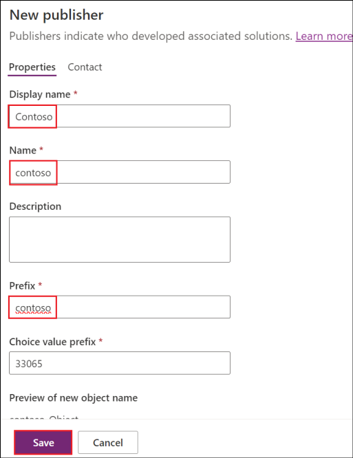

6.  화면 왼쪽 상단에서 **Back to solutions**을 선택하세요.

### 작업 3: 기본 솔루션 설정

1.  Maker 포털의 **Solutions** 섹션에서 **Set your preferred
    solution** 옆에 있는 **Manage**를 선택하세요.

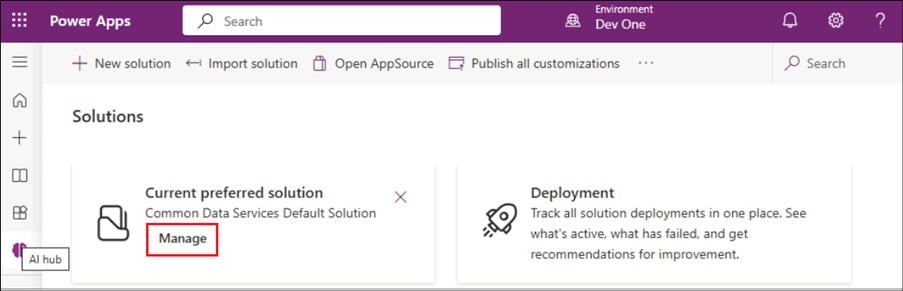

2.  **Unless otherwise specified, save my changes in**에서 **Bookings
    (contoso)**를 선택하고, **Apply**를 선택하세요.

### 작업 4: 부동산 속성(Real Estate Properties) 맞춤 테이블 생성하기

새로운 테이블을 생성하는 방법에는 두 가지가 있습니다. 하나는 기존의 수동
방법이고, 또 다른 하나는 Copilot을 사용하는 방법입니다.

#### 작업 4.1: Copilot을 사용해 Real Estate Properties 맞춤 테이블 생성하기

"Real Estate Property" 테이블을 다음과 같은 열과 데이터 유형으로
생성하세요-  
1. Property Name – Single line of text  
2. Asking Price - Currency   
3. Street - Single line of text  
4. City - Single line of text  
5. Client - Data type Lookup, Related table - Contact  
  
Real Estate Property 테이블에 Bedrooms 및 Bathrooms라는 두 개의 열을 더
추가하고 각각 데이터 유형(Datatype)을 선택할 수 있습니다. -  
1. Label - 1, Value - 1  
2. Label - 2, Value -2  
3. Label - 3, Value 3  
4. Label - 4, Value 4  
5. Label - 5, Value 5

 

"Booking Request" 테이블을 다음과 같은 열과 데이터 유형으로 생성하세요
-  
1. Booking Name - Single line of text  
2. Property - Data type Lookup, Related table - real estate property  
3. View name - Single line of text  
4. Viewer Email - Single line of text  
5. Booking Date - Date and time  
6. Notes - Multiple lines of text

 

"Booking Request" 테이블에 Decision 열을 추가하고, 데이터
유형은 **Choice**로 설정하세요 -  
1. Label - Undecided, Value - 1  
2. Label - Accepted, Value -2  
3. Label - Declined, Value 3

열이 모두 생성되면 **Real Estate Property columns and data**에 다음
테스트 데이터를 입력하세요:

- Property Name: !!**1100 High Villas**!!

- Asking Price: !!**250,000**!!

- Bathrooms: **3**

- Bedrooms: **2**

- City: !!**Redmond**!!

- Street: !!**Main Avenue**!!

#### 작업 4.2: Copilot을 사용하여 Real Estate Properties 맞춤 테이블 생성하기

Real Estate Properties 맞춤 테이블을 Dataverse에서 수동으로 생성하려면
다음 단계를 따르세요.

1.  왼쪽 탐색 창에서 **Tables** 을 선택한 후, **+ New table** 옆의
    드롭다운을 클릭하고 **Create** **new tables**를 선택하세요.

2.  **Let’s set up your data** 대화 상자에서 **Got it**을 클릭하세요.

3.  Create new tables 화면에서 **+ New table -\> Add columns and
    data**를 클릭하세요.

4.  테이블 이름을 Table1에서 !!**Real Estate Property**!!로 변경한 후,
    **Save and exit**를 클릭하세요.

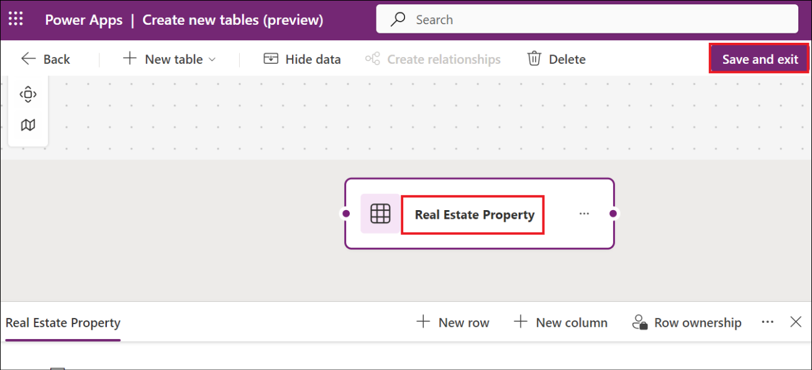

5.  Confirmation (확인) 대화 상자에서 **Save and exit**를 클릭하세요.

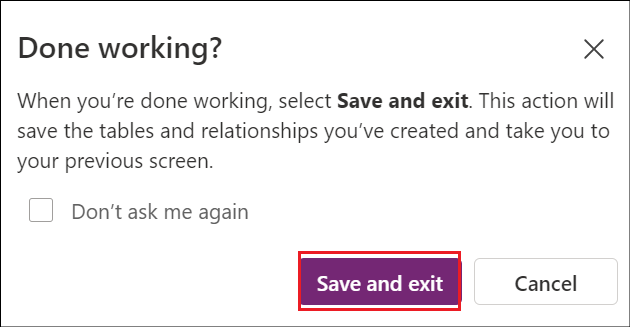

6.  저장이 완료되면 **Custom**  탭을 클릭하여 새로 생성된 테이블을
    찾습니다. 그 후, **Real Estate Property** 테이블을 클릭하세요.

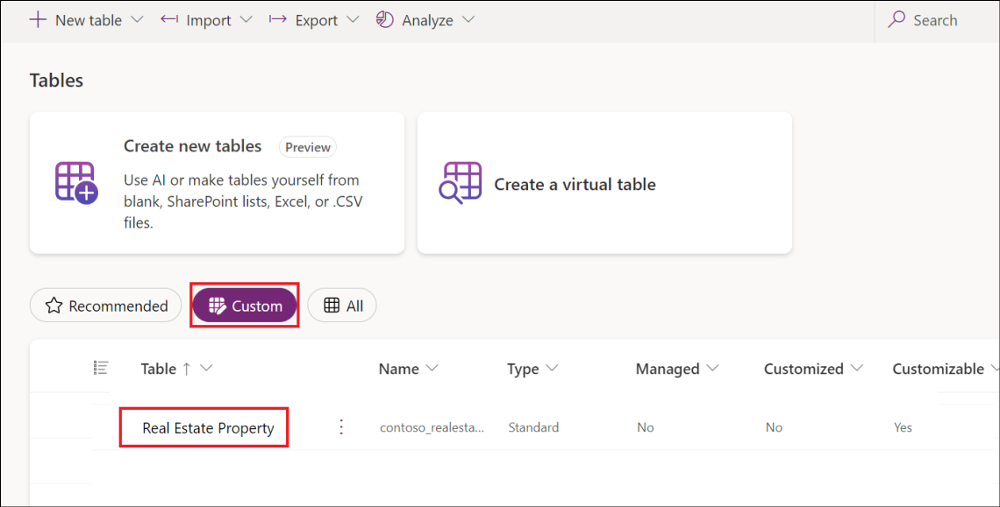

7.  **Real Estate Property columns and data** 아래에서 **New
    Column** 이라는 열의 이름을 변경합니다. **New Column**  옆의
    드롭다운을 클릭하고 \***Edit Column** 을 선택한 후 **Display name**
    을 !!**Property Name**!! 로 업데이트하고 **Save** 을 선택하세요.

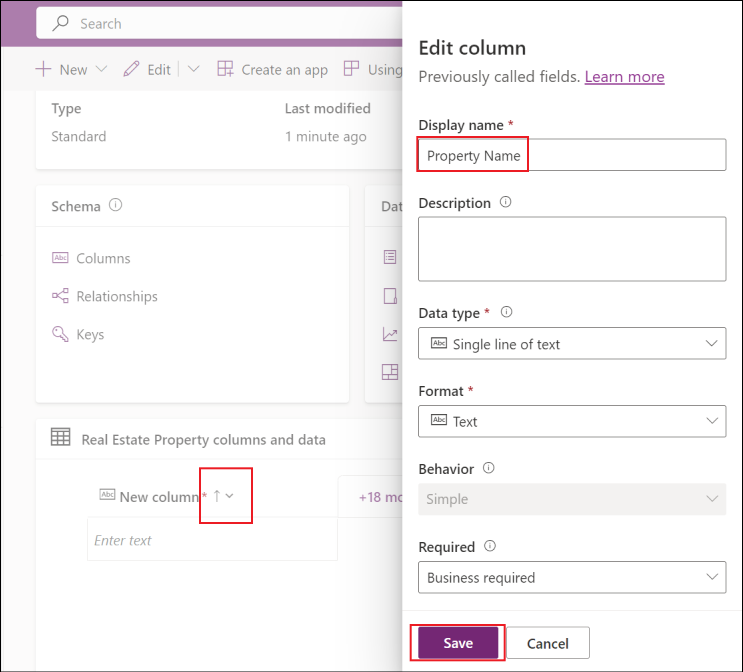

8.  열 및 데이터 창에서 + 버튼을 클릭하여 새 열을 추가하세요. 새 열
    창에서 다음 값을 입력한 후 **Save** 을 선택하세요.

    - Display name: !!**Asking Price**!!

    - Data type: Currency

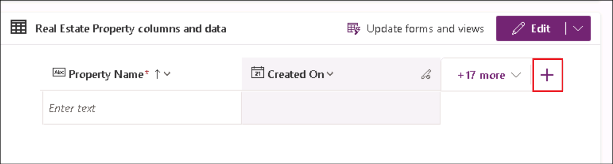

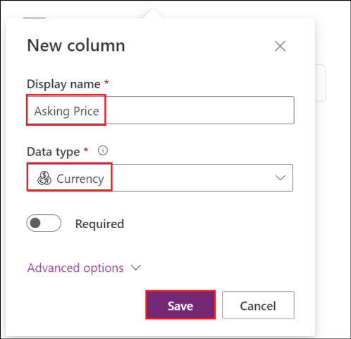

9.  다음 두 열을 추가하세요.

[TABLE]

10. 아래 값으로 다른 열을 추가하세요.

    - **Display name**: !!Bedrooms!!

    - **Data type**: Choice -\> Choice

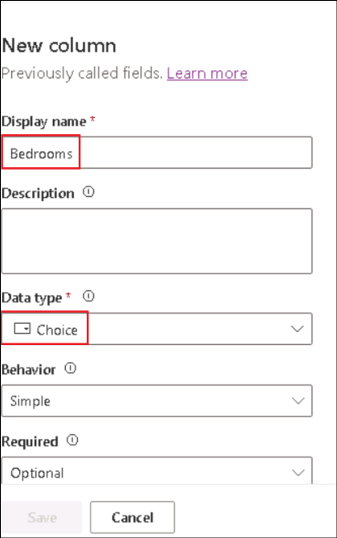

선택 값을 생성하세요:

**Sync this choice with** 옵션에서 **+ New choice** 를 선택하세요.

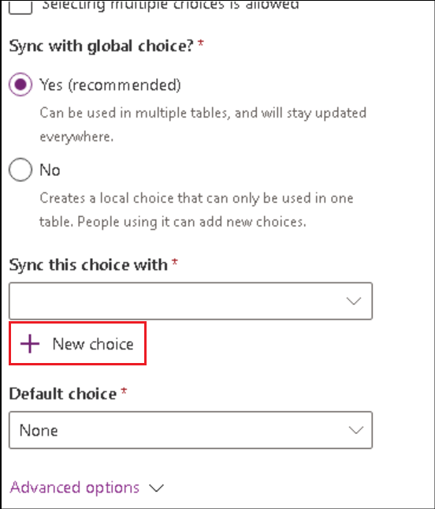

- **Choices 항목** 아래에서 표시(Display) 이름을 !!**Bedrooms**!! 로
  입력하세요.

- **Label** 과 **Value** 라는 두 개의 입력 필드가 표시됩니다. Label
  필드에 1을 입력하세요. Power Apps는 값을 자동으로 할당하지만, 값을 1로
  변경할 수 있습니다.

 

- **+ New choice**  항목을 선택한 후, Label에 **2**, Value에 **2**를
  입력하여 새 항목을 추가하세요.

 

- **+ New choice**  항목을 선택한 후, Label에 **3**, Value에 **3**을
  입력하여 새 항목을 추가하세요.

 

- **+ New choice**  항목을 선택한 후, Label에 **4**, Value에 **4**를
  입력하여 새 항목을 추가하세요.

 

- **+ New choice**  항목을 선택한 후, Label에 **5**, Value에 **5**를
  입력하여 새 항목을 추가하세요.

 

- **Save**선택하세요.

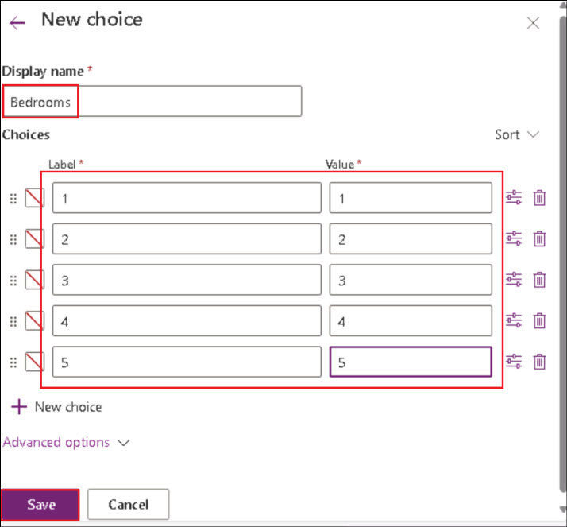

**Sync this choice with** 드롭다운 메뉴를 클릭하여 추가된 선택(choice)
**Bedrooms**을 선택하세요.

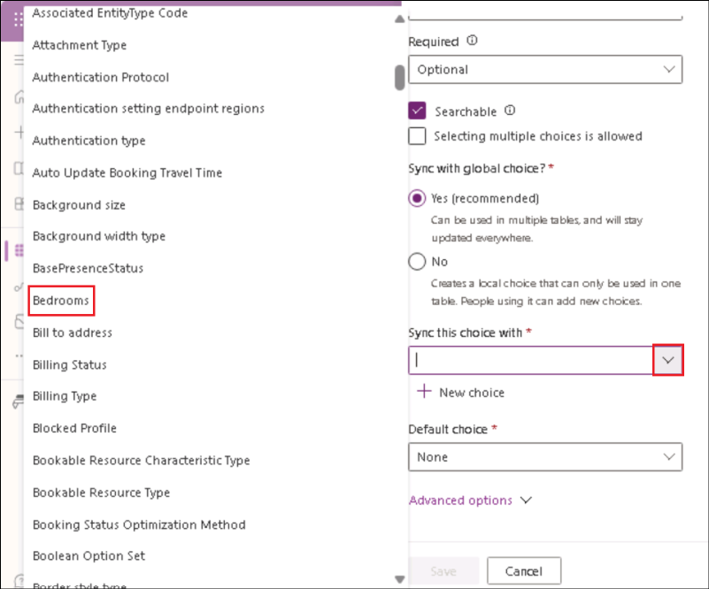

**Save**를 클릭하세요.

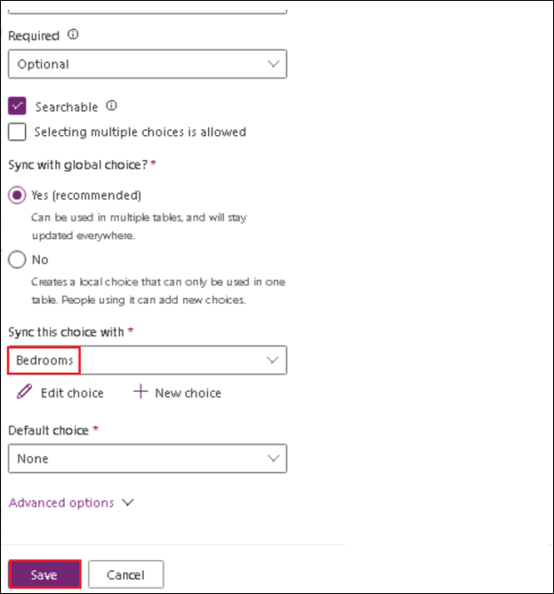

11. 열 및 데이터 창에서 + 버튼을 선택하여 새 열을 추가하세요.

12. New column 창에서 다음 값을 입력한 후, **Save**을 선택하세요:

    - **Display name**: !!Bathrooms!!

    - **Data type**: Choice -\> Choice

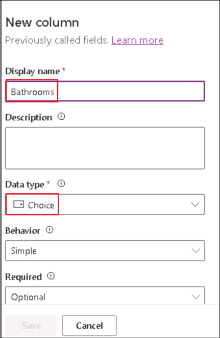

Choice 값을 생성하세요:

**Sync this choice with**에 있는 **+ New choice** 를 선택하세요.

- **Choices**에서 Display name을 !!Bathrooms!!으로 제공하세요.

 

- 두 개의 입력 필드가 표시됩니다: **Label** 과 **Value** . Label에
  **1**을 입력하세요. Power Apps가 값을 자동으로 할당하지만, 이를
  **1**로 변경할 수 있습니다.

- **+ New choice**를 선택하고, Label에 **2** 및 Value에 **2**를
  입력하세요.

- **+ New choice**를 선택하고, Label에 **3** 및 Value에 **3**을
  입력하세요.

- **+ New choice**를 선택하고, Label에 **4** 및 Value에 **4**를
  입력하세요.

- **+ New choice**를 선택하고, Label에 **5** 및 Value에 **5**를
  입력하세요.

- **Save**를 선택하세요.

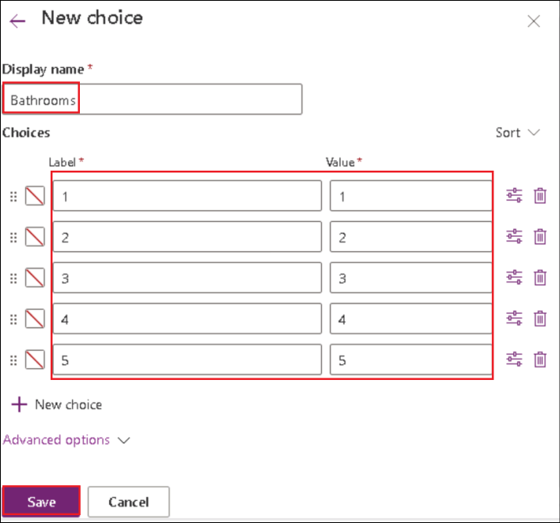

생성된 선택(choice) 항목을 선택하고, 열 추가 창에서 **Save**을
클릭하세요.

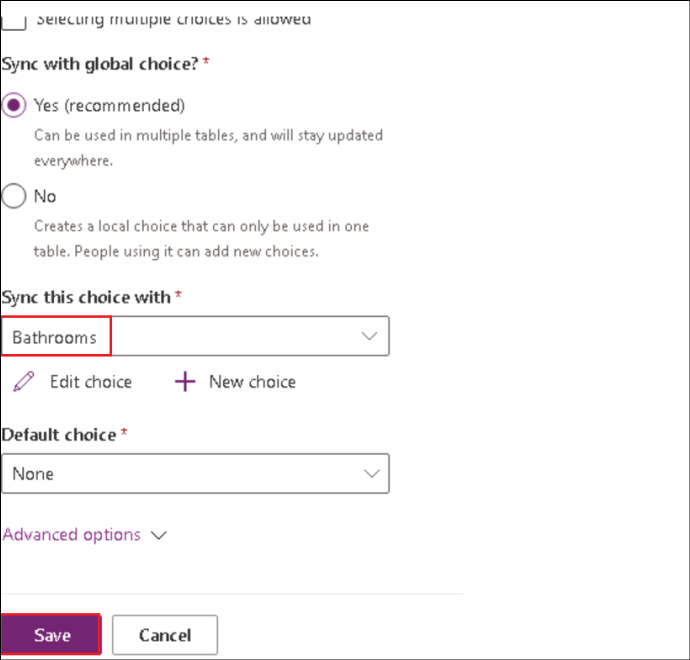

13. columns and data 창에서 + 버튼을 다시 선택하여 다른 열을 추가하세요.

New column 창에서 다음 값을 입력한 후 **Save**을 선택하세요:

- **Display name**: !!**Client**!!

- **Data type**: Lookup -\> Lookup

- **Related Table**: Contact

14. 모든 열이 생성되면, **Real Estate Property** **columns and data**
    아래에 다음 테스트 데이터를 입력하세요:

:::secondary 참고: 필요한 열이 표시되지 않으면, **+\<number\>more**를
선택하여 표시되는 열을 수정하세요. :::

- Property Name: !!**1100 High Villas**!!

- Asking Price: !!**250,000**!!

- Bathrooms: **3**

- Bedrooms: **2**

- City: !!**Redmond**!!

- Street: !!**Main Avenue**!!

- Client: **Select any contact**

::: secondary 참고: Contact 테이블에 **client** 기록이 없다면, 해당 열에
데이터를 추가하지 않아도 됩니다. :::

### 작업 5: Bookings 테이블 생성

다음 단계를 따라 Real Estate Property Bookings을 위한 새로운 맞춤형
테이블을 Dataverse에서 생성하세요.

1.  왼쪽 탐색 창에서 **Tables**을 선택한 후, **Create** **new tables**를
    선택하세요.

2.  **Create new tables** 화면에 **+ New table -\> Add columns and
    data**를 클릭하세요.

3.  테이블 이름을 **Table1**에서 !!**Booking Request**!! 로 변경하세요.
    그 후, **Save and exit**를 클릭하세요.

4.  확인(confirmation) 대화상자에서 **Save and exit**를 클릭하세요.

5.  저장이 완료되면 **Custom** 탭을 클릭하여 새로 생성된 테이블을
    확인하세요. **Booking Request** 테이블을 클릭하세요.

6.  New Column이라는 이름의 열을 !!Booking Name!!으로 변경하세요. (**New
    Column** 옆의 드롭다운을 클릭하고 **Edit Column**을 선택한 후 표시
    이름 수정).

7.  열 이름 옆에 있는 **+** 기호를 클릭하세요.

8.  아래에 명시된 이름과 데이터 유형으로 열을 생성한 후, **Save**을
    클릭하세요.

    - Display name – !!Property!!

    - Data type – Lookup -\> Lookup

    - Related Table – Real Estate Property

- Display name – !!Viewer Name!!

- Data type – **Single line of text**

 

- Display name – !!Viewer Email!!

- Data type – **Single line of text**

- Format – **Email**

 

- Display name – !!Booking Date!!

- Data type – **Date and time**

 

- Display name – !!Notes!!

- Data type – **Multiple lines of text**

9.  아래 세부 정보를 사용하여 선택 데이터 유형 열을 추가하세요.

    - Display name – !!Decision!!

    - Data type – Choice -\> Choice

**Sync this choice with**에서 **+ New Choice**를 클릭하세요. **Display
name**을 !!**Decision**!!으로 입력하세요.

다음 정보를 입력하고 **Save**를 클릭하세요.

- Label – !!**Undecided**!!

- Value – 1

- Label – !!**Accepted**!!

- Value – 2

- Label – !!**Declined**!!

- Value – 3

**Sync this choice with** 필드에서 추가된 **Choice Decision**을 선택한
후, **Undecided**를 **Default choice** 항목으로 지정하고 **Save**을
클릭하세요.

## 연습 2: Copilot Studio 사용하기

### 작업 1: Copilot Studio 체험판 등록

1.  브라우저의 새 탭에서 다음 url으로 이동하세요:
    !\!<https://copilotstudio.microsoft.com/>!!.

2.  **Choose your country/region**을 **default** 값으로 두고 **Start
    free trial**을 클릭하세요.

3.  왼쪽 상단에서 **Environments**을 클릭한 후, **Dev One**을
    선택하세요.

4.  Welcome to Copilot Studio! 메시지가 표시되면 **Skip** 을 선택하세요.

### 작업 2: Real Estate Booking Service 에이전트 생성

1.  왼쪽 탐색 창에서 **Create**를 선택한 후, **New agent** 타일을
    선택하세요.

2.  **Skip to configure**를 선택하세요.

3.  다음 정보를 입력하세요.

    - Name - !!**Real Estate Booking Service**!!

    - Description - !!**Create bookings for real estate properties**!!

    - Instructions - !!**Create a copilot for topics relating to
      creating bookings for real estate properties!!**

    - Language **–** **English** 선택

4.  화면 오른쪽 상단에 있는 **Create** 버튼 옆의 세 점을 클릭한
    후, **Edit advanced settings**를 선택하세요.

5.  **Bookings** 솔루션을 선택한 후, **Save**을 선택하세요.

6.  화면 오른쪽 상단에서 **Create**을 선택하세요ㅣ

7.  에이전트가 생성되면 Test your copilot 창에서 !!**How do I make a
    booking?**!! 을 입력하고 **Enter** 키를 눌러 응답을 확인하세요.
    일반적인 응답이 표시될 것입니다.

### 작업 3: 보안 구성

1.  화면 오른쪽 상단에서 **Settings**을 선택하세요.

2.  **Security** 탭을 선택한 후, **Authentication** 타일을 선택하세요.

3.  **No authentication** 선택하고 **Save**을 클릭하세요.

4.  **Save this configuration** 프롬프트에 **Save** 을 선택하세요.

5.  인증 설정이 저장되면 **Close** 옵션을 클릭하여 **Settings** 창을
    닫으세요.

### 작업 4: 필요하지 않은 주제 비활성화

새로 생성한 Copilot에는 샘플 토픽이 포함되어 있습니다. 이 샘플 토픽들은
삭제하고, 필요하지 않은 시스템 토픽은 비활성화하세요.

1.  Copilot Overview 페이지의 상단 메뉴에서 **Topics** 을 선택하세요.

2.  **Custom** Topics 페이지로 이동하게 됩니다.

3.  **System** 탭을 선택하세요. Sign in 토픽에 대해 **Enabled**를
    **Off**로 전환하세요.

### 작업 5: Copilot 게시 및 테스트

1.  에전트를 게시하기 위해서 **Publish**를 선택하세요.

2.  **Publish this agent** 대화상자에서 **Publish** 를 선택하세요.

### 작업 6: 데모 웹사이트

라이선스가 없는 사용자도 Copilot을 테스트할 수 있도록 데모 웹사이트가
제공됩니다. 이들에게 데모 웹사이트 URL을 공유할 수 있습니다.

1.  화면 오른쪽 상단의 **Settings** 또는 **Publish** 버튼 옆의 **점 세
    개** 를 클릭하고 **Go to demo website**를 선택하세요.

2.  **Type your message** 입력란에 !!**What information is needed to
    book a viewing for a real estate property?**!! 입력하고 에이전트의
    응답을 확인하세요.

Studio의 Test your agent 창에서 확인했던 것처럼, 이 데모 웹사이트에서도
일반적인 응답이 제공될 것입니다. 이는 아직 에이전트에 특정 주제나 동작
로직이 설정되지 않았기 때문이며, 향후 실습에서 이러한 기능들을
단계적으로 구성해 나갈 예정입니다.

## 연습 3: Copilot로 주제(topic) 생성 및 관리

### 작업 1: Copilot을 사용하여 주제 생성

자연어를 사용하여 주제를 생성하고 수정할 수 있습니다.

1.  **Copilot Studio**가 열려 있는 브라우저 탭으로 다시 이동하세요.
    **Topics** 탭에서 **Add a topic**을 선택한 후, **Create from
    description with Copilot** 옵션을 선택하세요.

:::secondary::: **참고:** Select Allow if prompted with See text and
images copied to the clipboard라는 메시지가 표시되면 Allow를 선택하세요.
:::

2.  다음 정보를 입력하고 **Create**를 클릭하세요.

    - Name your topic - !!**Customer Details**!!

    - Create a topic to... - !!**Ask the customer for their name and
      email address**!!

3.  새 주제가 트리거 문구 및 질문 노드와 함께 표시됩니다.

4.  **Save**를 선택하세요.

### 작업 2: 자연어로 노드 업데이트

1.  화면 오른쪽에 **Edit with Copilot** 창이 표시되지 않으면, authoring
    canvas 상단에 있는 **Copilot** 아이콘을 선택하세요.

2.  두 번째 질문 노드인 **What is your email address?**를 선택하세요.

3.  **Edit with Copilot** 패널에서 **What do you want to do?** 필드에
    다음 텍스트를 입력하세요.

!!**Update the message in this question node to say thank you to the
Name variable from the previous node and then proceed to ask the email
address question**!!

::: :::

4.  **Update**를 선택하세요.

5.  **Save**를 선택하세요.

### 작업 3: 자연어를 사용하여 노드 추가

기존 노드 업데이트를 추가하는 것 외에도 Copilot을 사용하여 새 노드를
추가할 수 있습니다.

1.  노드 주위의 빈 공간을 클릭하여 선택된 노드가 없는지 확인하세요.

2.  **What do you want to do?** 필드에서 다음 텍스트를 입력하고
    **Update**를 선택하세요.

!!**Add a new multiple-choice question to prompt the user if the details
are correct with two options Yes or No**!!

3.  새로운 질문 노드가 토픽 끝에 추가되며 사용자가 선택할 수 있는 옵션이
    표시됩니다.

4.  질문 부분에서, Are the details correct? 아래에 다음 내용을
    입력하세요:

> \<h3\>Summary\</h3\>
>
> \<p\>\<strong\>Full Name:\</strong\>
>
> Name string
>
> \</p\>
>
> \<p\>\<strong\>Email Address:\</strong\>
>
> EmailAddress string
>
> \</p\>
>
> \<p\> 태그 안에 있는 **Name string**과 **Email address** **string**을
> 해당 변수로 변경하려면, **{x}** 기호를 선택하여 각각의 변수로
> 대체하세요.

5.  **Save**를 선택하세요.

### 작업 4: 변수 범위 구성

1.  **Variables**을 선택하여 Variables 창을 여세요.

2.  주제(topic)에는 값을 입력받는 변수와 반환하는 변수가 있습니다. 이
    연습에서 사용하는 변수는 원래 주제로 값을 반환하는 역할을 합니다.

3.  주제 변수 오른쪽에 있는 체크박스를 선택한 후, **Save**을
    클릭하세요.

## 연습 4: 수동으로 주제(topic) 생성 및 관리

### 작업 1: From blank에서 주제(topic)을 생성하기

1.  **Topics** 탭을 선택하세요.

2.  **Add a topic**을 선택한 후, **From blank**를 선택하세요.

3.  Topic details 대화상자를 열기 위해 **Details** 을 선택하세요.

4.  다음 정보를 입력하고 **Save**를 클릭하세요.

    - **Name** - !!Book a Real Estate Showing!!

    - **Display Name –** !!**Book**!!

    - **Description** - !!Select the property and requested date and
      create a booking request!!

5.  Topic details 대화상자를 닫기 위해서 **Details** 를 선택하세요.

### 작업 2: 트리거 문구 추가

1.  **Trigger**에서 **Phrases** 항목 아래의 **Edit**를 선택하세요. **Add
    Phrases** 아래에 Enter !!**I want to book a real estate showing**!!
    을 입력한 후, **+** 아이콘을 클릭하세요.

2.  아래 문장들을 하나씩 입력하세요. 각 문장을 입력한 후에는 + 아이콘을
    눌러 추가하세요.

    - !!**Schedule a real estate showing**!!

    - !!**Arrange the viewing for a real estate property**!!

    - !!**Set up an appointment to view a house**!!

    - !!**Plan a property viewing**!!

3.  모든 문장을 추가한 후,  **Save**을 선택하세요.

### 태스크 3: 메시지 노드 추가

1.  트리거 노드 아래의 **+** 아이콘을 선택한 후, **Send a message**를
    선택하세요.

2.  **Enter a message** 필드에서 다음 문장을 입력하세요:

!!Hi, I can help you with booking a real estate property showing.!!

3.  **Save**를 선택하세요.

### 작업 4: 주제(Topic) 관리 노드 추가

1.  send a message 노드 아래에서 **+** 아이콘을 선택한 후, **Topic
    management -\> Go to another topic**을 선택하세요.

2.  **Customer Details** 주제를 선택하세요.

3.  **Save**를 선택하세요.

### 작업 5: 조건(condition) 노드 추가

1.  Topic management 노드 아래의 **+** 아이콘을 **Add a condition**을
    클릭하세요.

2.  변수로 **DetailsCorrect**를 선택하세요.

3.  **Condition**을 **is equal to**로 선택하세요.

4.  **value**를 **Yes**로 선택하세요.

5.  **Save**를 선택하세요.

### 작업 6: 질문 노드 추가

1.  왼쪽 condition 노드 아래에서 **+** 아이콘을 선택하고 **Ask a
    question**을 선택하세요. 다음 정보를 입력하고 **Save**를 클릭하세요.

    - Enter a message - !!Which property do you want to see?!!

    - **Identify** - Select **User's entire response** 선택하세요.

    - **Save user response as**을 **Variable name**에
      !!**PropertyName**!!를 입력하세요.

2.  질문 노드 아래의 **+** 아이콘을 선택하고 **Ask a question**를
    선택하세요 . 아래 정보를 입력하고 **Save**을 클릭하세요**.**

    - **Enter a message** - !!What date and time do you want to see the
      property?!!

    - Identify - **Date and Time** 선택

    - **Save user response as** – **Var1**을 클릭하여 Variable
      properties 창을 열고, **Variable name**에 !!**DateTime**!!을
      입력하세요.

### 작업 7: Copilot 테스트하기

1.  화면 오른쪽 상단에 있는 **Test** 버튼을 선택하여 testing 패널을
    엽니다. Testing 패널 상단의 오른쪽에 있는 **세 개의 점**을 선택하고,
    **Track between topics**을 선택하세요.

2.  **Conversation Start** 메시지가 표시되면, Copilot이 대화를
    시작합니다.

3.  응답으로, 생성한 주제에 대한 트리거 문구를 입력하세요:

!!I want to book a real estate showing!!

4.  Copilot이 "**What is your name?**"라는 질문을 합니다.

5.  성함을 입력해주세요.

6.  **Email**을 입력하라는 프롬프트가 나타나면 이메일을 입력하세요. 세부
    사항을 입력한 후에는 정보가 정확한지 묻는 질문과 함께 **Yes** 또는
    **No** 옵션이 표시됩니다. **Yes**를 선택하세요.

7.  **Which property to you want to see?** 프롬프트에 !!555 Oak Lane,
    Denver, CO 80203!!을 입력하세요.

8.  **What date and time do you want to see the property?** 프롬프트에
    !!**Tomorrow 10:00 AM**!!을 입력하세요.

## 연습 5: 예약이 생성되거나 업데이트될 때 자동으로 이메일을 보내는 자율 에이전트 구축

이 연습은 자율 에이전트의**When a row is added, modified or
deleted** 트리거를 보여주기 위한 것입니다.

### 작업 1: 에이전트 생성

1.  왼쪽 탐색 창에서 **Agents**를 클릭하세요.

2.  새로운 에이전트를 생성하려면 **+ New agent** 를 클릭하세요.

3.  에이전트를 구성을 설정하려면 **Skip to configure** 를 클릭하세요.

4.  다음 정보를 입력하고 **Create**을 선택하세요.

**Name** - !!Autonomous agent!!

**Description** - !!You are an agent to detect the updates to the
Booking Requests table!!

5.  에이전트 설정이 완료되려면 몇 초가 걸립니다. 완료되면 **Your agent
    is ready** 메시지와 함께 자율 에이전트가 열립니다.

6.  오른쪽 상단에서 **Settings**을 선택하세요.

7.  에이전트의 트리거 생성을 계속하려면 Generative AI 옵션이
    활성화되어야 합니다.

8.  **Settings** 화면 왼쪽에 있는 옵션 목록에서 Generative AI 옵션을
    선택하세요. **Using generative AI in conversations** 아래에서
    **Generative**를 선택하고 **Save**을 클릭하세요.

9.  **Settings** 창을 닫으세요.

### 작업 2: 에이전트에 트리거 추가

1.  Autonomous agent 페이지로 돌아가서, **Triggers (preview)** 섹션까지
    스크롤한 후 **+ Add trigger**를 선택하세요.

2.  **Add trigger** 화면에서 **When a row is added, modified or
    deleted** 트리거를 선택하세요.

3.  다음 화면에서 **Continue**를 클릭하세요.

4.  선택하면, **Trigger name** 및 **Sign in options**이 다음 화면에
    로드됩니다. 이 과정은 몇 분 정도 걸릴 수 있습니다. 선택한 트리거에는
    두 개의 앱이 표시됩니다. 하나는 **Microsoft Copilot Studio**이고,
    다른 하나는 **Microsoft Dataverse**입니다..

5.  로드되면 로그인 옵션에 대해 연결 상태가 **초록색**으로 표시되는지
    확인하고, **Next**를 클릭하여 계속 진행하세요.

6.  **Add trigger** 화면에서 아래 세부 사항을 선택하고 **Create
    trigger**를 클릭하세요.

    - Change type – **Added or modified**

    - Table name – **Booking Requests**

    - Scope – **Organization**

    - Trigger instructions – **default**으로 둡니다. 이렇게 하면 전체
      응답이 에이전트에 반환됩니다.

7.  트리거 생성을 완료하는 데 3-5분 정도 걸릴 수 있습니다.

8.  완료되면, **Time to test your trigger!** 화면에서 **Close**를
    클릭하세요.

9.  **Actions** 탭을 클릭하고 **+ Add action**를 선택하세요.

10. !!Send an email!! 를 찾고 **Send an email (V2) action**를
    선택하세요.

11. 연결이 설정되면 **Next**를 클릭하세요.

12. **End user authentication** 드롭다운에서 **Copilot author
    Authentication** 옵션을 선택하고 **Add action**을 선택하세요.

13. 생성한 Action을 선택하세요.

14. **Inputs** 탭을 선택하세요.

15. 메일을 받을 이메일 주소를 **Description** 필드에 입력한 후,
    **Save**을 클릭하세요. 이 이메일 주소는 본인이 액세스할 수 있는 모든
    메일 ID가 될 수 있습니다.

### 작업 3: 에이전트에 지침 추가

1.  **Overview**를 선택하여 Overview 페이지로 이동한 후, **Overview
    page**에서 Edit를 클릭하세요.

2.  아래의 지침을 **Instructions** 텍스트 영역에 붙여넣고, 섹션
    **b**에서 \<Mail ID\>를 세부 사항을 보낼 이메일 주소로 변경한 후
    **save** 을 클릭하세요.

!!a. Read the details of the row that gets added or modified!! !!b. Mail
the modified information only to \<Mail ID\> with a proper subject and
body added to the email!!

3.  Publish **를 클릭하여** 연결된 모든 채널에 에이전트를 게시하세요.

4.  **Publish this agent** 대화 상자에서 **Publish** 를 클릭하세요.

5.  게시가 완료되면 성공 메시지가 표시됩니다.

### 작업 4: Bookings 테이블 업데이트하기

1.  Login to !\!<https://make.powerapps.com/>!!에 로그인한 후, 왼쪽
    탐색**Tables**을 선택하세요.

2.  **Custom**을 선택한 다음, 목록에서 **Booking Request** 테이블을
    선택하세요.

3.  테이블의 값 추가 또는 업데이트하세요.

### 작업 5: 에이전트 테스트하기

1.  에이전트 페이지에서 Test를 선택한 후, **Activity Map**을
    활성화하세요.

2.  에이전트 페이지에서 **Test trigger** 옵션을 선택하세요. Bookings
    테이블에서 수행한 업데이트가 트리거를 실행했을 것입니다. 이 트리거를
    사용해 Copilot Studio에서 테스트를 진행할 예정입니다.

3.  최신 항목을 선택하고 **Start testing**을 클릭하세요.

4.  트리거가 실행됩니다.

5.  지정된 메일 ID로 메일이 전송됩니다.

6.  아래와 같은 메일을 받았는지 해당 메일함을 확인하세요.

**요약**

이 실습에서는 다음 내용을 배웠습니다:

- Copilot Studio에서 에이전트를 만들고 주제(topic)를 생성하는 방법

- Copilot Studio에서 에이전트를 테스트하고 데모 웹사이트에 게시하는 방법

- 자율 에이전트를 구축하고 이를 테스트하는 방법

 
