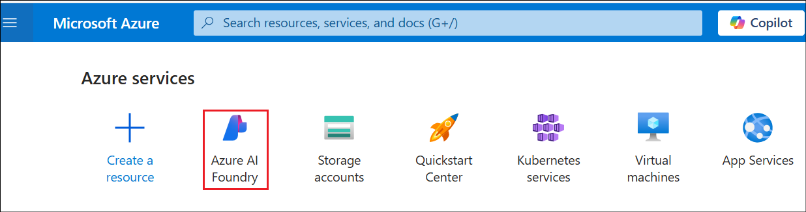
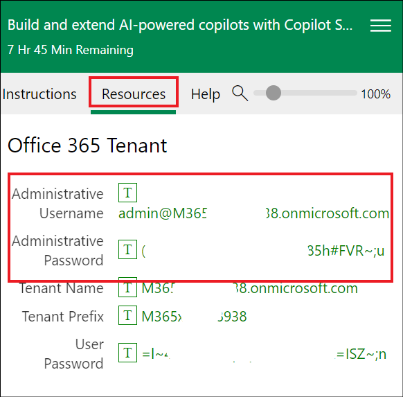
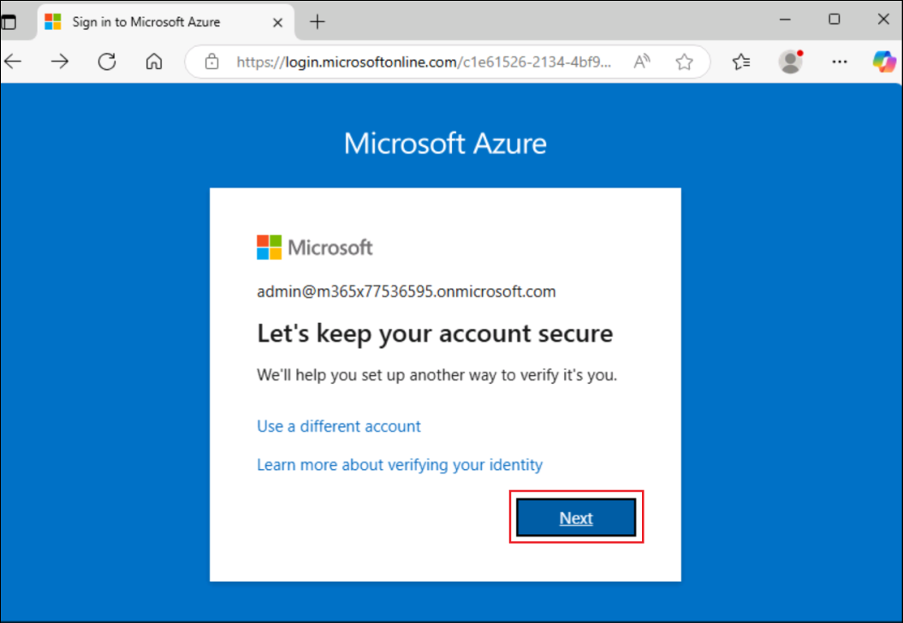
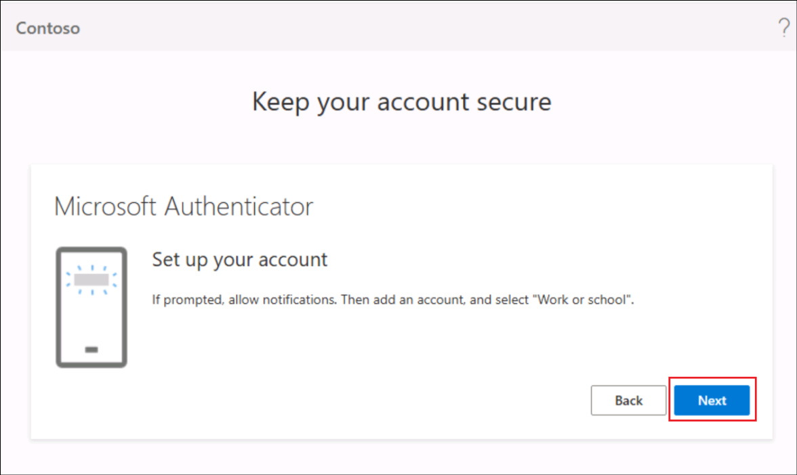

# Laboratório 02 - Configurar o Dynamics 365 Customer Service

## Objetivo

Neste laboratório, você ativará a **avaliação do Dynamics 365 Customer
Service**.

## Tarefa 1: Inscreva-se para uma avaliação do Dynamics 365 Customer Service

1.  Efetue login em
    +++<https://dynamics.microsoft.com/en-us/customer-service/overview/+++>

2.  Efetue login usando o **Office 365 Tenant details** na aba **Home,**
    se solicitado.

3.  Clique em **Try for free**

4.  Digite seu **nome de usuário administrativo do Office 365** na aba
    **Resources**, marque a caixa de seleção e clique em **Start your
    free trial**.

5.  Defina a região como **United States**, digite seu **Phone number**
    e clique em **Submit**.

6.  Se você visualizar a opção Iniciar avaliação para Engage customers,
    clique em **Launch Trial**.

7.  Uma vez ativado, seu espaço de trabalho de Atendimento ao Cliente
    será aberto.

## Resumo

Neste laboratório, ativamos o Dynamics 365 Customer Service, que será
usado no **Laboratório 04 – Aprimorar o agente Safe Travels e
implementar a orquestração de múltiplos agentes.**

 
