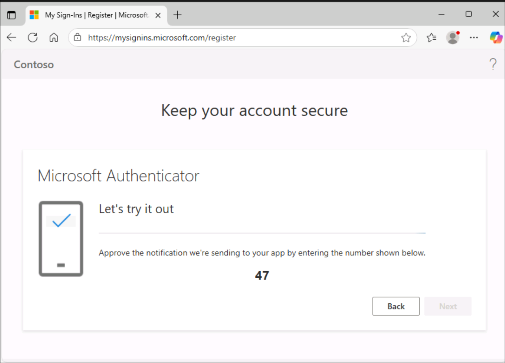
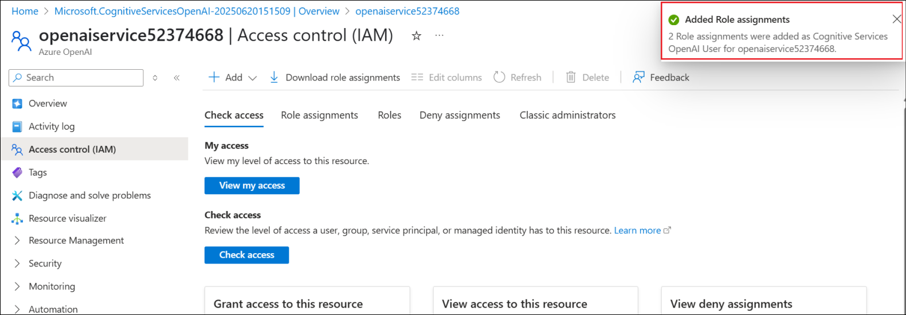
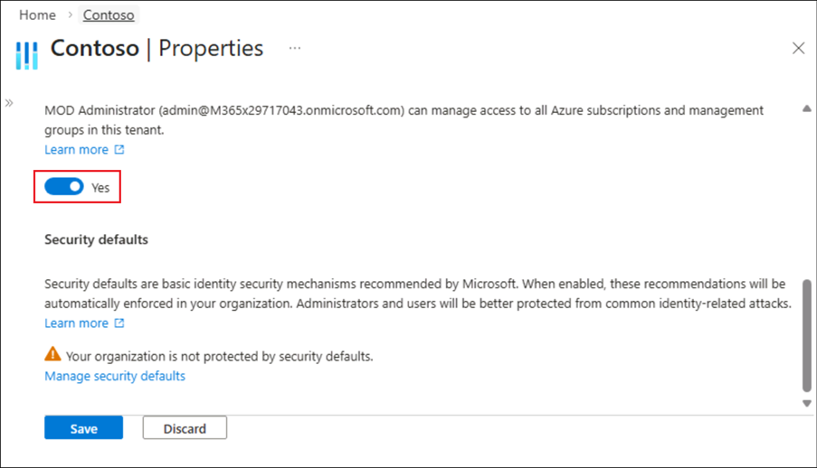
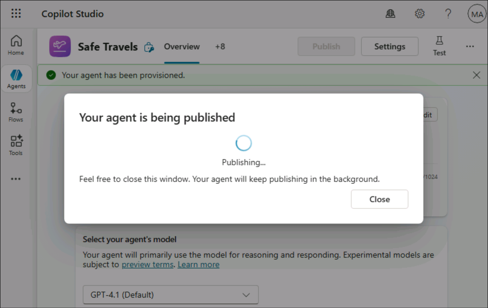
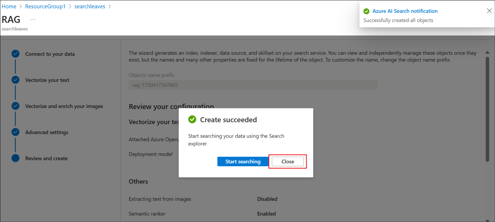
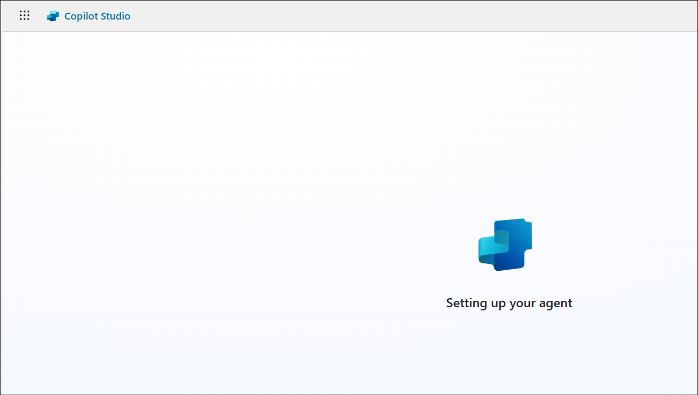
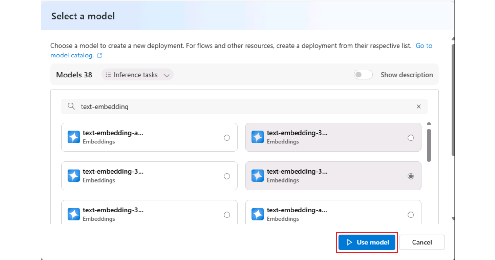

# Lab 1- Build and enhance a template based enterprise assistant

**Objective**

**Agent templates** are designed to help you get started with a **custom
agent**. You are responsible for assessing all safety and legal
implications of using an agent template and customizing it as
appropriate for your business.

An agent built from the **Safe Travels agent template** is a
Business-to-Employee (B2E) agent designed to provide employees of a
company with **travel assistance**. This agent helps ensure employees
are well-prepared and informed for their next work trip. This agent uses
natural language processing to offer a conversational interface, making
it easy and intuitive for employees to access the information they need.
However, the default website used by the agent currently only covers US
travel destinations. You can replace the default website with your own
knowledge source.

In this lab, you will create an agent from the **Safe Travels
template** and enhance it in Lab 05.

## Exercise 0 - Create Security Group in Entra ID and Configure Copilot Studio Authors

This is a prerequisite task in order to help us to publish and work
seamlessly with the agents in Copilot Studio throughout this course.

1.  Navigate to the Azure portal at
    +++https://portal.azure.com/+++ and login with your tenant
    credentials if prompted.

    -   Username - +++@lab.CloudCredential(M365).AdministrativeUsername+++
      
    -   Password -  +++@lab.CloudCredential(M365).AdministrativePassword+++

    
    
    
    
    
    
2.  If the **Authenticator app** set up was done in Lab 1, then ignore the steps from this step till step 5 and continue from Step 6. Else complete these steps.

    Select **Next** in the Keep your account secure window and follow the **prompts**.

    

3.  Download the Authenticator app in your phone if you do not have it
    already.

    

4.  Follow the prompts and complete the setup.

    >[!Note] Note: From your Authenticator app, select **+** at the top right and then select **Work or school account**. Then select **Scan a QR code**.

    

    

    

    

5.  In the Azure welcome screen, select **Get Started**.

    

7.  Search for and select +++Microsoft EntraID+++.

    

8.  From the left pane, select **Manage** -> **Groups**.

    

9.  Select **New group** to create a new security group.

    

10.  Enter the below details

     - Group type – Select **Security**

     - Group name – Enter +++**copilotagentsecurity**+++

     - Microsoft Entra roles can be assigned to the group –
      Select **Yes** (If this option is not visible, ignore this step)

     

11. Select **No owners selected**, select the **MOD Administrator** from
    the **Add owners** page and click on **Select**.

    

    

12. Similarly, select **No members selected**, and add the **MOD
    Administrator** from the list and click on **Select**.

    

13. Select **No roles selected**. If you **do not** see this **option**,
    ignore this and the next step.

    

14. Search for and select +++**Global admin**+++ and select **Select**.

    

15. Select **Create** once all the details are added and
    select **Yes** in the confirmation dialog.

    

    

16. Ensure that you get a **success** message.

    

17. Select Contoso|Groups from the top left.

    

18. Select **Properties** under **Manage** from the left pane.

    

19. Toggle **Yes** under **Access management for Azure resources** option and then select the **Manage security defaults** option.

    

20. Select **Enabled** under Security defaults option and click on **Save**.

    

21. Select **Save** in the Contoso|Properties page.

    

19. Now, select **Roles and administrators** under **Manage** from the
    left pane.

    

20. Search for +++privileged role admin+++ and click on the **Privileged
    Role Administrator** role (**Do not select the checkbox**, click on
    its name).

    

21. Select **+ Add assignments**.

    

22. Select **No members selected**.

    

23. Select the **MOD Administrator** id and select **Next**.

    

    

24. Select **Assign**.

    

25. Ensure that the role assignment is successful.

    

26. From a new tab, navigate to
    +++https://admin.powerplatform.microsoft.com/+++.
    Select **Manage** from the left pane and then select the **Tenant Settings** option.

    

27. Select **Copilot Studio Authors** from the list available.

    

28. Click on the **Edit** icon to edit the settings.

    

29. Search for and select the **+++copilotagentsecurity+++** group that
    you created earlier.

    

30. Select **Save** to save the settings.

    

31.	Select **Manage** -> **Environments** -> **Dev One** environment.

    

32.	Select **Settings** from the top menu bar.

    

33.	Select **Product** -> **Features**.

    

34. Scroll down to the **Dataverse Model Context Protocol** section and select the checkbox against **Allow MCP clients to interact with Dataverse MCP Server (Preview version)** and select **Save**.

    

## Exercise 1: Create Safe Travels agent from template

In this exercise, you will create the agent in Copilot Studio using the
Safe Travels agent template.

1. Still from the Power Platform admin center, select **Manage** -> **Environments -> Dev One** and copy the value of the **Environment ID** and save it locally. 

   

2.  From a newtab, login to +++https://copilotstudio.microsoft.com/environments/**< EnvironmentID >**+++ (Replacing **< EnvironmentID >** with the Environment ID value fetched above and saved locally)

    >[!Alert] **Important:** **Save** this **url** to access the Copilot Sutdio in all the upcoming labs.

3.  This open up the **Start free trial** page. Leave the country as **United States** and click **Start free trial**.

    

3.  Select Skip in the Welcome screen.

    

4.  Select **Agents** from the left pane and then select the **Safe
    Travels** template under **Start with an agent template**.

    

5.  The Safe Travels template creates a new agent that is designed to
    provide employees of a company with travel assistance. 

    

6.  Browse through the set-up page. Under **Knowledge**, you can find
    that **US Travel Website** is already added as a Knowledge source.
    It can be edited if needed. Here, we are using the same website.

    

7.  Select **Create** to create the Safe Travels agent. We are not
    changing anything here and using the template as such. At any point,
    the agent can be upgraded as per the user requirements.

    

8.  The **agent** gets **created** and opens up automatically showing up
    the **Overview** page.

    

9.  In the Test pane, enter +++How to apply for passport?+++ and
    hit **Send**.

    The Test pane is open by default. If not, click on the Test icon on top
right.

    

10. You can see that the agent provides information on how to apply for
    the passport from its knowledge source.

    

## Exercise 2: Publish the agent to Teams and Microsoft 365 Copilot

In this exercise, you will **publish** the agent created in Copilot
Studio to the **Microsoft Teams** and **Microsoft 365 Copilot** channel.

>[!Alert] **Important:** Since this is a test environment used for training purposes, there might be issues in getting the agent published, based on any recent changes to the product. If that happens, there will be issues in executing the  exercises that follow. This will not be the case in the production.

1.  Open **MS Teams** +++https://teams.microsoft.com/v2/+++ from a
    browser and **login** using your tenant credentials from
    the **Resources** tab if prompted.

2.  Back in the Copilot Studio, select **Publish** from the top right of
    the agent page.

    

3.  Check the **Force newest version** checkbox and then
    select **Publish** in the confirmation dialog.

    
    
    

4.  Select **Channels** from the top navigation bar.

    

5.  Select **Teams and Microsoft 365 Copilot** from the list of
    available channels.

    

6.  Select **Add channel**.

    

7.  Click on the **See agent in Teams** option add the agent to the
    Teams.

    

8.  This opens up the agent in the Microsoft Teams. Select **Cancel** in
    the **This site is trying to open Microsoft Teams** pop up and then
    select **Use the Web App instead** option.

    

9.  Select **Add** to add the agent.

    
    
    

10. Once added, you will get an option to open the agent.
    Select **Open**.

    

11. Test the agent from Teams.

    

12. Back in the Copilot Studio, close the Teams and Microsoft 365
    Copilot channel window.

    

## Exercise 3 – Test the existing Safe Travels agent

In this exercise, we will test the **Safe Travels** agent to see how it
responds when asked about travel approval.

1.  Back in the Copilot Studio -\> Safe Travels agent, select
    the **Test** icon to test the agent.

    

2.  Enter +++Need travel approval+++ in the Test window and click
    on **Enter**.

    

3.  You can see that the agent responds with a generalized instruction
    set to be followed to get the travel approval.

    

## Exercise 4 – Enhance the agent with company specific Knowledge assets

In this exercise, we will add knowledge asset - **Travel
Policy** specific to Contoso.

1.  From the Overview page of the agent, scroll down and select **+ Add
    knowledge**

    

2.  Click on **select to browse** option.

    

3.  From **C:\Labfiles\Lab Files** folder, select **Travel
    Policy.docx** and click **Open**.

    

4.  Click **Add to agent** to the add the file.

    

    

5.  Ensure that the file is added. Wait till the status changes
    from **In progress** to **Ready**. You can continue with the next
    step while it is changing to the Ready state if it takes more than
    few minutes.

    

    >

6.  Now, test the agent with the same question to see that the agent
    responds with the company specific policies from the knowledge asset
    added.

## Summary

In this lab, you created a **Business-to-Employee (B2E) travel
assistance** agent by using the **Safe Travels agent template** in
Microsoft Copilot Studio. You explored how agent templates provide a
quick starting point by preconfiguring conversational capabilities and
knowledge sources, while still allowing for future customization to meet
organizational and legal requirements. Using the built-in **US travel
website** as a **knowledge source**, you tested the agent’s ability to
answer employee travel-related questions through natural language
interactions. Finally, you **published** the agent to **Microsoft Teams
and Microsoft 365 Copilot**, validated its availability in Teams, and
confirmed that employees can access and interact with the Safe Travels
agent directly within their everyday collaboration tools.

 

