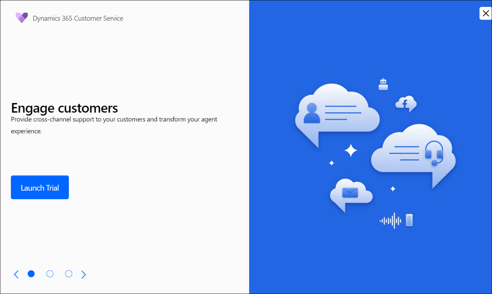
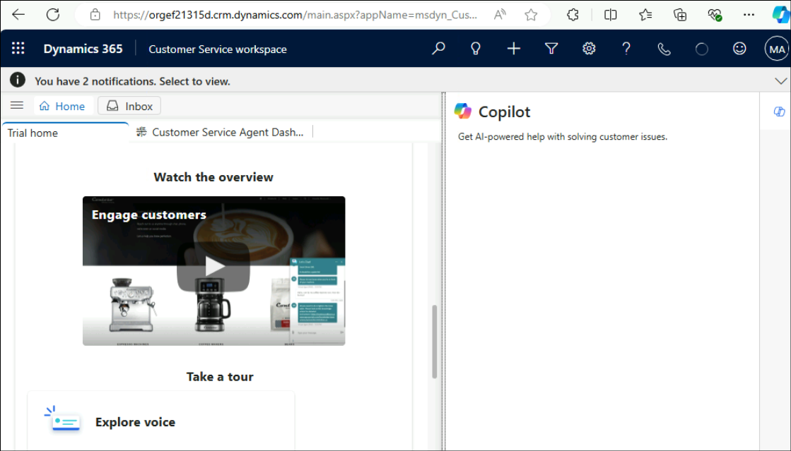

# ラボ 02 - Dynamics 365 Customerを構成する

## 目標

このラボでは、Azure でセキュリティ グループを作成し、Copilot Studio
の設定を更新してから、**Dynamics 365 Customer Service
の試用版**をアクティブ化します。

## タスク 1: Entra ID でセキュリティ・グループを作成し、Copilot Studio Authorsを構成する

1.  +++https://portal.azure.com/+++ Azure
    ポータルに移動し、ログイン資格情報を使用してログインします。

2.  「Keep your account
    secure」ウィンドウで「Next」を選択し、指示に従います。

3.  携帯電話に Authenticator
    アプリをまだダウンロードしていない場合はダウンロードします。

4.  指示に従ってセットアップを完了します。

5.  Azure のようこそ画面で、\[**Get Started**\] を選択します。

6.  +++Microsoft EntraID+++ を検索して選択します。

7.  左側のペインから、「**Manage -\> Groups**」を選択します。

8.  新しいセキュリティ グループを作成するには、\[**New group**\]
    を選択します。

9.  以下の詳細を入力してください

- Group type – **Security**を選択

- Group name – +++copilotagentsecurity+++ を入力してください

- Microsoft Entraのロールをグループに割り当てることができます –
  **Yes**を選択します

10. 「No owners selected」を選択し、「Add owners」ページからMOD
    Administratorを選択して、「Select」をクリックします。

11. 同様に、「**No members selected**」を選択し、リストから **MOD
    Administrator**を追加して、「**Select**」をクリックします。

12. 「**No roles selected**」を選択します。

13. +++Global admin+++ を検索して選択し、**\[Select**\]
    を選択します。

14. すべての詳細を追加したら「**Create**」を選択し、確認ダイアログで「**Yes**」を選択します。

15. 成功メッセージが表示されたことを確認します。

16. 新しいタブから、+++https://power platform.microsoft.com
    にアクセスします。左側のペインで「**Manage**」を選択し、「**Tenant
    Settings**」オプションを選択します。

17. 利用可能なリストから「**Copilot Studio Authors**」を選択します。

18. **Edit**アイコンをクリックして設定を編集します。

19. 先ほど作成した **copilotagentsecurity**
    グループを検索して選択します。

20. 「**Save**」を選択して設定を保存します。

## タスク 2: Dynamics 365 Customer Service の試用版にサインアップする

1.  +++https://dynamics.microsoft.com/en-us/customer-service/overview/+++
    にログインします

2.  プロンプトが表示されたら、\[**Home**\] タブ**から Office 365
    テナントの詳細**を使用してログインします。

3.  「**Try for free**」をクリックします。

4.  \[**Resources**\] タブから **Office 365
    管理者ユーザー名**を入力し、チェック ボックスをオンにして、\[**Start
    your free trial**\] をクリックします。

5.  Countryを「**United States**」に入力し、**Phone
    number**を入力して「**Submit**」をクリックします。

6.  Engage
    顧客向けの試用版を起動するオプションが表示された場合は、**「Launch
    Trial」**をクリックします。

7.  アクティブ化されると、カスタマー サービス ワークスペースが開きます。

## 要約

このラボでは、**ラボ 04 (エージェントを Dynamics 365 Customer Service
アプリに統合し、ライブ エージェントへの自動ケース
エスカレーションを実装する)** で使用される Dynamics 365 Customer Service
をアクティブ化しました。
