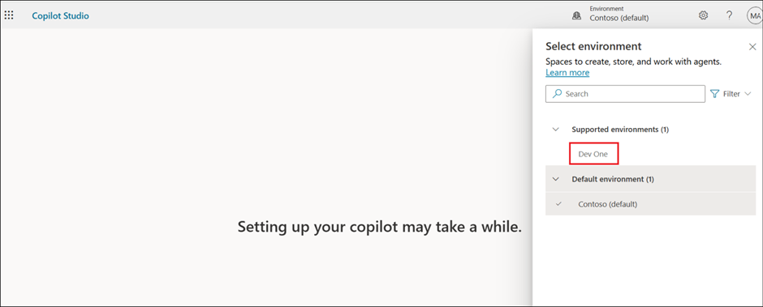

# 实验2 - 构建并增强基于模板的企业助理

**目标**

**经纪人模板**旨在帮助您开始使用**定制经纪**人。您有责任评估使用代理人模板的所有安全和法律影响，并根据您的业务进行定制。

基于**安全旅行代理模板**构建的代理是一种企业对雇员（B2E）代理，旨在为公司员工提供**旅行协助**。该代理帮助员工充分准备并充分了解下一次出差。该代理利用自然语言处理提供对话式界面，使员工轻松直观地获取所需信息。不过，代理目前使用的默认网站只覆盖美国旅游目的地。你可以用自己的知识来源替换默认网站。

在这个实验室里，你将从**Safe Travels模板**创建一个代理，并在Lab
05中加以增强。

## 练习0 - 在Entra ID中创建安全组并配置Copilot Studio作者

这是帮助我们在整个课程中与Copilot Studio代理无缝协作发布的前提任务。

1.  访问Azure门户的+++https://portal.azure.com/+++，在
    **Resources** 标签页中使用你的租户凭证登录。

    

    

    

2.  在“Keep your account secure”窗口中选择“**Next** ”，然后按照
    **prompts**。

    

3.  如果你还没有，可以下载手机上的身份验证器应用。

    

4.  按照提示作，完成设置。

    

    

    

    

5.  在 Azure 欢迎界面，选择**“Get Started**”。

    

6.  搜索并选择 +++Microsoft EntraID+++。

    

7.  在左侧面板中，选择 **Manage** -\> **Groups**。

    

8.  选择**New group** 以创建新的安全组。

    

9.  请输入以下详细信息

    - 组别类型 – 选择 **Security**

    - 集团名称 – 输入 +++**copilotagentsecurity**+++

    - 可以将 Microsoft Entra
      角色分配给该组——选择**“Yes**”（如果该选项不可见，请忽略此步骤）

    

10. 选择“**No owners selected**”，从**Add owners** 页面选择 **MOD
    Administrator** ，点击“**Select**”。

    

    

11. 同样地，选择“**No members selected**”，然后从列表中添加 **MOD
    Administrator** ，并单击“**Select**”。

    

12. 选择：**No roles
    selected**。如果你**没有**看到这个**选项**，请忽略这个选项，进入下一步。

    

13. 搜索并选择 **+++Global admin+++** 并选择 **Select。**

    

14. 添加所有细节后选择 **Create**，确认对话框中选择**“Yes**”。

    

    

15. 确保你收到**成功**信息。

    

16. 从左上角选择 Contoso|Groups。

    

17. 从左侧窗格的“**Manage**”下选择“**Properties**”。

    

18. 将“**can manage access to all Azure subscriptions and management
    groups in this tenant** ”选项切换为“Yes”，然后单击“**Save**”。

    

19. 现在，从左侧窗格的“**Manage**”下选择“**Roles and
    administrators**”。 

    

20. 搜索 +++privileged role admin+++，然后单击“**Privileged Role
    Administrator** ”角色（**不要选中复选框**，单击其名称）。

    

21. 选择 **+ Add assignments**。

    

22. 选择**“No members selected**”。

    

23. 选择 **MOD Admin id** ，然后选择 **Next**。

    

    

24. 选择 **Assign**。

    

25. 确保角色分配成功。

    

26. 从新标签页，导航到+++<https://admin.powerplatform.microsoft.com/+++>。
    从左侧窗格选择“**Manage**”，然后选择 **Tenant Settings** 选项。 

    

27. 从可用列表中选择 **Copilot Studio Authors**。

    

28. 点击**“Edit**”图标以编辑设置。

    

29. 搜索并选择 你之前创建的 **+++copilotagentsecurity+++** 组。

    

30. 选择 **Save** 以保存设置。

    

## 练习1：从模板创建安全旅行代理

在这个练习中，你将使用 Safe Travels 代理模板在 Copilot Studio
中创建代理。

1.  从浏览器登录
    +++https://copilotstudio.microsoft.com+++。开始免费试用页面会打开。选择您的国家，点击
    **Start free trial**。

    

2.  选择 **Dev One** 环境。

    

    [!提醒] **重要** 如果Copilot Studio没有显示如下截图中选择 **Environment**  的选项，请按照以下步骤作。

    

    > 打开
    > +++https://admin.powerplatform.microsoft.com/+++。选择“**Manage** -> **Environments
    > -> Dev One** ”，然后选择“**Environment ID**”的值。
    >
    > 返回 Copilot Studio 选项卡并打开
    > +++https://copilotstudio.microsoft.com/environments/**< EnvironmentID >**+++（将 **< EnvironmentID >** 替换为上面获取的值）

3.  在欢迎界面选择跳过。

    

4.  从左侧窗格中选择“**Agents**”，然后在“**Start with an agent
    template**”下选择“**Safe Travels** ”模板。 

    

5.  安全旅行模板创建了一个新的代理，旨在为公司员工提供旅行协助。

    

6.  浏览设置页面。在“**Knowledge**”下，您可以看到 **US Travel
    Website** 已添加为知识库来源。如有需要，可以进行编辑。这里，我们也使用该网站。

    

7.  选择
    **Create **以创建安全旅行代理。我们不会更改任何内容，也不会继续使用模板。代理可以随时根据用户需求进行升级。

    

8.  **代理**程序**创建完成**后，会自动打开并显示 **Overview** 页面。

    

9.  在测试窗格中，输入+++How to apply for
    passport?+++，然后点击“**Send**”。
    测试窗格默认打开。如果未打开，请点击右上角的测试图标。

    

10. 你可以看到代理会根据其知识来源提供护照申请信息。

    

## 练习2：将代理发布到Teams和Microsoft 365 Copilot

在本练习中，您将把在 Copilot Studio 中创建的代理发布到 **Microsoft
Teams** 和 **Microsoft 365 Copilot** 频道。

1.  从浏览器打开**MS Teams**
    +++https://teams.microsoft.com/v2/+++，然后用**Resources** 标签中的租户凭证**登录**。 

2.  回到Copilot Studio，从 代理页面右上角选择 **Publish**。

    

3.  选中“**Force newest
    version** ”复选框，然后在确认对话框中选择“**Publish** ”。

    

    

4.  从顶部导航栏选择“**Channels** ”。

    

5.  从可用频道列表中选择 **Teams**和 **Microsoft 365 Copilot**。

    

6.  选择 **Add channel**。

    

7.  点击“**See agent in Teams** ”选项，将代理添加到Teams中。

    

8.  这将在 Microsoft Teams 中打开代理。在“**This site is trying to open
    Microsoft Teams**”弹出窗口中选择“**Cancel**”，然后选择“**Use the Web
    App instead** ”选项。

    

9.  选择 **Add** 以添加代理。

    

    

10. 添加后，你会有机会开设代理。选择 **Open**。

    

11. 测试Teams的代理。

    

12. 回到 Copilot Studio，关闭 Teams 和 Microsoft 365 Copilot 频道窗口。

    

## 练习3——测试现有的安全旅行代理

在本练习中，我们将测试 **Safe Travels**
代理，看看它在被问及旅行批准时的反应。

1.  回到Copilot Studio——\>安全旅行代理，选择 **Test** 图标来测试代理。

    

2.  在测试窗口输入+++Need travel approval+++，然后点击 **Enter**。

    

3.  你可以看到客服会给出一套通用的指示，要求你按照它来获得旅行批准。

    

## 练习4 – 用公司专属的知识资产增强代理

在本练习中，我们将添加知识资产——Contoso 特有的**Travel Policy** 。

1.  在代理的概览页面，向下滚动并选择 **+ Add knowledge**

    

2.  点击选择 **select to browse** 。

    

3.  从 **C：\Labfiles\Lab Files** 文件夹中，选择** Travel
    Policy.docx**并点击 **Open**。

    

4.  点击 **Add to agent** ，添加文件。

    

    

5.  确保文件已添加。等待状态从“**In
    progress**”变为“**Ready**”。如果状态变为“就绪”需要几分钟时间，您可以继续执行下一步。

    

    

6.  现在，用同样的问题测试代理，看看代理是否回复了公司根据知识资产添加的具体政策。

## 摘要

在本实验中，您使用 Microsoft Copilot Studio 中的 **Safe Travels
代理模板**创建了一个**Business-to-Employee (B2E) 旅行援助代理**。
你探讨了代理模板如何通过预配置对话功能和知识源，提供快速起点，同时仍允许未来定制以满足组织和法律要求。
您利用内置的**美国旅游网站作**为**知识来源**，测试了代理通过自然语言交互回答员工与旅行相关问题的能力。最后，你们将代理**发布**到**Microsoft
Teams和Microsoft 365
Copilot**，验证了其在Teams中的可用性，并确认员工可以在日常协作工具中直接访问和交互Safe
Travels代理。

 
