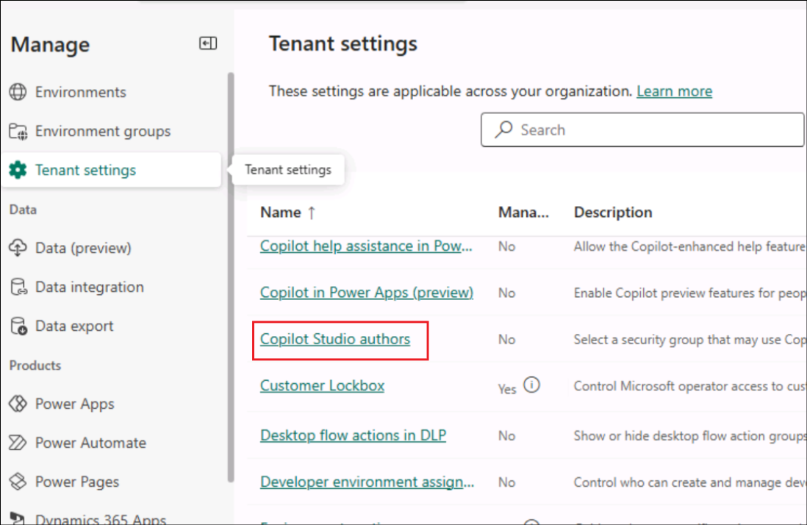

# Lab 02 – OneDrive で作成された新しいファイルを追跡するための自律エージェントを構築する

**紹介**

ある組織のOneDrive For
Businessでは、複数のファイルが作成されており、管理者がそれらを追跡することが困難になっています。

**目標**

新しく追加されたファイルの詳細をファイル詳細トラッカーに入力する自律エージェントを構築します。これにより、ファイルの追加を追跡する問題が解決され、ファイル詳細トラッカーには新しく作成されたすべてのファイルの詳細が記録されます。

## 手順 1: 環境の設定

1.  Resourcesタブからのパスワードを使用してVMにログインします。

### タスク 1: OneDriveを設定する

1.  ブラウザを開き、+++**https://office.com**+++へナビゲートする。**Resources**
    タブからの資格情報を使用して**サインイン**する**。**

2.  左側のメニューから**OneDrive**を選択する。

3.  左上にある**+** 符号をクリックして**Files upload**を選択する。

4.  **C:\LabFiles**からのファイル**File
    details**を選択して**Open**を選択する。

5.  ファイルがアップロードされてから、ファイルが通常処理されたとのメセッジが画面にポップアップされます

6.  左側のメニューから「マイファイル」をクリックすると、新しいファイルがそこに表示されているのがわかります。

### タスク 2 : 開発環境を作成する

1.  Resourcesタブからテナント情報を使用して+++<https://admin.powerplatform.microsoft.com/>+++
    へログインする。

2.  左側のナビゲーション画面から **Environments**選択して**+
    New**をクリックする。

3.  開いたNew
    Environment画面で、以下の詳細を入力し、「**Next**」をクリックします。.

[TABLE]

4.  **Add Dataverse**画面にデフォルトを選択し、**Save**をクリックする。

5.  新しく作成されたEnvironmentがアドミンセンターにリストされ、その状況がEnvironment画面に表示します。

6.  **Status**が**ready**になってからEnvironmentが利用できます。このenvironment
    を今後の手順に使用します。

### タスク 3: Copilot Studio のトライアルを有効にする 

1.  新しいタブで+++**https://copilotstudio.microsoft.com/**+++を開く

2.  ラボVMの**Resources**タブで提供された**資格情報**を使用し、**サインイン**する。

> 

3.  ログインしてから**Welcome to Microsoft Copilot Studio**
    ページで国を**United States**のままにしておき**、Get
    Started**をクリックする。

4.  **Welcome**画面で**Skip**を選択する。

## 手順 2: 自律エージェントの構築とテスト

### タスク 1: Copilot Studioからエージェントの作成

1.  エージェント作成ページに表皮されるSkip to
    configureオプションをクリックする。

2.  エージェント作成画面に以下の詳細を入力して、**Create**をクリックする。

- **Name** - +++New file tracker agent+++

- **Description** - +++This agent will update the File details tracker
  placed in the OneDrive, each time a new file is created in the
  OneDrive

### タスク 2: エージェントにトリガーを追加する

1.  エージェントが作成されてからスクロールダウンして、**Trigger**セクションで**+
    Add trigger**を選択する

2.  **Turn on generative orchestration to continue**のダイアログで**Turn
    it
    on**を選択する。このオプションの設定をオンにすることでトリガーを追加します。

3.  Add triggerメニューから**When a file is created**
    トリガーを選択する。

4.  **Add trigger**画面に**Continue**を選択する。

> 次の画面で、トリガー名が入力されていることを確認できます。Microsoft
> Copilot Studio と OneDrive for Business
> への接続が確立されるまでお待ちください（各コネクタに緑色のチェックマークが表示されます）。「Next」をクリックします。

5.  以下の詳細を選択します。

- **Folder** – Root

- **Include subfolders** – Yes

> 他のフィールドをデフォルトのままにして**Create trigger**を選択する。

6.  トリガーが作成されてから**Time to test your
    trigger**メセッジが表示される。それを**Close**します。トリガーの基本的なフローを少し調整して機能を実装し、テストします。

> 

### タスク 3: トリガーにロジックを追加する

1.  **New file track
    agent**ページにトリガーのセクションへスクロールダウンする。

2.  **When a file is
    created**のトリガーの横にある三つのドットをクリックして、**Edit in
    Power Automate**を選択する。

3.  **When the file is created**と**Sends a prompt action**
    の間にある+アイコンを選択して**Add an action**を選択します。

4.  +++add a row+++ を検索して、**Add a row into the table**を選択する。

5.  各行に対して以下の値を選択し、Saveをクリックする。

[TABLE]

6.  フローは以下のスクリーンショットのようになります。

7.  フローを保存して**publish**する**。**

### タスク 4: トリガーをPublishする

1.  Copilot Studioで**Settings**を選択する

2.  **Security** -\> **Authentication** -\> **No
    authentication**選択し、**Save**をクリックする。

3.  確認ダイアログで**Save**を選択する。

4.  次に、**Publish**選択し、エージェントを公開する。

5.  確認ダイアログでで **Publish**を選択する。

### タスク 5: トリガーをテストする

1.  ブラウザで**OneDrive**に戻ります。「+」をクリックして**Word文書**を選択します。

2.  ドキュメントに名前を付けて、「**Create**」を選択します。

3.  プライバシーのオプションを閉じるよう**Close**をクリックする

4.  同様に、さらにいくつかのファイルを追加します。

5.  次に、OneDrive からファイル details.xlsx
    を開き、作成されたファイルの詳細がトラッカーに追加されていることを確認します。

6.  OneDrive
    にファイルが作成されると、トリガーが起動され、**ファイルが追加されたとき**のフローが実行され、トラッカーが更新されます。

7.  Copilot
    Studioのアクティビティタブで自律エージェントの詳細を確認することもできます。

**要約**

このラボでは、Copilot Studio
から自律エージェントを作成、公開、テストする方法を学習しました。
