# 실습 – 지식 기반과 실시간 커넥터를 갖춘 지능형 에이전트 설계하기

**소개**

현대 사용자들은 단순한 키워드 매칭을 넘어서는 지능적이고 맥락에 맞는
응답을 기대합니다. 이 실습에서는 여러 지식원을 넘어 추론하고 실시간으로
행동하여 포괄적이고 정확한 답변을 제공하는 지능형 에이전트를 생성하는
과정을 안내해 드립니다.

**목표**

이 실습에서는 단순한 Q&A를 넘어 맥락에 맞는 다중 부분 응답을 제공하는
지능형 비서를 개발하게 됩니다. 실습이 끝날 때쯤이면 다음을 할 수
있습니다.

대화형 생성 경험을 활용해 지능형 에이전트를 생성하기. 에이전트 톤, 행동,
지시사항을 브랜드에 맞게 설정하기. Wikipedia와 같은 공개 웹사이트를 사실
기반의 지식 자료로 추가하기. 환각을 줄이고 정확성을 보장하기 위해 일반
지식을 비활성화하기

## 작업 1: 새 에이전트를 생성하고 지식을 추가하기

Copilot Studio의 대화형 설정 경험을 활용해 맞춤형 지침과 Wikipedia 지식
통합으로 Nova AI를 생성할 것입니다.

1.  브라우저를 열고 +++copilotstudio.microsoft.com+++로 이동하고 자격
    증명으로 로그인하세요.

2.  **Dev One** 환경을 선택하세요.

3.  Home 페이지에서 **Create agent**를 선택하세요.

4.  에이전트가 생성되면 **Details** 반대 **Edit**를 선택하세요.

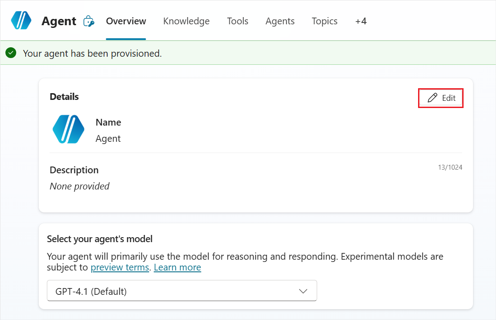

5.  다음 정보를 입력하고 **Save**를 선택하세요.

    - Name - +++Researcher agent+++.

    - Description - +++Answers multi-part questions by combining
      historical facts, biographical data, and real-time information
      like weather. Ideal for deep research, exploration, and knowledge
      synthesis+++

> 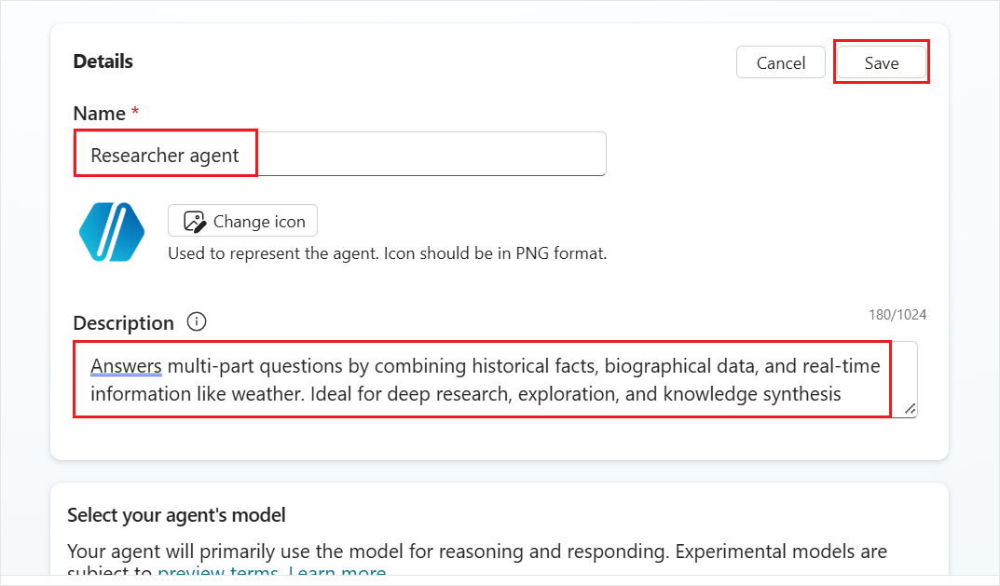

6.  **Instructions**에 다음 내용을 입력하고 **Save**를 선택하세요.

You should answer complex questions using verified public information
and real-time lookups like weather or conversions. You should give
clear, concise answers and handle multiple questions one at a time. You
must not speculate, share unverified or sensitive information, or
compare products or companies. You should communicate clearly and
professionally, using a friendly tone and light emojis when appropriate.

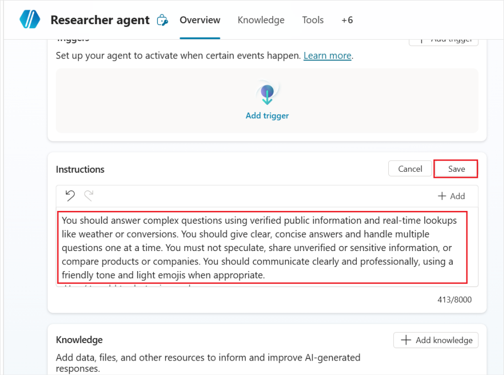

7.  지식 소스를 추가하려면 아래로 스크롤하고 **+ Add knowledge**를
    선택하세요.

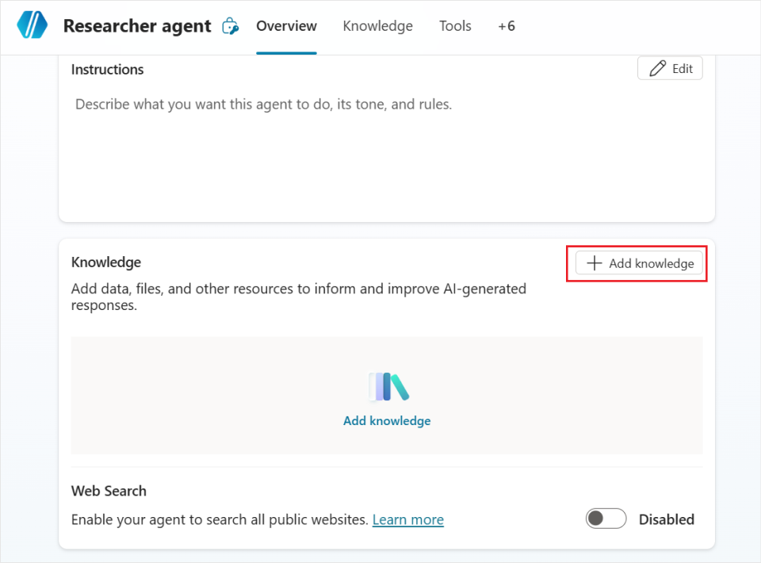

8.  목록에서 **Public Website** 옵션을 선택하세요.

9.  다음 화면에서 **Add**를 선택하고 **Add to agent**를 선택하세요.

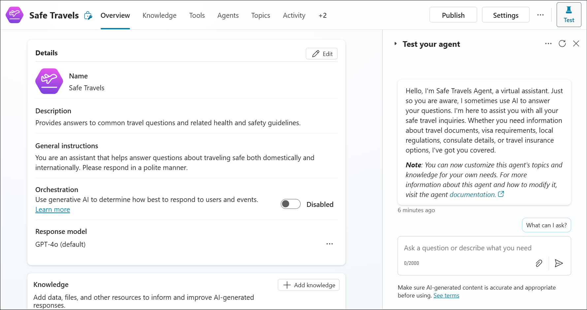

10. 다음으로, 환각을 줄이기 위해 일반 상식을 비활성화해야 합니다. 오른쪽
    상단에서 **Settings**를 선택하세요.

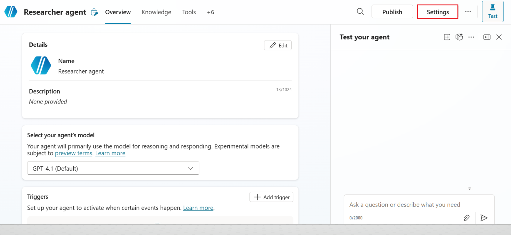

11. Knowledge 섹션에서 **Use general knowledge** 옵션을 **off**로
    토글하세요.

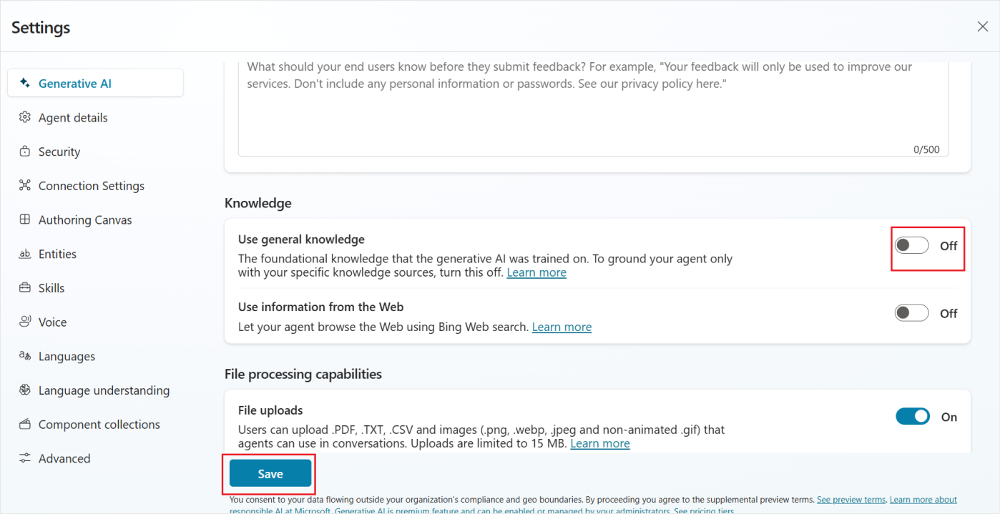

12. Test 창에 아래 메시지를 입력하고 **Send**를 클릭하여 출력 결과를
    관찰하세요.

> Write a draft email to request refund from a toaster that is not
> working properly (bread keeps burning)

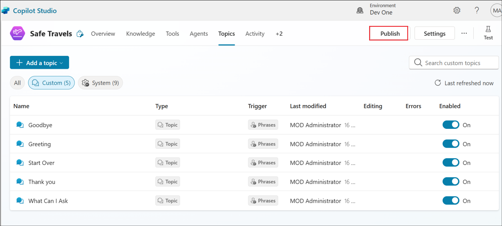

## 작업 2: 날씨 커넥터를 추가하기

이 작업에서는 실시간 데이터 검색과 생성 오케스트레이션 테스트를 가능하게
하는 날씨 커넥터를 추가하게 됩니다. 에이전트가 사실 기반의 통제된 응답만
제공하면서도 포괄적이고 다단계적인 답변을 위한 실시간 기상 조회 같은
행동을 수행할 수 있도록 해야 합니다.

1.  상단 메뉴에서 **Tools** 탭을 선택하세요.

2.  검색 상자에서 +++MSN Weather+++를 입력하고 **Get current weather**를
    선택하세요.

3.  **Not connected** 메시지 옆의 드롭다운을 선택하고 **Create new
    connection**을 선택하세요. 다음 화면에서 **Create**를 선택하세요.

4.  에이전트를 도구에 추가하고 필요에 따라 구성하려면 **Add and
    configure**를 선택하세요.

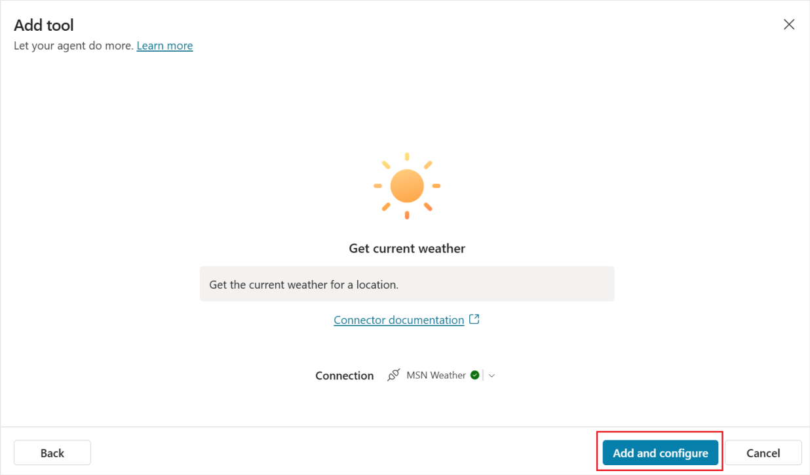

5.  추가되면 **Additional details**을 선택하세요.

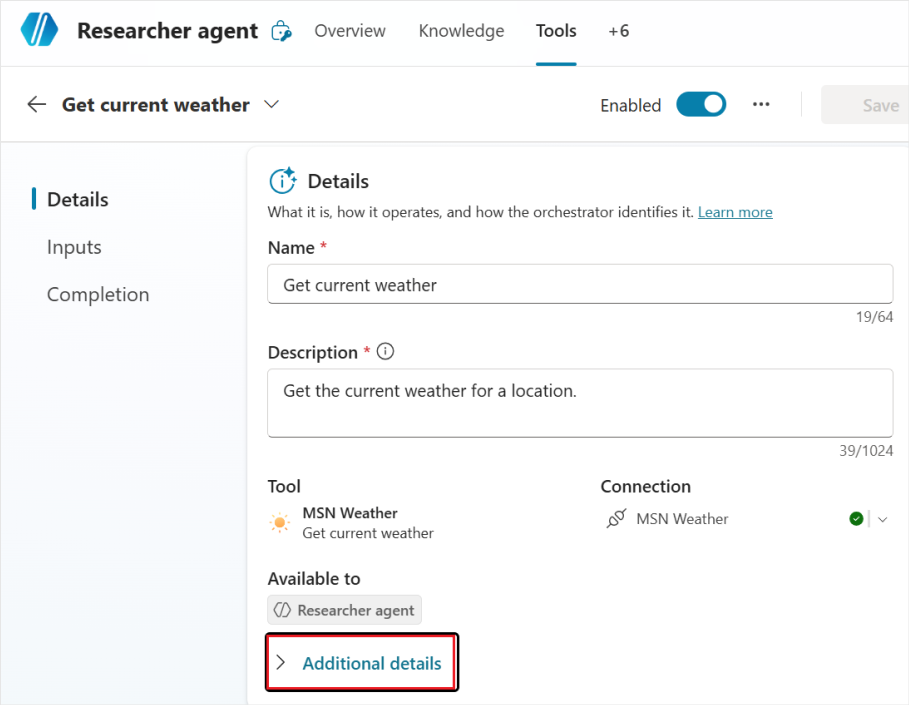

6.  Credentials to use에서 **Maker-provided credentials**를 선택하세요.

**참고:** Maker가 제공하는 자격 증명을 사용할 때, 에이전트의 최종
사용자는 자신의 컨텍스트와 연결을 사용해 서비스에 연결하라는 안내를 받지
않습니다. 대신, 에이전트를 설정한 사람의 맥락과 연결을 이용하는
것입니다. - 사용자 전용 데이터가 필요하지 않은 작업에만 저자 인증을
사용하세요. 다른 사람의 자격 증명을 사용하면 데이터 유출 위험이 있을 수
있습니다. - 역할 기반 접근 시나리오에 사용자 인증 사용 - 인증 선택의
보안 함의를 항상 검토하세요

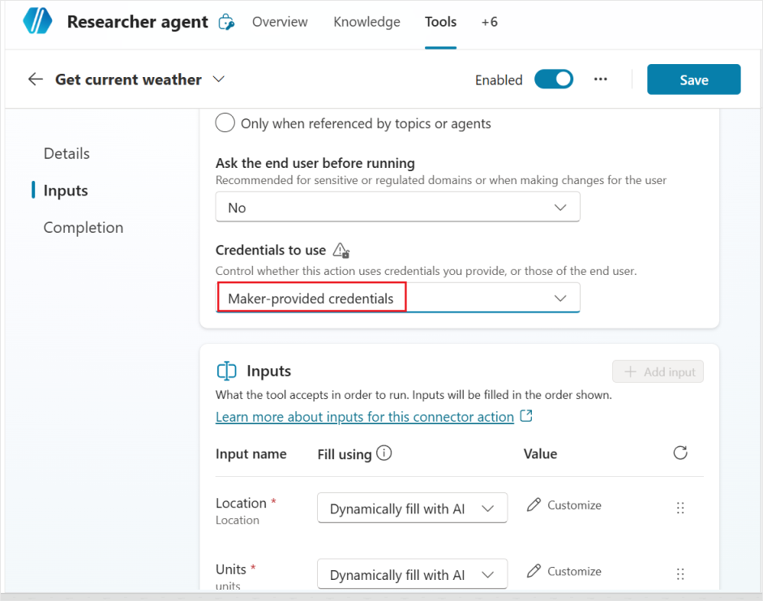

7.  **Inputs**, **Units**, -\> **Fill using** -\>에서 **Custom value**를
    선택하고 **Metric**을 선택하세요.

8.  **Inputs** 항목에서 **Location**을 선택하고 **Fill using to
    Dynamically fill with AI**를 남겨두고 설명을 설정하려면
    **Customize**를 선택하세요.

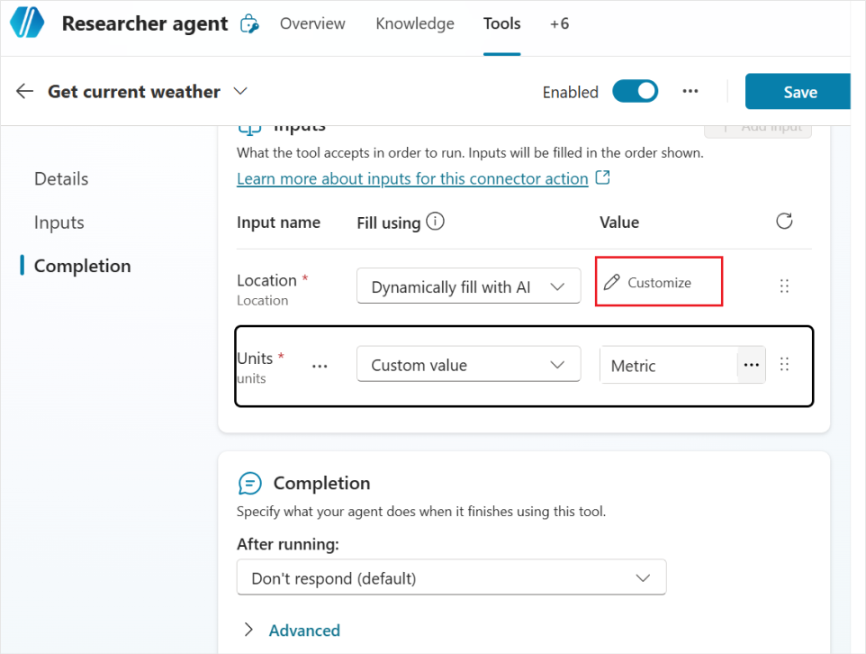

9.  다음 설명을 설정하고 **Save**를 선택하세요.

The location for the weather query. Valid inputs are City, State,
Country. Always include city and country, and state only for locations
where appropriate (e.g., in the US)

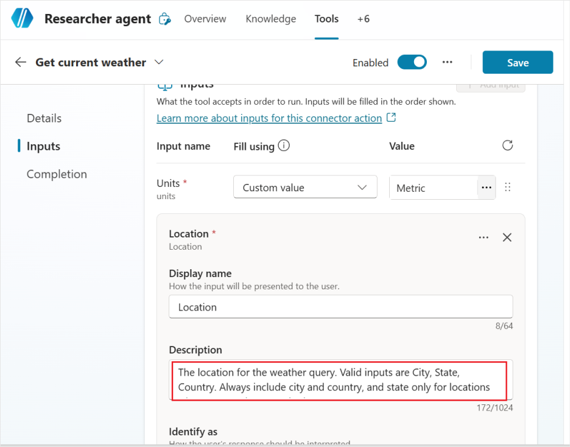

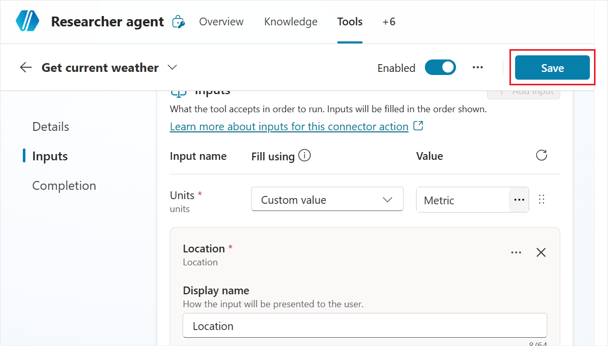

10. 이 복잡한 질문으로 사용자의 강화 에이전트를 테스트하세요:

> Who is the current CEO of the company that owns GitHub? Where did they
> earn their MBA? What's the average rent for a one-bedroom apartment
> near that campus? What's the air quality index in that area today?

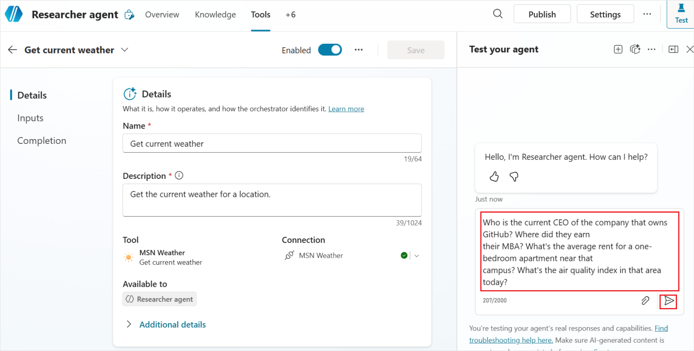

11. 생성 오케스트레이션이 여러 번 검색을 수행하고 날씨 커넥터를
    트리거하여 포괄적인 답변을 제공하는 방식을 주목하세요.

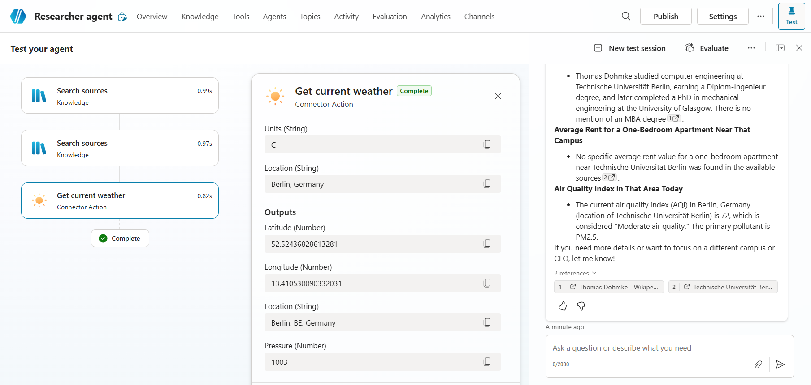

## 작업 3: AI 비서를 더 원활하게 조정해 대화하기

시스템 주제를 맞춤화하여 상호작용을 향상시키고 원활한 사용자 경험을
제공합니다.

이 섹션에서는 내장 시스템 주제를 맞춤화하여 사용자 상호작용을 개선하고
단순한 지식 출처를 넘어 더 원활한 경험을 생성할 것입니다.

비서의 환영 메시지를 더 흥미롭게 맞춤화하고, 사용자를 효과적으로 안내할
수 있는 시작 제안을 추가하며, Escalate와 같은 시스템 주제를 조직의
요구에 맞게 다듬으세요.

1.  상단 메뉴에서 **Topics**을 선택하세요.

2.  **System**에서 **Conversation Start** 주제를 선택하세요.

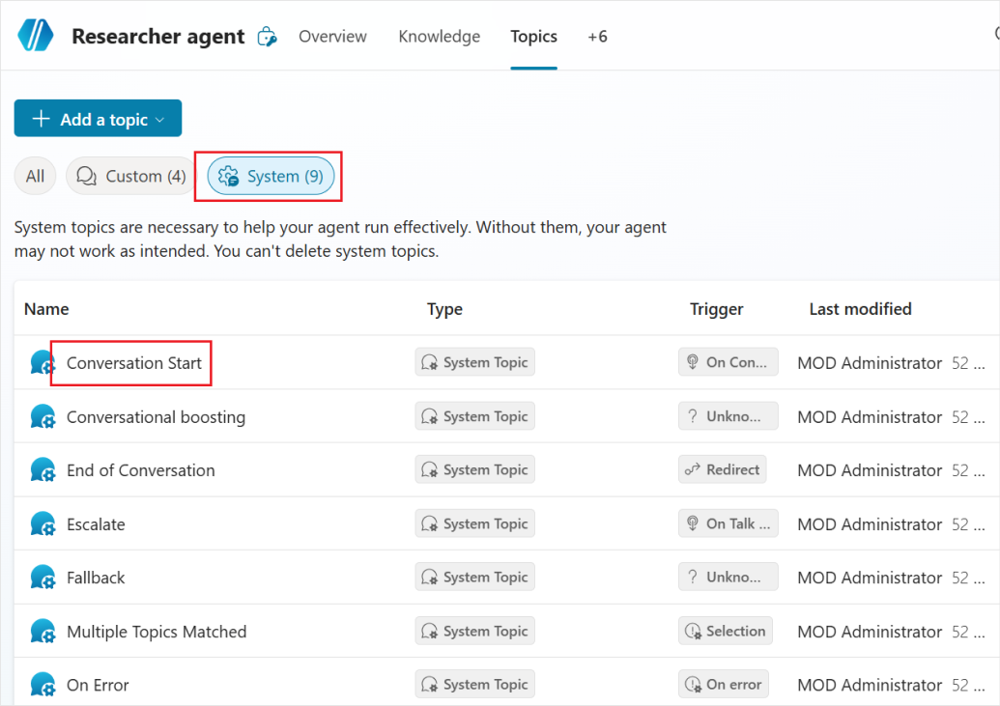

3.  주제의 **Message** 노드에서 다음 메시지를 입력하세요.

> Hi there! I'm Researcher agent, your intelligent assistant for deep
> research and discovery. I can break down complex questions and combine
> insights from historical facts, biographies, and real-time data like
> the weather. What are you curious about today?
>
> 

4.  같은 노드에 있는 상태에서 **+ Add** -\> **Quick reply**를
    선택하세요.

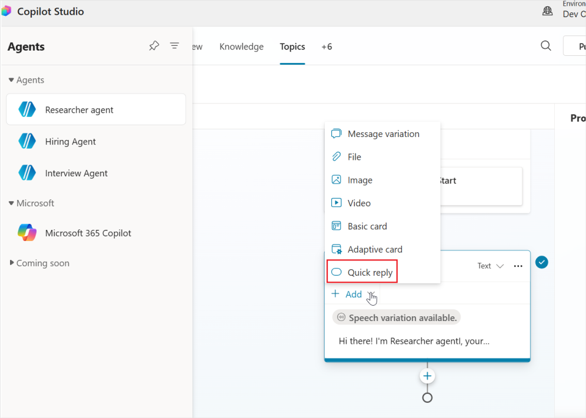

5.  다음 질문을 추가하세요.

+++What caused the fall of the Roman Empire?+++

6.  마찬가지로 2개 더 추가하세요.

> +++Who is the current CEO of the company that owns GitHub? Where did
> they earn their MBA? What's the average rent for a one-bedroom
> apartment near that campus? What's the air quality index in that area
> today?+++
>
> +++What's the temperature in the city that hosted the last Olympic
> Games?+++

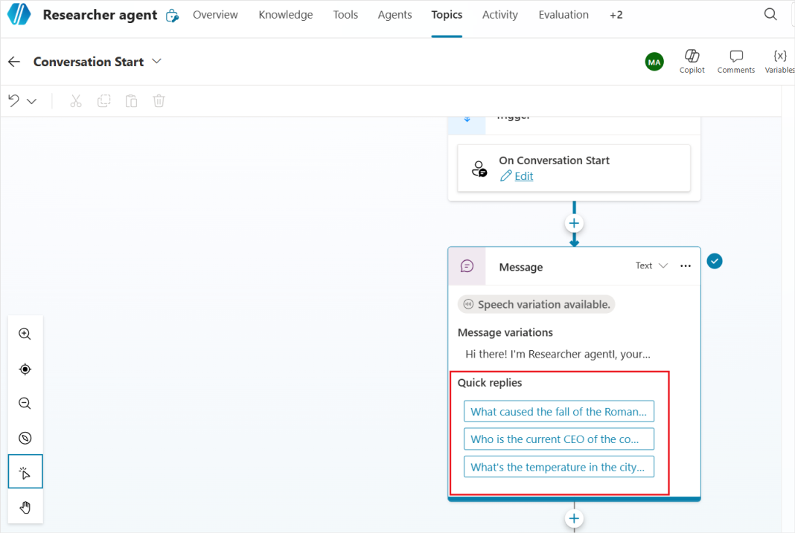

7.  추가되면 주제를 저장하려면 **Save**를 선택하세요.

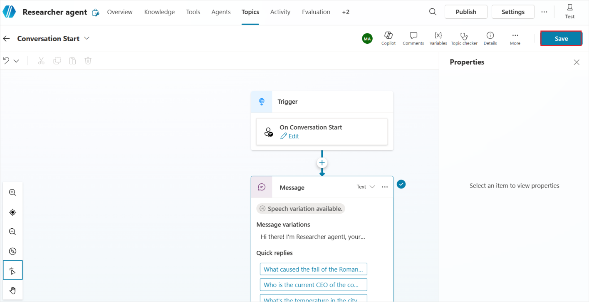

8.  에스컬레이션 경험을 맞춤화하세요. **Topics** -\> **System** -\>
    **Escalate**를 선택하세요.

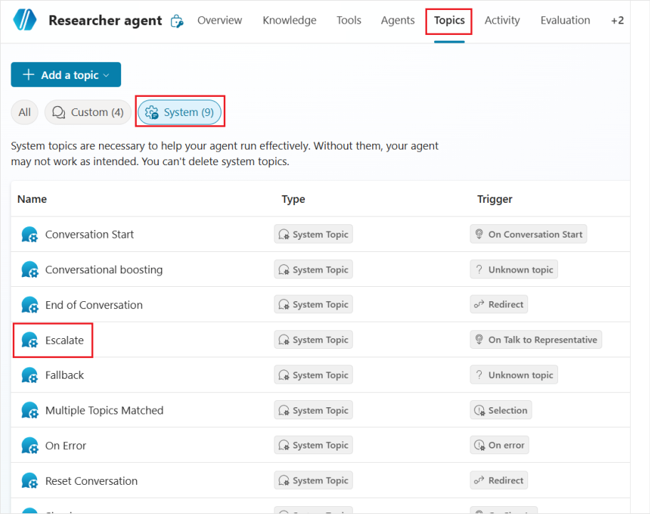

9.  아래 텍스트를 업데이트하여 최종 사용자의 차단을 더 의미 있게
    해제하고 **Save**를 선택하세요 .

> I'm sorry, but I can't seem to be able to help you. I recommend
> reaching out to our \[Microsoft Copilot Studio community\]
> (https://aka.ms/CopilotStudioCommunity) or submitting a \[support
> request\]
> (<https://learn.microsoft.com/en-us/power-platform/admin/get-help-support>).

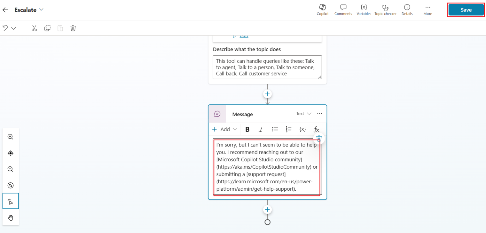

## 작업 4: 에이전트를 공개하고 데모 웹사이트에 게시하기

이 섹션에서는 인증 해제를 해제해 에이전트를 공개적으로 접근 가능하게 한
후, 테스트 및 공유를 위해 데모 웹사이트에 게시합니다. Researcher
에이전트는 일반 정보를 제공하고 개인 데이터는 처리하지 않으므로, 원활한
사용자 경험을 위해 인증을 비활성화하고 데모 웹사이트에 게시하여 실제
사이트에 배포하기 전에 피드백을 수집합니다.

1.  **Settings**으로 이동하세요.

2.  **Security** -\> **Authentication**을 선택하세요. **No
    authentication**을 선택하고 **Save**를 선택하세요.

3.  확인 프롬프트를 **Save**를 선택하세요.

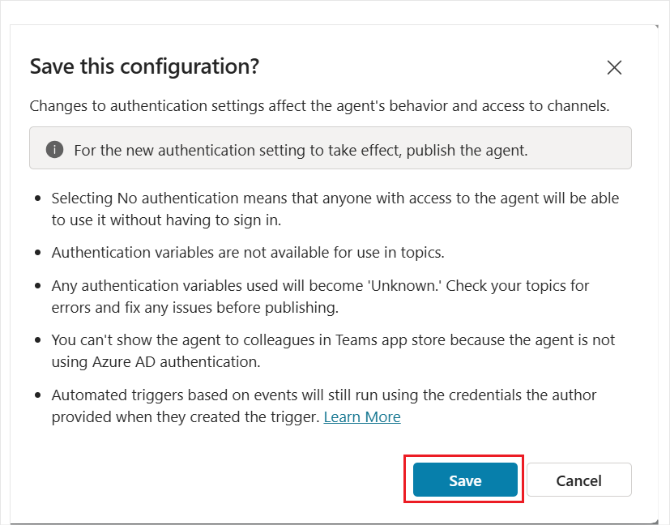

4.  이제 Settings 창을 닫으세요.

5.  변경 사항을 실시간으로 생성하기 위해 **Publish**를 선택하세요.

6.  확인 상자에서 **Publish**를 선택하세요.

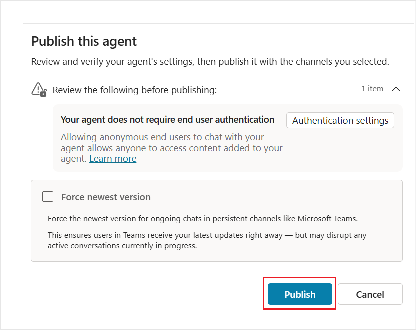

7.  게시가 완료되면 성공 메시지를 받게 됩니다.

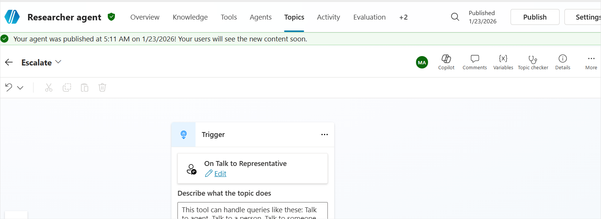

8.  이제 상단 메뉴에서 **Channels**를 선택하세요.

9.  사용 가능한 체널 목록에서 **Demo website**를 선택하세요.

10. Welcome 메시지를 +++Welcome to your demo website+++로 입력하고
    **Save**를 선택하세요.

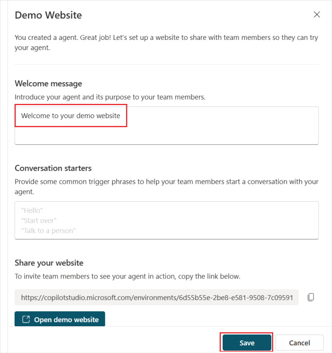

11. 사이트를 열려면 **Open demo website**를 클릭하세요.

12. 이제 에이전트와 상호작용할 수 있습니다.

## 요약

이 실습에서 사용자는 다음과 같은 공개 지능형 에이전트를 성공적으로
구현했습니다:

- 복잡하고 다부분적인 연구 질문에 답

- 검증된 공개 지식 및 실시간 커넥터를 사용

- 통제된 지식원을 통해 환각을 최소화

- 세련되고 사용자 친화적인 대화 경험을 제공

- 배포 및 라이브 데모 웹사이트를 통해 접근 가능

이 실습은 단순한 Q&A를 넘어 신뢰할 수 있고 실시간으로 맥락 인식
인사이트를 제공하는 **production-ready intelligent agent**를 설계, 강화,
출판하는 방법을 시연합니다.
