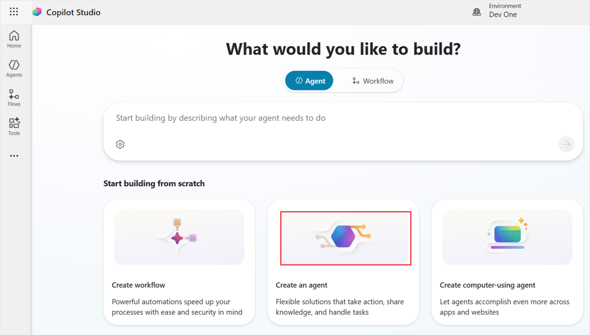
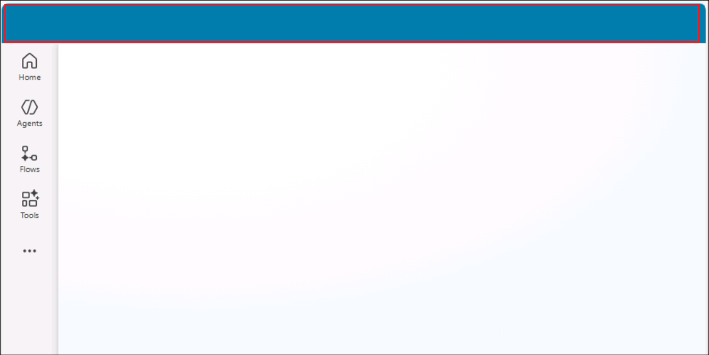
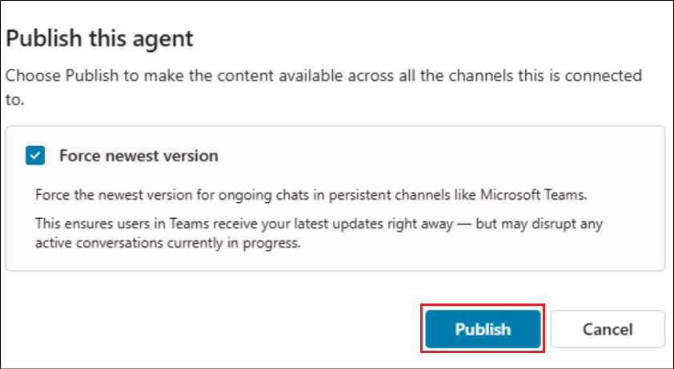
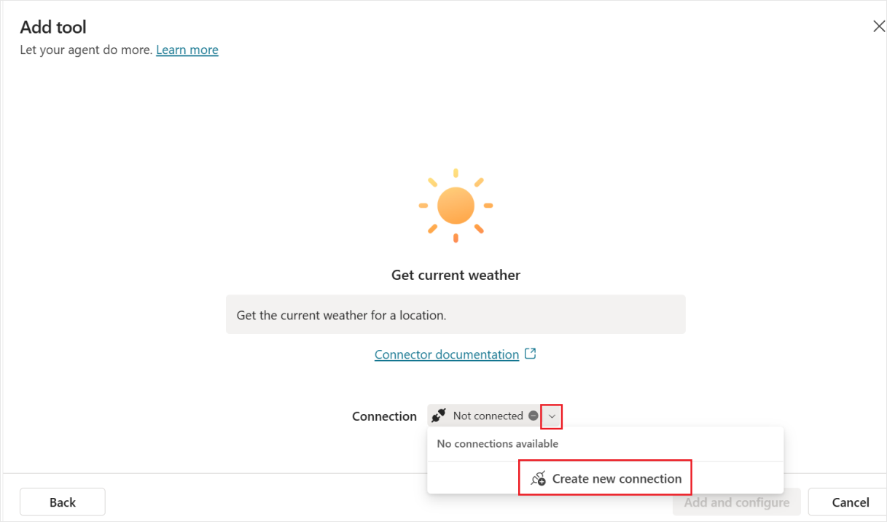
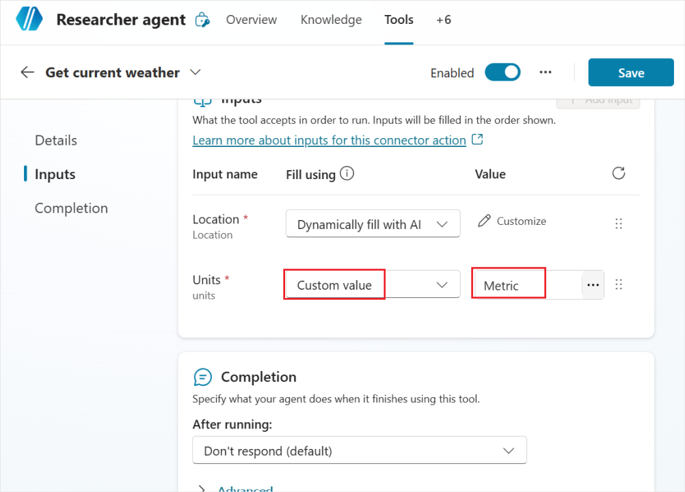

# Lab 03 – Create Safe Travels agent from Template

**Objective**

**Agent templates** are designed to help you get started with a **custom agent**. You are responsible for assessing all safety and legal implications of using an agent template and customizing it as appropriate for your business.

An agent built from the **Safe Travels agent template** is a Business-to-Employee (B2E) agent designed to provide employees of a company with **travel assistance**. This agent helps ensure employees are well-prepared and informed for their next work trip. This agent uses natural language processing to offer a conversational interface, making it easy and intuitive for employees to access the information they need. However, the default website used by the agent currently only covers US travel destinations. You can replace the default website with your own knowledge source.

In this lab, you will create an agent from the **Safe Travels template** and enhance it in Lab 05.

## Exercise 1: Create Safe Travels agent from template

In this exercise, you will create the agent in Copilot Studio using the Safe Travels agent template.

1.  From a browser, login to +++https://copilotstudio.microsoft.com+++.
    The Start free trial page opens up. Select your country and click
    **Start free trial**.

    

2.  Select the **Dev One** environment.

    

    >[!Alert] **Important** If the Copilot Studio does not show up the option to select **Environment** as in the below screenshot, then follow the below steps.
    >
    >
    >
    > Open +++https://admin.powerplatform.microsoft.com/+++. Select **Manage** -> **Environments -> Dev One** and select the value of the **Environment ID**.
    >
    >
    > Navigate back to the Copilot Studio tab and open +++https://copilotstudio.microsoft.com/environments/**< EnvironmentID >**+++   (Replacing **< EnvironmentID >** with the value fetched above)

3.  Select Skip in the Welcome screen.

    
    
3.  Select **Agents** from the left pane and then select the **Safe Travels** template under **Start with an agent template**. 

    

5.  The Safe Travels template creates a new agent that is designed to
    provide employees of a company with travel assistance. 

    

6.  Browse through the set-up page. Under **Knowledge**, you can find
    that **US Travel Website** is already added as a Knowledge source.
    It can be edited if needed. Here, we are using the same website.

    

7.  Select **Create** to create the Safe Travels agent. We are not
    changing anything here and using the template as such. At any point,
    the agent can be upgraded as per the user requirements.

    

8.  The **agent** gets **created** and opens up automatically showing up
    the **Overview** page.

    

9.  In the Test pane, enter +++How to apply for passport?+++ and hit
    **Send**.

    The Test pane is open by default. If not, click on the Test icon on top
right.

    

10. You can see that the agent provides information on how to apply for
    the passport from its knowledge source.

    

## Exercise 2: Publish the agent to Teams and Microsoft 365 Copilot

In this exercise, you will **publish** the agent created in Copilot Studio to the **Microsoft Teams** and **Microsoft 365 Copilot** channel.

1.  Open **MS Teams** +++https://teams.microsoft.com/v2/+++ from a browser and **login** using your tenant credentials from the **Resources** tab.

1.  Back in the Copilot Studio, select **Publish** from the top right of the agent page.

    

2.  Check the **Force newest version** checkbox and then select **Publish** in the confirmation dialog.

    

    
    
4.  Select **Channels** from the top navigation bar.

    

5.  Select **Teams and Microsoft 365 Copilot** from the list of
    available channels.

    

6.  Select **Add channel**.

    

7.  Click on the **See agent in Teams** option add the agent to the
    Teams.

    

8.  This opens up the agent in the Microsoft Teams. Select **Cancel** in the **This site is trying to open Microsoft Teams** pop up and then select **Use the Web App instead** option.

    

9.  Select **Add** to add the agent.

    

    

10.  Once added, you will get an option to open the agent. Select
    **Open**.

    

11.  Test the agent from Teams.

    

11. Back in the Copilot Studio, close the Teams and Microsoft 365
    Copilot channel window.

    

