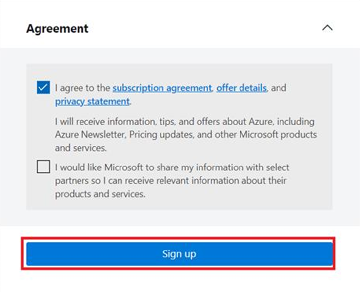

# Lab 03- Using a connection to Azure OpenAI on your data for generative answers

**Lab duration** – 40 minutes

**Objective:**

In this lab, we will learn how to use the Azure Open AI connection in
the copilot to generate answers.

## Exercise 0: Set up the environment

### Task 1: Redeem Azure Pass
1.	Open a new tab on your browser and browse to the **Microsoft Azure Pass** website using the given link +++https://www.microsoftazurepass.com/+++.
   
2.	Click on **Start**.
   
    
  	
3.	Enter the **Office 365 Tenant Administrative credentials** from the Lab VM(**Resources tab**) and **Sign In**.

    

    
 
4.	Click on **Yes** in the Stay Signed in window.
   
5.	Verify email id and then click on **Confirm Microsoft Account**.
   
    
  	
6.	Paste the **promo code** from the **Resources** tab in the **Enter Promo code** box, enter the characters you see and then click **Submit**.

   
   
   
 
7.	It may take few seconds to process the redemption.
8.	Fill in the details appropriately on the **Sign up** page.
9.	On the **Agreement** window, select the check box - I agree to the subscription agreement, offer details, and privacy statement, and then click on **Sign up**.

    

10.	Click on **Next** in the Protect your account dialog.

    
   	
11.	Click on **Next** in the More information required screen to configure the **Authenticator app**.

    
 
12.	Click on **Next** if you already have the Microsoft Authenticator app in your phone.
    
    
   	
    >[!Note] **Note:** If you do not have the Authenticator app in your phone, download the authenticator app on your phone and then continue with the next steps.

13.	Click on **Next** on the **Keep your account secure** screen.

    
 
14.	Scan the QR code displayed on the screen from your phone and then click on **Next**.

    

15. A **number** will be displayed on the screen.

    
    
16. Enter the **number** in the **Authenticator app** of your phone and
    then you will get **Notification approved** message on the **VM**.
    Click on **Next**.

    
 
17.	Click **Done** on the Success screen.

    
 
18.	You will now be redirected to the Azure portal. **Close** the Welcome to Azure screen and then the Azure portal for now.

    

 
### Task 2: Register the required Resource providers
1.  Login to +++<u><https://portal.azure.com/>+++</u>, using the Azure
    account credentials from the Resources tab of the VM.

2.  On **Welcome to Microsoft Azure** dialog box, click on **Maybe
    later** button.

    

3.  Type in +++**Subscriptions**+++ in the search bar and select
    **Subscriptions**.

    

4.  Click on your assigned **subscription**.

    

5.  From the left menu, click on the **Resource Providers** under
    Settings.

    
6.   In the search bar, type +++**Microsoft.Storage**+++, and identify **Microsoft.Storage** from the list that get populated. Click on the three dots next to **Microsoft.Storage** and select **Register**.

    

7.  A notification stating **Successfully registered resource provider**
    is obtained once the registration is successful.

8.  Repeat steps 6 and 7 to register the following Resource providers.

    - +++**Microsoft.Security**+++

    - +++**Microsoft.Search**+++

    - +++**Microsoft.CognitiveServices**+++

    - +++**Microsoft.Sql**+++

    - +++**Microsoft.Web**+++

    - **Microsoft.ManagedIdentity**

## Exercise 1: Create Azure OpenAI resource

1.  From the Azure portal home page, click on **Azure portal menu**
    represented by three horizontal bars on the left side of the
    Microsoft Azure command bar as shown in the below image.

    

2.  Navigate and click on **+ Create a resource**.

    

3.  On **Create a resource** page, in the **Search services and
    marketplace** search bar, type **Azure OpenAI**, then press the
    **Enter** button.

    

4.  In the Marketplace page, navigate to the Azure OpenAI section, click
    on the Create V chevron button, then click on **Azure OpenAI** as
    shown in the image. (In case, you clicked on the Azure **OpenAI
    section**, then click on the **Create** button on the **Azure OpenAI
    page**).

    

5.  In the **Create Azure OpenAI** window, under the **Basics** tab,
    enter the following details and click on the **Next** button.

    1.  **Subscription**: Select the assigned subscription

    2.  **Resource group**: click on Create new\> enter **AOAI-RGXX**(XX
        can be a unique number)

    3.  **Region**: Select **East US**

    4.  **Name**: Azure-openai-testXX (XX can be a unique number) (here,
        we entered **Azure-open-test29**)

    5.  **Pricing tier**: Select **Standard S0**

    

    

6.  In the **Network** tab, leave all the radio buttons in the default
    state, and click on the **Next** button.

    

7.  In the **Tags** tab, leave all the fields in the default state, and
    click on the **Next** button.

    

8.  In the **Review+submit** tab, click
    on the **Create** button.

    

9.  Wait for the deployment to complete. The deployment will take around
    10-15 minutes.

    

10. On **Microsoft.CognitiveServicesOpenAI** window, after the
    deployment is completed, click on the **Go to resource** button.

    

## Exercise 2- Create an Azure Storage Account and Azure cognitive Search by using the portal

### **Task 1: Cognitive Services Usages Reader for the Azure OpenAI resource**

1.  From the home page of Azure portal(+++https://portal.azure.com+++),
    type in +++**Subscriptions**+++ in the search bar and select
    **Subscriptions**.

    

2.  Click on your assigned **subscription**.

    

3.  From the left menu, click on the **Access control(IAM).**

    

4.  On the Access control(IAM) page, Click +**Add** and select **Add
    role assignments.**

    

5.  Type the **Cognitive Services Usages Reader** in the search box and
    select it. Click **Next**

    

6.  In the **Add role assignment** tab, select Assign access to User
    group or service principal. Under Members, click **+Select members**

    

7.  On the Select members tab , search your Azure OpenAI subscription
    and click **Select.**

    

8.  In the **Add role assignment** page, Click **Review + Assign**, you
    will get a notification once the role assignment is complete.

    

    

9.  You will see a notification – added as Cognitive Services Usage
    Reader for Azure Pass-Sponsorship.

    

10. In Azure subscription page from the left menu, click on the **Access
    control(IAM).**

    

11. On the Access control(IAM) page, Click +**Add** and select **Add
    role assignments.**

    

12. Type the [**Cognitive Services
    Contributor**](https://learn.microsoft.com/en-us/azure/ai-services/openai/how-to/role-based-access-control#cognitive-services-contributor)
    in the search box and select it. Click **Next**.

    

13. In the **Add role assignment** tab, select Assign access to User
    group or service principal. Under Members, click **+Select members**

    

14. On the Select members tab , search your Azure OpenAI subscription
    and click **Select.**

    

15. In the **Add role assignment** page, Click **Review + Assign**, you
    will get a notification once the role assignment is complete.

    

    

16. You will see a notification – added as Cognitive Services Usage
    Reader for Azure Pass-Sponsorship.

    

17. Click on **Home**, search for +++**Azure OpenAI**+++ in the search
    bar and select **Azure OpenAI.**

    

18. Click on your **Azure OpenAI** service.

    

19. From the left menu, click on the **Access control(IAM).**

    

21. Type the [**Cognitive Services
    Contributor**](https://learn.microsoft.com/en-us/azure/ai-services/openai/how-to/role-based-access-control#cognitive-services-contributor)
    in the search box and select it. Click **Next**.

    

22. In the **Add role assignment** tab, select Assign access to User
    group or service principal. Under Members, click **+Select members**

    

23. On the Select members tab , search your Azure OpenAI subscription
    and click **Select.**

    

24. In the **Add role assignment** page, Click **Review + Assign**, you
    will get a notification once the role assignment is complete.

    

    

25. You will see a notification – added as Cognitive Services Usage
    Reader for Azure Pass-Sponsorship.

    

### **Task 2: Create an Azure Storage Account by using the portal**

1.  Sign in to the +++**<https://portal.azure.com/>+++**

2.  Click on the **Portal Menu**, then select **+ Create a resource**

    

3.  In the **Create a resource** window search box, type +++**Storage
    account**+++ and then click on the **storage account**.

    

4.  In the **Marketplace** page, click on the **Storage account**
    section.

    

5.  In the **Storage account** window, click on the **Create** button.

    

6.  On **Create a storage account** window, under the **Basics** tab,
    enter the below details to create a storage account and then click
    on **Review + create**

- 

    | **Subscription** | Select your Azure OpenAI subscription |
    |----|----|
    | **Resource group** | Select AOAI-RGXX |
    | **Storage account name** | **azureopenaistorageXX**(XX can be a unique number) (here, we entered **azureopenaistorage39**) |
    | **Region** | **East US** |
    | **Performance** | **Standard: **Recommended for most scenarios (general-purpose v2 account) |
    | **Redundancy** | **Locally-redundant storage (LRS)** |

    

7.  On the **Review** tab, click on the **Create** button.

    

8.  This new Azure Storage account is now set up to host data for an
    Azure Data Lake. Click on the **Go to resource** button.

    

9.  After the account has been deployed, you will find options related
    to Azure Data Lake in the Overview page. In the left-side navigation
    pane, navigate to **Data storage** section, then click on
    **Containers**.

    

10. On **azureopenaistorageXX \| Containers** page, click on
    **+Container.**

    

11. On the New container pane that appear on the right side, enter the
    container **Name** as +++ **source**+++ and click on **Create**
    button.

    

12. On **azureopenaistorageXX \| Containers** page, select **source**
    container.

    

13. On **source** container page, click on **Upload** button.

    

14. In the **Upload blob** pane, click on **Browse for file**, navigate
    to **C:\Labfiles** location and select **TF-AzureOpenAI.pdf**, then
    click on the **Open** button.

    

    

15. In **Upload blob** pane, click on the **Upload** button.

    

16. You will see a notification – **Successfully uploaded blob** when
    the uploaded is succeeded.

    

    

### **Task 3: Create an Azure Cognitive Search service in the portal**

1.  From the **azureopenaistorageXX \| Containers** page, click on
    **Home** to go back to Azure portal home page.

    

2.  In Azure portal home page, click on **+ Create Resource**.

    

3.  In the **Create a resource** page search bar, type and select +++azure ai search+++.

    

4.  Click on **azure ai search** section.

    

5.  In the **Azure AI Search** page, click on the **Create** button.

    

6.  On the **Create a search service** page, provide the following
    information and click on **Review+create** button.

    | **Field**          | **Description**                                |
    |--------------------|------------------------------------------------|
    | **Subscription**   | Select your Azure OpenAI subscription          |
    | **Resource group** | Select your Resource group                     |
    | **Region**         | EastUS                                         |
    | **Name**           | **mysearchserviceXX** (XXcan be unique number) |
    | **Pricing Tier**   | Click on change Price Tire\>select **Basic**   |

    

    

    

7.  Once the Validation is passed, click on the **Create** button.

    

    

8.  After the deployment is completed, click on the **Go to resource**
    button.

    

9.  In the **mysearchserviceXX** Overview page. In the left-side
    navigation pane, under **Settings** section, select **Semantic
    ranker**.

    

10. On the **Semantic ranker** tab**, ensure that **Free** plan is selected. 

    

## Exercise-3: Add your data using Azure OpenAI Studio

### **Task 1: Deploy gpt-3-turbo and embedded models in Azure AI Studio**

1.  Open your browser, navigate to the address bar, and type or paste
    the following URL:
    +++https://oai.azure.com/+++ then
    press the **Enter** button. Login using your **Azure** credentials.

    

> **Note**: If you are directed to the **Azure OpenAI Studio** home
> page, then skip steps from \#2 to \#4, else continue.

2.  In the **Microsoft Azure** window, enter your **Sign-in**
    credentials, and click on the **Next** button.

    

3.  Then, enter the password and click on the **Sign in** button**.**

    

4.  In **Stay signed in?** window, click on the **Yes** button.

    

5.  Select **May be later** option.

    

5.  On the **Welcome to Azure OpenAI Studio** dialog box, under the
    **Subscription** field, enter the subscription assigned to you, and
    in the **Resource** field, select the existing AOAI Resource name,
    and then click on the **Use resource** button.

    

6.   The **Azure OpenAI Studio home** page appears.

    

7.	On the **Azure OpenAI Studio** homepage, click on **Create new deployment**.

    

8.  In the **Deployments** page, click on +**Create new deployment**.

    

10.	Enter the below details and click on the Create button.
      -   Deployment name - +++gpt4+++
      -   Select a model – gpt-4
      -   Model version – 0125-Preview
       -    ployment type - Standard

    
   	
11.	Scroll down to click on **Create**.

    
   	
12.   You will get a **success** notification under **Notifications** and the created deployment details will be listed on the **Deployments** page.

   

## Exercise 4: Create a Copilot app with custom data

### **Task 1: Create a chatbot with custom data**

1.  Select **Chat** to open the Chat playground.

    

2.	In **Chat playground** pane, select **+Add data source** under **Add your data**.

    

3.  In the **Add data** page, under **Select or add data source** enter
    the following details and select **Next.**

    | **Select data source** | **Select Azure Blob Storage(preview)** |
    |----|----|
    | **Subscription** | Select your Azure OpenAI subscription |
    | **Select Azure Blob storage resource** | Select **azureopenaistorageXX** |
    | **Select storage container** | Select **source** |
    | **Select Azure AI Search resource** | Select **mysearchserviceXX** |
    | **Enter the index name** | **copilot-index** |
    | **Indexer schedule** | Once |

    

   >[!Note] **Note**: In case, you encounter an error – **Can‘t manage CORS on this
resource. Please select another storage resource**, then syn your VM
time.*

4.  In the **Add data** page, on the **Data management** tab select
    **Semantic** under **Search type,** select the chunk size as
    **1024(default).**Then, click on **Next.**

    

5.	In the **Data connection pane**, select **API key** and click on **Next** button.
   
6. In **Review and Finish** pane, review the details that you’ve entered, and click on **Save and close** button**.**

    

7.	The data will be added in your Chat Playground. This process will take a few minutes to complete.

   

8.	Once added, the data details are displayed under the **Add your data tab**.
   
   

9.	Click on the drop down next to the **Deploy to** option and select **A new copilot in Copilot Studio(preview)**.

   

10.  **Deploy to a copilot in Copilot Studio(preview)** dialog box appears, then click on the **Continue in Copilot Studio** button.

   

11.   Login using your tenant details if prompted.
12.   Click on **Skip** in the Welcome screen.

       

13.   Select the environment CustomerService Trial and click on **Next**.

       
   	
14.	In the **Create a copilot** pane, enter **Copilot name** as +++**CopilotForAOAI**+++ and click on **Create** button.

       

15.	Once deployed, click on **Topics**. Select **System** under Topics and then select the **Conversational boosting**.

       

16.	Select **Edit** under the **Data sources**. 

       

17.	In the **Create generative answers properties** pane, toggle **Allow the AI to use is own general knowledge (preview)** to **off** and then click on the **Classic data** option to expand it.
    
       

18. Under the **Data sources -> Azure OpenAI Services on your data**, click on **+ Add connection** and select **Azure OpenAI**.

       

19. Click on the **Connection properties** option.

       
    
21. Enter the below details in the **General** tab.

    -   Deployment - +++gpt4+++
    -   Api version - +++2023-06-01-preview+++
    -   Maximum tokens in response - +++800+++
    -   Temperature - 0
    -   Top P - 1

       

21. Click on the **Model data** tab under **Connection properties** and
    then select **+ Add**.

   

22. Enter the below details for **Data sources** and click on **Save**.

   - **Index name -** +++copilot-index+++
   
   - **Semantic search configuration** – default
   
   - **Query type – semantic**

   

   

23. Close the **Create generative answers properties**.

   
   
24. Click on the **Test** icon to test the copilot.

   

25. In the chat, type +++**What is Azure OpenAI?**+++ and hit **Enter**.
    Observe that the output that the copilot gives is from the pdf file
    that we uploaded in the Azure OpenAI Studio. This result is
    generated by creating a connection to the Azure OpenAI deployment,
    from the Copilot Studio copilot.

   

26. Ask few more questions that are relevant to the uploaded document to
    see how the integration works.

### **Task 2: Delete the deployed models**

1.  In Azure OpenAI Studio, on the left pane, under the **Management**
    section, click on **Deployments**.

    

2.	Select **gpt4** and click on **Delete deployment**.

    

3.	In the **Confirm delete** dialog box, click on the **Delete** button. You will see the notification – **Successfully Deleted deployment**.

    

### **Task 3: Delete the Resource group**

1.  From the Azure portal, select the **Resource group** you created in
    Exercise 1(AOAI-RGXX). Select **Delete resource group**.

    

2.  Enter the name of the Resource group and click on **Delete**.

    

**Summary**

You've created a storage account, container, and Azure cognitive service in Azure portal, then you've deployed gpt-4 model in Azure OpenAI Studio. You’ve added data in Chat Playground, deployed it as a copilot in Copilot studio, configured the connection parameters from the Copilot Studio and integrated Azure OpenAI on your data in the Copilot Studio. 

