# Laboratorio 04 – Integración de un agente con la aplicación Dynamics 365 Customer Service e implementación del escalado automático de casos al agente en vivo

## Objetivo

Este laboratorio detalla los pasos para escalar una conversación a un
agente en vivo desde los agentes.

\[!Alerta\] **Importante:** Este laboratorio sólo puede ejecutarse si se
ha habilitado la prueba de Dynamics 365 según el **Laboratorio 02 -
Configuración de Dynamics 365 Customer Service.**

## Ejercicio 1: Configurar el workspace de Dynamics 365 Customer Service

### Tarea1: Configurar la extensión Omnichannel Power Virtual Agent 

1.  Abra el enlace,
    +++<https://appsource.microsoft.com/en-cy/product/dynamics-365/mscrm.omnichannelpvaextension?tab=Overview&ref=dynamicsforcrm.com+++> y
    haga clic en **Get it now** en la página Omnichannel Power Virtual
    Agent Extension.

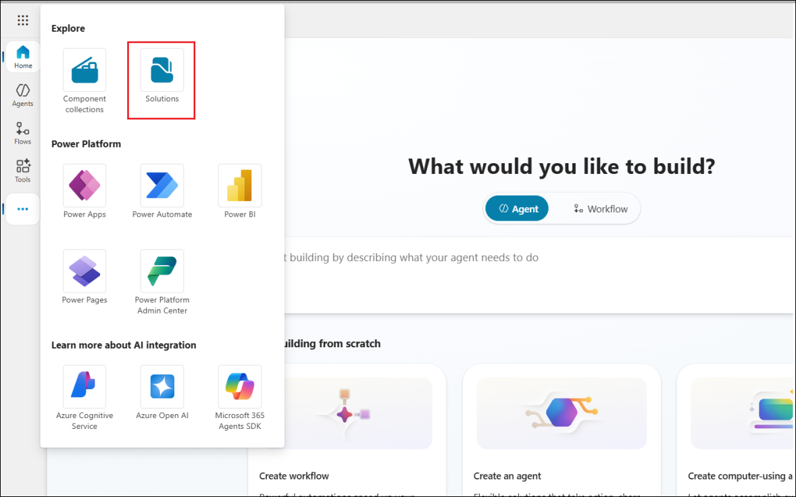

2.  Inicie sesión con las credenciales del tenant desde la
    pestaña **Resources**.

3.  Haga clic en **Get it now**.

4.  Seleccione **CustomerService Trial** en **Select an environment**,
    marque las casillas correspondientes y haga clic en **Install**.

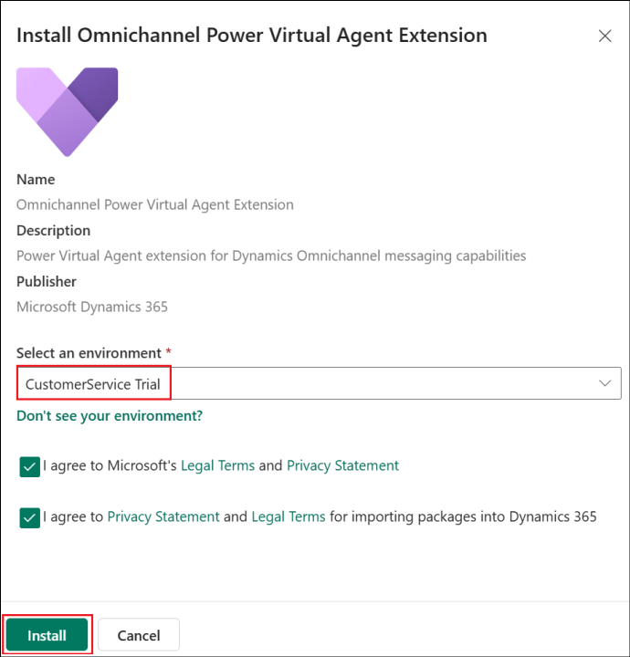

## Tarea 2: Configurar los ajustes de búsqueda en el centro de administración de Power Platform

1.  Inicie sesión en
    +++<https://admin.powerplatform.microsoft.com/+++> con los datos de
    su tenant. Seleccione **Manage** en el panel izquierdo y, a
    continuación, seleccione **CustomerService Trial** en la lista de
    entornos.

2.  Seleccione **Settings** en el panel superior.

3.  Seleccione **Product** -\> **Features**.

4.  Activa **Dataverse Search** a **On** y haz clic en **Save**. Luego, activa la opción **Single table search** a **On** y selecciona **Save**.

## Ejercicio 2: Crear un agente

1.  Desde la página de inicio de Copilot Studio,
    +++[https://copilotstudio.microsoft.com+++](https://copilotstudio.microsoft.com+++/),
    seleccione el entorno **CustomerService Trial** en la parte superior
    derecha.

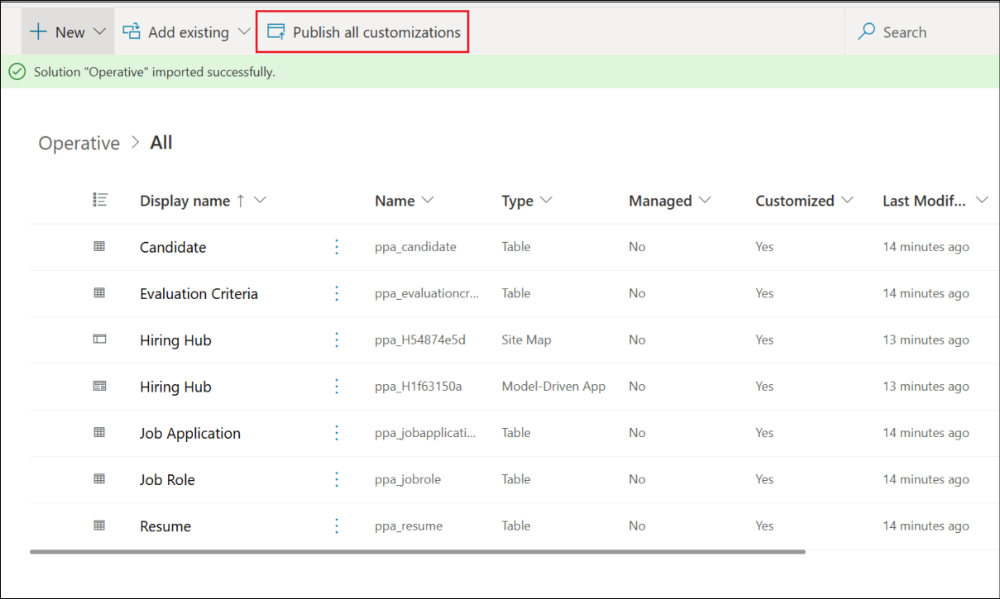

2.  Seleccione **Agents** en el panel izquierdo. Haga clic en **+ New
    Agent** para crear un nuevo agente.

3.  En el área de texto Type your message, escriba +++**You are a
    customer service agent who helps in identifying stores nearby.**+++
    y presione **send**.

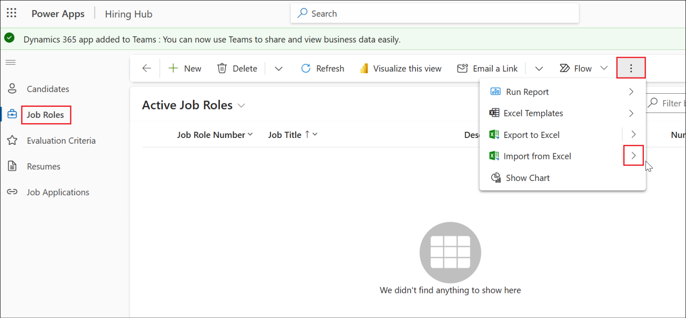

4.  El agente puede sugerir un nombre para el agente que se está
    creando. Aceptarlo o sugerir uno nuevo..

5.  Escriba el mensaje +++**Maintain a polite tone**+++ a continuación y
    presione **send**.

6.  Haga clic en **Create**.

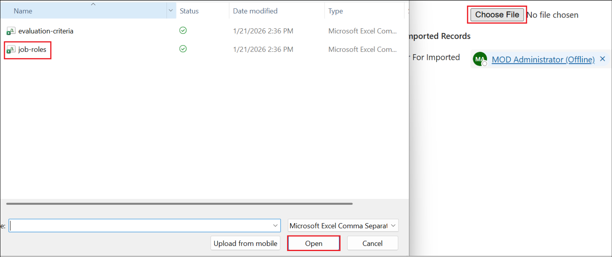

7.  El agente creado se abre con un mensaje, **Your agent is ready**.

## Ejercicio 3: Conectar Copilot a Dynamics 365 Customer Service y configurar el tema Escalate

### Tarea 1: Configurar el tema Escalate

Nos centramos aquí en mostrar el concepto de escalado a agente en vivo.
Por lo tanto, trabajaremos directamente en ello sin crear ningún otro
tema nuevo.

1.  Seleccione la pestaña **Topics** y, a continuación, seleccione la
    pestaña **System**. Seleccione el tema **Escalate**.

2.  Seleccione el nodo de mensaje del tema y sustituya el contenido
    existente con, +++You will be transferred to a live agent shortly+++

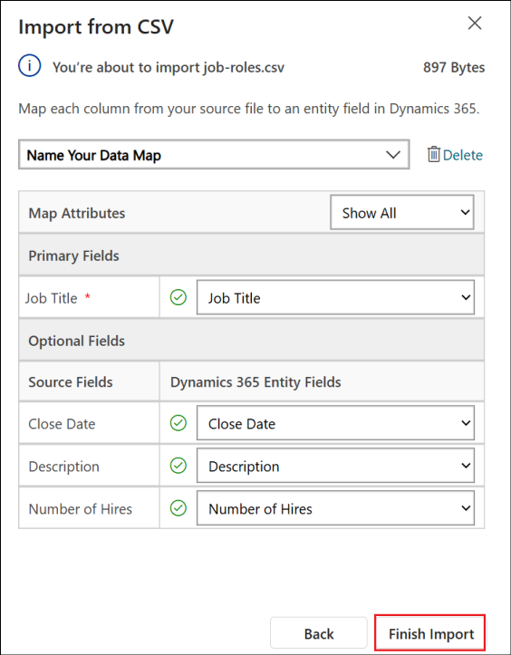

3.  Haga clic en el símbolo + para añadir un nodo junto al nodo Message.

4.  Seleccione **Topic management** -\> **Transfer conversation**.

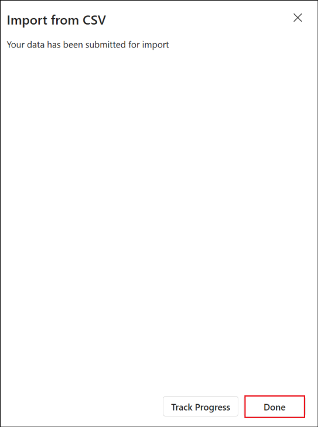

5.  Escriba el mensaje +++The customer wants to talk to a live agent+++
    en el nodo Transfer conversation.

6.  **Guarde** el tema hacienda clic en Save.

7.  **Publique** el agente hacienda clic en Publish.

### Tarea 2: Conectar Copilot a Dynamics 365 Customer Service

1.  Una vez publicado, en la parte superior derecha de la página
    Copilot, haga clic en **Settings**.

2.  Seleccione **Security**, y **Authentication** en Security.

3.  Seleccione la opción **No authentication** y luego haga clic
    en **Save**.

4.  Seleccione **Save **en el cuadro de diálogo de confirmación.

5.  Cierre el panel **Settings**.

> 

6.  Haga clic en **Channels** (si los canales no están visibles, haga
    clic en el signo +1 para ver la opción **Channels**)

7.  Seleccione **Dynamics 365 Customer Service** en el panel Customer
    engagement hub.

8.  En la página Dynamics 365 Customer Service, haga clic
    en **Connect**.

9.  Una vez que reciba el mensaje **successfully connected**, haga clic
    en **Close**.

## Ejercicio 4: Crear flujo de trabajo y canal en el centro de administración de Dynamics 365 

### Tarea 1: Gestionar un usuario en Omnichannel para Customer Service 

1.  Inicie sesión en
    +++[https://admin.powerplatform.microsoft.com+++](https://admin.powerplatform.microsoft.com+++/) con
    sus credenciales de administrador de tenants. Seleccione **Manage**
    en el panel izquierdo. Seleccione el entorno **CustomerService
    Trial** en **Environments**.

2.  Haga clic en el **valor de la URL** debajo de **Environment URL**.

3.  Seleccione **Customer Service workspace** en la barra de encabezado.

4.  Se abrirá la página **Apps**. Seleccione **Customer Service admin
    center**.

5.  Esto abre la página **Dynamics 365 Customer Service admin center**.

### Tarea 2: Configurar flujo de trabajo

1.  En la página del centro de administración,
    seleccione **Workstreams** en **Customer support** en el panel
    izquierdo y, a continuación, seleccione la opción **+ New
    workstream**.

2.  Seleccione Inbound

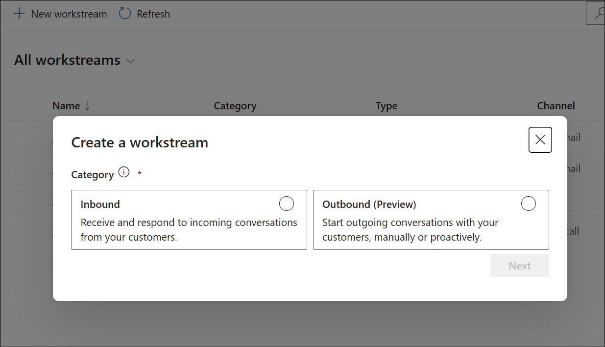

3.  Complete los siguientes datos, desplácese hacia abajo y haga clic en
    **Create**.

    - Name - +++**New Workstream**+++

    - Owner – **MOD Administrator** (Seleccionado por defecto)

    - Type – **Messaging**

    - Channel – **Chat**

> 

4.  Una vez creado el flujo de trabajo, haga clic en **Set up
    chat **para configurar el canal de chat.

5.  En la pantalla **Live chat setup – Channel details**, complete los
    siguientes datos.

    - Name - +++**Chat Channel**+++

    - Language – **English - United States**

6.  Desplácese hacia abajo y haga clic en **Next**.

7.  Acepte los valores predeterminados en las dos páginas siguientes
    hasta llegar a la pantalla del widget de chat. En la pantalla Live
    chat setup – Chat widget, ingrese el nombre +++**Store Locator
    Assistant**+++, acepte los demás valores predeterminados y haga clic
    en **Next**.

8.  En la pantalla **Live chat setup – Behaviors**, acepte los valores
    predeterminados y haga clic en **Next**.

9.  En la pantalla **Live chat setup – User features**, desactive las
    opciones **File attachment** y **Voice and video calls** y haga clic
    en **Next**.

10. Acepte el valor predeterminado en la pantalla Notification y haga
    clic en **Next**.

11. En la pantalla **Live chat setup – Review and finish**,
    seleccione **Create channel**.

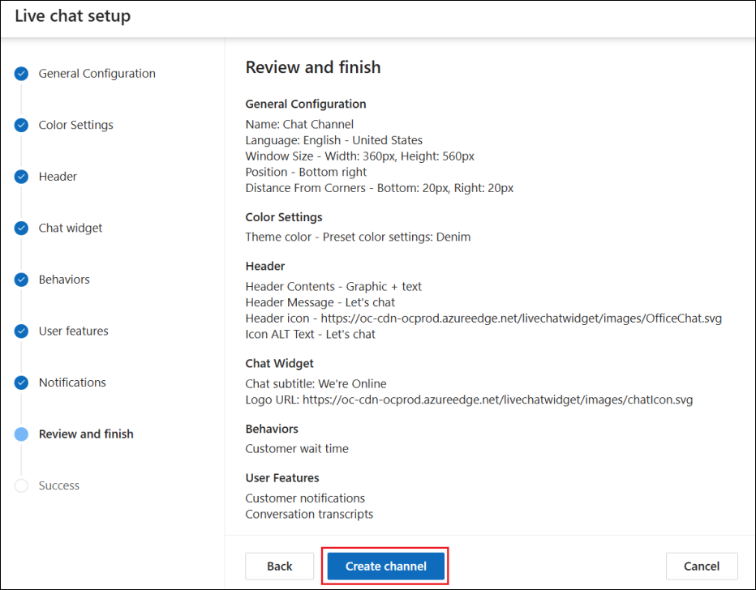

12. **Copie** el valor del widget que aparece en la pantalla **Live chat
    setup – Success** y **guárdelo** en un bloc de notas para añadirlo a
    una página web en los próximos ejercicios. A continuación, haga clic
    en **Done** para completar la configuración.

### Tarea 3: Agregue el agente al flujo de trabajo

1.  De vuelta en la página **New Workstream**, desplácese hacia abajo y
    haga clic en **+ Add bot** en la sección Bot.

2.  En la lista de copilotos de la pantalla Add bot, seleccione el
    agente **Store Locator Assistant** y haga clic en **Connect**.

3.  Asegúrese de que el bot se ha añadido al flujo de trabajo tal y como
    se muestra en la siguiente captura de pantalla.

4.  En el panel izquierdo, seleccione **AI Agents**.

5.  Asegúrese de que el agente **Store locator** está conectado.

## Ejercicio 5: Crear una página web y probar el escalado al agente

1.  Inicie sesión en +++<https://make.powerpages.microsoft.com/+++> con
    sus credenciales de administrador de tenants.

2.  Asegúrese de que se encuentra en el entorno **CustomerService
    Trial**.

3.  Haga clic en **Get started**.

4.  Haga clic en Skip en la página **Tell us about yourself**.

5.  Desplácese hacia abajo en la página siguiente y haga clic en la
    opción **Start with a template **para empezar a crear el sitio con
    una plantilla.

6.  Seleccione una plantilla y haga clic en **Choose this template**.

7.  En el cuadro de texto Give your site a name textbox, ingrese el
    nombre como +++**Contoso Store assistant**+++, acepte los demás
    valores predeterminados y haga clic en **Done**.

8.  Una vez creado el sitio, haga clic en **Edit**.

> 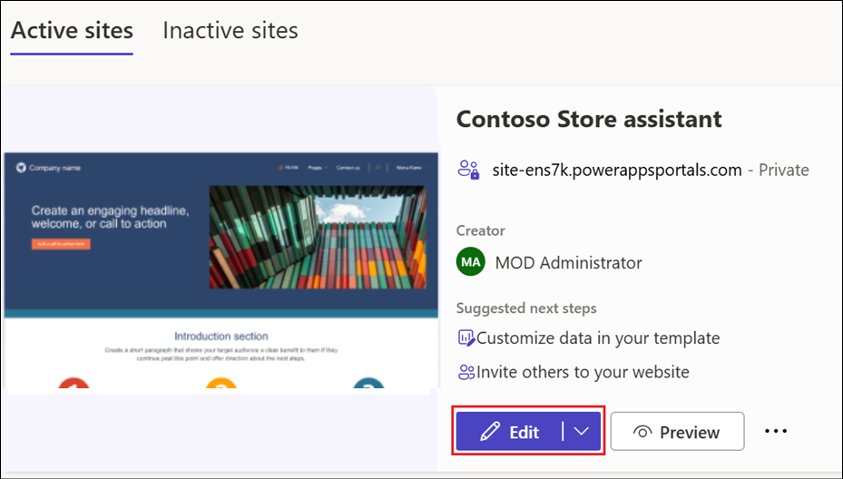

9.  Haga clic en **Edit site header** en el título **Company name**.

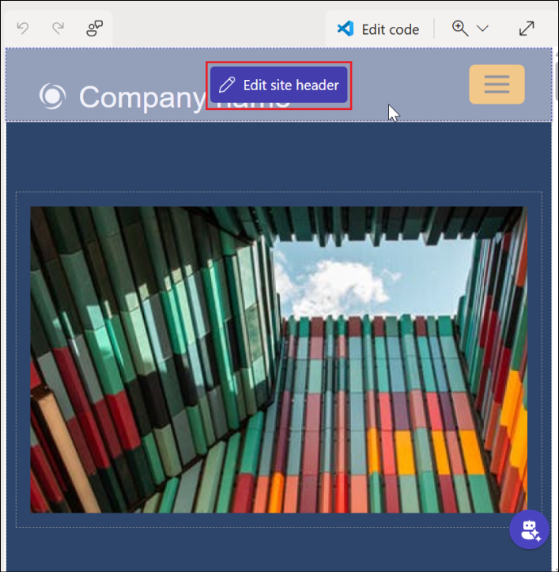

10. En el panel **Edit site header**, ingrese el **Site title** como
    +++**Contoso Store assistant**+++ y cierre el cuadro de diálogo.

11. Haga clic en **Edit code** en la esquina superior derecha de la
    página.

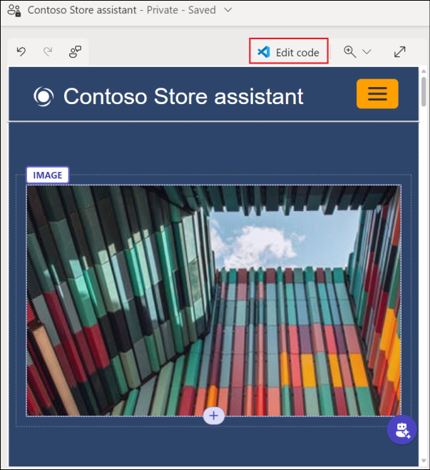

12. Haga clic en **Open Visual Studio Code**.

13. Haga clic en **Allow**. **Inicie sesión **con sus credenciales de
    tenant si es necesario.

14. Se abre la página de inicio de la página web en Visual Studio Code.

15. Desplácese hasta el final del archivo. Añada el **script** copiado
    al crear el flujo de trabajo, después de la última línea de este
    archivo.

16. Guarde el archivo, cierre la pestaña Visual Studio Code y vuelva a
    Power Pages. Haga clic en **Sync**.

17. Una vez completada la sincronización,
    seleccione **Preview** -\> **Desktop.**

18. Su página web se abrirá en una nueva pestaña. Busque **Store Locator
    Assistant** integrado en la página, en la parte inferior
    derecha. **Haga clic** en él.

19. Ingrese +++Talk to agent+++.

20. Desde la página de administración de Customer Service, haga clic
    en **Customer Service admin center** y seleccione la
    aplicación **Customer Service workspace**.

21. En la página del workspace de Customer Service, recibirá
    una **solicitud de chat**. **Acéptela**.

22. Una vez aceptada, se abre la pantalla de chat con el mensaje que
    habíamos indicado en el tema Escalate. Aquí también podemos añadir
    cualquier otra información proporcionada por el usuario al agente en
    vivo.

23. Simule el chat entre el agente en vivo y el cliente si desea ver
    cómo funciona y cómo termina.

> 

## Resumen

En este laboratorio, hemos aprendido a

- Crear un agente desde Copilot Studio y configurar el tema Escalate.

- Publicar el agente en el workspace de Dynamics 365 e integrarlo en una
  página web. 

