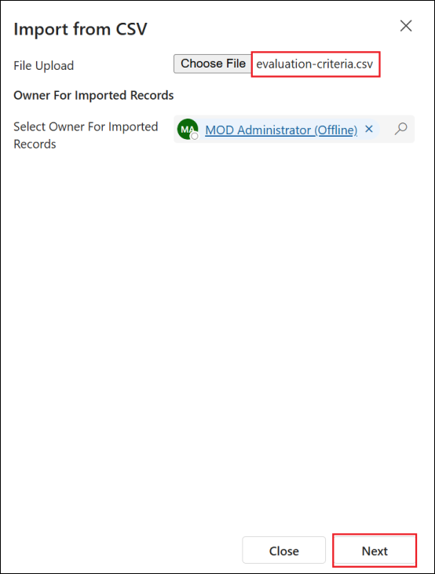
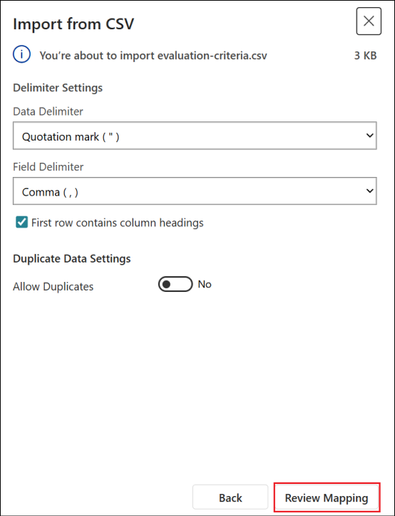
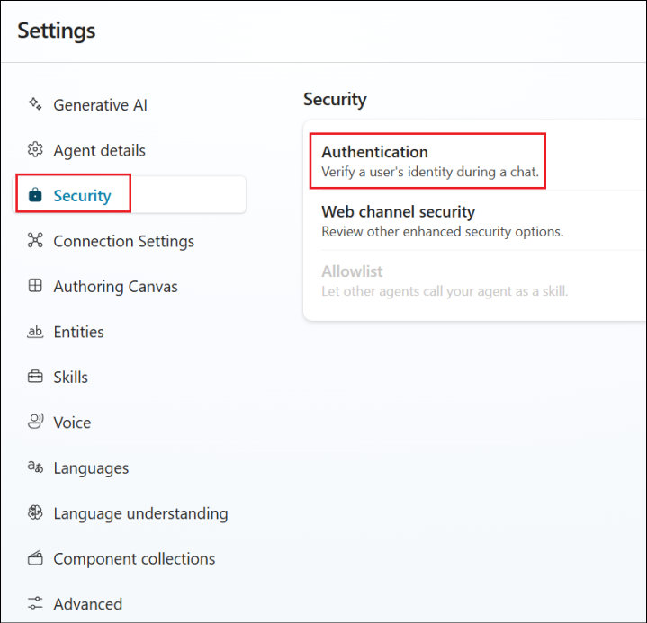
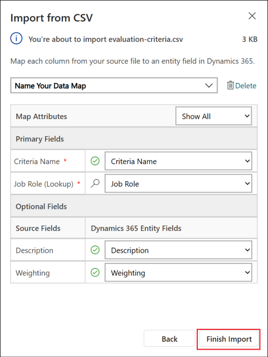
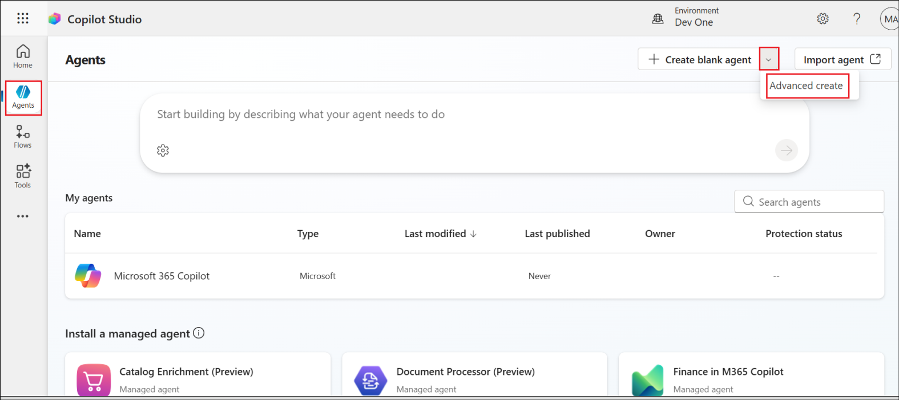
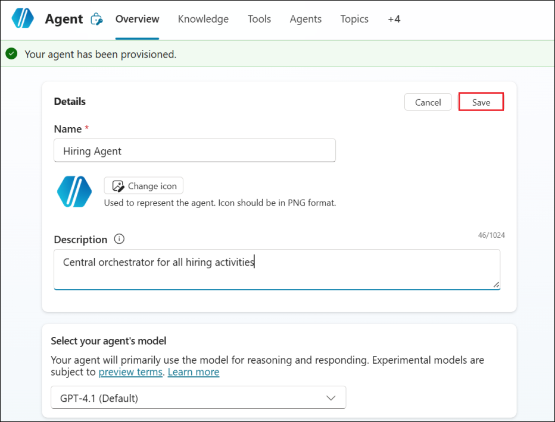

# ラボ 1: 人材獲得のためのインテリジェントな採用エージェントの作成

このラボでは、採用自動化システムの基盤を構築します。まず、候補者、職種、採用ワークフローの管理に必要なすべてのDataverseテーブルとデータ構造を含む、事前構成済みのソリューションをインポートします。次に、これらのテーブルにサンプルデータを入力します。サンプルデータは、このモジュール全体の学習をサポートし、テストのための現実的なシナリオを提供します。最後に、Copilot
Studioで採用エージェントを作成し、今後のミッションで追加するすべての機能の基礎となる基本的な会話型インターフェースを設定します。

## 演習1: ソリューションをインポートする

この演習では、既存のソリューションをインポートします。

1.  +++https://copilotstudio.microsoft.com+++ で Copilot Studio
    にアクセスしてください。

2.  左側のナビゲーションで ... を選択し、\[**Solutions**\]
    を選択します。

3.  「**Import
    solution**」を選択します。「**Browse**」をクリックし、**C:\LabFiles**
    フォルダにある「**Operative**」で始まる**zip**ファイルを選択して「**Open**」をクリックします。。

4.  選択したら、「**Open**」を選択し、「**Import**」を選択します。

5.  これには約3～5分かかります。成功すると、緑色の通知バーに「Solution
    "Operative" imported successfully」というメッセージが表示されます。

6.  「imported
    successfully」というメッセージが表示されたら、ソリューション
    リストでソリューションの表示名 (**Operative**)
    を選択して、インポートした内容を確認します。

7.  ソリューションを確認し、次のコンポーネントがインポートされていることを確認します。

8.  ページの上部にある \[Publish all customizations\]
    ボタンを選択します。

## 演習2 - サンプルデータをインポートする

この演習では、前回の演習でインポートしたテーブルの一部にサンプルデータを追加します。

1.  前回の演習でインポートしたソリューションから、**Hiring
    Hub** Model-Driven
    Appを起動するには、行の前のチェックマークを選択し、上部の**Play** ボタンを選択します。　

> 

2.  左側のナビゲーションで「**Job
    Roles** 」を選択します。コマンドバーの「**More** 」アイコン（上下に3つの点が並んでいるアイコン）を選択し、「**Import
    from Excel**」の横にある右矢印を選択します。　

3.  **Import from CSV**を選択します。　

4.  \[**Choose File** \] ボタンを選択し、**C:\LabFiles** から
    **job-roles.csv** ファイルを選択して、\[**Open**\] を選択します。

5.  **Nextを**選択します**。**次のステップはそのままにして、**Review
    Mappingを選択します。**

6.  マッピングが正しいことを確認し、「**Finish Import**」を選択します。

7.  「**Done**」を選択します。少し時間がかかる場合がありますが、「**Refresh** 」ボタンを押してインポートが成功したかどうかを確認できます。

8.  ここで、**Evaluation Criteria sample data**をインポートします。

9.  左側のナビゲーションで**Evaluation Criteria**を選択します。

10. 先ほどと同様に「**Import from CSV**」を選択します。「**Choose
    File** 」ボタンを選択し、**C:\LabFiles**から**evaluation-criteria.csv**を選択します。

11. 「**Next**」を選択します。次のステップはそのままにして、「**Review
    Mapping**」を選択します。

12. マッピングのためにさらに少し作業が必要です。「**Job
    Role**」フィールドの横にある**虫眼鏡**アイコンを選択してください。

13. ここで「**Job
    Title**」が選択されていることを確認し、選択されていない場合は追加して「**OK**」を選択します。　

14. 残りのマッピングも正しいことを確認して、「**Finish
    Import**」を選択し、「**Done**」を選択します。

15. これには少し時間がかかりますが、「**Refresh** 」ボタンを押してインポートが成功したかどうかを確認できます。

## 演習3 - 採用エージェントを作成する

前提条件の設定は完了です。いよいよ実際の作業に移りましょう！まずは採用エージェントを追加しましょう！

1.  Copilot Studio の左側のペインから「Agents」を選択します。「+ Create
    blank agent」の横にあるドロップダウンを選択し、「Advanced
    create」を選択します。

2.  Agent設定で、ソリューションとして「**Operative**」を選択し、「**Confirm
    and create**」を選択します。

3.  作成されたエージェントのDetailsに対して**Edit** を選択します。

4.  名前に+++**Hiring Agent**+++、Descriptionに「+++ **Central
    orchestrator for all hiring activities** +++」と入力し、\[**Save**\]
    を選択します。

> 

## まとめ

> このラボでは、次の作業を完了しました。

- **シナリオ理解**:
  採用自動化の課題と構築するソリューションに関する包括的な知識。

- **ソリューションの展開**:
  採用管理システムの構成要素が正常にインポートされ、構成されました。

- **エージェントの作成**:
  エージェントアカデミーオペレーターとして構築するシナリオの始まりとなる採用エージェントを構築しました
