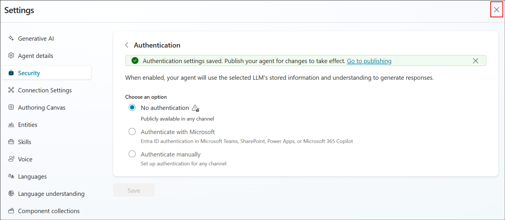
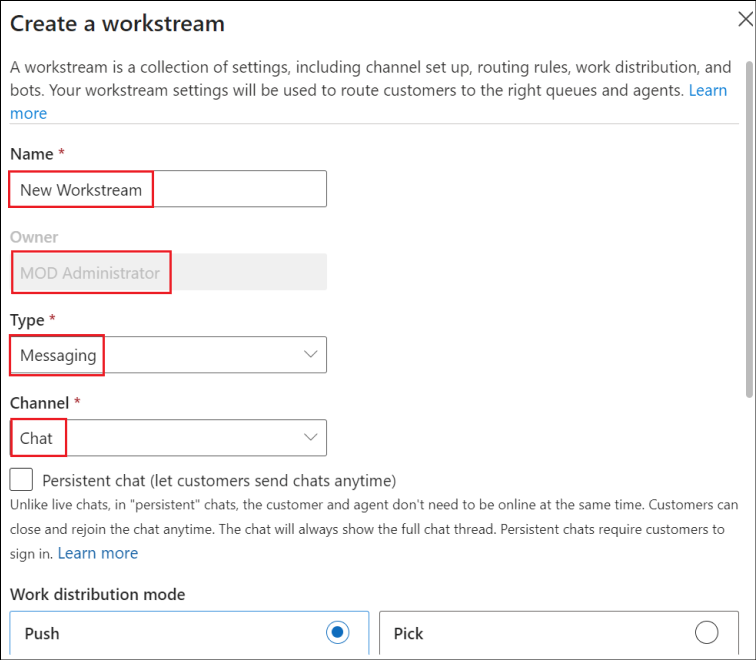
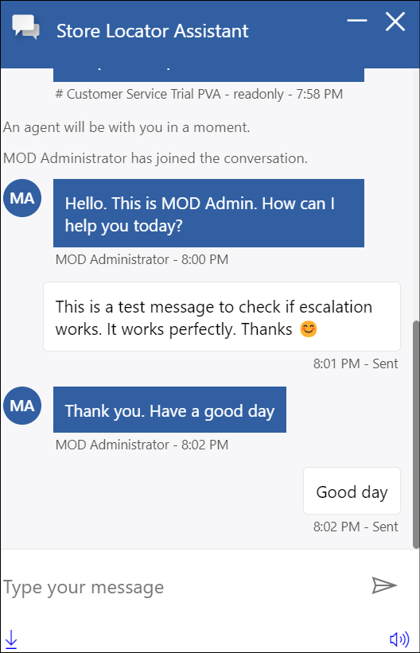

# Lab 04 - Integrate an agent with the Dynamics 365 Customer Service app and implement automated case escalation to the live agent

## Objective

This lab details the steps to escalate a conversation to a live agent
from the agents.

>[!Alert] **Important:** This lab can be executed only if the Dynamics
365 trial has been enabled as per **Lab 02 - Configure the Dynamics 365
Customer Service**

## Exercise 1: Configure the Dynamics 365 Customer Service workspace

### Task 1: Configure Omnichannel Power Virtual Agent Extension

1.  Open the link,
    +++https://appsource.microsoft.com/en-cy/product/dynamics-365/mscrm.omnichannelpvaextension?tab=Overview&ref=dynamicsforcrm.com+++ and click on **Get it now** in the Omnichannel Power Virtual Agent Extension page.

    

2.  Sign in with the tenant credentials from the **Resources** tab.

    

3.  Click on **Get it now**.

    

4.  Select the **CustomerService Trial** under **Select an
    environment**, select the check boxes and click on **Install**.

    

    

## Task 2: Configure search settings in the Power Platform admin center

1.  Login to +++https://admin.powerplatform.microsoft.com/+++ using
    your tenant details. Select **Manage** from the left pane and then
    select **CustomerService Trial** environment from the list of
    environments.

    

2.  Select **Settings** from the top pane.

    

3.  Select **Product** -\> **Features**.

    

4.  Toggle **Dataverse Search** and **Single table search** option
    to **ON** and select **Save**.

    

## Exercise 2: Create an agent

1.  From the Copilot Studio home page,
    +++https://copilotstudio.microsoft.com+++, select the **CustomerService Trial** Environment from the top right.

    

2.  Select **Agents** from the left pane. Click on the **+ New
    Agent** to create a new agent.

    

3.  In the Type your message text area, type +++**You are a customer service agent who helps in identifying stores nearby.**+++ And hit **send**.

    

4.  The agent might suggest a **name** for the Agent being created.
    Either accept it or suggest a new name.

5.  Type the message +++**Maintain a polite tone**+++ next and
    hit **send**.

    

6.  Click on **Create**.

    

7.  The created agent opens up with a message, **Your agent is ready**.

    

## Exercise 3: Connect the copilot to Dynamics 365 Customer Service and configure the Escalate topic

### Task 1: Configure the Escalate topic

We are focusing here on showcasing the escalation to live agent concept.
So, we will directly work towards it without creating any other new
topics.

1.  Select the **Topics** tab and then select the **System** tab. Select
    the **Escalate** topic.

    

2.  Select the message node of the topic and replace the existing
    content with, +++You will be transferred to a live agent shortly+++

    

3.  Click on the + symbol to add a node next to the Message node.

4.  Select **Topic management** -\> **Transfer conversation**.

    

5.  Give a message +++The customer wants to talk to a live agent+++ in
    the Transfer conversation node.

    

6.  **Save** the Topic.

    

7.  **Publish** the agent.

    

### Task 2: Connect the copilot to Dynamics 365 Customer Service

1.  Once published, from the copilot page top right, click
    on **Settings**.

    

2.  Select **Security**, and **Authentication** under Security.

    

3.  Select the **No authentication** option and then click on **Save**.

    

4.  Select **Save** in the confirmation dialog box.

    

5.  Close the **Settings** pane.

    

6.  Click on **Channels** (If the Channels is not visible, click on the
    +1 to view the **Channels** option)

    

7.  Select **Dynamics 365 Customer Service** from the Customer
    engagement hub pane.

    

8.  On the Dynamics 365 Customer Service page, click on **Connect**.

    

9.  Once you get a **successfully connected** message, click
    on **Close**.

    

## Exercise 4: Create workstream and channel in Dynamics 365 admin center

### Task 1: Manage a user in Omnichannel for Customer Service

1.  Login to +++https://admin.powerplatform.microsoft.com+++ using your admin tenant credentials. Select **Manage** from the left pane. Select **CustomerService Trial** environment **under Environments**.

    

2.  Click on the **url value** under **Environment URL**.

    

3.  Select **Customer Service workspace** from the header bar.

    

4.  This opens the **Apps** page. Select **Copilot Service admin
    center** from it.

    

5.  This opens up the **Dynamics 365 Customer Service admin
    center** page.

    

### Task 2: Configure workstream

1.  From the admin center page, select **Workstreams** under **Customer
    support** from the left pane and then select the **+ New
    workstream** option.

    

2.  Select Inbound

    

    

3.  Fill in the below details, scroll down and click on **Create**.

    - Name - +++**New Workstream**+++

    - Owner – **MOD Administrator** (Selected by default)

    - Type – **Messaging**

    - Channel – **Chat**

    

    

4.  Once the workstream is created, click on **Set up chat** to set up
    the chat channel.

    

5.  In the **Live chat setup – Channel details** screen, fill in the
    below details.

    - Name - +++**Chat Channel**+++

    - Language – **English - United States**

    

6.  Scroll down and click **Next**.

    

7.  Accept the defaults in the next 2 pages until you reach the Chat
    widget screen. In the Live chat setup – Chat widget screen, provide
    the name as +++**Store Locator Assistant**+++, accept the other
    defaults and click on **Next**.

    

8.  In the **Live chat setup – Behaviors** screen, accept the defaults
    and click on **Next**.

    

9.  In the **Live chat setup – User features** screen, toggle **File
    attachment** and **Voice and video calls** options to **off** and
    click on **Next**.

    

10. Accept the default value in the Notification screen and click
    **Next**.

11. In the **Live chat setup – Review and finish** screen,
    select **Create channel**.

    

12. **Copy** the value of the widget that appears in the **Live chat
    setup – Success** screen and **save** it in a notepad to add it to a
    webpage in the upcoming exercises. Then, click on **Done** to
    complete the configuration.

    

### Task 3: Add the agent to the workstream

1.  Back in the **New Workstream** page, scroll down and click on **+ Add bot** in the **Add an AI agent** section.

    

2.  From the list of bots on the Add a bot screen, select the **Store
    Locator Assistant** (the name might differ based on the agent that you created earlier) agent and click on **Connect**.

    

3.  Ensure that the bot is added to the workstream as in the screenshot below.

    

4.  From the left pane, select **AI Agents**.

    

5.  Ensure that the **Store locator** agent is connected.

    

## Exercise 5: Create a webpage and test the escalation to agent

1.  Login to +++https://make.powerpages.microsoft.com/+++ using your
    tenant admin credentials.

    

2.  Ensure that you are in **CustomerService Trial** environment.

3.  Click on **Get started**.

    

4.  Click on Skip in the **Tell us about yourself** page.

    

5.  Scroll down in the next page and click on **Start with a
    template** option to start creating the site with a template.

    

6.  Select a template and click on **Choose this template**.

    

7.  In the Give your site a name textbox, enter the name as +++**Contoso
    Store assistant**+++, accept the other defaults and click
    on **Done**.

    

8.  Once the site is created, click on **Edit**.

    

9.  Click on **Edit site header** in the **Company name** title.

    

10. In the **Edit site header** pane, provide the **Site title** as
    +++**Contoso Store assistant**+++ and close the dialog.

    

11. Click on **Edit code** in the top right corner of the page.

    

12. Click on **Open Visual Studio Code**.

    

13. Click **Allow**. **Login** using your tenant credentials if
    required.

    

14. The Home page of the web page opens up in the Visual Studio Code.

    

15. Scroll to the end of the file. Add the **script** copied while
    creating the workstream, after the last line of this file.

    

16. Save the file, close the Visual Studio Code tab and return to the
    Power pages. Click on **Sync**.

    

17. Please wait for few minutes before proceeding to the next step.
    
18. Once the Sync is completed, select **Preview** -\> **Desktop.**

    

19. Your web page opens in a new tab. Find the **Store Locator
    Assistant** embedded to the page at the bottom right of the web
    page. **Click** on it.

    

20. Enter +++Talk to agent+++.

    

21. From the Customer Service admin page, click on **Customer Service
    admin center** and select the app **Customer Service
    workspace** from it.

    

    

22. In the Customer Service workspace page, you will get a **chat
    request**. **Accept** it.

    

23. Once accepted, the chat screen opens up with the message that we had
    given in the Escalate topic. We can also add any other information
    provided by the user here to the live agent.

    

24. Simulate the chat between the live agent and the customer if you
    wish to see how it works and then ends.

    

    

## Summary

In this lab, we have learnt to

- Build an agent from the Copilot Studio and configure the Escalate
  topic.

- Publish the agent to Dynamics 365 workspace and integrate it in a web
  page. 
