## Lab 04 - Enhancing the Real Estate copilot with Gen AI capabilities

**Lab duration** – 80 minutes

**Objective:**

Implement entities, slot filling and variables usage in the Copilot for
Real Estate app. Enhance the copilot created for the Real Estate app to
elevate the customer experience by implementing Generative AI.

## Exercise 1: Use entities to improve the copilot

Microsoft Copilot Studio uses entities to understand user intent. There
are many prebuilt entities included for commonly used information. You
can create custom entities for your specific purpose.

### Task 1: View prebuilt entities

1.  Open the Copilot Studio at +++https://copilotstudio.microsoft.com+++
    and open the agent **Real Estate Booking Service.**

2.  Select **Settings** in the top-right of the screen.

    

3.  Select the **Entities** tab. You can see a list of pre-built
    entities.

    

### Task 2: Create the property type entity

1.  Select **+ Add an entity** and select **+ New entity**.

    

2.  Select the **Closed list** tile.

    

3.  Enter the below details

    -   Name - +++Property Type+++
    -   Enter item under List items –  +++Apartment+++ - Select Add

    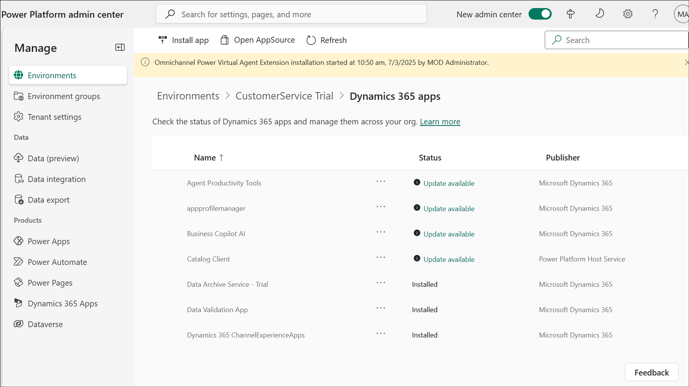

4.  Enter +++**Condominium**+++ in the **Enter item** field and
    select **Add**.

5.  Enter +++**Duplex**+++ in the **Enter item** field and
    select **Add**.

6.  Enter +++**House**+++ in the **Enter item** field and
    select **Add**.

   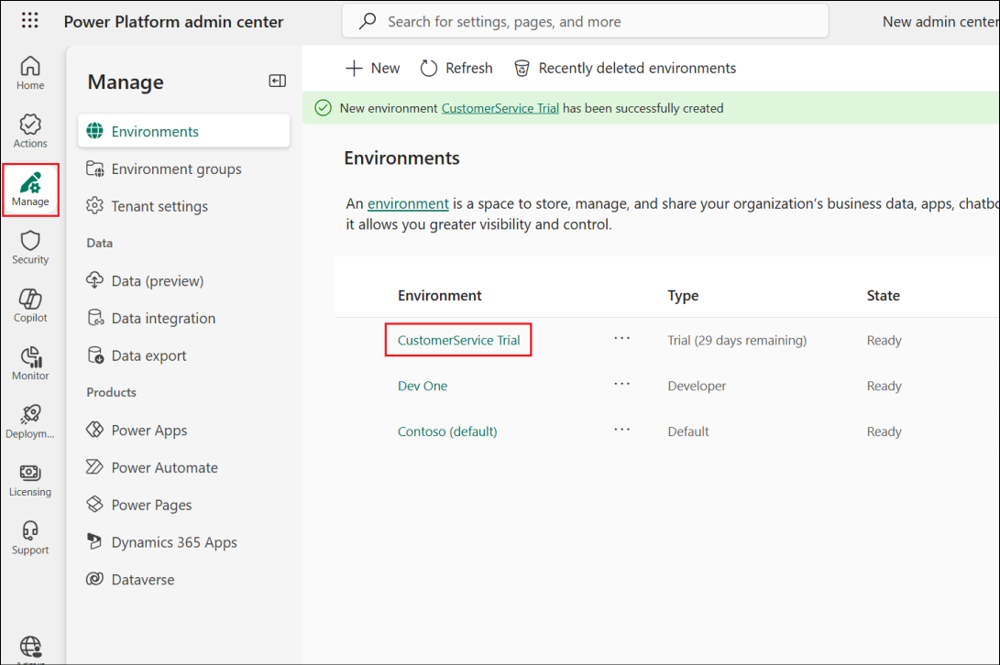

7.  Select **+ Synonyms** for **Apartment**, enter +++**Flat**+++, then
    select the **+** icon and select **Done**.

    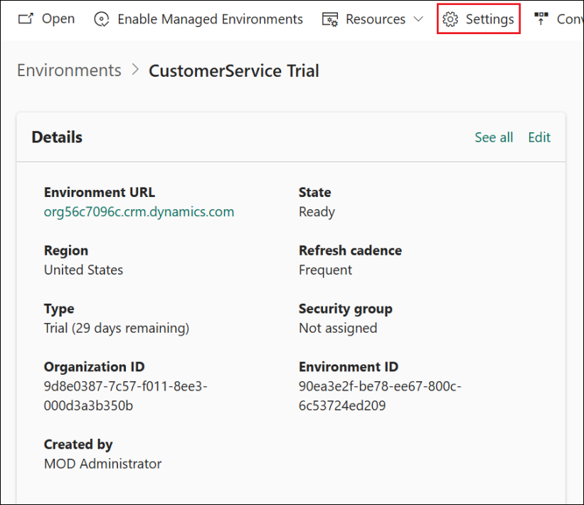

8.  Select **+ Synonyms** for **House**, enter +++**Single-family home**+++, then select the **+** icon and select **Done**.

9.  Select **+ Synonyms** for **Condominium**,
    enter +++**Townhouse**+++, then select the **+** icon and
    select **Done**.

10. Select **Save**.

    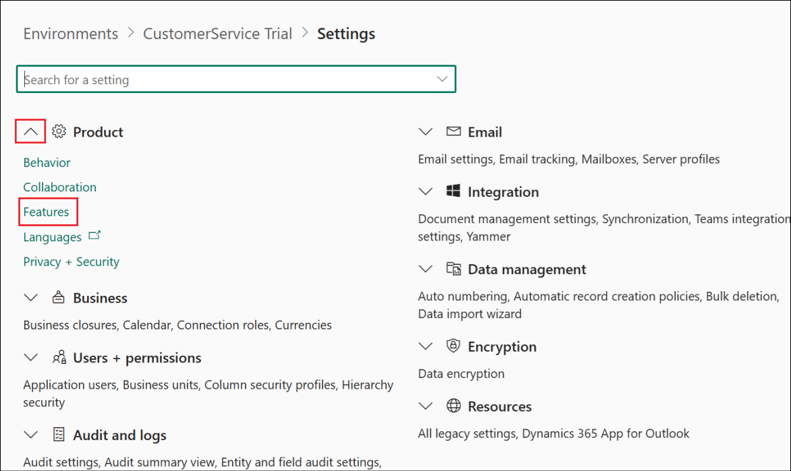

11. Select **Close**.

    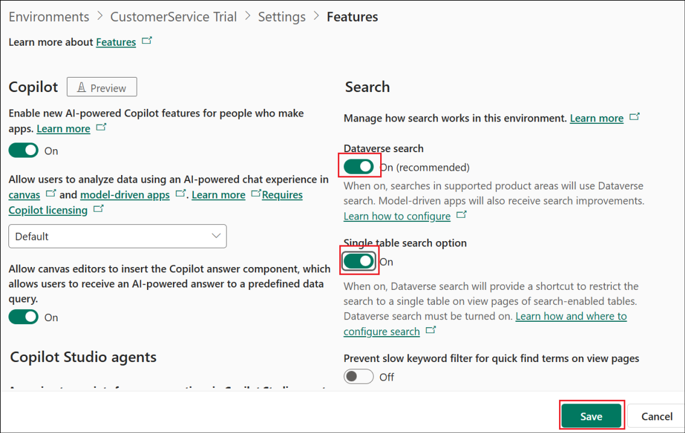

### Task 3: Create number of bedrooms entity

1.  Select **+ Add an entity** and select **+ New entity**.

    

2.  Select the **Regular expression (Regex)** tile.

    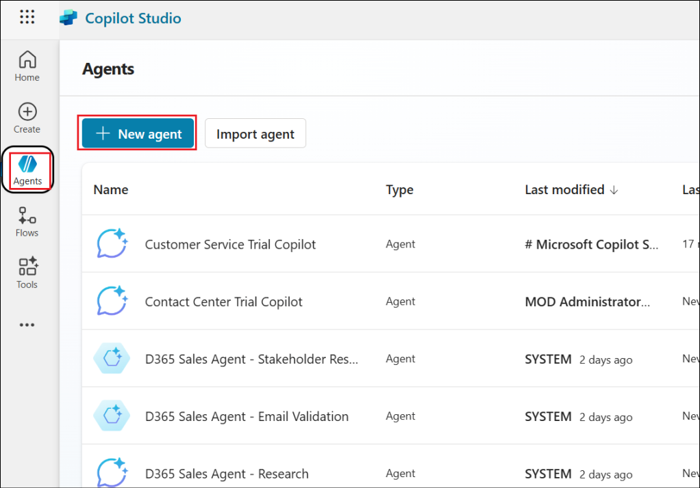

3.  Enter the below details and click on **Save**.

    - Name  - +++**Number of Bedrooms**+++ 
    
    - Pattern  - +++**\[1-5\]**+++ 

    

4.  Select **Close**.

    

5.  Close the **Settings** pane.

    

### Task 4: Use entities

1.  Select the **Topics** tab. Select the **Book a Real Estate
    Showing** topic.

    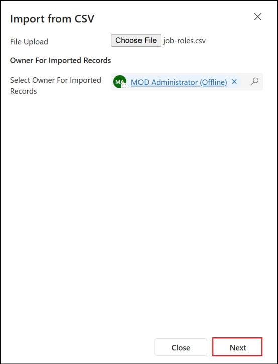

2.  Select the **+** icon above the property question node and
    select **Ask a question**.

    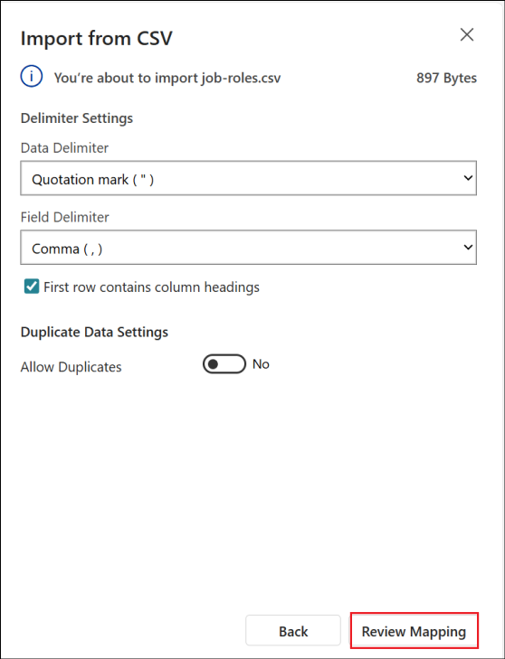

3.  Fill in the below details.

    - **Enter a message** - +++What type of property do you want to see?+++
    
    - **Identify** – Select **Property Type**
    
    - Select **Select options for user** and check the **Display** option
      for all list values.

    

4.  Select the variable in **Save user response as** and enter
    +++**PropertyType**+++ for **Variable name**

    

5.  Select the **+** icon below the new question node and select **Ask a
    question**.

6.  Enter the below details and click on **Save**.

    - **Enter a message** - +++How many bedrooms do you need?+++

    - **Identify -** Select **Number of Bedrooms**

    - **Save user response as** - Enter +++NumberofBedrooms+++ for **Variable name**

    

## Exercise 2: Create Flows

Microsoft Copilot Studio can access data in Microsoft Dataverse using Agent flows

### Task 1: Create Power Automate flow to retrieve a property

1.  Select the **Tools** tab from the top menu. Select **+ Add a tool**.

    

2.	Select **+ New tool**.

    

3.  Select **Agent flow**.

    
  	
4.	Select the trigger step **When an agent calls the flow** and select **+ Add an input**.

    

    

5.	Select **Text**.

    

6.  Enter the below details

    - **Input** – +++Bedrooms+++

    - **Please enter your input** - +++Number of Bedrooms+++

    

7.  Select the **+** icon between the two steps in the flow and to **Add an action**.

    

8. Enter +++**Dataverse**+++ in the **Search** field and select **See
    more** for the **Microsoft Dataverse connector**.

    

9. Select the **List rows** action.

    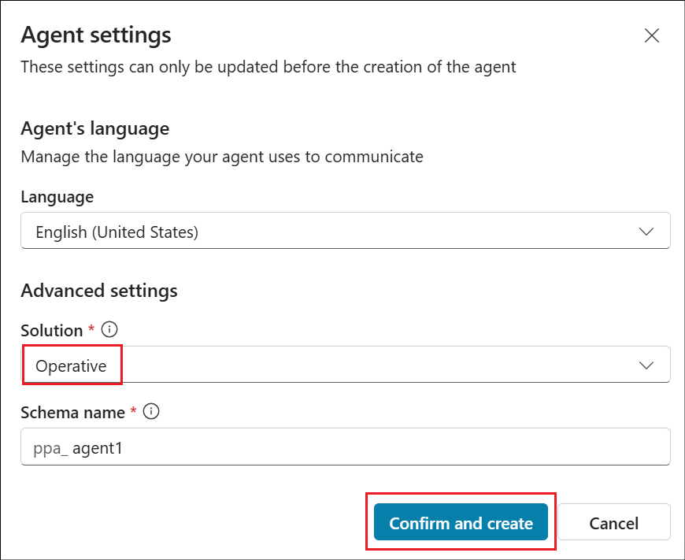

10. If prompted for authentication, select **OAuth** and select **Sign
    in**. Sign in using your tenant id if prompted.

    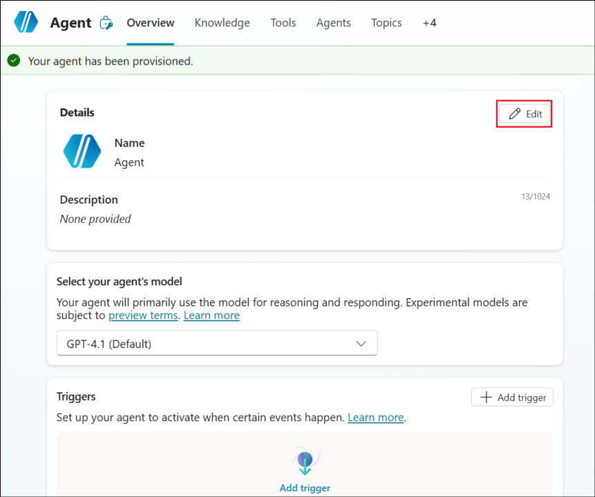

11. Select **Real Estate Properties** for table name.

12. Select **Show all** if all the options does not get listed automatically.

13. Enter +++contoso_bedrooms eq+++ in the **Filter Rows** field.

14.	Use **spacebar** next to **eq** to ensure that you are adding the value after a space. Use **Dynamic content** to select the **Bedrooms** parameter and select **Add**.

    

15. Select the **Respond to Copilot** action and select **+ Add an output**.

    

16. Select **Text**.

17. Enter the below details

    - **Enter a name** - +++PropertyId+++

    - **Enter a value to respond with** - select **Insert Expression** and
  enter the following expression:
      +++first(outputs('List_rows')?['body/value'])['contoso_realestatepropertyid']+++

    

18. Select **Add**.

    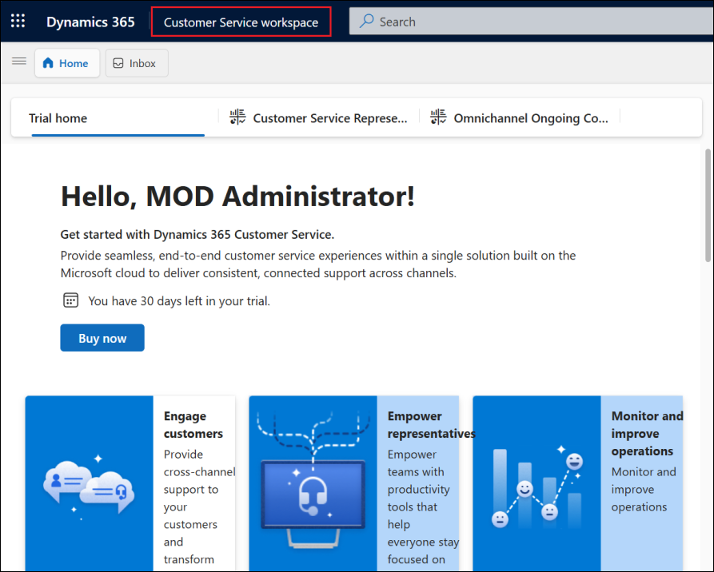

19.	From +++https://make.powerapps.com+++, open the table **Real Estate Property**. Navigate to its column, Property Name(This might be Real Estate Property or slightly different when created using Copilot) -> Edit Column -> Advanced options. Look for the value of the **Logical name**. It should be something similar to **contoso_newcolumn**. It might be slightly different as well. Save the part that is there after **contoso_** locally. If the Logical name is **contoso_newcolumn**, keep a note of **newcolumn** for usage in the next step.

   	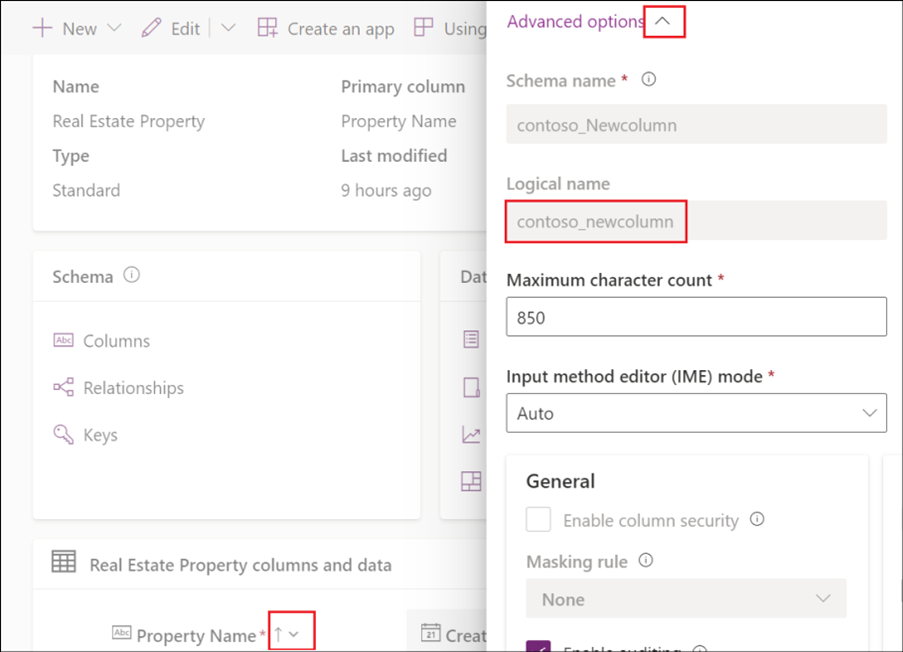
   	
20. Back in the **Copilot Studio Designer** page, in the **Respond to Copilot** pane, select **+ Add an output**.

    

21. Select **Text**.

    - **Enter a name** - +++PropertyName+++ 

    - **Enter a value to respond with** - select **Insert Expression** and
  enter the following expression:
      +++first(outputs('List_rows')?\['body/value'\])\['contoso_propertyname'\]+++

    - Replace **propertyname** in **contoso_propertyname** in the above expression, with the value saved in the step before this(**newcolumn**).

    - Select **Add**.
    
    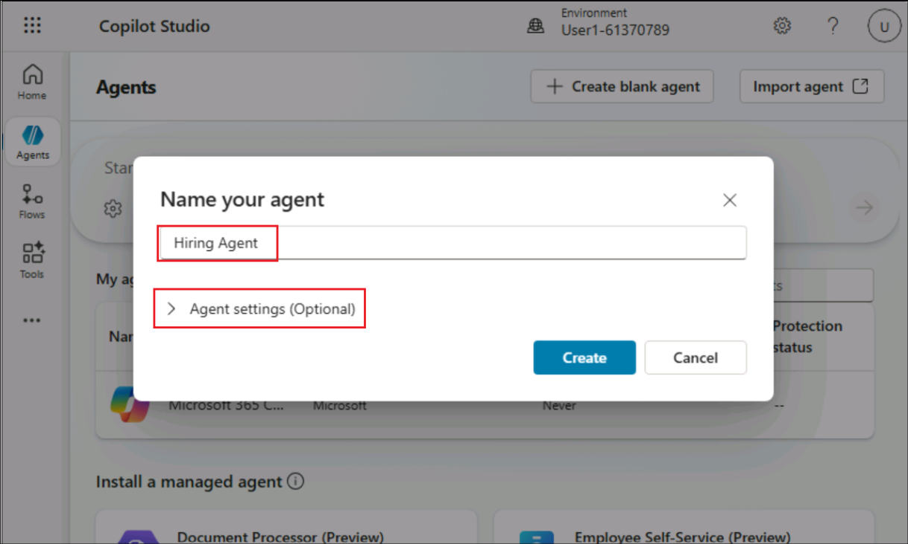

    >[!Note] **Note:**  This value replacement needs to be done since the Logical name for this column is not a standard value and we will have to check and update based on the value from the Table.

    

22. Select **Save draft**.

    

23. Once saved, select **Publish**.

    

24.	Select **Flows** from the left pane and then select the created flow named **Untitled**.

    

25.	Select **Edit** in the **Details** pane.

    

26.	Name the flow as +++Get Property+++ and select **Save**.

    

### Task 2: Add a Copilot action for retrieving a property

1.	Select the **Topics** tab of the agent **Real Estate Booking Service**.

    

2.	Select the **Book a Real Estate Showing** topic.

    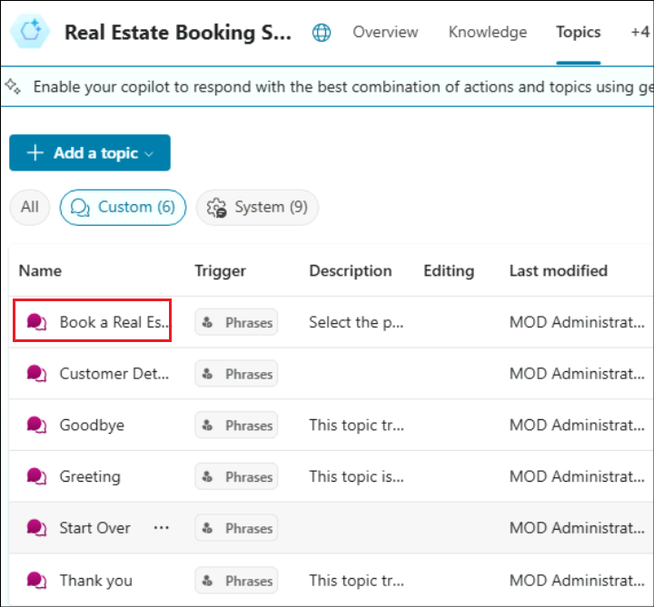
  	
3.  Select the **+** icon below the **How many bedrooms do you need?** question node and select **Add a tool**. Select the **Get Property** flow.

    

4.  Select the **NumberofBedrooms** variable for the **Bedrooms** input
    parameter.

    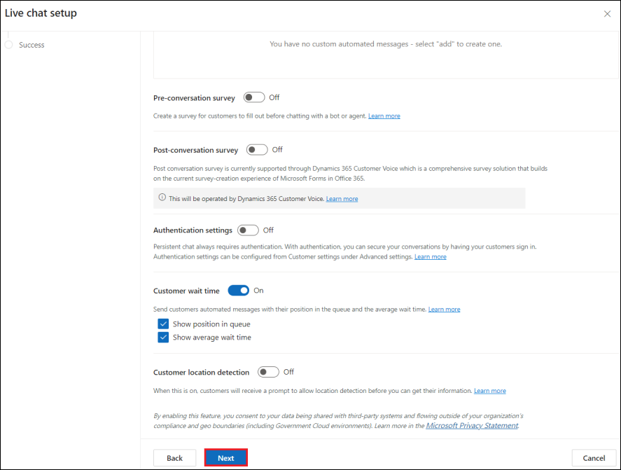

5.  Select the **three dots** in the **Which property do you want to
    see?** question node and select **Delete**.

    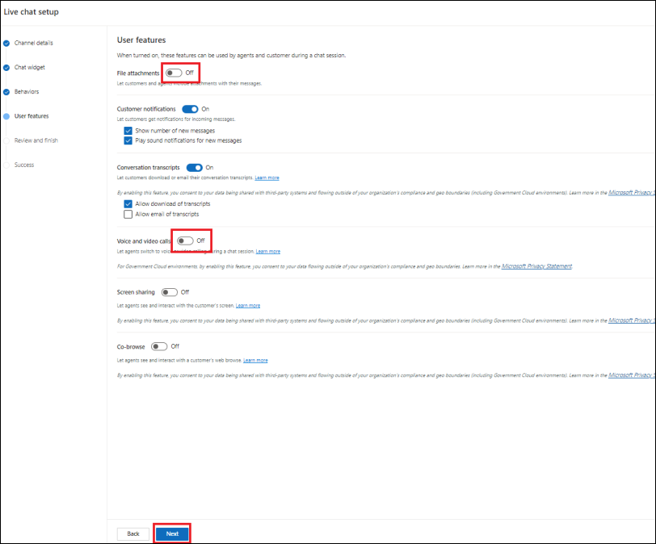

6. Select the the **+** icon under the action node and select **Send a message**.

7. Fill in the below details

    - **Enter a message** - +++Property+++

    - Select the **Insert variable** icon and select
  the **PropertyName** variable.

    

8. Select **Save**.

    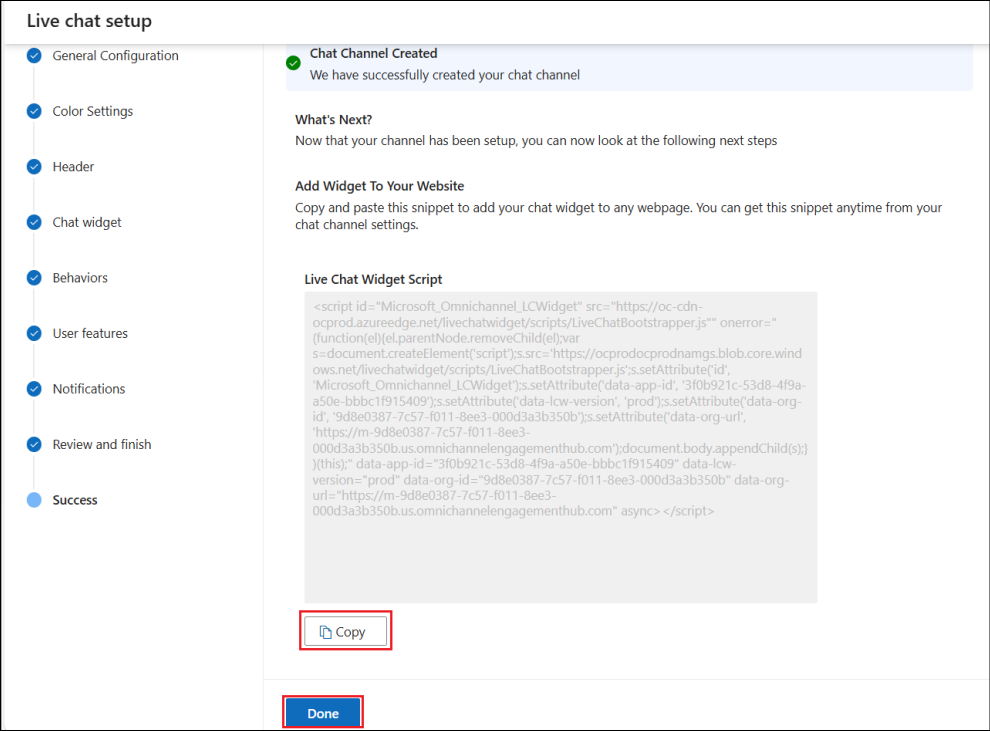

9. Once saved, select **Publish**.

    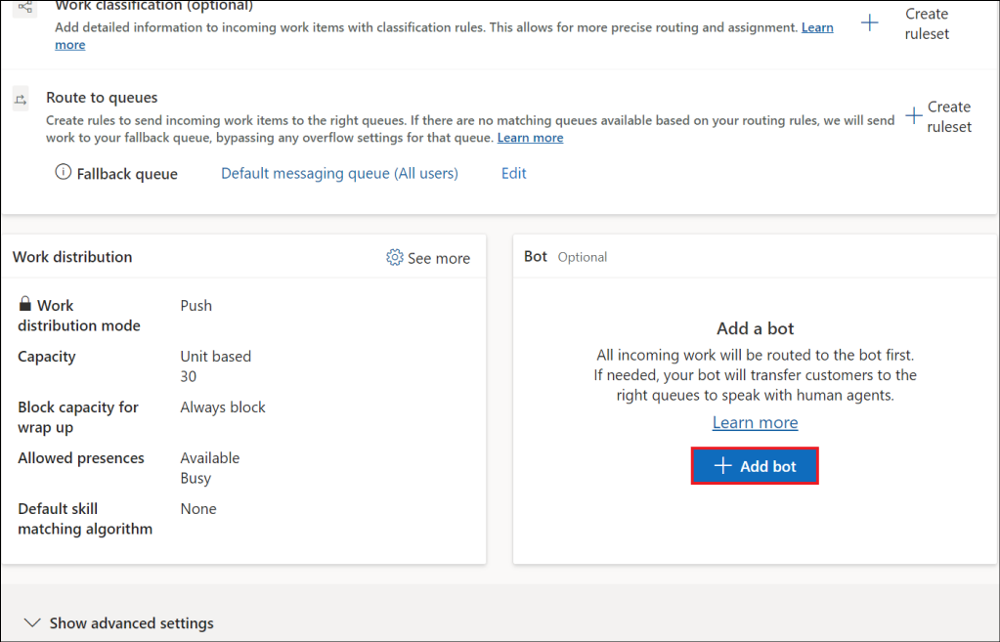

10. Click on **Publish** in the Publish confirmation dialog.

    

### Task 3: Create Power Automate flow to make a booking

1.  Select the **Tools** tab and select **+ Add a tool**.

    

2.	Select **Agent flow** from the **New tool** pane.

    

3.	Select the trigger step **When Copilot Studio calls a flow** and select **+ Add an input -> Text**.

    

    

4.  Enter the below details

    - Input - +++**PropertyId**+++

    - Please enter your input **-** +++**Property**+++

5.  Select **+ Add an input -> Text**

    - Input - +++**ViewerName**+++

    - Please enter your input **-** +++**Viewer Name**+++

6.  Select **+ Add an input ->** **Text**.

    - Input - +++**ViewerEmail**+++

    - Please enter your input **-** +++**Viewer Email**+++

    

7.  Select the **+** icon between the two steps to **Add an action**.

    

8.  Enter +++**Dataverse**+++ in the **Search** field and select **See more** for the Dataverse connector.

    

9. Select the **Add a new row** action.

    

10. Select **Booking Requests** for table name.

11. Enter +++**Copilot booking**+++ in the **Booking Name** field.

12. Select **Show all**.

    

13. Enter +++contoso_bookingrequests()+++ in the **Property (Real Estate
    Properties)** field, move the cursor within the brackets, and
    use **Dynamic content**.

    

14. Select the **PropertyId** parameter.

    

15. Use **Dynamic content** to select the **ViewerName** parameter for
    the **Viewer Name** field.

    

16. Use **Dynamic content** to select the **ViewerEmail** parameter for
    the **Viewer Email** field.

    

17. The parameters will now look similar to those in the screenshot
    below.

    

18. Select **Save draft**.

    

19. Once saved, select **Publish**.

    

### Task 4: Add a Copilot action for creating a booking request

1.	Select **Flows** from the left pane and select the **Untitled** flow.

    

2.	Select **Edit** in the **Details** pane.

    

3.	Provide the **Flow name** as +++Booking Request+++.

    

4.	Select the **Topics** tab of the **Real Estate Booking Service** agent and select the **Book a Real Estate Showing** topic.

    

5.  Select the **+** icon below the **What date and time do you want to
    see the property?** node and select **Add a tool**.

6.  Select the **Booking Request** flow.

    

7.  Select the **PropertyId** variable for the **PropertyId** input
    parameter.

    Select the **Name** variable for the **ViewerName** input parameter.

    Select the **EmailAddress** variable for the **ViewerEmail** input
parameter.

    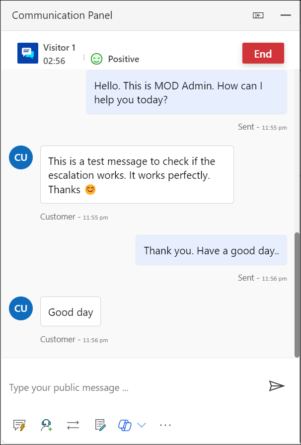

8. Select the **+** icon below the action node. Select **Topic
    management**, then select **Go to another topic** and select **End
    of conversation**.

    

9. Select **Save**.

    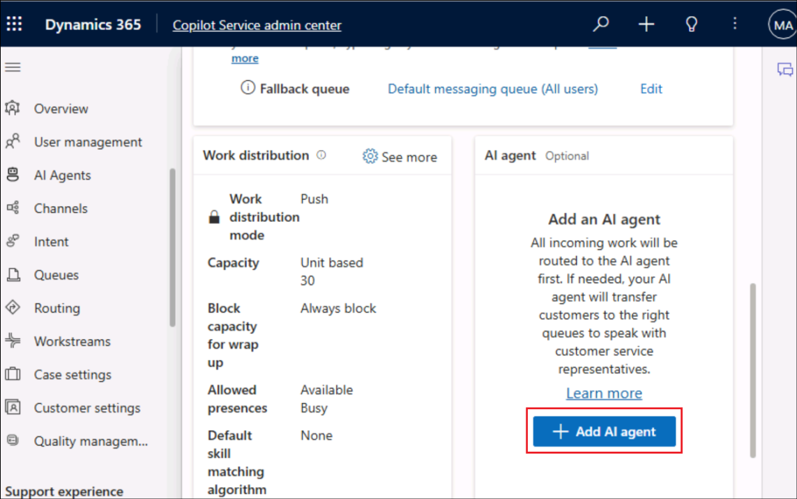

10. Once saved, select **Publish** and select **Publish** again in the
    confirmation dialog.

    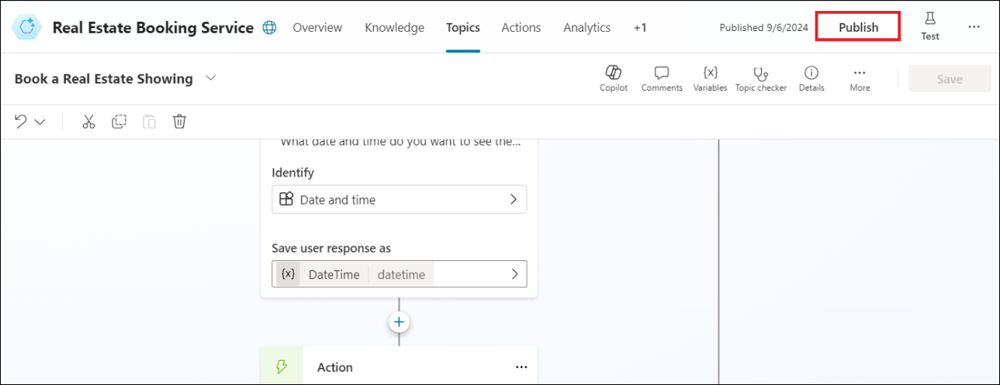

    

## Exercise 3: Test the agent 

### Task 1: Test the agent and make a booking request

1.  Select the **Test** button in the top-right of the screen to open
    the testing panel. Select the **three dots** at the top of the
    testing panel in the top-right of the screen. Select **Track between topics**.

    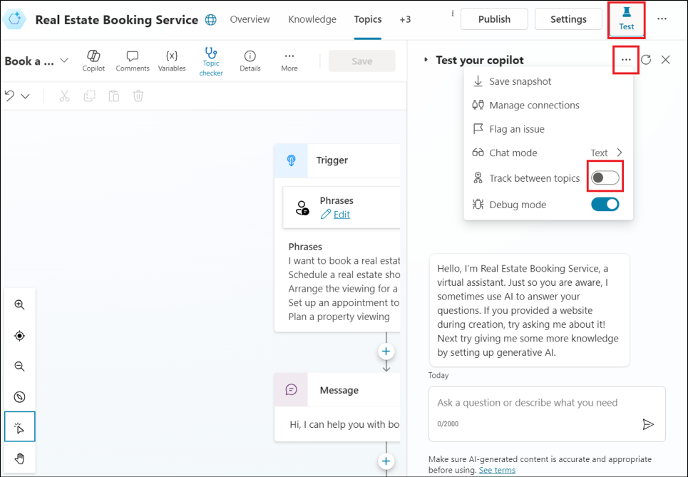

2.  When the **Conversation Start** message appears, your agent starts a
    conversation.

3.  In response, enter a trigger phrase for the topic that you created:

    +++I want to book a real estate showing+++

4.  The agent responds with the "**What is your name?**" question.

5.  Enter your name.

    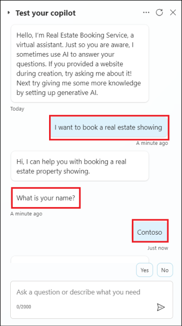

6.  Then enter your email when it prompts for the email. After you enter
    the details, a question asking if the information is correct, and
    options to select **Yes** or **No** is prompted. Select **Yes**.

    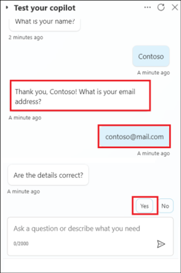

7.  Select **House** for the type of property prompt.

8.  Enter +++**2**+++ for the number of bedrooms prompts.

    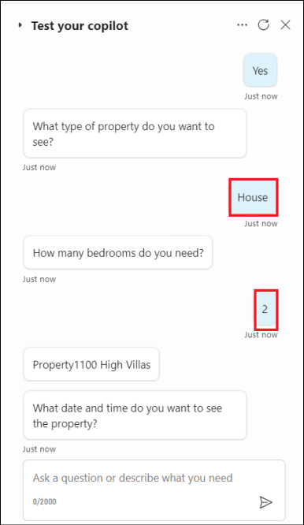

9.  Enter +++Tomorrow 2:00 PM+++ to the **What date and time do you want
    to see the property?** prompt.

10. Select **Yes** to the **Did that answer your question?** prompt.

11. Select any rating.

12. Select **No** to the **Can I help with anything else?** prompt.

    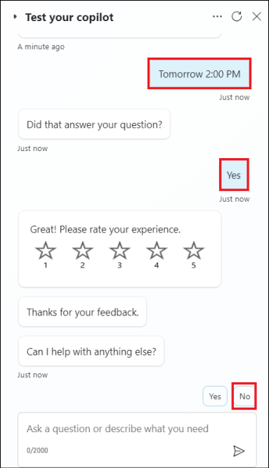

### Task 2: Verify booking request

1.  Navigate to the Power Apps portal at
    +++**https://make.powerapps.com**+++.

2.  In the left navigation pane, select **Tables** and
    select **Custom**.

3.  Select the **Booking Request** table.

    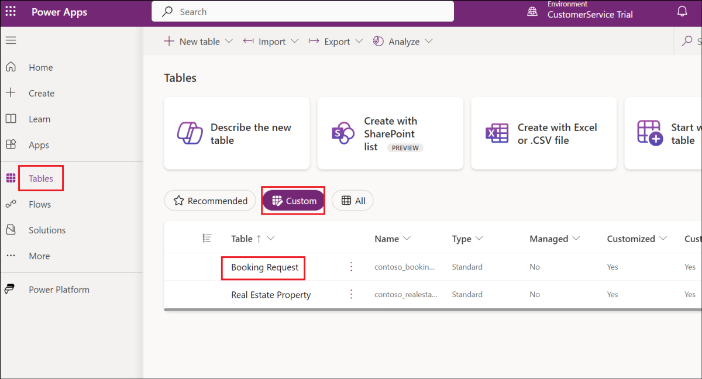

4.  Under **Booking Request columns and data** you should see that a
    Copilot booking request is now created.

    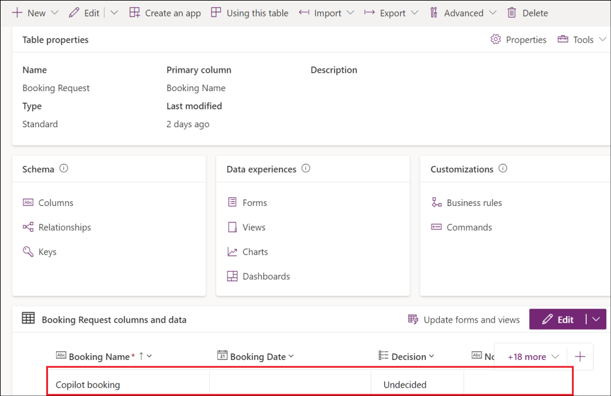

## Exercise 4: Set up Generative AI

In this exercise, you learn how to use the Generative answers feature to
improve your agent's responses.

### Task 1: Enable Generative AI

1.	Back in the **Copilot Studio** (+++https://copilotstudio.microsoft.com+++), select the agent **Real Estate Booking Service**.

2.  Select **Settings** in the top-right of the screen.

    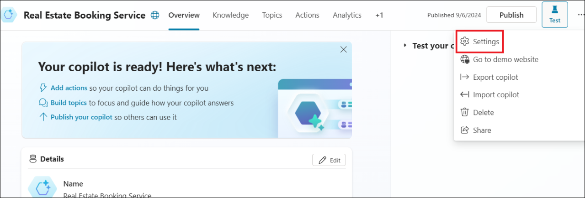

3.  Select the **Generative AI** tab.

4.	Select **Yes** under **Use generative AI orchestration for your agent's responses?**

    

5.	Scroll down and set the **content moderation** to **Moderate**.

    

5.  **Close** the Settings pane.

    

### Task 3: Add knowledge from a website

1.  Click on the **Overview** tab.

2.  Select **+ Add knowledge** under the **Knowledge** section.

    

3.  Select the **Public websites** tile.

    

4.  Enter the public website link +++https://create.microsoft.com/templates/real-estate+++.
    Select **Add**.

    

5.  Give the name +++Real Estate Website+++ in the **Name** field and then
    select **Add**.

    

### Task 4: Add knowledge from Dataverse

1.  Select the **Knowledge** tab. Select **+ Add knowledge**.

    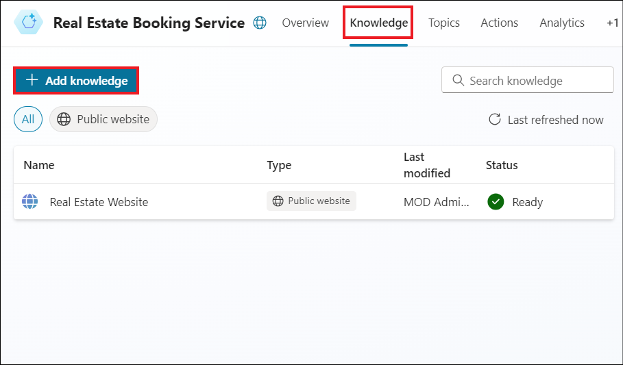

2.  Select **Dataverse**.

    

3.  Select the **Real Estate Property** table and select **Next**.

    

4.	Select **Add**.

    

### Task 5: Add knowledge from files

1.  From the **Knowledge** tab, select **+ Add knowledge**.

    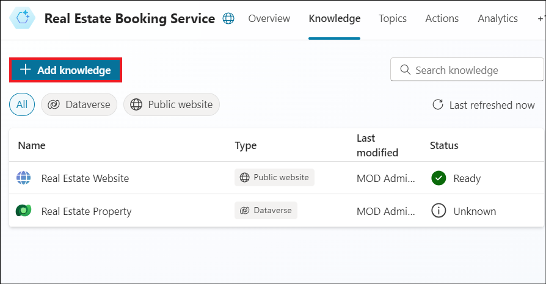

2.	Under **Upload file** section, select **select to browse** and browse to locate the file **SummitRealtyCaseStudy.docx** at **C:\LabFiles** and select it.

    

3.  Select **Add**.

    

    >[!Alert] **Important:** The file upload will complete and the indexing will take some time to complete. Check the status in the Knowledge tab to ensure that the file is available. 
    
### Task 6: Use generative answers in System fallback topic

1.  Select the **Topics** tab and select **System**. Select
    the **Fallback** topic.

    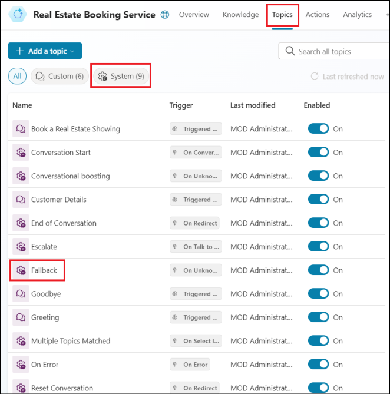

2.  Select the **three dots** in the message node and select **Delete**.

    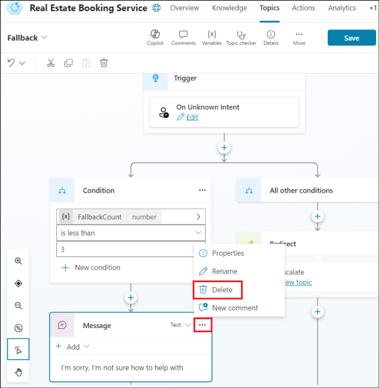

3.  Select the **+** icon under the Condition node, select **Advanced**,
    and select **Generative answers**.

    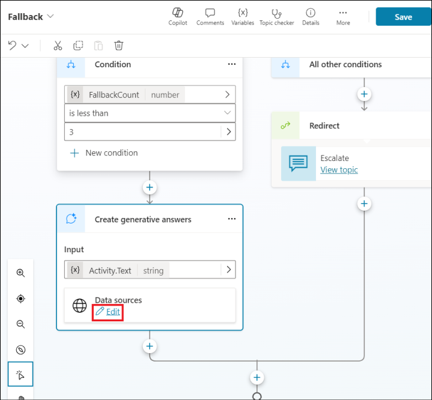

4.  Select the **Input** field, select **System** in the **Select a
    variable** pane. Select **Activity.Text** from it.

    

5.  Select **Edit** under **Data sources**.

    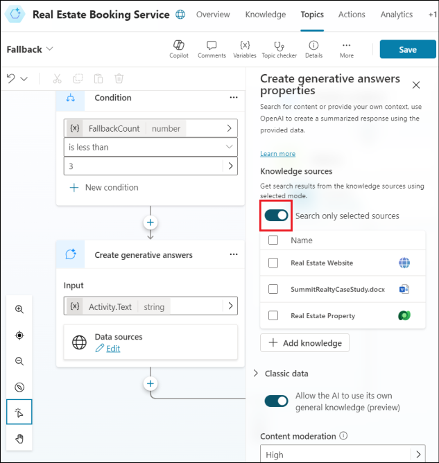

6.  Select **Search only selected sources**.

    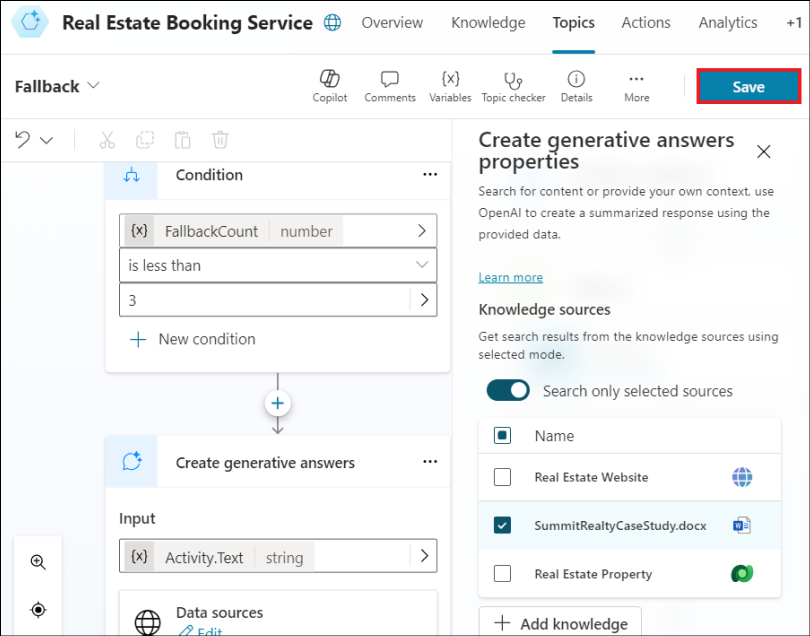

7.  Select the **SummitRealtyCaseStudy** document. Deselect **Allow the
    AI to use its own general knowledge**.
    Select **Medium** for **Content moderation**.

    

8.  Select **Save**.

    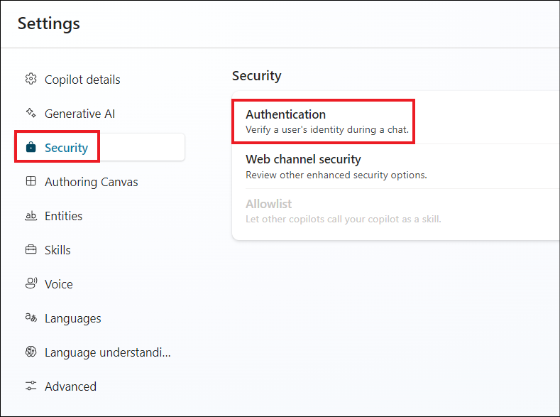

### Task 7: Configure Security

1.  Select the **Overview** tab.

2.  Select **Settings** in the top-right of the screen.

    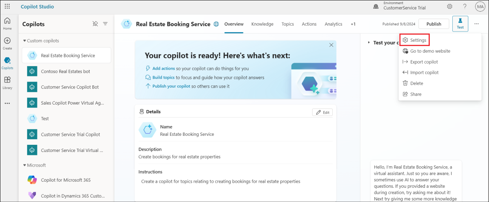

3.  Select the **Security** tab and then select
    the **Authentication** tile.

    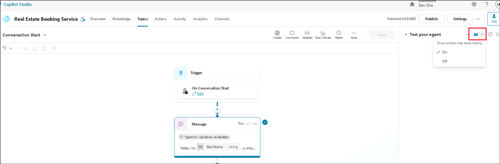

4.  Select Authenticate with Microsoft **(Entra ID authentication in
    Teams and Power App)**.

5.  Select **Save**.

    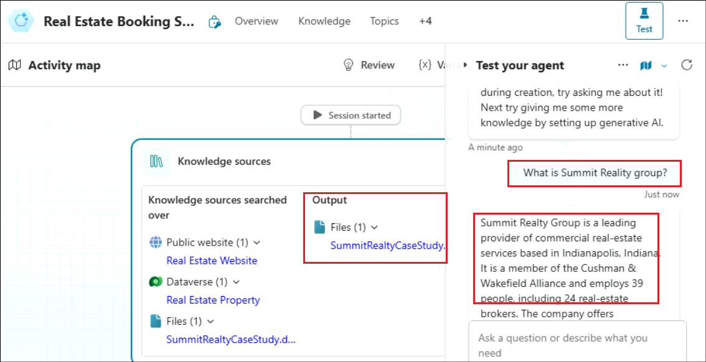

6. Select **Save**.

    

7. Select **Close**.

    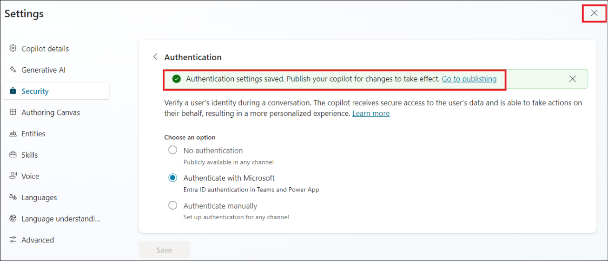

8. Select the **Overview** tab.

9. Select **Publish** and select **Publish** again in the dialog.

    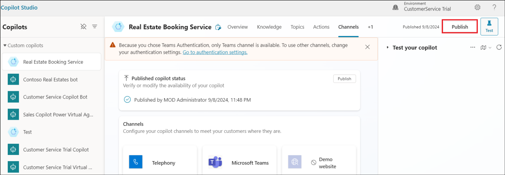

### Task 8: Test the agent's knowledge

1.  Select the **Test** button in the top-right of the screen to open
    the testing panel.

    

2.	Select **Activity map** if not selected already.

    

3.	Select the **Refresh** button in Test Panel to **Start a new conversation**.
   
4.	Type in +++What is Summit Realty group?+++ and hit **send**.
   
5.	You will get a response from the uploaded file as in the screenshot below since it has been added as the knowledge source to look for in the Fallback topic.

    

**Summary:**

In this lab, we have learnt to

- Use entities and slot filling

- Implement Flow actions

- Add knowledge to the agent

- Enable Generative AI
