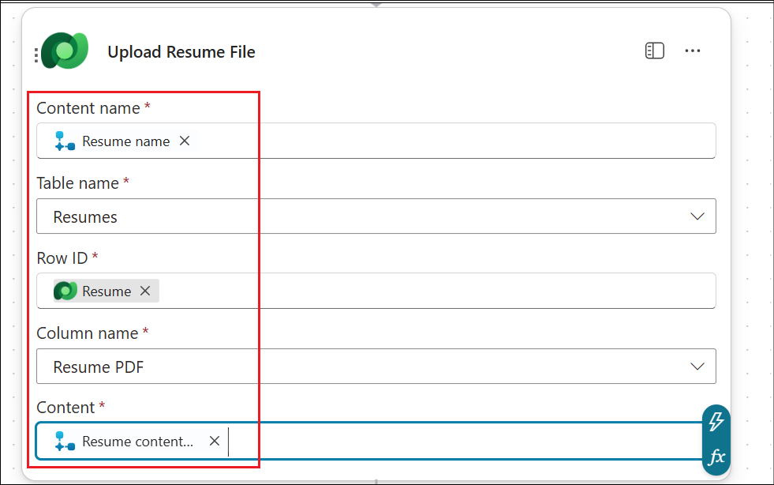
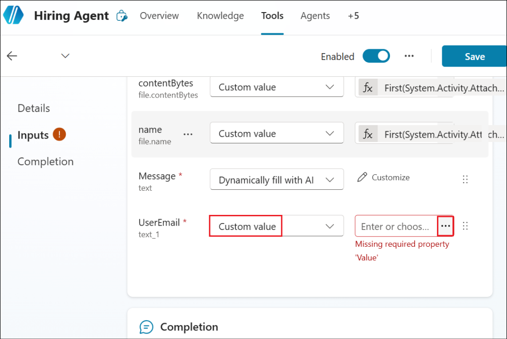
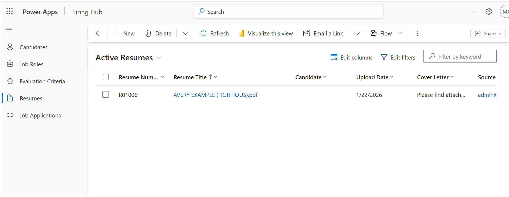
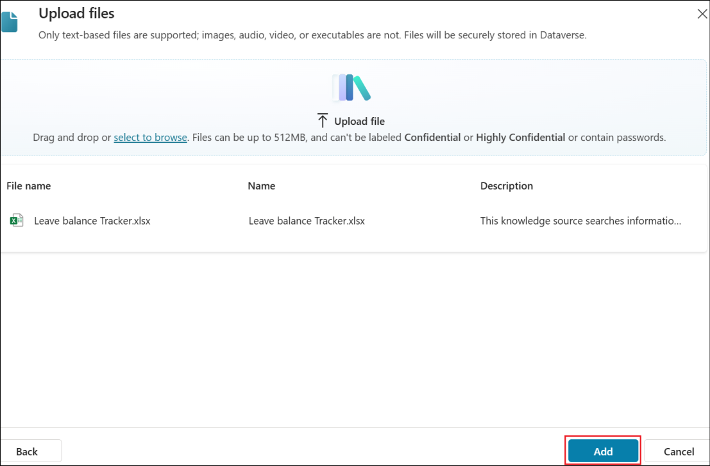
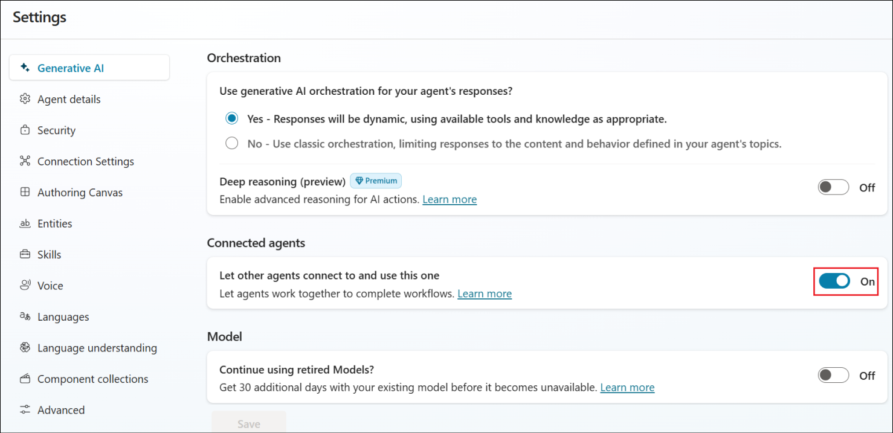
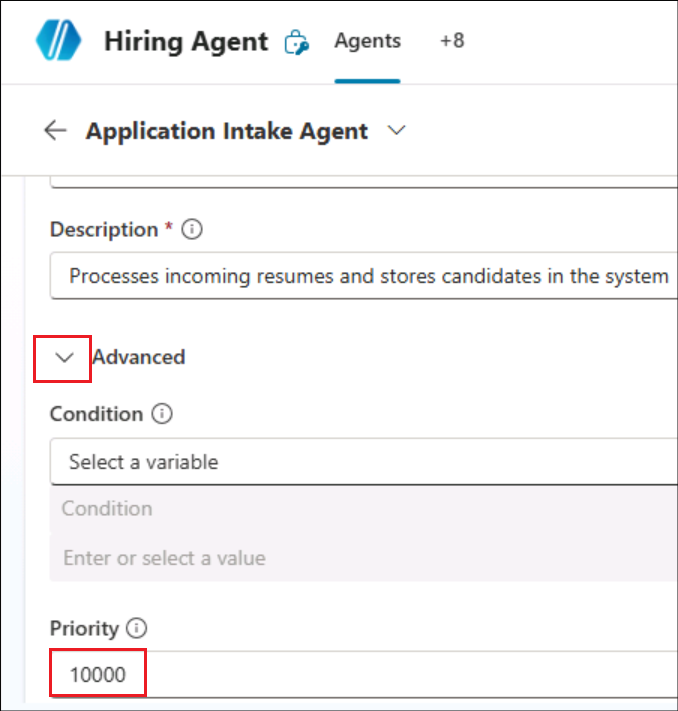
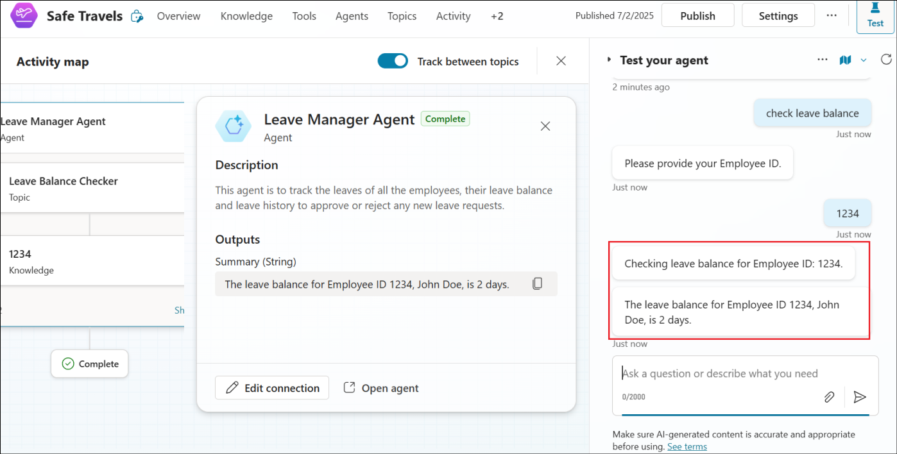

# Laboratorio 05 – Mejorar el agente Safe Travels e implementar la coordinación multigente

# Objetivo

Ha creado un agente llamado **Safe Travels** utilizando una plantilla
proporcionada en Copilot Studio en un laboratorio anterior. En este
laboratorio, comprenderá cómo se puede mejorar ese agente para adaptarlo
a las necesidades de clientes específicos.

En el proceso, aprenderá los conceptos de creación de flujos de agentes
y orquestación de múltiples agentes en Copilot Studio.

## Ejercicio 1 – Pruebe el agente Safe Travels existente

En este ejercicio, probaremos el agente **Safe Travels** para ver cómo
responde cuando se le pregunta sobre la aprobación de viajes.

1.  Abra **Copilot Studio** en +++https://copilotstudio.microsoft.com+++
    desde un navegador. Vaya al entorno **Dev One** y abra el
    agente **Safe Travels**.

2.  Seleccione el icono **Test** para probar el agente.

3.  Ingrese +++Need travel approval+++ en la ventana Test y haga clic
    en **Enter**.

4.  Puede ver que el agente responde con un conjunto de instrucciones
    generalizadas que deben seguirse para obtener la autorización de
    viaje.

## Ejercicio 2 – Mejorar al agente con activos de conocimiento específicos de la empresa

En este ejercicio, añadiremos un activo de conocimiento - **Travel
Policy**, específico de Contoso.

1.  En la página Overview del agente, desplácese hacia abajo y
    seleccione **+ Add knowledge**

2.  Haga clic en la opción **select to browse**.

3.  En la carpeta **C:\Labfiles**, seleccione **Travel Policy.docx** y
    haga clic en **Open**.

4.  Haga clic en **Add** para añadir el archivo.

> 

5.  Asegúrese de que el archivo se ha añadido. Espere hasta que el
    estado cambie de **In progress** a **Ready** antes de continuar con
    el siguiente paso.

## Ejercicio 3 – Crear un equipo y un canal en Microsoft Teams

En este ejercicio, crearemos un equipo y un canal en MS Teams al que se
enviará la solicitud de aprobación de viaje.

1.  Abra Microsoft Teams y seleccione la opción **See all your
    teams **en el panel izquierdo.

2.  Seleccione **Create team **para crear un nuevo equipo.

3.  Ingrese el nombre del equipo como +++**HR Team**+++ y el nombre del
    primer canal como +++**Travel Approval Channel**+++ y seleccione
    **Create**.

4.  Seleccione **Skip** en el cuadro de diálogo Add members to HR Team.

Ahora, la creación del equipo y del canal se ha completado.

## Ejercicio 4 – Crear un flujo de agente

En este ejercicio, crearemos un nuevo flujo de agente para publicar la
solicitud de viaje en el canal Teams

1.  Seleccione **Flows** en el panel izquierdo.

2.  Seleccione **New agent flow **para crear un nuevo flujo.

3.  Seleccione **Add a trigger**.

4.  Seleccione **When an agent calls the flow** en **AI capabilities**.

5.  Seleccione **+ Add an input**.

6.  Seleccione **Number** y asígnele el nombre +++**Employee ID**+++. A
    continuación, seleccione **+ Add an input**.

> 

7.  Ahora, seleccione una entrada de **Texto** y asígnele el nombre
    +++**Purpose**+++.

8.  Seleccione **Add an action** debajo del nodo desencadenante.

9.  Busque +++**Teams**+++ y haga clic en **See more** debajo del grupo
    de acciones de Teams.

10. Seleccione **Post message in a chat or channel**.

11. Seleccione **Sign in** e **inicie sesión **con sus credenciales.

12. Seleccione los siguientes datos

Post as – Seleccione **User**

Post in – Seleccione **Channel**

Team – Seleccione **HR Team**

Channel – Seleccione **Travel Approval Channel**

13. En el campo Message, ingrese lo siguiente

\`\`\`

> Travel Request from
>
> Employee ID - \<Employee ID\>
>
> Purpose - \<Purpose\>
>
> \`\`\`
>
> Reemplace **\<Employee ID\>** y **\<Purpose\>** por las variables de
> contenido dinámico, **Employee ID** y **Purpose**, tal y como se
> muestra en las siguientes capturas de pantalla.

14. La pestaña Parameters tendrá ahora el siguiente aspecto.

15. Cierre la pestaña Parameters.

16. Añada otra **acción** después del nodo Post message.

17. Seleccione **Respond to the agent** en **Skills**.

18. Seleccione Add an output. Asígnele el nombre +++Output+++ e ingrese
    el valor +++Request submitted+++.

19. Haga clic en **Save draft** para guardar el flujo.

20. Una vez guardado el flujo, seleccione **Publish**.

21. Asegúrese de que el flujo se ha publicado.

22. Haga clic en la pestaña **Overview** del flujo del agente.

23. Seleccione **Edit** y asigne al flujo el nombre +++Request Travel
    Approval Flow+++ en el panel **Details**. Seleccione **Save**.

## Ejercicio 5 – Añadir el flujo del agente como herramienta al agente

En este ejercicio, añadiremos el flujo Create Agent al agente Safe
Travels con el fin de aprovechar la funcionalidad del flujo.

1.  En el panel izquierdo, seleccione **Agents**.

2.  Seleccione el agente **Safe Travels**.

3.  Desplácese hacia abajo en la página Overview y seleccione **Add
    tool**.

4.  Seleccione el creado **Request Travel Approval Flow**.

5.  Seleccione **Add to agent**.

6.  Una vez añadido, el flujo aparecerá en la sección **Tools** de la
    página **Overview** del **agente**.

## Ejercicio 6 – Crear tema

En este ejercicio, crearemos un tema para utilizar el flujo de
aprobación de viajes creado.

1.  Seleccione **Topics** en el menú superior. Seleccione **+ Add a
    topic** -\> **Add from description with Copilot**.

2.  Ingrese los siguientes datos y luego seleccione **Create**.

**Name** - +++Travel Approval+++

**Create a topic to** - +++This topic should get the Employee ID
(Number) and Purpose of travel (Text) details from the user and invoke
the Tool "Request Travel Approval Flow"+++

3.  El **Tema** se crea como se muestra a continuación.

> 

4.  Compruebe si realmente se invoca el flujo. En este caso, solo se
    añade un nodo Message que indica que se ha invocado el flujo. En tal
    caso, elimine dicho nodo Message y haga clic en el icono Add a node
    después del nodo en el que se solicita el propósito al usuario.

5.  Seleccione **Add a tool** -\> **Request Travel Approval Flow**

6.  Añada la variable **EmployeeID** para la variable de
    flujo **Employee ID.**

7.  De manera similar, añada la información sobre el propósito del
    viaje.

8.  Añada un nodo **Send a message** y añada la variable de salida como
    se muestra en las capturas de pantalla siguientes.

9.  Seleccione **Save** y, a continuación, **Publish** para publicar el
    agente.

> 

10. Seleccione **Publish** en el cuadro de diálogo de confirmación.

11. Seleccione el icono Test, ingrese +++Travel Approval+++ y envíelo
    desde el panel de prueba.

12. Responda facilitando los siguientes datos al agente

> Employee ID – +++1234+++
>
> Purpose of travel - +++Client meeting for finalizing proposal of XYZ
> project+++

13. Recibirá un mensaje del agente indicando que se ha **enviado la
    solicitud**.

14. Abra el canal Teams y verá los datos publicados allí para la
    aprobación del viaje.

## Ejercicio 7 – Crear agente de gestión de permisos

En este ejercicio, crearemos un agente de gestión de permisos que se
puede utilizar para obtener información sobre los permisos, el balance
de permisos de los empleados, etc.

1.  En la página de inicio de Copilot Studio, seleccione **Agents** -> **+ Create blank agent**.

2.  Una vez que el agente esté creado, selecciona **Edit**.

3.  Ingresa los siguientes detalles y selecciona **Save**.

    - Name - +++Leave Manager Agent+++

    - Description - +++This agent is to track the leaves of all the
      employees, their leave balance and leave history to approve or
      reject any new leave requests.+++

4.  Una vez creado el agente, desplácese hacia abajo en la página
    Overview y seleccione **Add knowledge** en la sección **Knowledge**.

5.  Haga clic en **select to browse**.

6.  Seleccione el archivo **Leave balance Tracker** en C:\Labfiles y
    haga clic en **Open**.

7.  Seleccione **Add** para añadir el rastreador al agente.

8.  El archivo se añade. Espere hasta que el estado sea Ready antes de
    continuar con el siguiente paso.

9.  Seleccione **+ Add a topic** -\> **Add from description with
    Copilot** desde la pestaña Topics.

10. Ingrese los siguientes datos y haga clic en **Create**.

- Name - +++Leave Balance Checker+++

- Create a topic to - +++Get the Employee ID from the user and check and
  reply with the leave balance based on the tracker added as knowledge
  source+++

11. Compruebe si el tema tiene el nodo para obtener el ID de empleado y,
    a continuación, haga clic en Save. Aquí tenemos un nodo para obtener
    el ID de empleado y un nodo de mensaje que indica que se está
    recuperando el balance.

> Compruebe el tema una vez y elimine los demás nodos que se hayan
> creado aparte de los anteriores.

A continuación, **guarde** el tema haciendo clic en Save.

12. Envíe un mensaje +++Check Leave balance+++ desde el panel de prueba.

13. Ingrese +++1234+++ como ID de empleado.

14. Compruebe la respuesta del agente. Se recupera del activo de
    conocimiento añadido al agente.

> 

15. Seleccione Publish y espere hasta que el agente se publique.

## Ejercicio 8 - Implementar la orquestación multiagente en Copilot Studio

En lugar de depender de un único agente para hacerlo todo, o de
gestionar agentes desconectados en silos, las organizaciones ahora
pueden crear sistemas multiagente en Copilot Studio (vista previa),
donde los agentes se delegan tareas entre sí. Esto incluye los creados
con el generador de agentes de Microsoft 365, Microsoft Azure AI Agents
Service y Microsoft Fabric. Ahora, todos estos agentes pueden trabajar
juntos para lograr un objetivo común: completar tareas complejas y
críticas para el negocio que abarcan sistemas, equipos y flujos de
trabajo.

En este ejercicio, agregaremos el agente Leave management al agente Safe
Travels, que se puede usar para obtener información sobre las vacaciones
cuando se planifica un viaje.

1.  Seleccione el agente **Safe Travels** desde Copilot Studio.

2.  Primero probaremos este agente para ver qué información puede
    proporcionar sobre las ausencias. En el panel Test, ingrese +++Check
    Leave balance+++ y presione enter.

3.  Puede ver que el agente responde con información generalizada sobre
    cómo comprobar el saldo de vacaciones. Al hacerlo, también hace
    referencia al documento de la política de viajes.

4.  Seleccione la pestaña **Agents** en el menú superior y seleccione
    **+ Add**.

5.  En **Choose how do you want to extend your agent**, seleccione
    **Copilot Studio**.

6.  En la lista, seleccione **Leave Manager Agent**. Solo se puede
    añadir si está publicado. Espere si se encuentra en proceso de
    publicación.

7.  Seleccione **Add agent** para añadir este agente a **Safe Travels**.

8.  Espere unos minutos después de añadir el agente y, a continuación,
    haga clic en **Publish**.

9.  Espere unos minutos más después de que se publique el agente y, a
    continuación, ingrese +++Check Leave balance+++ en el panel de
    prueba del **agente** **Safe Travels**.

10. Puede ver que se accede automáticamente al agente **Leave
    Manager** y que este responde con la pregunta **Enter Employee
    ID** del **tema del agente Leave Manager**.

11. Ingrese el Employee ID como +++1234+++ y podrá ver que el agente
    responde basándose en los conocimientos del agente de Leave Manager.

## Resumen

En este laboratorio, hemos aprendido a mejorar un agente creado a partir
de una plantilla para adaptarlo a las necesidades individuales. También
hemos aprendido a implementar la coordinación de múltiples agentes en
Copilot Studio

