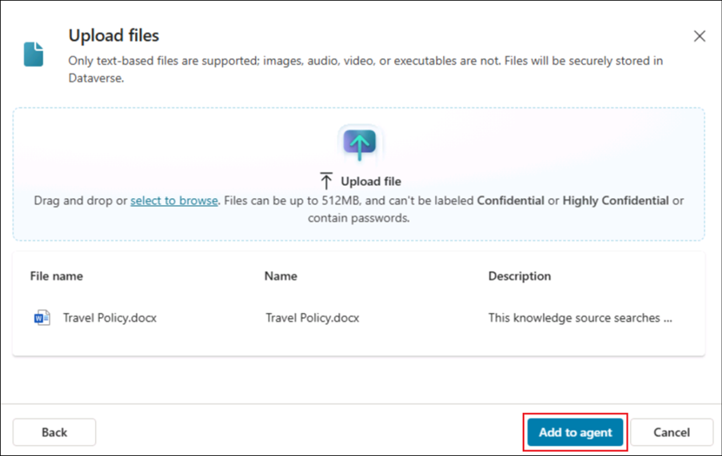
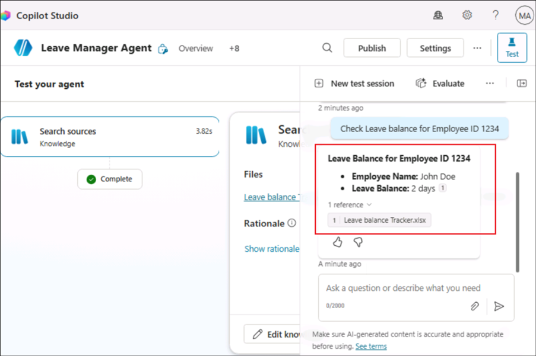
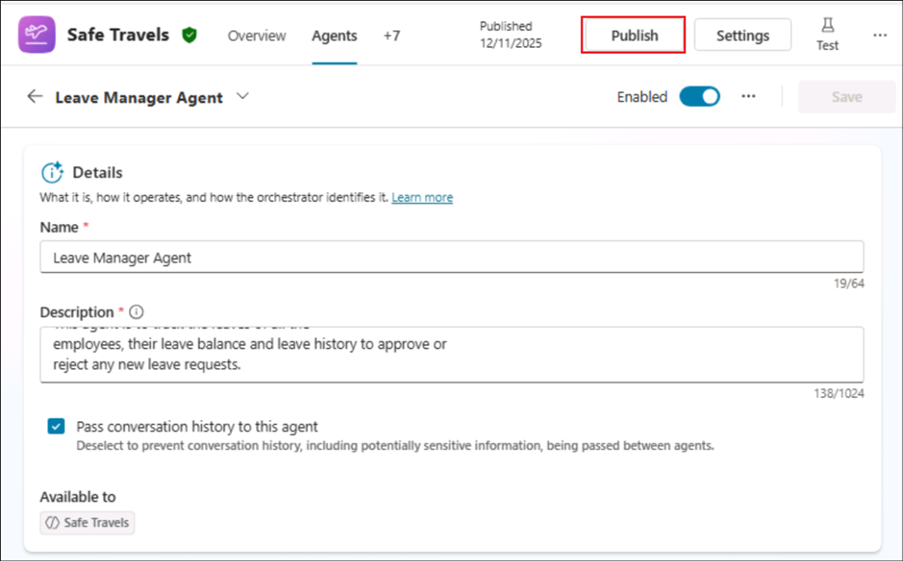
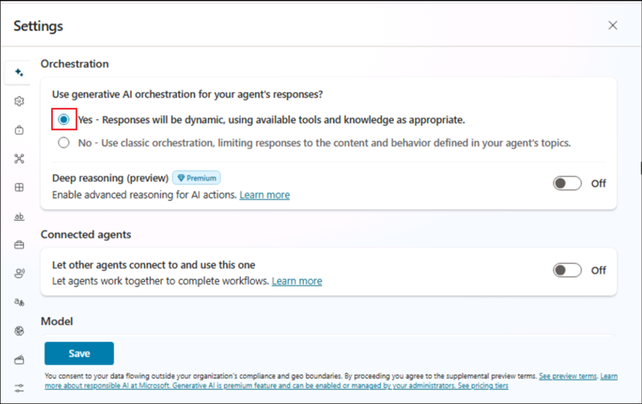
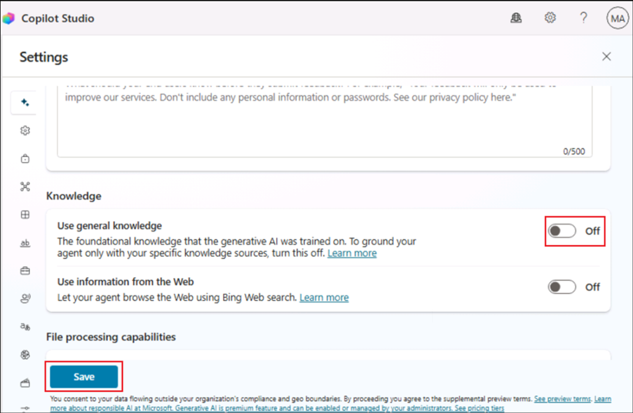
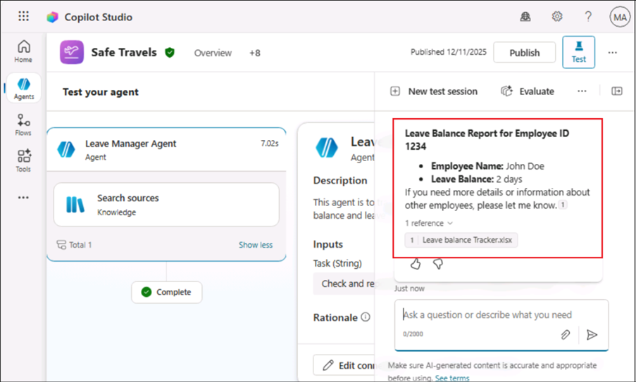

# Lab 05 – Enhance the Safe Travels agent and implement Multi agent orchestration

## Objective

You created an agent named **Safe Travels** by using a template provided
in the Copilot Studio in a previous lab. In this lab, you will
understand how that agent can be enhanced to suit the needs of specific
customers.

In the process of doing that, you will learn the concepts of Agent Flow
creation and Multi agent orchestration in Copilot Studio.

## Exercise 1 – Test the existing Safe Travels agent

In this exercise, we will test the **Safe Travels** agent to see how it
responds when asked about travel approval.

1.  Open the **Copilot Studio** at
    +++https://copilotstudio.microsoft.com+++ from a browser. Navigate
    to the **Dev One** environment and open the **Safe Travels** agent.

    

    >[!Alert] **Important** If the Copilot Studio and does not show up the option to select **Environment** as in the below screenshot, then follow the below steps.
    >
    >
    >
    > Open +++https://admin.powerplatform.microsoft.com/+++. Select **Manage** -> **Environments -> Dev One** and select the value of the **Environment ID**.
    >
    >
    > Navigate back to the Copilot Studio tab and open +++https://copilotstudio.microsoft.com/environments/**< EnvironmentID >**+++   (Replacing **< EnvironmentID >** with the value fetched above)

    
2.  Select the **Test** icon to test the agent.

    

3.  Enter +++Need travel approval+++ in the Test window and click on
    **Enter**.

    

4.  You can see that the agent responds with a generalized instruction
    set to be followed to get the travel approval.

    

## Exercise 2 – Enhance the agent with company specific Knowledge assets

In this exercise, we will add knowledge asset - **Travel Policy**
specific to Contoso.

1.  From the Overview page of the agent, scroll down and select **+ Add
    knowledge**

    

2.  Click on **select to browse** option.

    

3.  From **C:\Labfiles\Lab Files** folder, select **Travel Policy.docx** and click
    **Open**.

    

4.  Click **Add to agent** to the add the file.

    

    

5.  Ensure that the file is added. Wait till the status changes from
    **In progress** to **Ready**. You can continue with the next step while it is changing to the Ready state if it takes more than few minutes.

    

    
    
## Exercise 3 – Create a Team and Channel in Microsoft Teams

In this exercise, we will create a team and a channel in MS Teams to
which the travel approval request will be sent.

1.  Open Microsoft Teams and select **See all your teams** option from
    the left pane.

    

2.  Select **Create team** to create a new team.

    

3.  Enter the Team name as +++**HR Team**+++ and First channel name as
    +++**Travel Approval Channel**+++ and select **Create**.

    

4.  Select **Skip** in the Add members to HR Team dialog.

    

5.  Now, the Team and Channel creation is completed.

    


## Exercise 4 – Create an Agent Flow

In this exercise, we will create a new AgentFlow to post the travel
request to the Teams channel

1.  Select **Flows** from the left pane.

    

2.  Select **New agent flow** to create a new flow.

    

3.  Select **Add a trigger**.

    

4.  Search for +++agent+++ and select **When an agent calls the flow** under **Skills**.

    

5.  Select **+ Add an input**.

    

6.  Select **Number** and name it as +++**Employee ID**+++. Then select
    **+ Add an input**.

    

    

7.  Now, select a **Text** input and name it as +++**Purpose**+++.

    

8.  Select **Add an action** below the trigger node.

    

9.  Search for +++**Teams**+++ and click on **See more** under the Teams
    group of actions.

    

10. Select **Post message in a chat or channel**.

    

11. Select **Sign in** and **login** using your credentials.

    

    

12. Select the below details

    Post as – Select **User**
    
    Post in – Select **Channel**
    
    Team – Select **HR Team**
    
    Channel – Select **Travel Approval Channel**

    

13. In the Message field, enter the following

    ```
    Travel Request from 
    Employee ID - <Employee ID>
    Purpose - <Purpose>
    ```

    Replace **< Employee ID >** and **< Purpose >** with the dynamic content variables, **Employee ID** and **Purpose** as in the below screenshots.

    

    

14. The Parameters tab will now look like below.

    

15. Close the Parameters tab.

    

16. Add another **action** after the Post message node.

    

17. Select **Respond to the agent** under **Skills**.

    

18. Select **Add an output**. Add a **Text** output. Name it as +++Output+++ and enter the value as
    +++Request submitted+++.

    

19. Click on **Save draft** to save the flow.

    

20. Once the flow is saved, select **Publish**.

    

21. Ensure that the flow has been published.

    

22. Click on the **Overview** tab of the agent flow.

    

23. Select **Edit** and name the flow as +++Request Travel Approval
    Flow+++ in the **Details** pane. Select **Save**.

    

## Exercise 5 – Add the Agent flow as a tool to the agent

In this exercise, we will add the create Agent flow to the agent Safe
Travels in order to leverage the flow functionality.

1.  From the left pane, select **Agents**.

    

2.  Select the **Safe Travels** agent.

    

3.  Scroll down in the Overview page and select **Add tool**.

    

4.  From the **Flow** tab, select the created **Request Travel Approval Flow**.

    

5.  Select **Add to agent**.

    

6.  Once added, the flow will get listed under **Tools** section of the
    **Overview** page of the **agent**.

    

## Exercise 6 – Create Topic

In this exercise, we will create a Topic to use the created travel
approval flow.

1.  Select **Topics** from the top menu. Select **+ Add a topic** -\>
    **Add from description with Copilot**.

    

2.  Enter the below details and then select **Create**.

    **Name** - +++Travel Approval+++
    
    **Create a topic to** - +++This topic should get the Employee ID
    (Number) and Purpose of travel (Text) details from the user and invoke
    the Tool "Request Travel Approval Flow"+++

    

3.  The **Topic** gets created as below.

    

    

4.  See if the Flow is actually invoked. In this case, only a Message
    node stating that the flow is invoked is added. In such a case,
    delete such Message node and click on Add a node icon after the node
    where the Purpose is requested from the user.

    

    

5.  Select **Add a tool** -> **Request Travel Approval Flow**

    

6.  Add the Variable **EmployeeID** for the flow variable **Employee
    ID.**

    

7.  Similarly add the Purpose of travel input.

    

8.  Add a **Send a message** node and add the Output Variable to it as
    in the screenshots below.

    

    

9.  Select **Save** and then **Publish** to publish the agent.
    
    

    

11. Select **Publish** in the confirmation dialog box.

    

12. Select the Test icon and enter +++Travel Approval+++ and send from
    the test pane.

    

13. Converse by giving the below details to the agent

    Employee ID – +++1234+++
    
    Purpose of travel - +++Client meeting for finalizing proposal of XYZ project+++

    

14. Select **Allow** to allow connection.

    

15. You will get a **Request submitted** message from the agent.

    

16. Open the Teams Channel and you will see the details posted there for
    the Travel approval.

    

## Exercise 7 – Create Leave Management agent 

In this exercise, we will build a Leave management agent which can be
used to learn about the leaves, leave balance for employees and so on.

1.  From the Copilot Studio Home page, select **Agents** from the left pane. Then, select **+ Create blank agent**.

    

2.  Once the agent is created, select **Edit**.

    

3.  Enter the below details and select **Save**.

    - Name - +++Leave Manager Agent+++

    - Description - +++This agent is to track the leaves of all the
      employees, their leave balance and leave history to approve or
      reject any new leave requests.+++

    

4.  Once it is saved, scroll down in the Overview page and
    select **Add knowledge** under the **Knowledge** section.

    

5.  Click on **select to browse**.

    

6.  Select the file **Leave balance Tracker** from **C:\Labfiles\Lab Files** and click
    **Open**.

    

7.  Select **Add to agent** to add the tracker to the agent.

    

8.  The file gets added. Wait until the status is **Ready**.

    

    >[!Alert] **Important:** The **Knowledge source** at times takes more **time** to come to the **Ready** state. If it takes more than **5 minutes**, please **continue** with the **next step** to check if you are able to get the **result** from the **added source**. Because, it gets added at the back end and takes time to reflect the same in the UI. If you are able to get **proper results**, please **proceed** with the next steps. **Else**, **wait** for some time.
    
9.  Select **Settings** from the top right.

    

10. Ensure that **Yes** is selected under **Use generative AI orchestration** and toggle **Use general knowledge** option under Knowledge section to **Off** and then select **Save**.

    

    

11. **Send** a message +++Check Leave balance for Employee ID 1234+++ from the **Test** pane.

    

12. Check the **response** from the agent. This is retrieved from the
    knowledge asset added to the agent.

    
    
13. Select **Publish** and wait till the agent is published.

    

## Exercise 8 - Implement Multi agent orchestration in Copilot Studio

Rather than relying on a single agent to do everything—or managing
disconnected agents in silos—organizations can now build multi-agent
systems in Copilot Studio (preview), where agents delegate tasks to one
another. This includes those built with the Microsoft 365 agent builder,
Microsoft Azure AI Agents Service, and Microsoft Fabric. These agents
can now all work together to achieve a shared goal: completing complex,
business-critical tasks that span systems, teams, and workflows.

In this exercise, we will add the Leave management agent to the Safe
Travels agent which can be used to learn about the leaves when planning
to travel.

1.  Select the **Safe Travels** agent from Copilot Studio.

    

2.  We will first test this agent to see what information it can give on
    leaves. From the Test pane, enter +++Check Leave balance+++ and hit
    enter.

    

3.  You can see that the agent responds with a generalized information
    on how to check the leave balance. It also refers to the Travel
    Policy document while doing this.

    

4.  Select the **Agents** tab from the top menu and select **+ Add**.

    

5.  From the list, select **Leave Manager Agent**. It can be added only
    if it is published. Please wait if it is in the process of
    publishing.

    

7.  Select **Add and configure** to add this agent to **Safe Travels**.

    

8.  Wait for few minutes after the agent is added and then click on
    **Publish**.

    


9. Select **Settings** and ensure that the **Generative AI** is turned **On**. Also, toggle the **Use General knowledge** under Knowledge section to **Off** and then select **Save**.

    

    
   
9.  From the **Test** pane of the **Safe Travels agent**, enter +++Check Leave balance of Employee ID 1234+++ and hit **Send**.

    

10. You can see that the **Leave Manager** agent is accessed
    automatically and the agent replies with the leave details from the Leave balance tracker.

    

## Summary

In this lab, you learned how to:

-    Extend agents with custom knowledge assets.

-    Design and connect Agent Flows to automate tasks via Teams.

-    Create topics using natural language prompts and integrate flows as tools.

-    Publish agents to Teams and Microsoft 365 Copilot for enterprise use.

-    Implement Multi-Agent Orchestration so multiple agents collaborate to fulfill complex user requests.

By completing this lab, you gained practical experience in designing modular, intelligent agents that can interact, automate workflows, and deliver cohesive business experiences across Microsoft’s Copilot ecosystem.


