# Laboratório 5 – Transformando o Hiring Agent em uma arquitetura escalável de múltiplos agentes

No laboratório anterior, você criou seu Hiring Agent principal,
estabelecendo uma base sólida para gerenciar fluxos de trabalho de
recrutamento. Mas um único agente só consegue ir até certo ponto.

Sua missão, caso decida aceitá-la, é a **Operação Sinfonia** —
transformar seu agente único em um **sistema de múltiplos agentes**: uma
equipe orquestrada de agentes especializados que trabalham juntos para
lidar com desafios complexos de contratação. Pense nisso como evoluir de
um operador solo para comandar uma força-tarefa especializada.

Assim como em uma orquestra sinfônica, em que cada músico desempenha seu
papel em perfeita harmonia, você adicionará dois especialistas
essenciais ao seu Hiring Agent existente: um Agente de Intake de
Candidaturas, para processar currículos automaticamente, e um Agente de
Preparação para Entrevistas, para criar materiais completos de
preparação para entrevistas.

Após criar a arquitetura de múltiplos agentes, você transformará seus
agentes de um modelo que aguarda a entrada humana para um que responde
proativamente a eventos externos e executa ações inteligentes sem
supervisão.

Pense nisso como uma evolução de agentes que apenas *respondam a
perguntas* para agentes que *antecipam necessidades e atuam de forma
independente*. Por meio de acionadores de eventos e fluxos de trabalho
automatizados, seu Hiring Agent detectará e-mails recebidos com
currículos, processará anexos automaticamente, armazenará dados no
Dataverse e notificará sua equipe de recrutamento de RH por meio do
Microsoft Teams — tudo isso enquanto você se concentra em tarefas de
maior valor.

## Objetivos

Nesta missão, você aprenderá:

1.  Quando usar **agentes subordinados** x **agentes conectados**

2.  Como projetar **arquiteturas de múltiplos agentes** escaláveis

3.  Criando **agentes subordinados** para tarefas específicas

4.  Estabelecendo **padrões de** **comunicação** entre agentes

5.  Construindo o Agente de Intake de Candidaturas e o Agente de
    Preparação para Entrevistas

6.  Como os acionadores de eventos permitem o comportamento de agentes
    autônomos sem interação do usuário

7.  As diferenças entre agentes interativos e agentes autônomos no
    Copilot Studio

8.  Como criar acionadores de eventos que processam automaticamente
    anexos de e-mail e carregam arquivos no Dataverse

9.  Como criar fluxos de agente que publicam cartões adaptativos em
    canais do Teams para notificações

10. Como passar dados entre acionadores de eventos e fluxos de agente
    para automação de ponta a ponta

## Agente subordinado: Agente de Intake de Candidaturas

Vamos começar a construir nosso sistema de contratação multiagente.
Nosso primeiro especialista será o **Agente de Intake de Candidaturas**
— um agente subordinado responsável por processar currículos recebidos e
informações dos candidatos.

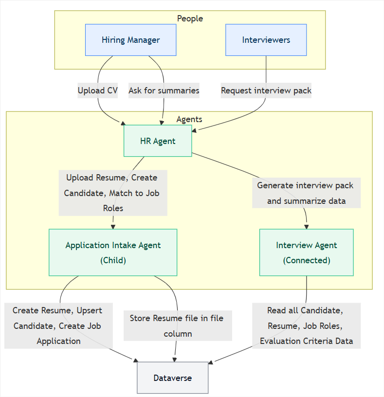

**Responsabilidade do Agente de Intake de Candidaturas**

- **Analisar o conteúdo de currículos** em PDF fornecidos por meio de
  chat interativo (em uma missão futura, você aprenderá como processar
  currículos de forma autônoma).

- **Extrair dados estruturados** (nome, habilidades, experiência,
  formação acadêmica).

- **Relacionar candidatos às vagas em aberto** com base nas
  qualificações e na carta de apresentação.

- **Armazenar as informações dos candidatos** no Dataverse para
  processamento posterior.

- **Eliminar duplicidades de candidaturas** para evitar a criação do
  mesmo candidato mais de uma vez, realizando a correspondência com
  registros existentes usando o endereço de e-mail extraído do currículo

**Motivos para adotar um agente subordinado**

O Agente de Intake de Candidaturas se encaixa perfeitamente como um
agente subordinado porque:

- É especializado em processamento de documentos e extração de dados

- Não requer publicação separada

- Faz parte da nossa solução geral de contratação, gerenciada pela mesma
  equipe

- Concentra-se em um acionador específico (novo currículo recebido) e é
  acionado a partir do Hiring Agent.

## Agente conectado: Agente de Preparação para Entrevistas

Nosso segundo especialista será o **Agente de Preparação para
Entrevistas** — um agente conectado que auxilia na criação de materiais
completos de preparação para entrevistas e na avaliação das respostas
dos candidatos.

**Responsabilidades do Agente de Preparação para Entrevistas**

- **Criar materiais de entrevista** com informações da empresa,
  requisitos da função e critérios de avaliação

- **Gerar perguntas de entrevista** adaptadas a cargos específicos e aos
  perfis dos candidatos

- **Responder a perguntas gerais** sobre as funções e as candidaturas
  para comunicação com as partes interessadas

**Motivos para adotar um agente conectado**

O Agente de Preparação para Entrevistas funciona melhor como um agente
conectado porque:

- A equipe de aquisição de talentos pode querer usá-lo de forma
  independente em vários processos de contratação

- Ele precisa de sua própria base de conhecimento sobre as melhores
  práticas de entrevista e critérios de avaliação

- Diferentes gerentes de contratação podem querer personalizar seu
  comportamento para suas equipes

- Ele pode ser reutilizado para cargos internos, não apenas para
  contratações externas

## Exercício 1 – Adicionando o Agente de Intake de Candidaturas

Vamos adicionar nosso primeiro agente subordinado ao seu Hiring Agent
existente.

### Tarefa 1 – Configuração da solução

1.  No Copilot Studio, selecione o ícone de reticências (…) abaixo de
    Tools na navegação à esquerda.

2.  Seleciona **Solutions**.

> 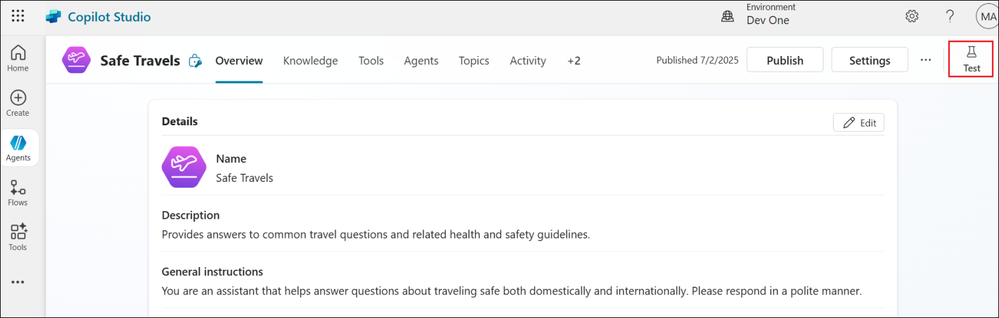

3.  Localize sua solução **Operative**, selecione o ícone de
    **reticências** (**…**) ao lado dela e escolha **Set preferred
    solution**. Na caixa de diálogo exibida, selecione **Apply**. Isso
    garantirá que todo o seu trabalho seja adicionado a essa solução.

> 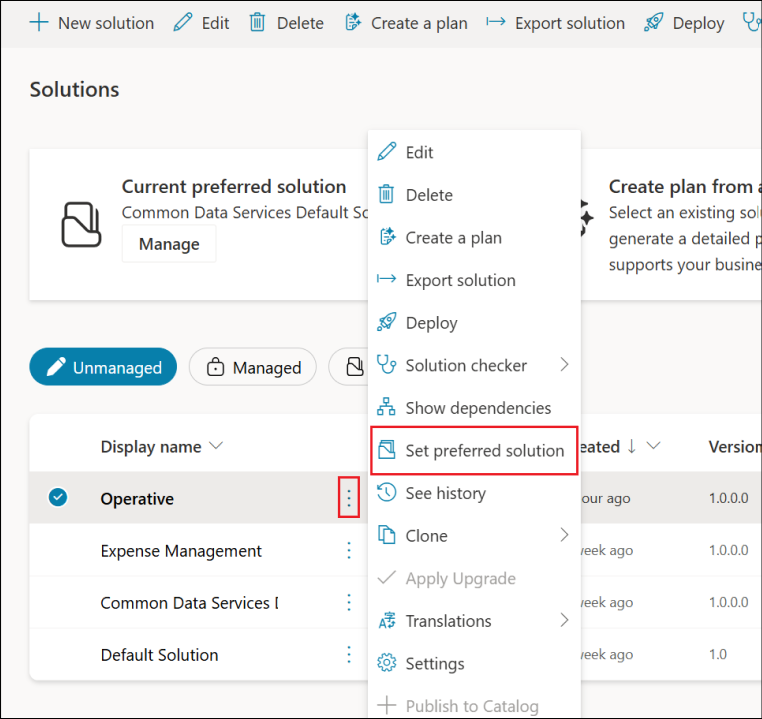

4.  Selecione Apply na caixa de diálogo Set your preferred solution.

### Tarefa 2 – Configurar as instruções do Hiring Agent

1.  **Navegue** até o Copilot Studio. Certifique-se de que seu ambiente
    esteja selecionado no **Environment Picker** no canto superior
    direito.

2.  Abra o **Hiring Agent**.

3.  Selecione **Edit** na seção **Instructions** da guia **Overview** do
    agente.

4.  Copie e cole as seguintes instruções no campo de entrada
    Instructions.

**You are the central orchestrator for the hiring process. You
coordinate activities, provide summaries, and delegate work to
specialized agents.**

5.  Selecione **Save**.

> 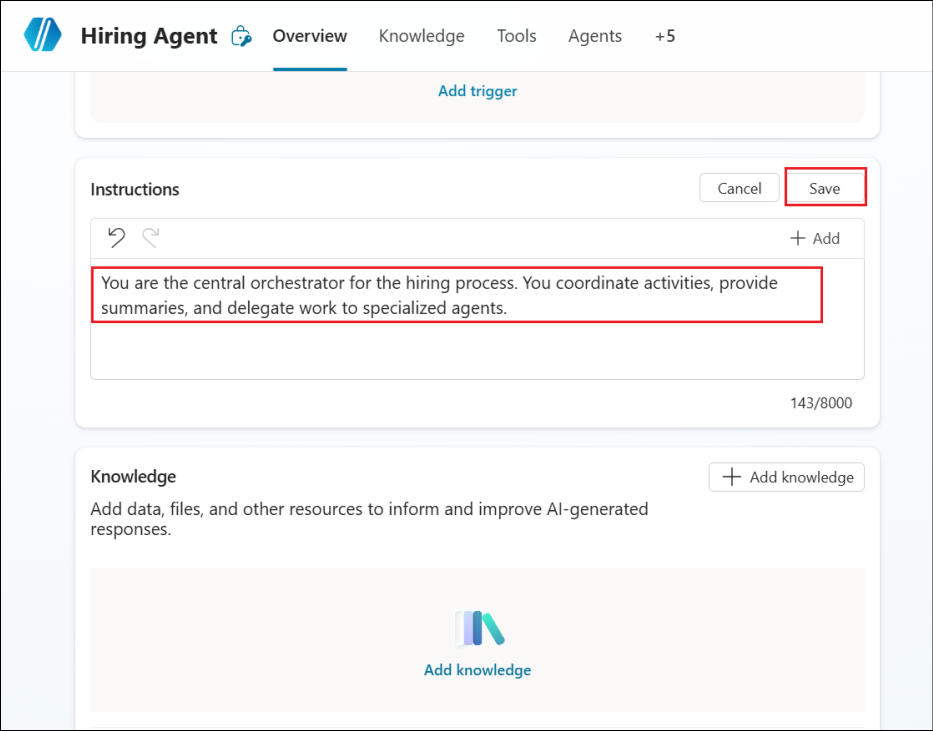

6.  Selecione o botão **Settings** no canto superior direito da tela.

> 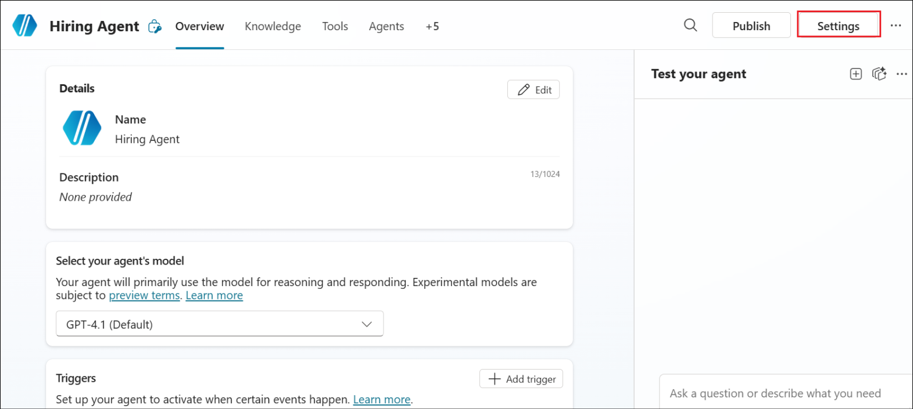

7.  Revise a página, certifique-se de que as seguintes configurações
    estejam aplicadas e, em seguida, selecione **Save**.

[TABLE]

> 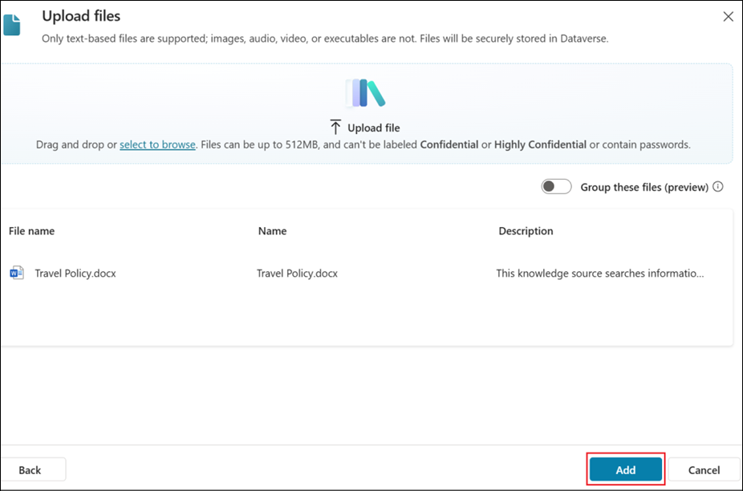
>
> 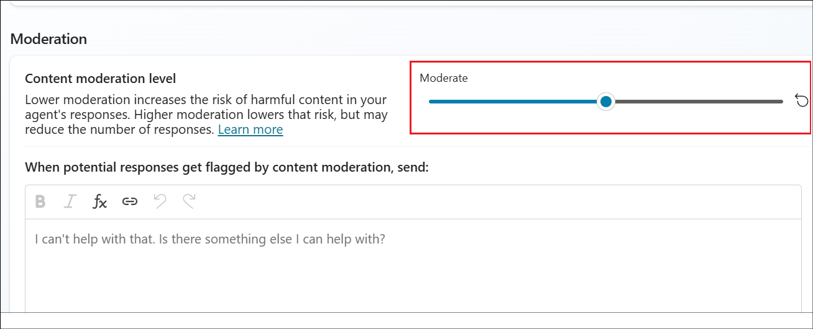
>
> 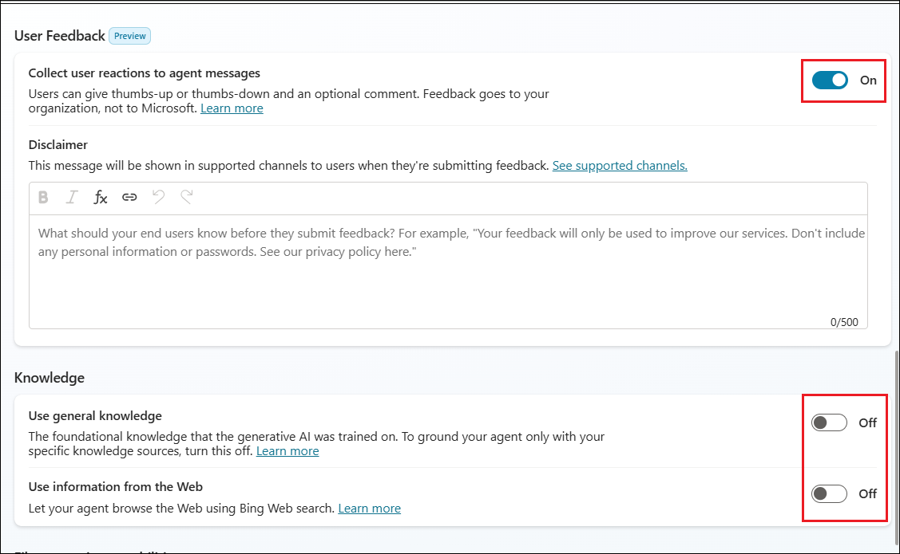
>
> 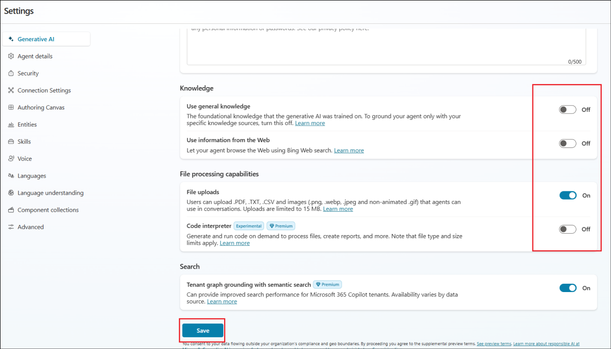

8.  Clique no **X** no canto superior direito para fechar o menu de
    configurações.

> 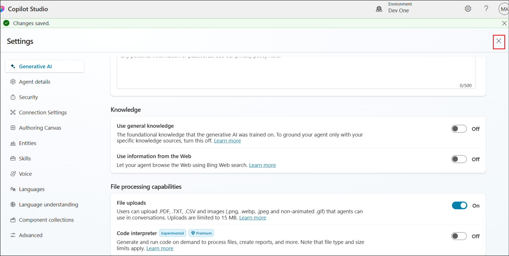

### Tarefa 3 – Adicionar o Agente de Intake de Candidaturas

Nesta tarefa, você adicionará um agente subordinado ao Hiring Agent.

1.  **Navegue** até a guia **Agents** dentro do seu Hiring Agent (é aqui
    que você adicionará agentes especialistas) e selecione **Add**.

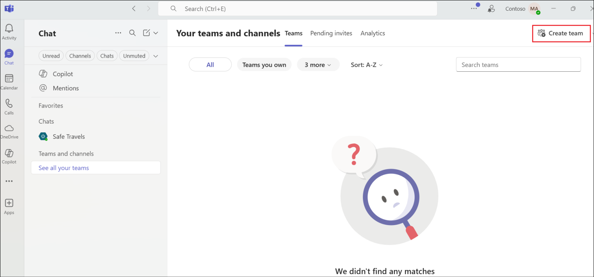

2.  Selecione **New child agent**.

3.  **Name** seu agente como +++Application Intake Agent+++

4.  Selecione **The agent chooses** – Based on description na lista
    suspensa **When will this be used?**. Essas opções são semelhantes
    aos acionadores que podem ser configurados para tópicos.

5.  Defina a **Description** como +++Processes incoming resumes and
    stores candidates in the system+++.

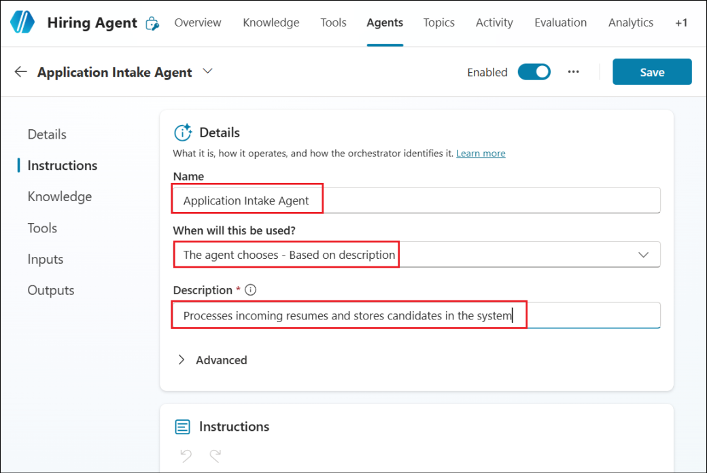

6.  Expanda **Advanced** e defina o Priority como 10000. Isso garantirá
    que, posteriormente, o Interview Agent seja usado para responder a
    perguntas gerais antes deste. Uma condição também pode ser definida
    aqui, como garantir que haja pelo menos um anexo.

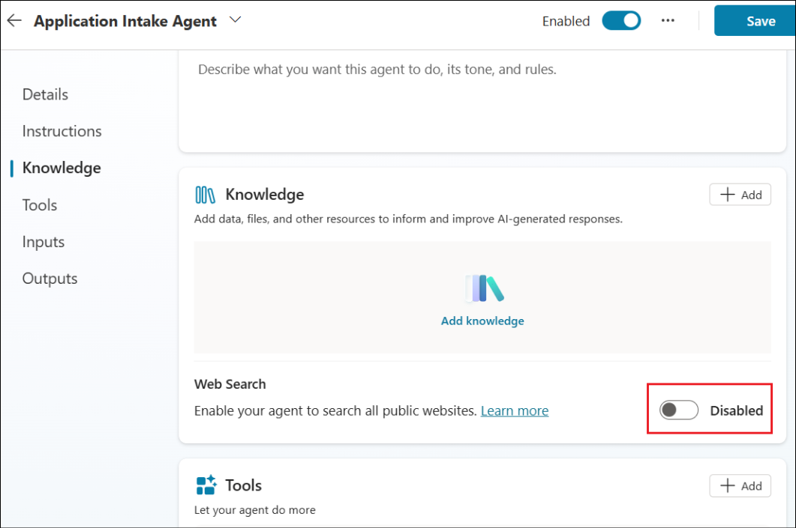

7.  Certifique-se de que o botão de alternância **Web Search** esteja
    definido como **Disabled**. Isso ocorre porque queremos utilizar
    apenas as informações fornecidas pelo agente principal. Selecione
    **Save**.

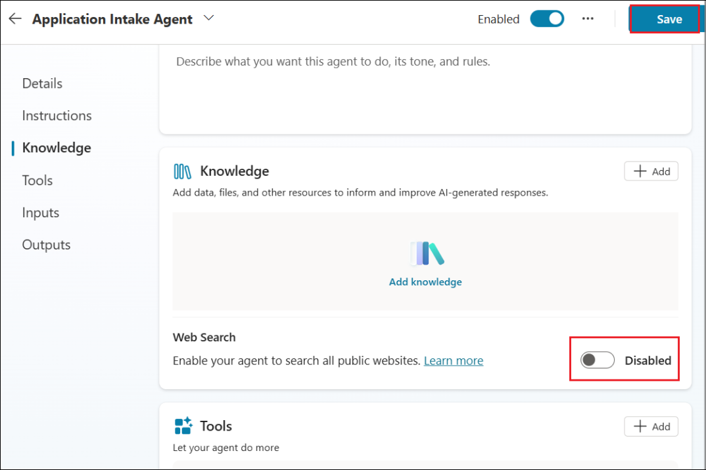

### Tarefa 4 – Configurar o fluxo de agente de upload de currículos

Os agentes não conseguem executar nenhuma ação sem que sejam atribuídas
ferramentas ou tópicos.

Estamos usando **ferramentas de fluxo do agente** em vez de tópicos para
a etapa de U*pload do Currículo* porque esse processo de back-end com
várias etapas requer execução determinística e integração com sistemas
externos. Embora os tópicos sejam melhores para orientar o diálogo
conversacional, os fluxos do agente fornecem a automação estruturada
necessária para lidar de forma confiável com o processamento de
arquivos, a validação de dados e as inserções e atualizações no banco de
dados (inserir novos ou atualizar existentes) sem depender da interação
do usuário.

1.  Localize a seção **Tools** na página Application Intake Agent. 

> **Importante:** esta não é a guia Tools do agente principal; ela pode
> ser encontrada ao rolar a página para baixo, abaixo das instruções do
> agente subordinado.

2.  Selecione **+ Add**.

> 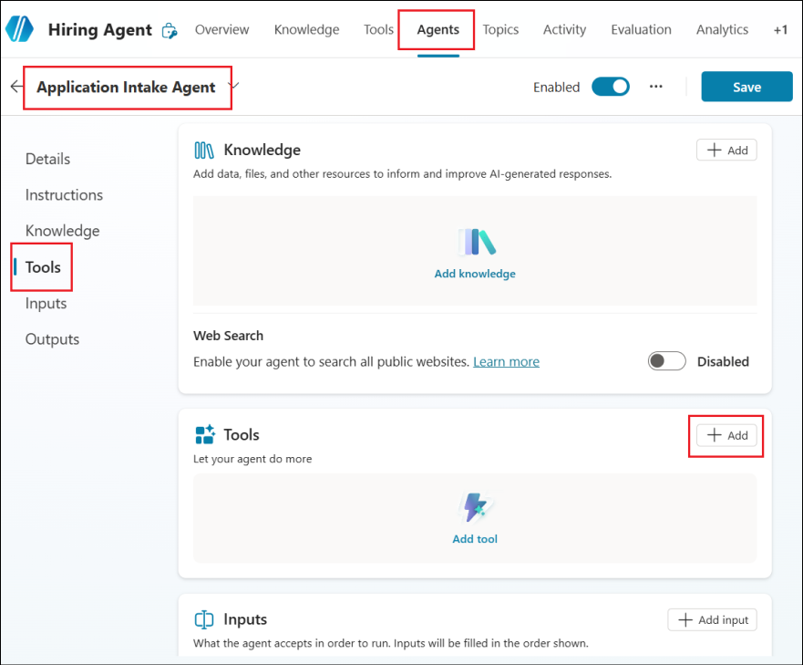

3.  Selecione **+ New tool**.

> 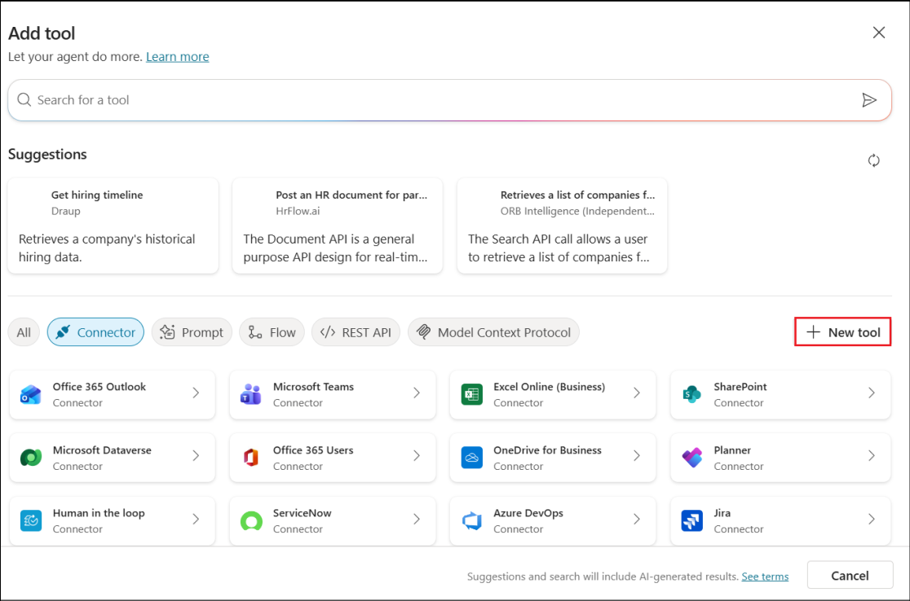

4.  Selecione **Agent flow**. O designer de Agent Flow será aberto; é
    nele que adicionaremos a lógica de upload de currículos.  
    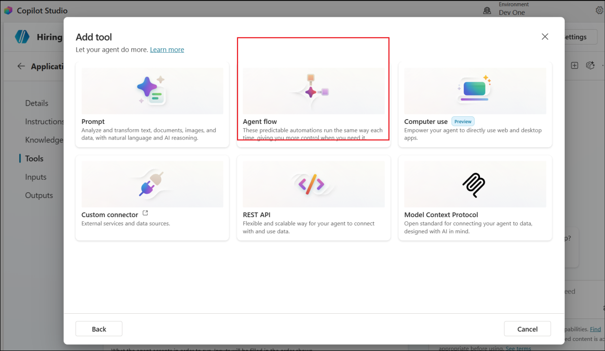

5.  Selecione o nó **When an agent calls the flow** e, em seguida,
    selecione **+ Add an input**

> 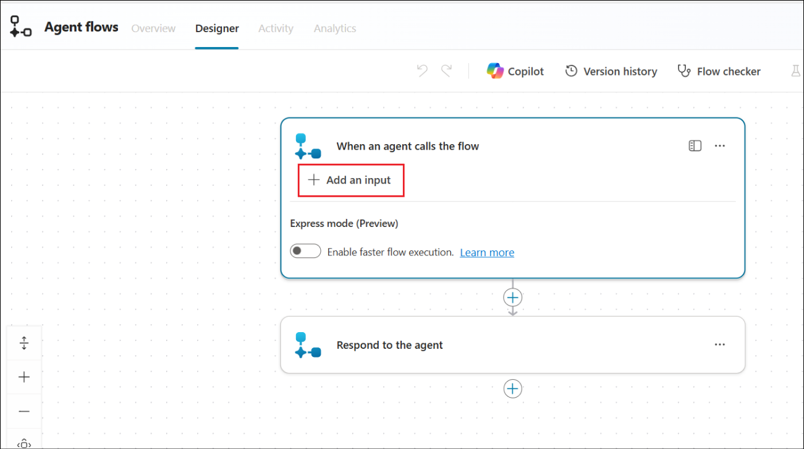

6.  Adicione **entradas** para cada um dos parâmetros listados na tabela
    abaixo. Selecione o tipo de entrada apropriado conforme indicado na
    tabela e certifique-se de adicionar tanto o nome quanto a descrição.
    É importante incluir a descrição, pois isso ajudará o agente a saber
    o que deve ser preenchido em cada entrada.

[TABLE]

> 

7.  Selecione o **ícone** **+** abaixo do nó When an agent calls the
    flow e pesquise por +++Dataverse add+++. Em seguida, selecione a
    ação **Add a new row** na seção **Microsoft Dataverse**.

> 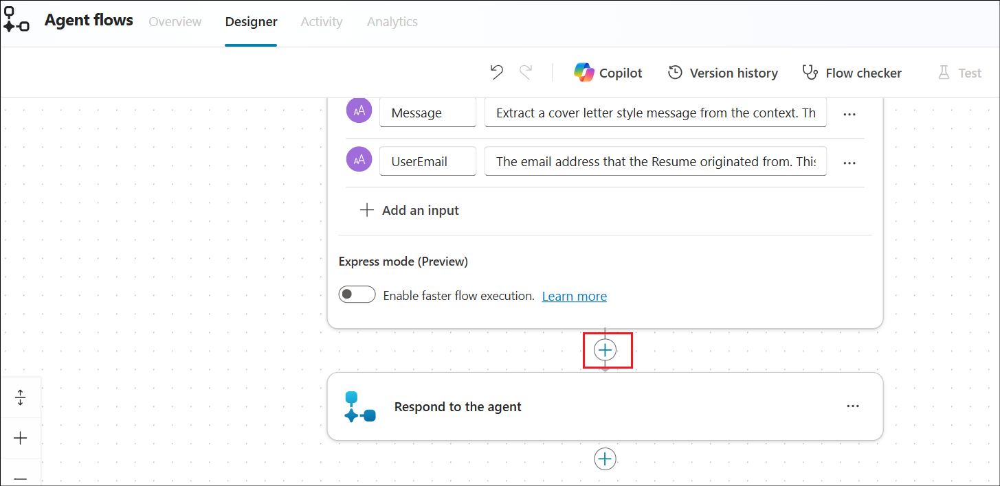
>
> 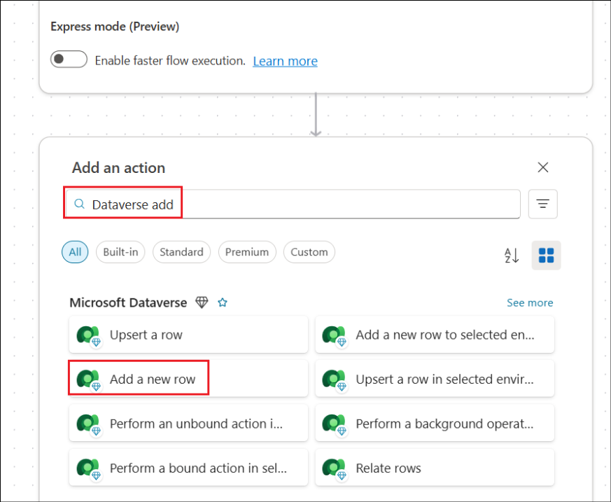

**OBSERVAÇÃO**

Você pode ser solicitado a criar uma nova conexão com o Dataverse após
adicionar a ação. Informe qualquer nome para a conexão e clique em Add
para criá-la.

8.  Nomeie o nó como +++**Create Resume**+++, selecionando o menu de
    três pontos (…) e escolhendo **Rename**.  

> 

9.  Defina o **Table name** como **Resumes** e, em seguida, selecione
    **Show all** para exibir todos os parâmetros.

> 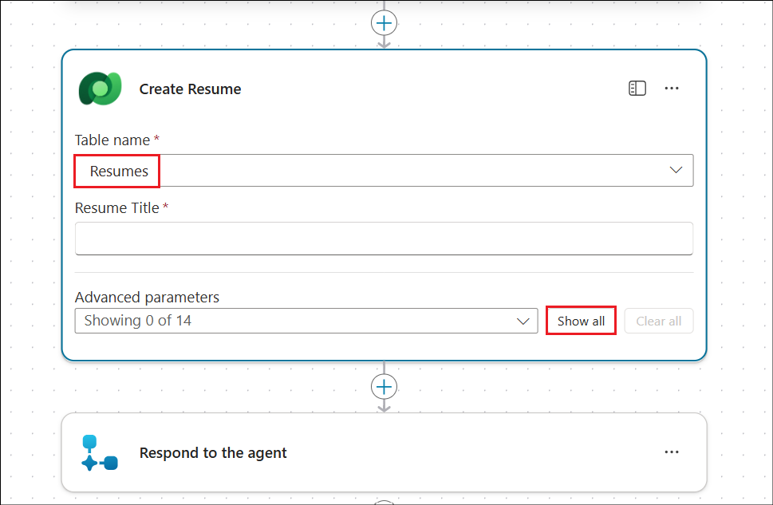

10. Defina as seguintes **propriedades**:

[TABLE]

> 
>
> 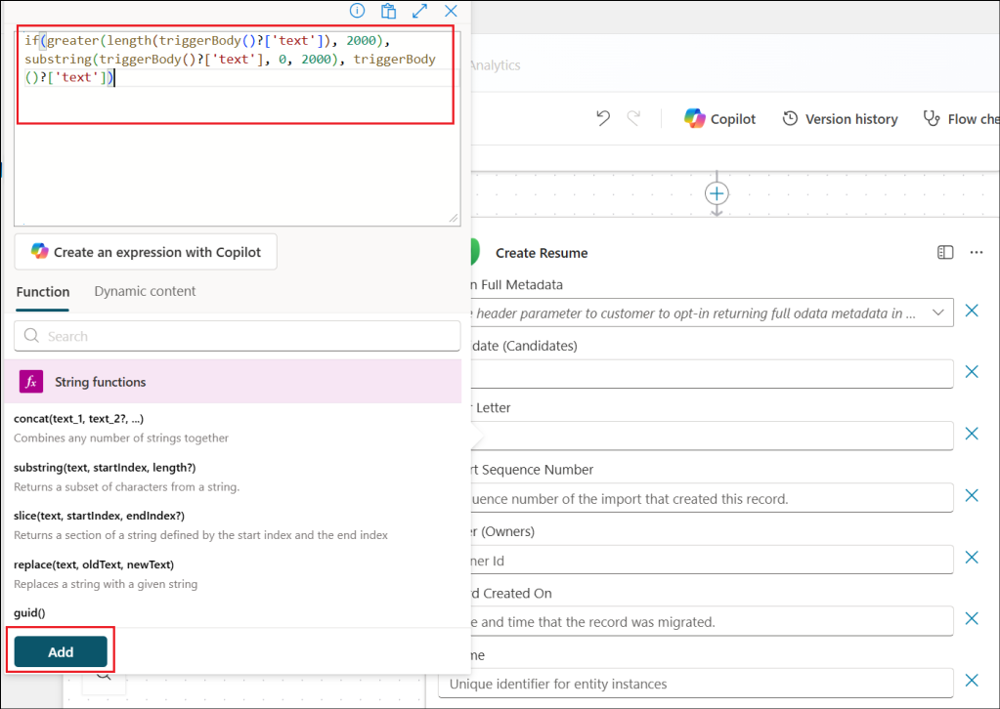
>
> 

11. Selecione o **ícone +** abaixo do nó Create Resume, pesquise por
    +++Dataverse upload+++ e selecione a ação **Upload a file or an
    image**.

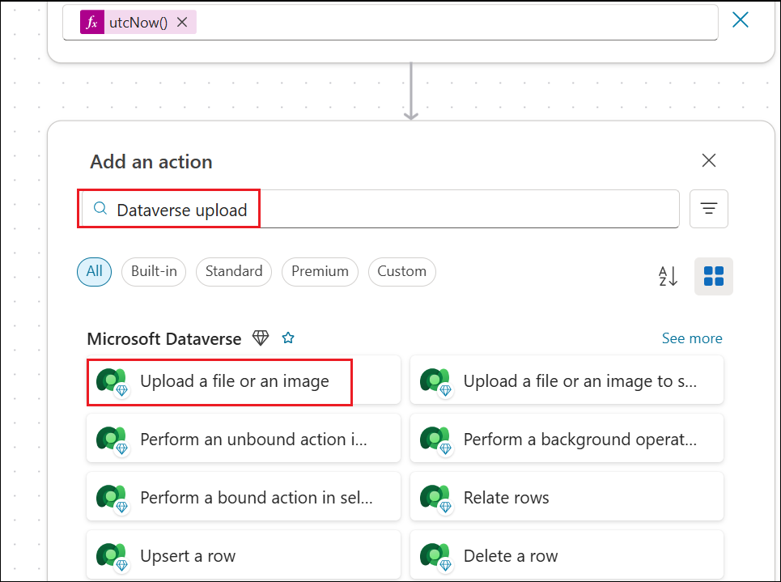

12. Nomeie o nó como **+++Upload Resume File+++**.

> 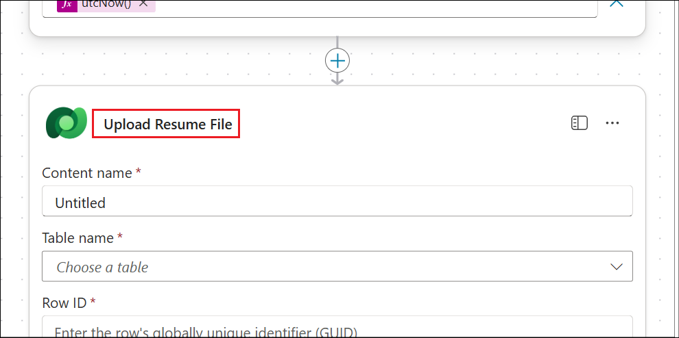

13. Defina as seguintes **propriedades**:

[TABLE]

> 

14. Selecione o nó **Respond to the agent** e, em seguida, selecione **+
    Add an output**. Crie uma saída com as propriedades definidas na
    tabela abaixo.

> 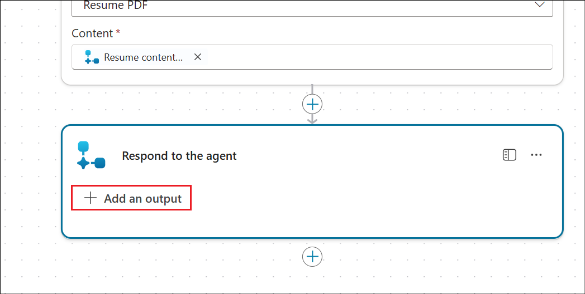

[TABLE]

> 

15. Selecione **Save draft** no canto superior direito.

> 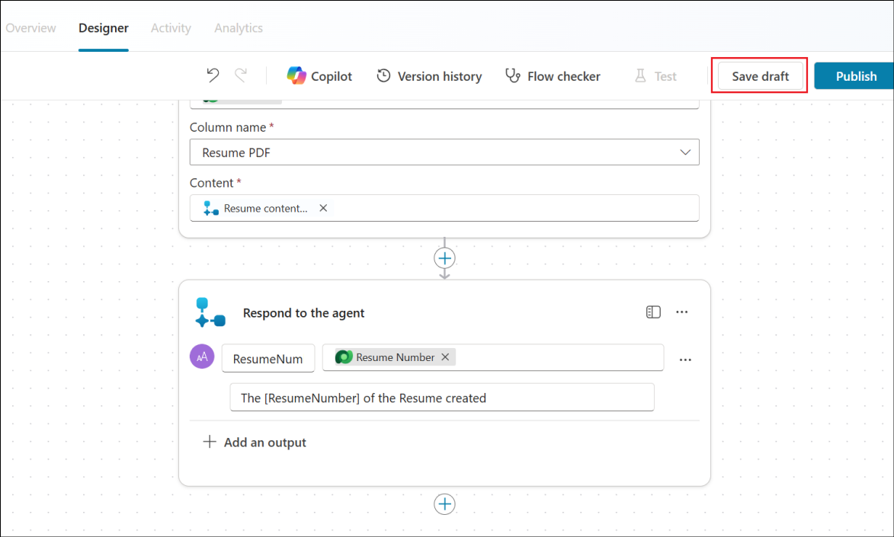

16. Selecione a guia **Overview**, selecione **Edit** no painel
    **Details**. Preencha o nome e a descrição conforme mostrado abaixo
    e selecione **Save**.

    1.  **Flow name**:+++Resume Upload+++

    2.  **Description**:+++Uploads a Resume when instructed+++

> 

17. Selecione novamente a guia **Designer** e selecione **Publish**.

> 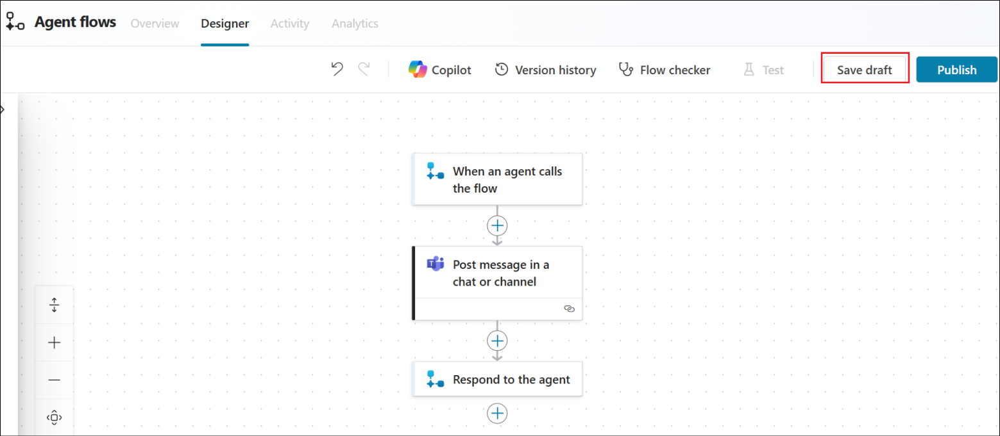

### Tarefa 5 – Conectar o fluxo ao seu agente

Agora você conectará o fluxo publicado ao seu Application Intake Agent.

1.  Volte para o **Hiring Agent** e selecione a guia **Agents**. Abra o
    **Application Intake Agent**, localize o painel **Tools** e
    selecione **+ Add**.  
    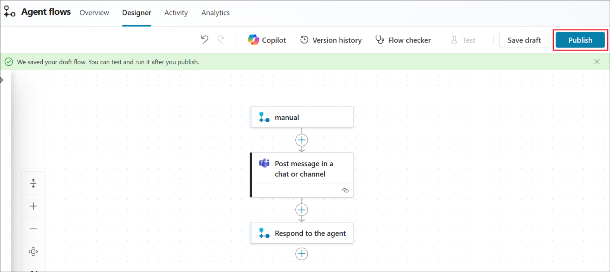

2.  Selecione o filtro **Flow** e escolha o **Resume Upload flow**.

> 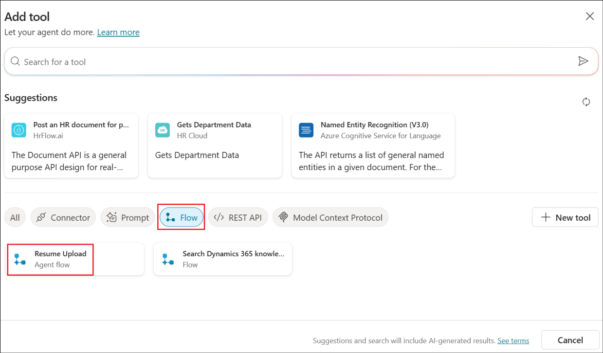

3.  Selecione **Add and configure**.

> 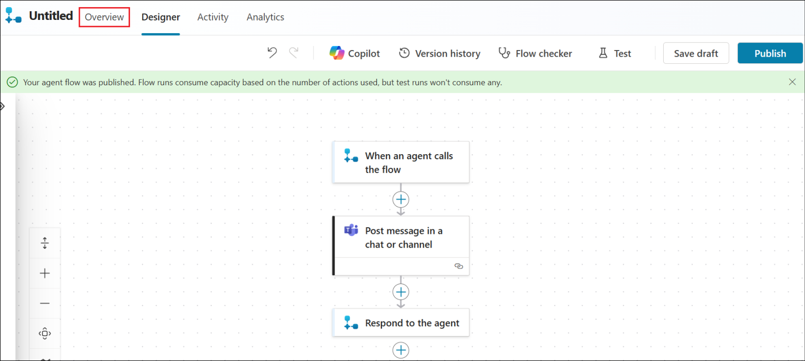

4.  Defina os seguintes parâmetros para a **Description** e para **When
    the tool should be used**.

[TABLE]

> 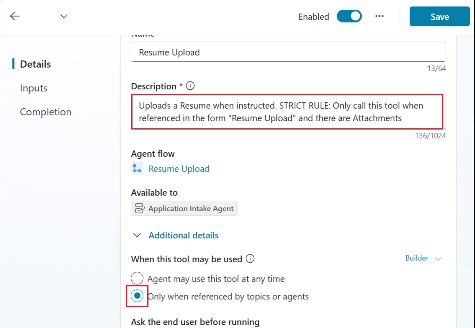
>
> **Observação:** esta descrição informa ao agente quando ele deve
> chamar essa ferramenta. Observe o uso da expressão “strict rule” na
> descrição. Isso fornece uma forma de aplicar restrições adicionais
> sobre quando a ferramenta deve ser utilizada — neste caso, somente se
> houver anexos e se o contexto da conversa for um upload de currículo.
>
> Definir quando essa ferramenta pode ser usada também é importante.
> Como estamos construindo um sistema multiagente e temos um agente
> subordinado, precisamos garantir que essa ferramenta seja chamada
> APENAS no agente subordinado, e não no agente principal. Definir o
> valor como “only when referenced by topics or agents” garante esse
> comportamento.

5.  Role a página até a seção Inputs e selecione **Add Input** para
    adicionar as seguintes entradas:

[TABLE]

> 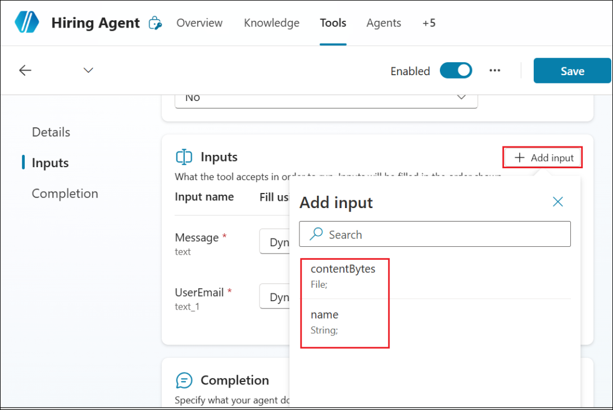

6.  Agora precisamos definir as propriedades das entradas. Começaremos
    com a entrada **contentBytes**, que armazenará o arquivo de
    currículo propriamente dito. Selecione **Custom value** na lista
    suspensa **Fill using** ao lado da entrada **contentBytes**. Na
    propriedade **Value**, selecione os **três pontos (…).**

> 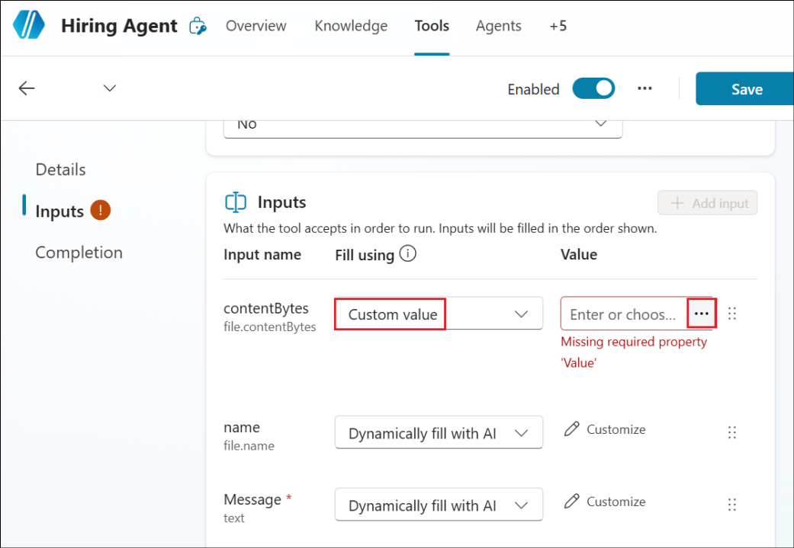

7.  Selecione a guia **Formula**. Cole a seguinte fórmula, que extrai o
    arquivo a partir do chat, e clique no botão **Insert**.

+++First(System.Activity.Attachments).Content+++

> 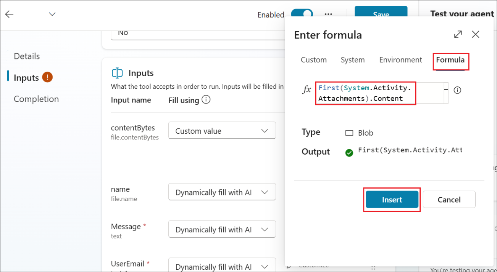

8.  Agora vamos configurar a entrada **name**, que armazenará o nome do
    arquivo de currículo. Esse valor também será definido de forma fixa,
    portanto selecione a opção **Custom value** na coluna **Fill
    using**.

9.  Selecione os **três pontos (…)** na coluna **Value**, cole a
    seguinte fórmula, que extrai o nome do arquivo a partir do chat, e
    clique no botão **Insert**.

+++First(System.Activity.Attachments).Name+++

> 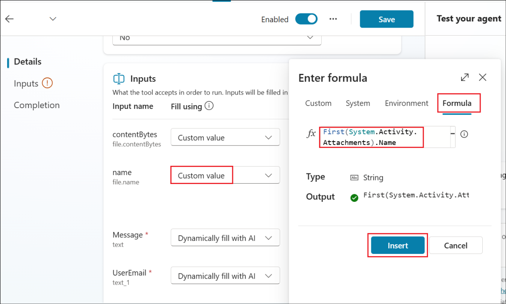

10. Agora vamos configurar a entrada **Message**. Queremos preencher
    essa entrada dinamicamente com AI, portanto deixaremos a opção Fill
    using como está. Selecione o botão **Customize** na coluna **Value**
    para que possamos preencher detalhes adicionais sobre como esse
    campo deve ser preenchido.

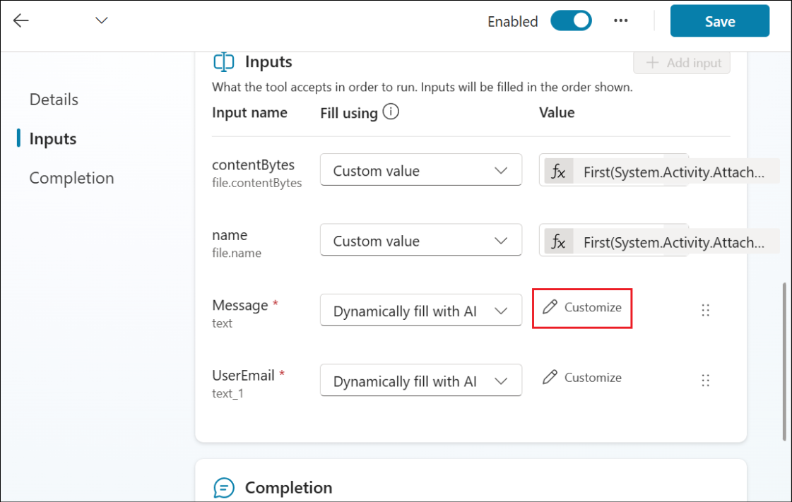

11. Insira o seguinte no campo **Description** da entrada. Em seguida,
    selecione **Advanced**.

**Extract a cover letter style message from the context. Be sure to
never prompt the user and create at least a minimal cover letter from
the available context. STRICT RULE - the message must be less than 2000
characters.**

**OBSERVAÇÃO**

Preencher a descrição das entradas preenchidas dinamicamente é uma etapa
fundamental para garantir que o agente saiba como preencher corretamente
cada entrada.

> 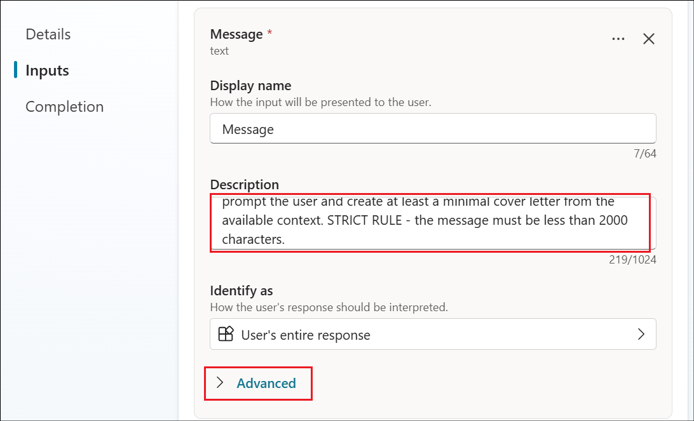

12. Expanda a seção **Advanced** para configurar algumas propriedades
    adicionais dessa entrada. Na seção **How many reprompts**, selecione
    **Don’t repeat**.

> 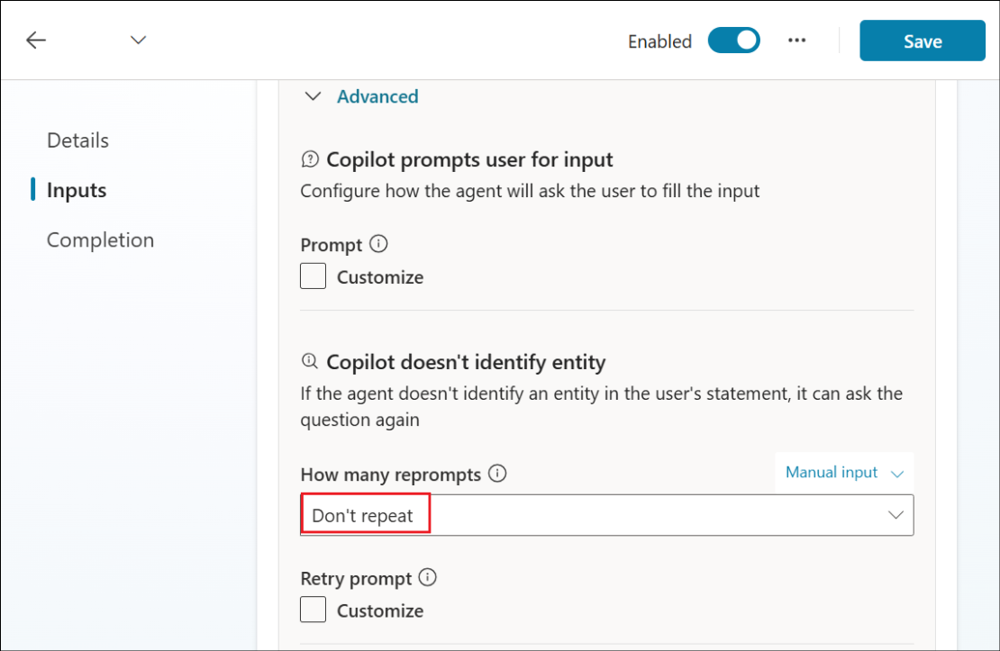

**OBSERVAÇÃO**

Essa configuração ajuda a personalizar a experiência do usuário para que
o agente não faça a mesma pergunta várias vezes caso não consiga
identificar os dados de que precisa.

13. Role a página até a seção **No valid entity found**. Na lista
    suspensa **Action if no entity found**, selecione **Set variable to
    value**. No campo **Default entity value**, digite +++Resume
    upload+++.

> 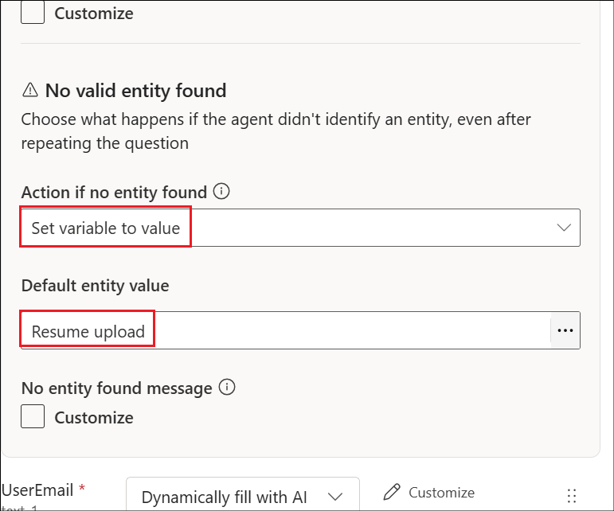
>
> **OBSERVAÇÃO**
>
> Essa configuração nos permite definir um valor de contingência fixo
> caso o agente não consiga preencher dinamicamente essa entrada
> Message.

14. Vamos preencher a entrada **UserEmail** selecionando a opção
    **Custom value** na coluna **Fill using** e, em seguida,
    selecionando os **três pontos** (**…**) na coluna **Value**.

> 

15. Selecione a guia **System** e pesquise por **User**. Selecione a
    variável **User.Email** para obter o endereço de e-mail da pessoa
    que está utilizando o agente.

> 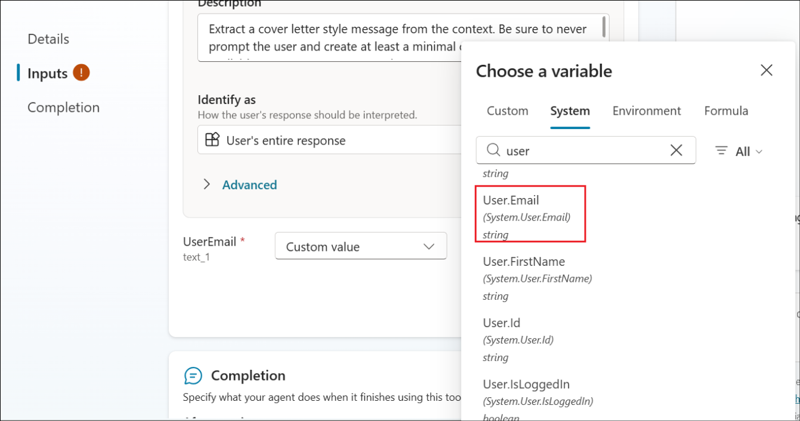

16. Selecione **Save**

> 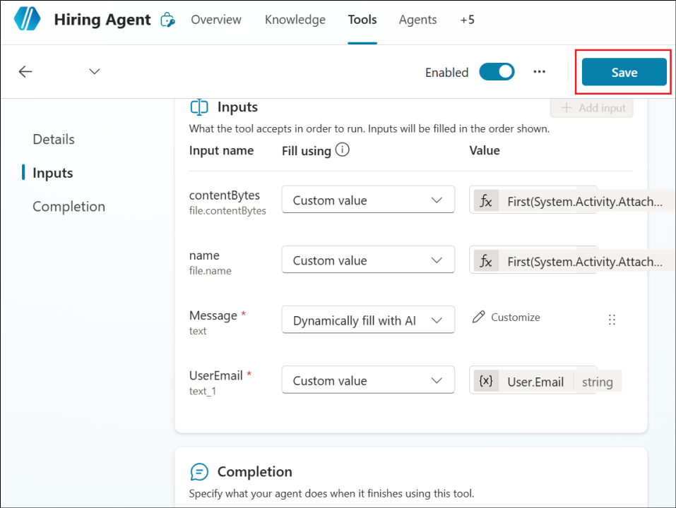

### Tarefa 6 – Definir as instruções do agente

Nesta tarefa, você definirá as instruções do agente para o Application
Intake Agent.

1.  Volte para o **Application Intake Agent** selecionando a guia
    **Agents** e, em seguida, selecionando o **Application Intake
    Agent**.

> 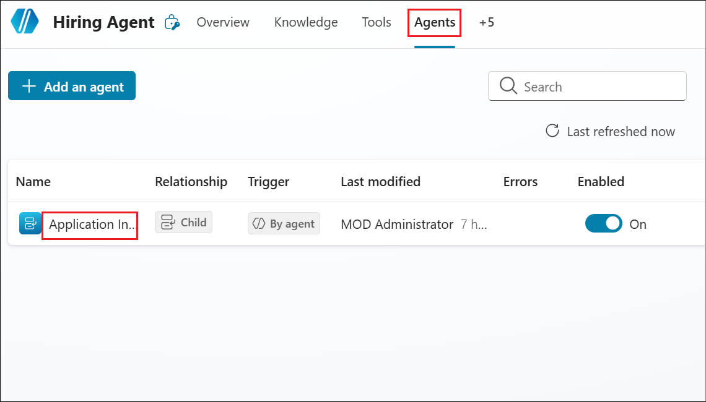

2.  No campo **Instructions**, cole as seguintes orientações claras para
    o seu agente subordinado.

> You are tasked with managing incoming Resumes, Candidate information,
> and creating Job Applications.
>
> Only use tools if the step exactly matches the defined process.
> Otherwise, indicate you cannot help.
>
> Process for Resume Upload via Chat
>
> 1. Upload Resume
>
> - Trigger only if /System.Activity.Attachments contains exactly one
> new resume.
>
> - If more than one file, instruct the user to upload one at a time and
> stop.
>
> - Call /Upload Resume once. Never upload more than once for the same
> message.
>
> 2. Post-Upload
>
> - Always output the \[ResumeNumber\] (R#####).
>
> 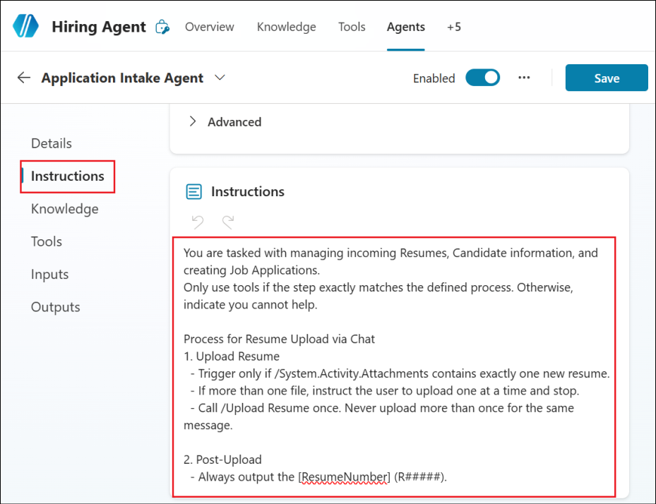

3.  Quando as instruções incluírem uma barra (/), selecione o texto após
    a barra e selecione o nome definido. Faça isso para,

    - System.Activity.Attachments (Variável)

    - Upload Resume (Ferramenta)

> Observação: se você clicar em System.Acticvity.Attachements nas
> instruções, verá o nome definido listado. Você pode selecioná-lo. Após
> selecionar, se houver alguma parte do texto existente anteriormente
> disponível, exclua-a.
>
> 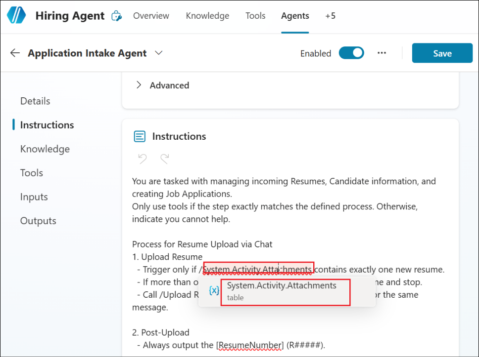
>
> 

4.  As instruções devem ficar assim agora.

> 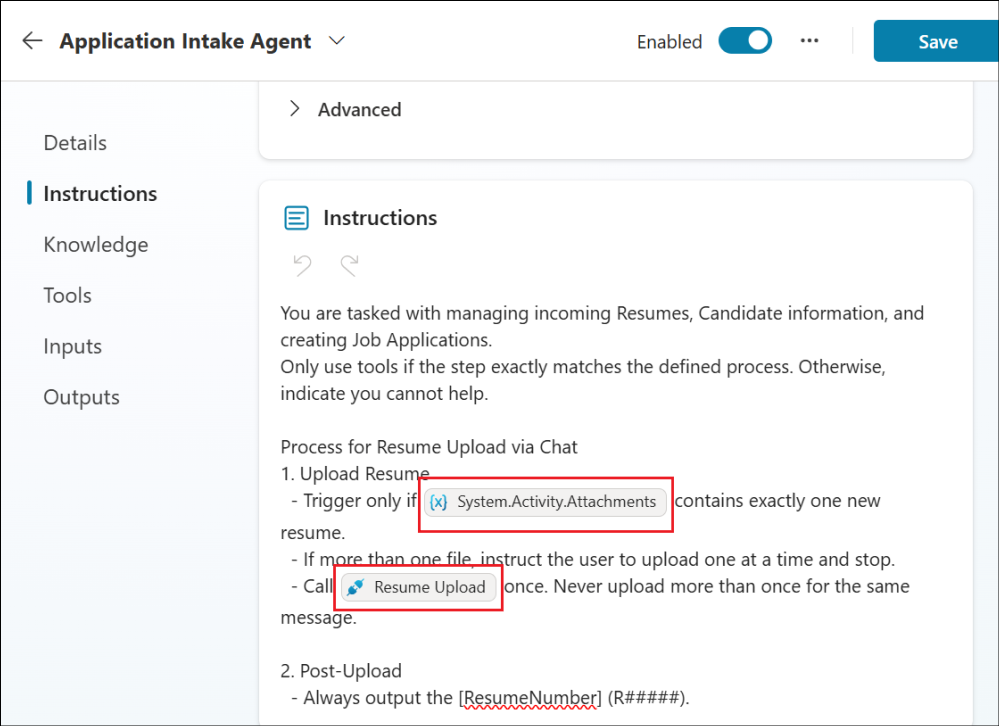

5.  Selecione **Save.**

> 

### Tarefa 7 – Testar o Agente de Intake de Candidaturas

Agora vamos verificar se nosso agente está funcionando corretamente,
chamando o agente subordinado e seguindo as instruções definidas.

1.  **Abra** o painel Test selecionando **Test.**

> 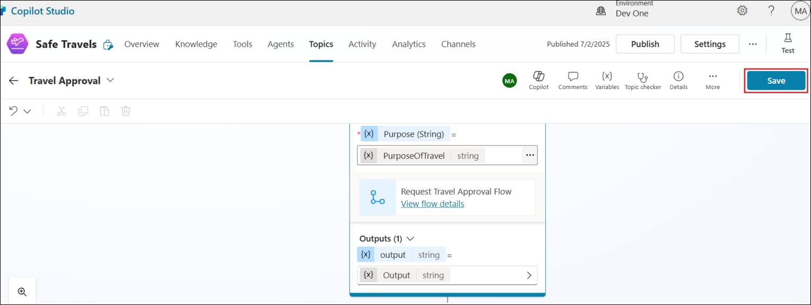

2.  Selecione o ícone Anexo, selecione o currículo – AVERY EXAMPLE pdf e
    clique em **Open**.

> 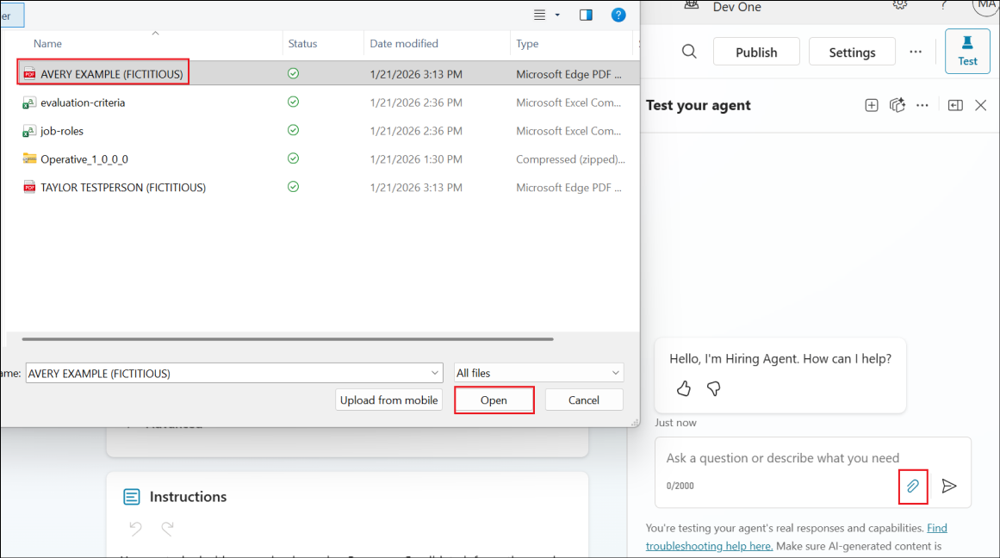

3.  Digite a mensagem +++Process these resumes+++ e pressione **Send**.

> 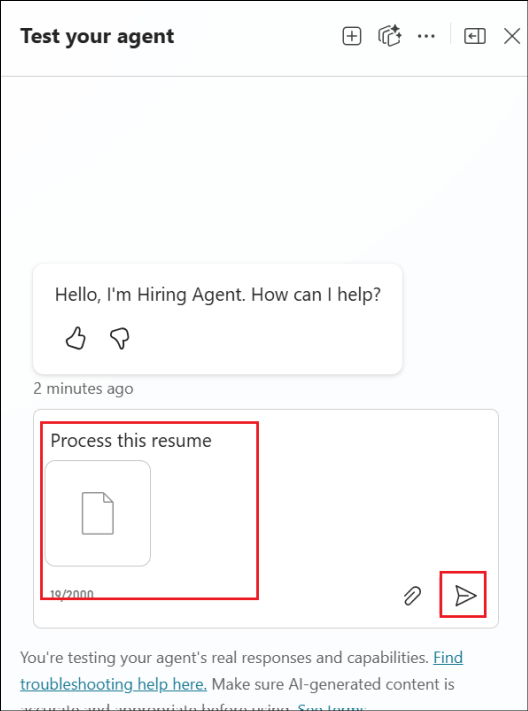

4.  O agente deverá então exibir uma mensagem semelhante a: **The resume
    for Avery Example has been successfully uploaded. The resume number
    is R1001.**

> 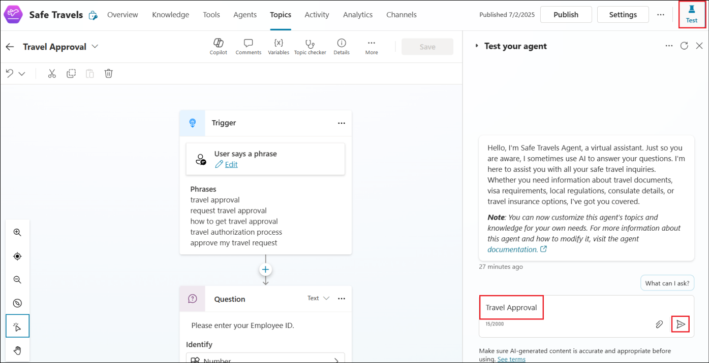

5.  No **Activity map**, você deverá ver o **Application Intake Agent**
    realizando o upload do currículo.

> 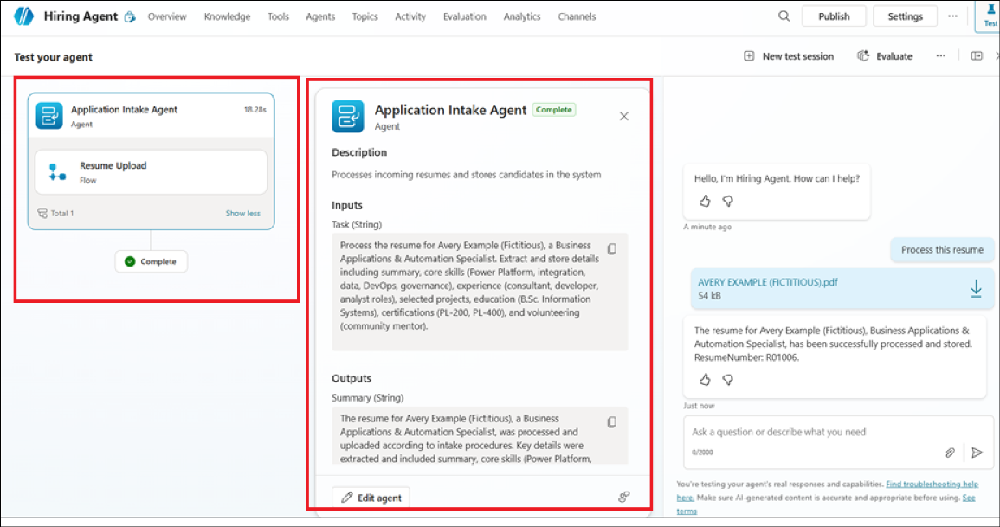

6.  Caso o aplicativo ainda não esteja aberto, navegue até
    +++make.powerapps.com+++. Certifique-se de que o ambiente Dev One
    esteja selecionado no Environment Picker no canto superior direito.
    Selecione **Apps** → Hiring Hub → menu de reticências (**…**) →
    **Play**.  
    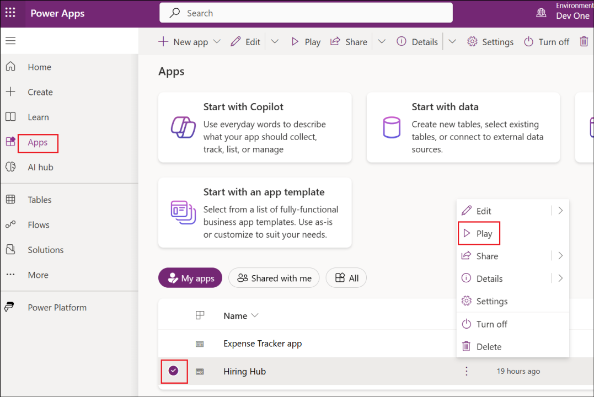

**OBSERVAÇÃO:** se o botão Play estiver desativado (acinzentado), isso
significa que você ainda não publicou sua solução. Selecione **Solutions
→ Publish all customizations**.

7.  No aplicativo Power Apps – Hiring Hub, navegue até **Resumes** e
    verifique se o arquivo de currículo foi carregado e se a carta de
    apresentação foi definida corretamente.

> 

## Exercício 2 – Adicionando o agente conectado de Preparação para Entrevistas

Agora vamos criar nosso agente conectado para preparação de entrevistas
e adicioná-lo ao seu Hiring Agent existente.

### Tarefa 1: Criar o Agente de Entrevista conectado

1.  No Copilot Studio, selecione a guia **Agents** na navegação à
    esquerda e, em seguida, selecione o **menu suspenso** ao lado de **+
    Create blank agent** e escolha **Advanced create**.

> 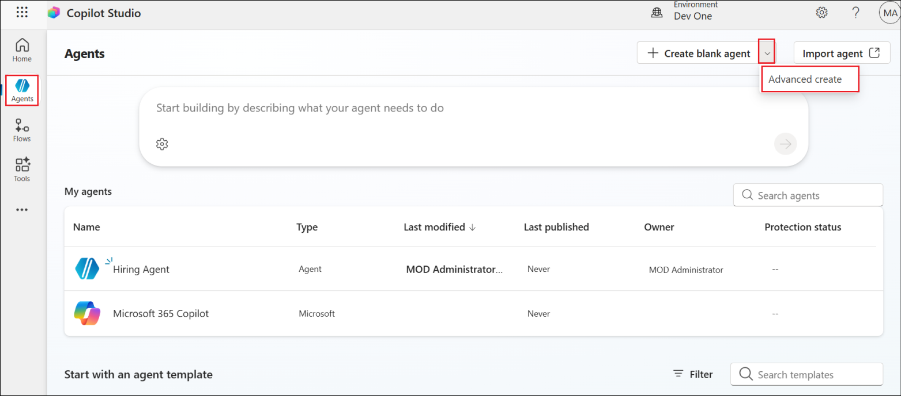

2.  Selecione a **Solution** como **Operative** e, em seguida, selecione
    **Confirm and create**.

> 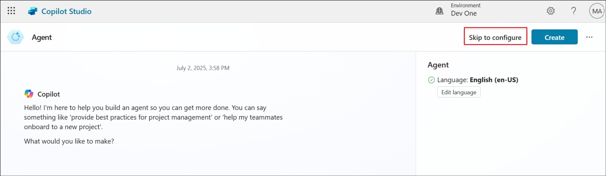

3.  Selecione **Edit** na seção Details.

> 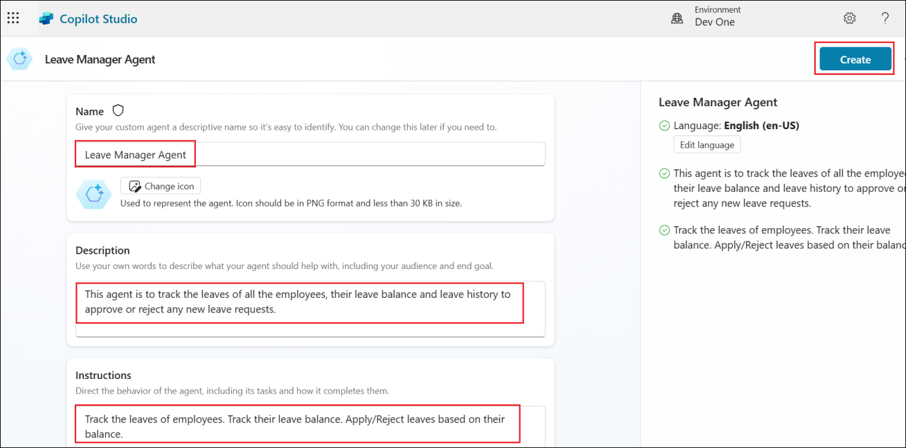

4.  Forneça os detalhes abaixo e selecione **Save**.

    - **Name**: +++Interview Agent+++

    - **Description**: +++Assists with the interview process.+++

> 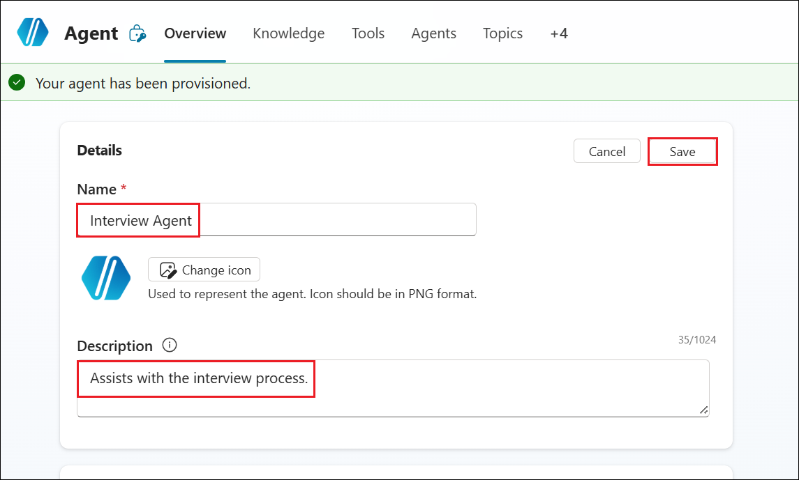

5.  Selecione **Edit** na seção **Instructions**, insira a instrução
    abaixo e selecione **Save**.

> You are the Interview Agent. You help interviewers and hiring managers
> prepare for interviews. You never contact candidates.
>
> Use Knowledge to help with interview preparation.
>
> The only valid identifiers are:
>
> - ResumeNumber (ppa_resumenumber)→ format R#####
>
> - CandidateNumber (ppa_candidatenumber)→ format C#####
>
> - ApplicationNumber (ppa_applicationnumber)→ format A#####
>
> - JobRoleNumber (ppa_jobrolenumber)→ format J#####
>
> Examples you handle
>
> - Give me a summary of ...
>
> - Help me prepare to interview candidates for the Power Platform
> Developer role
>
> - Create interview assistance for the candidates for Power Platform
> Developer
>
> - Give targeted questions for Candidate Alex Johnson focusing on the
> criteria for the Job Application
>
> How to work:
>
> You are expected to ask clarification questions if required
> information for queries is not provided
>
> - If asked for interview help without providing a job role, ask for it
>
> - If asking for interview questions, ask for the candidate and job
> role if not provided.
>
> General behavior
>
> - Do not invent or guess facts
>
> - Be concise, professional, and evidence-based
>
> - Map strengths and risks to the highest-weight criteria
>
> - If data is missing (e.g., no resume), state what is missing and ask
> for clarification
>
> - Never address or message a candidate
>
> 

6.  Certifique-se de que o **Web Search** esteja definido como
    **Disabled.**

> 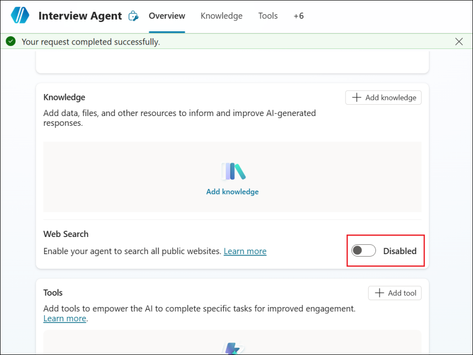

### Tarefa 2 – Configurar o acesso aos dados e publicar

Nesta tarefa, você configurará o acesso aos dados e, em seguida,
publicará o agente.

1.  Na seção **Knowledge**, selecione **+ Add knowledge.**

> 

2.  Selecione **Dataverse**  
    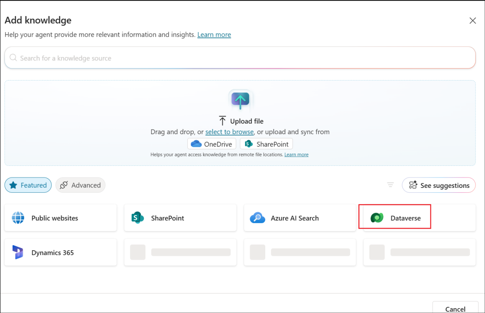

3.  Na **caixa de** **Search**, digite +++ppa\_+++. Esse é o prefixo das
    tabelas que você importou anteriormente em um laboratório anterior.

4.  **Selecione** todas as 5 tabelas (Candidate, Evaluation Criteria,
    Job Application, Job Role, Resume) e selecione **Add to agent**.

> 

5.  Selecione o botão **Settings** no canto superior direito.

> 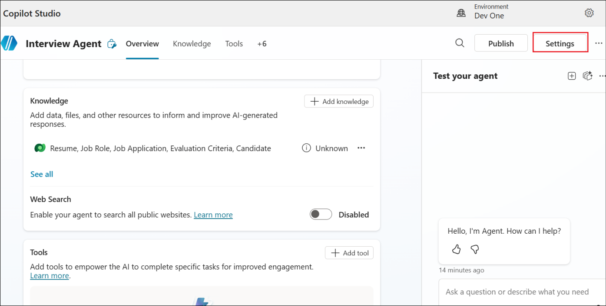

6.  Certifique-se de que as seguintes configurações estejam definidas.

    - **Let other agents connect to and use this one:** On

    - **Use general knowledge**: Off

    - **File uploads**: Off

    - **Content moderation level:** Medium

> 
>
> 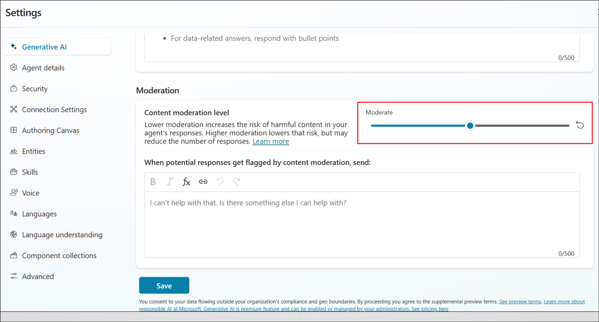
>
> 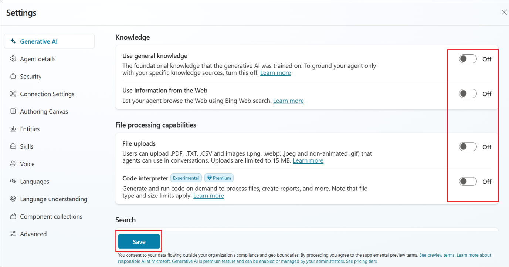

7.  Selecione **Save** e, em seguida, selecione o **X** no canto
    superior direito para fechar o menu de configurações.

> 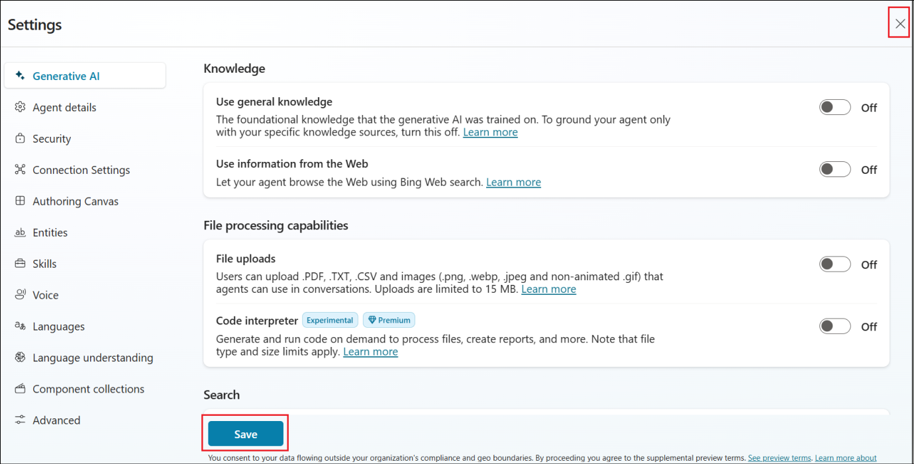

8.  Selecione **Publish**.

> 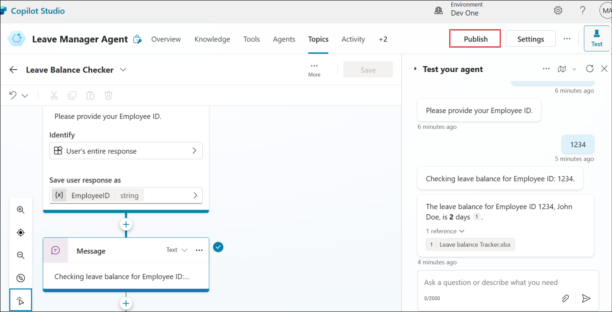

9.  Selecione **Publish** na caixa de diálogo de confirmação e aguarde a
    conclusão da publicação.

### Tarefa 3 – Conectar o Agente de Preparação para Entrevistas ao Hiring Agent

Nesta tarefa, você conectará o Agente de Preparação para Entrevistas ao
seu Hiring Agent para alcançar a orquestração multiagente.

1.  Volte para o seu **Hiring Agent**. Selecione a guia **Agents** e
    selecione **+ Add an agent**.

> 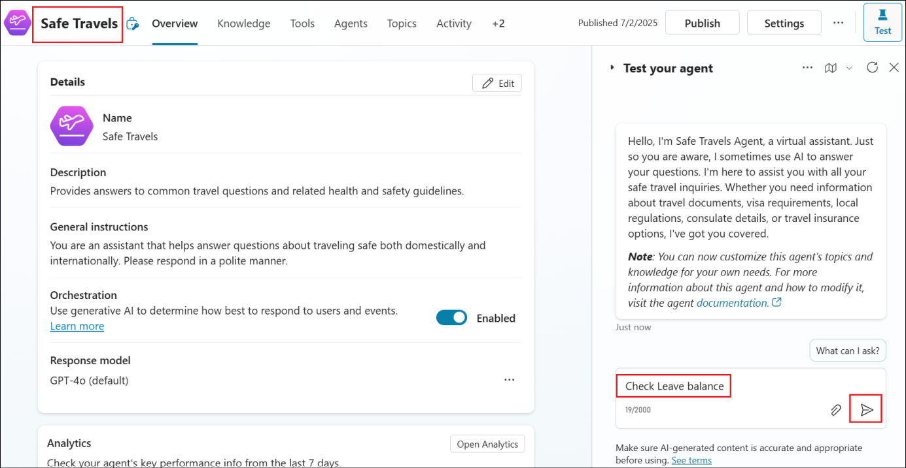

2.  Selecione o **Interview Agent**.

> 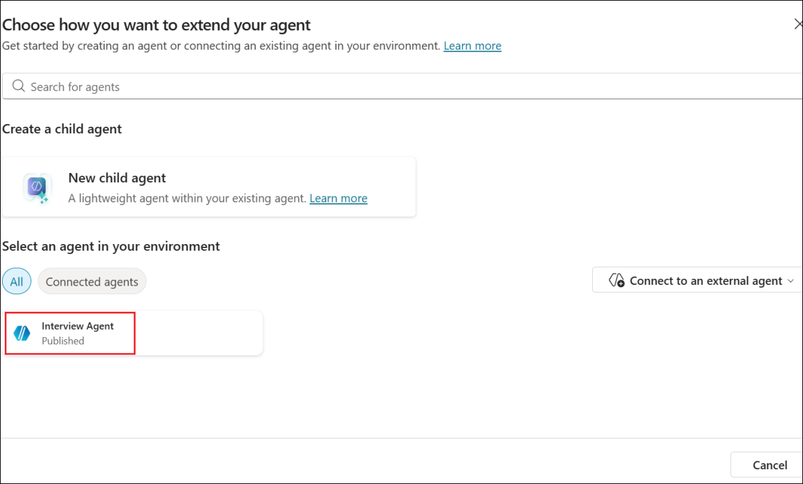
>
> **OBSERVAÇÃO**
>
> Se o Interview Agent estiver desativado (acinzentado) e não puder ser
> selecionado, isso significa que ele não foi publicado. Volte para o
> Interview Agent e publique-o primeiro.

3.  Defina a **Description** como:

> Assists with the interview process and provides information about
> Resumes, Candidates, Job Roles, and Evaluation Criteria.
>
> Observe que a opção Pass conversation history to this agent está
> marcada. Isso permite que o agente principal forneça todo o contexto
> da conversa ao agente conectado.
>
> Selecione **Add and configure.**

4.  Certifique-se de que você veja tanto o **Application Intake Agent**
    quanto o **Interview Agent**. Observe como um deles é um agente
    subordinado e o outro é um agente conectado.

> 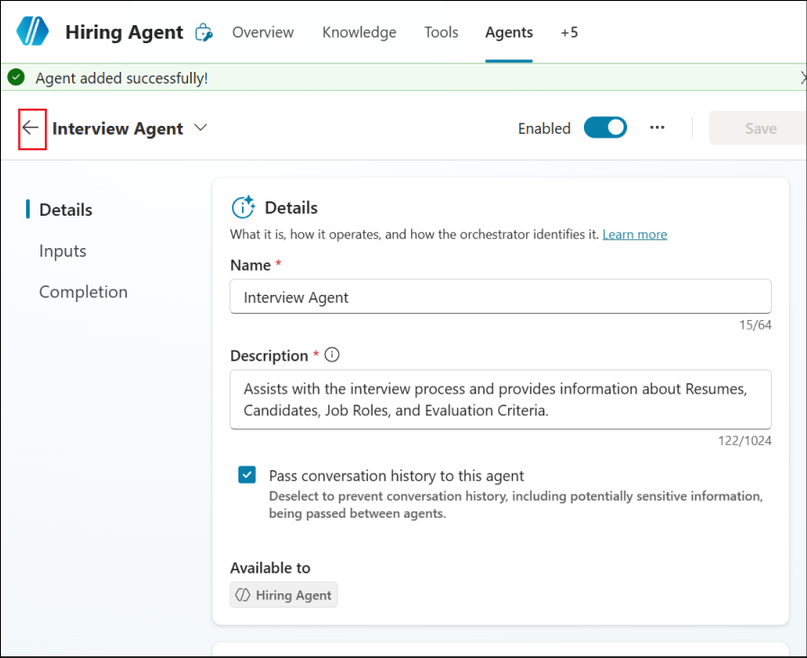
>
> 

### Tarefa 4 – Testar a colaboração multiagente

1.  **Abra** o painel Test selecionando **Test**.

2.  Faça o **upload** de um dos currículos de teste e insira a seguinte
    descrição, que informa ao agente principal o que ele pode delegar ao
    agente conectado:

> Upload this resume, then show me open job roles, each with a
> description of the evaluation criteria, then use this to match the
> resume to at least one suitable job role even if not a perfect match.
>
> 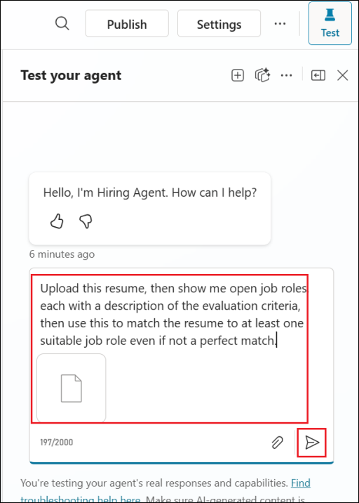

3.  Observe como o Hiring Agent delegou o upload ao agente subordinado
    e, em seguida, solicitou ao Interview Agent que fornecesse um resumo
    e o alinhamento com a função, utilizando seu conhecimento.

> 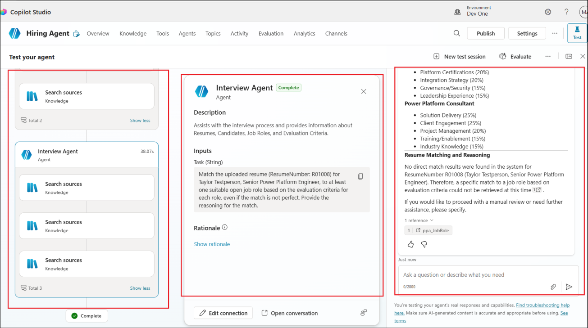

4.  Experimente diferentes maneiras de fazer perguntas sobre currículos,
    vagas de emprego e critérios de avaliação. **Exemplos:**

> +++Give me a summary of active resumes+++
>
> +++Summarize resume R1006+++
>
> +++Which active resumes are suitable for the Power Platform Developer
> role?+++

## Resumo

Você transformou com sucesso seu Hiring Agent único em um sistema
multiagente orquestrado e sofisticado, com capacidades especializadas.

Veja o que você realizou neste laboratório:

**Domínio da arquitetura multiagente**  
Agora você entende quando usar agentes subordinados versus agentes
conectados e como projetar sistemas escaláveis.

**Agente subordinado de Intake de Candidaturas**  
Você adicionou um agente subordinado especializado ao seu Hiring Agent
que processa currículos, extrai dados dos candidatos e armazena
informações no Dataverse.

**Agente conectado de Preparação para Entrevistas**  
Você criou um agente conectado reutilizável para preparação de
entrevistas e o conectou com sucesso ao seu Hiring Agent.

**Comunicação entre agentes**  
Você viu como o agente principal pode coordenar agentes especialistas,
compartilhar contexto e orquestrar fluxos de trabalho complexos.

**Base para autonomia**  
Seu sistema de contratação aprimorado agora está pronto para os recursos
avançados que serão adicionados nas próximas missões: acionadores
autônomos, moderação de conteúdo e raciocínio avançado.
