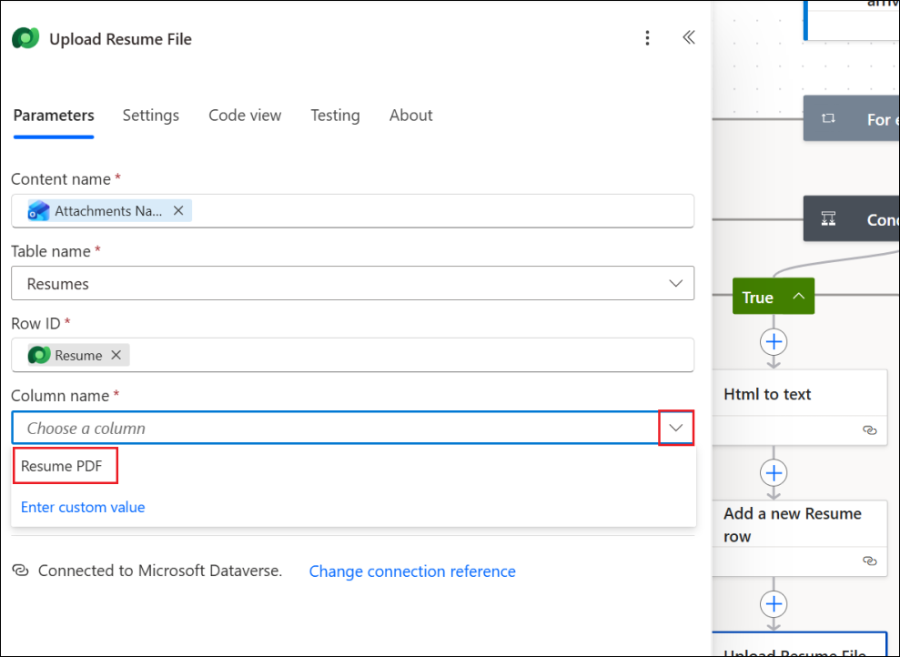
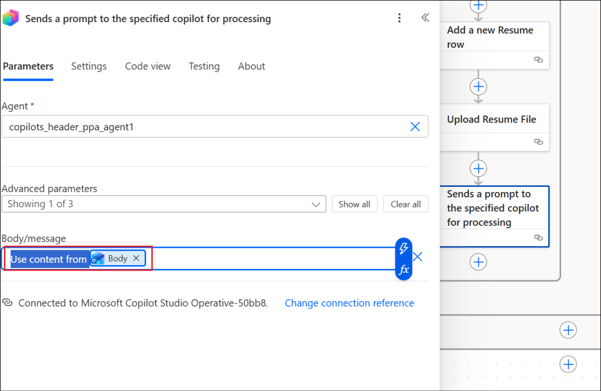

# 实验 06 - 在利用 Azure AI 搜索的 Copilot Studio 中创建 HR 知识助手代理

## 目的

一家大型企业希望减少员工在 SharePoint、PDF、内部 Wiki 和文档中搜索 HR
相关信息（政策、福利、休假指南等）所花费的时间。

为了克服这个问题，在本实验中，您将在 **Copilot Studio** 中构建一个
**Knowledge assistant agent**，该代理使用 **Azure AI Search** 在企业 HR
文档中进行索引和语义搜索。

## 练习 1：创建 Azure AI 搜索资源

1.  在 Azure 门户的主页中，选择 **Azure AI Foundry。**

2.  在 **AI Foundry** 页面中，从左侧窗格中选择 **AI Search**，然后选择
    **+ Create**。

3.  输入以下详细信息，然后选择 **Review + create**。

- Subscription – 选择您的 **assigned subscription**

- Resource group – 选择您的 **assigned Resource group**
  (**ResourceGroup1**)

- 存储帐户名称 – +++**searchleaves**+++

- 位置 – 选择您的 **assigned region**

4.  验证通过后，选择 **Create** 。

5.  部署需要几分钟时间。创建 搜索服务后，选择 **Go to resource**。

6.  在 **Overview** 页面中，复制 Url
    值并将其保存在记事本中，以便在将来的练习中使用。

7.  选择 **Keys** 下 **Settings** 从左侧窗格中。复制 **Primary admin
    key** 并将其保存在记事本中，以便在即将到来的练习中使用。

8.  在 左侧窗格中的 **Settings** 下选择 **Identity**。

9.  将 状态 切换为 **On** 在 系 **System assigned** 下，然后单击
    **Save**。

10. 在“**Enable system assigned managed
    identity**”对话框中选择“**Yes**”。

## 练习 2：创建存储帐户

1.  通过 +++https://portal.azure.com/+++ 登录到 Azure
    门户，并使用您的凭据登录。从主屏幕中选择 Storage accounts。

2.  选择“**+ Create**”以创建新的存储帐户。

3.  输入以下详细信息，接受其他字段中的默认值，然后单击 **Review +
    create**。

- Subscription – 选择您的 **assigned subscription**

- Resource group – 选择您的 **assigned Resource group**
  (**ResourceGroup1**)

- Region – 选择您的 **assigned region**

- 存储帐户名称 – +++**leavepolicystorage**+++

- 主要服务 – 选择 **Azure Blob Storage or Azure Data Lake Storage Gen
  2**

> 

4.  验证通过后，单击 **Create**。

5.  资源创建成功后，单击 **Go to resource**。

6.  在 **Data storage** 下选择 **Containers**。选择 **+
    Container**，输入名称 +++**document**+++，然后单击 **Create**
    创建容器。

7.  选择创建的容器 **document** ，将休假策略文档上传到其中。

8.  单击 **Upload**，然后选择 **Browse for files**。

9.  从 **C：\Labfiles** 中选择 **LeavePolicy.docx**，然后单击
    **Upload**。

10. 导航到 **leavepolicystorage** 存储帐户（从 Azure 门户的 **Home
    page** 中选择 **Storageaccounts**，然后选择
    leavepolicystorage），**Access Control (IAM)**。选择 **Add -\> Add
    role assignment**。

11. 搜索 **+++Storage Blob Data Reader+++**，选择它，然后单击“
    **Next**”。

12. 点击 **+Select members**，搜索并选择您的 **user id**，选择列出的
    **user id**，然后单击 **Select**。这会将“存储 Blob
    数据读取者”角色添加到你的用户 ID 中。

13. 选择“**Managed identity**”，然后选择**+ Select
    members**”。在“**Managed identity**”下选择“**Search
    service**”，然后选择列出的 **searchleaves** 搜索服务。

14. 单击 **Select** 以选择搜索服务。

15. 返回 Add role assignment 屏幕，单击 **Review + assign**。

16. 在下一个屏幕中再次选择 **Review + assign**。

17. 添加角色后，请继续执行下一步。

在本练习中，我们创建了一个 Storage 帐户，并向其添加了文档和所需的 Role
权限。

## 练习 3：创建 Azure OpenAI 服务并部署模型 

1.  在 Azure 门户主页中，搜索选择“+++Azure OpenAI++”。

2.  选择 **+ Create**。

3.  输入以下详细信息，然后选择 **Next**。

- Subscription – 选择您的 **assigned subscription**

- Resource group – 选择您的 **assigned Resource group**
  (**ResourceGroup1**)

- Region – 选择您的 **assigned region**

- 名字 – +++**openaiservice52374668**+++

- 定价层 – Select **Standard**

4.  在接下来的 2 个屏幕中选择 **Next**，在 **Review + submit**
    屏幕中选择 **Create**。

5.  创建服务后**，**单击 **Go to resource**。

6.  从 左侧窗格中选择 **Access control （IAM），**然后选择 **Add -\> Add
    role assignment**。

7.  搜索 **+++Cognitive Services OpenAI User+++**，选择角色，然后单击
    **Next**。

8.  选择 **+ Select members**，搜索您的 **user id**，选择它，然后单击
    **Select**。

9.  返回 **Add role assignment** 屏幕，选择 **Managed
    identity**。然后选择 **+ Select members**。在 **Select managed
    identities** 屏幕中，选择 **Managed identity** 下的 **Search
    service**，然后选择 **seachleaves** 服务。

10. 选择后，单击 **Select**。

11. 在接下来的 2 个屏幕中选择 Review + assign。

12. 请等待有关 角色添加的 **success** 消息，然后再继续执行下一个任务。

13. 在 Azure OpenAI 服务资源的“**Overview**”页中，选择“**Go to Azure AI
    Foundry portal**”，在其中打开 Azure OpenAI 服务并部署模型。

14. 从 左侧窗格中选择 Deployments。

15. 选择 **+ Deploy model -\> From base models**。

16. 搜索 **+++text-embedding+++**，选择 **text-embedding-3-large**
    ，然后选择 **Confirm**。

17. 在 Deploy text-embedding-3-large 中选择 **Deploy**。

18. 模型将部署，并且屏幕将加载部署详细信息。

## 练习 4：创建向量索引

1.  转到 **searchleaves** AI Search 服务资源。选择 **Import and
    vectorize data**。

2.  选择 **Azure Blob Storage** 选项。

3.  在“**What scenarios are you targeting?**”屏幕中选择 **RAG** 选项。

4.  输入以下详细信息，接受其他值作为默认值，然后单击 **Next**。

- Subscription – 选择您的 **assigned subscription**

- 存储帐户 - 选择 **leavepolicystorage**

- Blob 容器 – 选择 **document**

5.  在 Vectorize your text 屏幕中，订阅和 Azure OpenAI
    资源详细信息已预先填充。输入以下详细信息，然后单击 **Next**。

- 模型部署 – 选择 **text-embedding-3-large**

- Authentication type – 选择 **System assigned identity**

- 选中复选框以确认 Azure OpenAI 的成本警报。

6.  在 **Vectorize and enrich your images** 屏幕中选择 下一步
    ，因为我们在这里不处理图像，然后在 **Advanced settings** 屏幕中选择
    **Next** 。

7.  在 **Review + create** 屏幕中选择 **Create** 。

8.  单击 成功对话框中的 **Close**。

## 练习 5：创建知识助手代理

1.  使用您的登录凭证登录 +++https://copilotstudio.microsoft.com+++。

2.  从 左侧窗格中选择 **Create**。

3.  选择 **+ New agent** 创建新代理。

4.  输入 +++ You are a Knowledge assistant agent for HR who will answer
    questions related to leaves and leave policies to the
    employees.+++，然后选择 **Send**。

> 

5.  Copilot 向代理建议一个名称。单击 **Create** 以创建代理。

6.  创建代理后，在 Test 窗格中输入 +++How many days I can avail PARITIES
    leaves？+++，然后单击 **Send。**

7.  它给出了一个通用的回答，如下面的屏幕截图所示。

## 练习 6：将 Azure AI 搜索添加为知识源

1.  从 代理的 **Overview** 页面中，选择 **Add knowledge**。

2.  从可用知识源列表中选择 Azure AI 搜索。

3.  单击下一个屏幕中 **Not connected**旁边的 **drop down**
    菜单，然后选择 **Create new connection**。

4.  输入 我们在上一个练习中保存到记事本的 **Endpoint url** 和 **Admin
    key** 值，然后单击 **Create** 以创建连接。

5.  建立连接后，将列出可用索引并已选中。单击 **Add**。

6.  AI Search 服务已作为知识源添加到代理，现在处于 **Ready** 状态。

7.  现在，让我们使用之前尝试的相同问题来测试代理。

8.  在 Test 窗格中，输入 +++How many days I can avail
    falls？+++，然后单击 **Send。**

9.  您可以看到，代理现在的响应来自在 AI Search 服务中上传的文档。

## 总结

在本实验中，我们学习了如何将代理连接到作为知识源的 Azure AI
搜索服务，并根据源测试代理。
