# Laboratório 6 – Evoluindo o Hiring Agent para um sistema autônomo

Neste laboratório, você se aprofundará nos **acionadores de evento**,
elevando seu sistema de agentes de um modelo reativo para uma **operação
autônoma**. Você transformará seus agentes de um estado em que aguardam
a entrada humana para um modelo que responde proativamente a eventos
externos e executa ações inteligentes sem supervisão.

Pense nisso como uma evolução de agentes que apenas respondem a
perguntas para agentes que antecipam necessidades e atuam de forma
independente. Por meio de acionadores de evento e fluxos de trabalho
automatizados, seu **Hiring Agent** **detectará** **e-mails** recebidos
com currículos, **processará** anexos **automaticamente, armazenará**
dados no **Dataverse** e **notificará** sua **equipe de recrutamento de
RH** por meio do Microsoft Teams — tudo isso enquanto você se concentra
em tarefas de maior valor.

**Objetivos**

Neste laboratório, você aprenderá:

1.  Como os acionadores de evento permitem o comportamento de agentes
    autônomos sem a interação do usuário

2.  As diferenças entre agentes interativos e agentes autônomos no
    Copilot Studio

3.  Como criar acionadores de evento que processam automaticamente
    anexos de e-mail e carregam arquivos no Dataverse

4.  Como criar fluxos de agente que publicam cartões adaptativos em
    canais do Teams para notificações

5.  Como passar dados entre acionadores de evento e fluxos de agente
    para automação de ponta a ponta

**O que é um acionador de evento?**

Os **acionadores de evento** permitem que um agente atue de forma
autônoma quando algo acontece em outro sistema — sem a necessidade de
uma mensagem do usuário. Quando o evento configurado é disparado — como
“novo item no SharePoint”, “novo e-mail”, “tarefa atribuída no Planner”
ou até mesmo uma recorrência baseada em tempo — um conector envia uma
carga de acionador para o agente. Em seguida, o agente segue suas
instruções para decidir quais ações ou tópicos devem ser acionados.

**Agente interativo x agente autônomo – comparação**

Agora que você já conhece a diferença entre acionadores de evento e
acionadores de tópico, vamos entender a diferença entre um agente
interativo e um agente autônomo.

Nos termos do Copilot Studio, “interativo” refere-se a agentes que atuam
principalmente por meio de **tópicos** em um chat ou canal. Já
“autônomo” refere-se a agentes que também utilizam **acionadores de
evento** para executar ações sem a necessidade de entrada do usuário.

## Exercício 1 – Automatizando e-mails de candidatura de candidatos

Em seguida, vamos adicionar um acionador de evento ao **Hiring Agent** e
criar um fluxo de agente no **Agente de Intake de Candidaturas**
subordinado para realizar o processamento adicional necessário para a
autonomia.

**Cenário de caso de uso**

**Como** recrutador(a) de RH

**Quero ser** notificado(a) quando um e-mail com um currículo chegar à
minha Inbox e for automaticamente carregado no Dataverse,

**Para que eu possa** acompanhar os currículos enviados por e-mail que
são automaticamente armazenados no Dataverse.

Alcançaremos isso utilizando duas técnicas.

1.  Acionador de evento para quando o e-mail chegar,

    - Verificar se o contentType do arquivo é igual a PDF como tipo de
      formato.

    - Extrair o arquivo e carregá-lo no Dataverse utilizando ações por
      meio do conector do Dataverse.

    - Em seguida, enviar um prompt ao agente para processamento
      adicional, passando parâmetros de entrada provenientes das ações
      do Dataverse.

2.  Um fluxo de agente será adicionado ao **Agente de Intake de
    Candidaturas** subordinado, que será invocado pelo prompt definido
    no acionador.

    - Use os parâmetros de entrada transmitidos a partir do prompt do
      acionador de evento em um cartão adaptável publicado em um canal
      no Microsoft Teams para notificar a equipe de recrutamento de RH.
      O cartão adaptativo terá um link para a linha do Dataverse, que
      pode ser visualizada no **Hiring Agent**.

### Tarefa 1 – Automatizar o carregamento de currículos recebidos por e-mail para o Dataverse

1.  No Hiring Agent, role a página para baixo na **guia** **Overview**
    até a seção **Triggers** e selecione **+ Add trigger**.

> 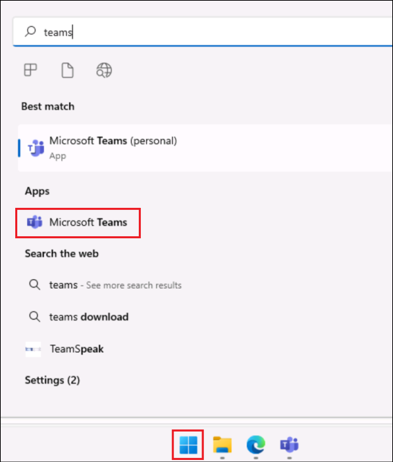

2.  Uma lista de acionadores será exibida. Selecione **When a new email
    arrives (V3)** e, em seguida, selecione **Next**.

> 

3.  Selecione **Continue** na próxima tela.

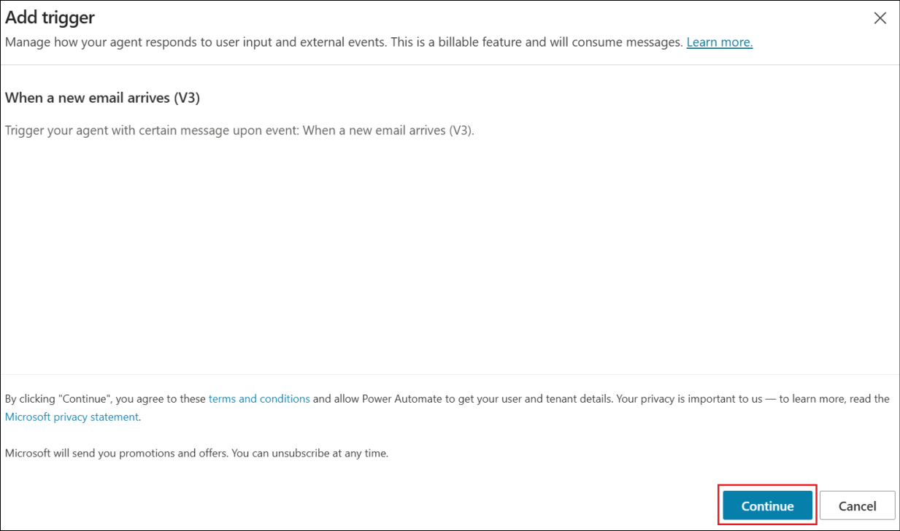

4.  Agora veremos o **Trigger name** e as **Sign in connection
    references** para os aplicativos listados. Renomeie o trigger name
    conforme indicado a seguir:

+++When a new email arrives from an applicant+++

> **OBSERVAÇÃO:** Certifique-se de que há uma marca verde ao lado de
> cada uma das referências de conexão dos aplicativos listados. Se não
> houver uma marca verde, faça login por meio do menu de reticências (…)
> e selecione **+ New connection reference** para criar uma nova
> referência de conexão.
>
> 

5.  A etapa final é definir as propriedades de entrada do acionador.
    Atualize as seguintes propriedades conforme indicado a seguir,

[TABLE]

6.  Selecione **Create trigger**.

> 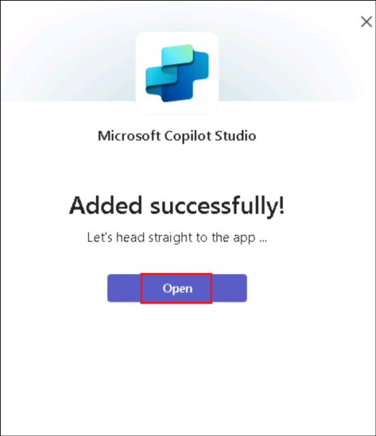

7.  Após a criação, será exibida uma mensagem de confirmação informando
    que o acionador foi adicionado ao agente. Selecione **Close**, e o
    acionador passará a ser listado na seção **Triggers**.

> 

8.  Agora vamos atualizar o acionador de evento para adicionar mais
    recursos de automação. Selecione o menu de **reticências** (**…**)
    ao lado do acionador e escolha **Edit in Power Automate**.

> 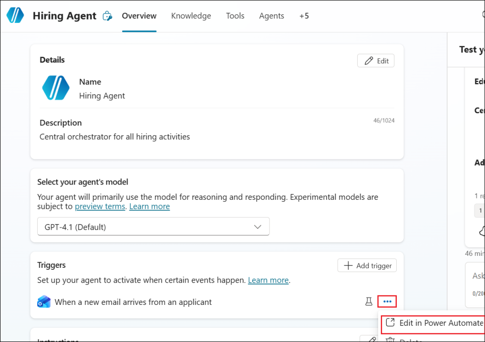

9.  O acionador será então carregado como um fluxo no portal do criador
    do Power Automate. Ele será aberto no designer de fluxos, onde
    podemos adicionar mais lógica e ações para maior automação. O
    acionador aparecerá na parte superior, seguido por **Sends a prompt
    to the specified copilot for processing** como a última ação no
    fluxo.

> 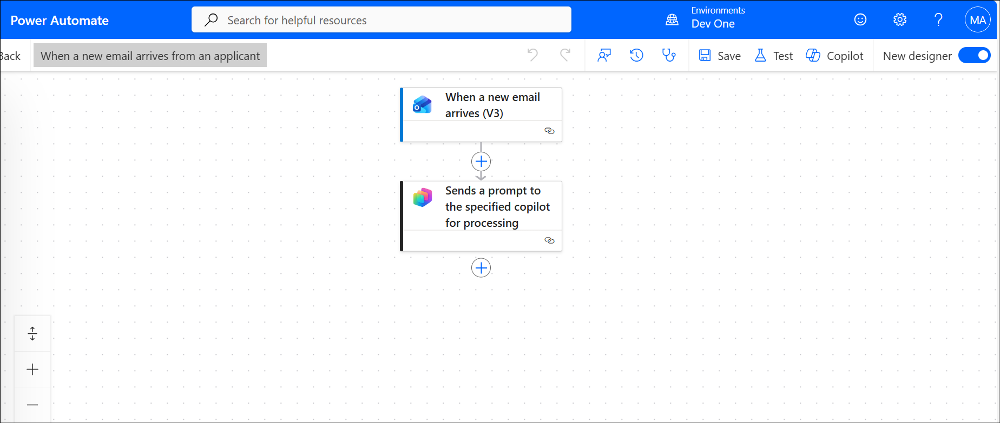

10. Por padrão, o acionador **When a new email arrives** no Power
    Automate pode processar vários e-mails juntos caso vários cheguem ao
    mesmo tempo, executando o fluxo apenas uma vez para todo o lote.

> Para garantir que o fluxo seja executado separadamente para cada
> e-mail, selecione o nó When a new email arrives e, em seguida,
> selecione **Settings**.
>
> Ative a configuração **Split On** nas **Settings** do **acionador** e
> selecione **@triggerOutputs()?\['body/value'\]** no campo do **menu
> suspenso** **array**.
>
> Com a opção **Split On** ativada e o campo de array definido como
> @triggerOutputs()?\['body/value'\], o fluxo será executado
> individualmente para cada mensagem, mesmo que várias cheguem
> simultaneamente.
>
> 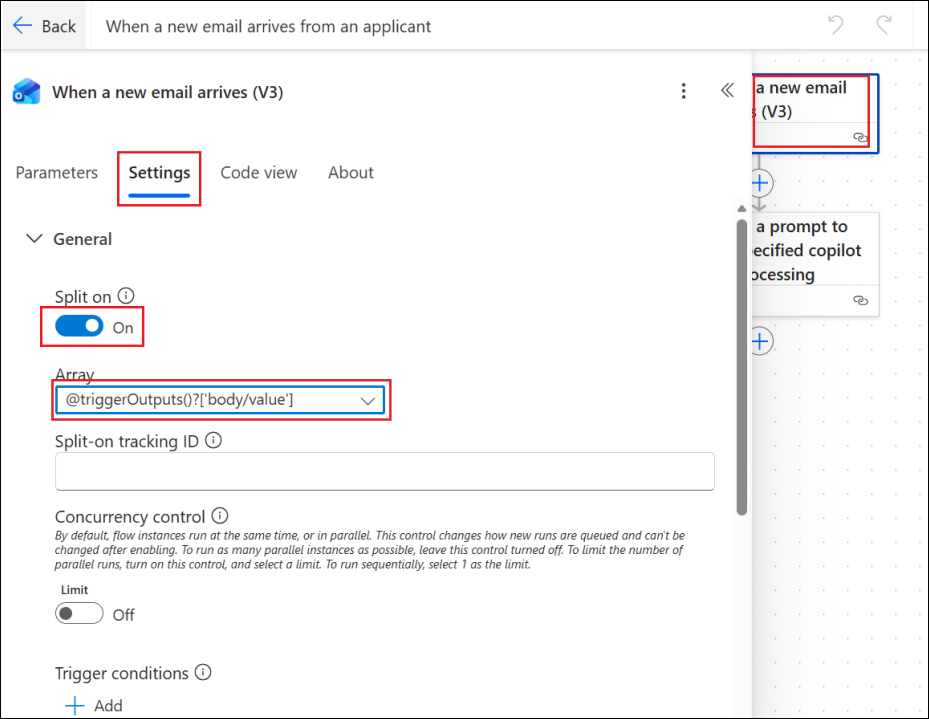

11. Em seguida, vamos adicionar uma lógica para verificar o tipo de
    arquivo do anexo. Queremos fazer o upload apenas de anexos .PDF e
    não de imagens (que podem vir de assinaturas de e-mail). Selecione o
    ícone **+** abaixo do acionador e escolha **Control** na seção
    **Built-in tools**.

> 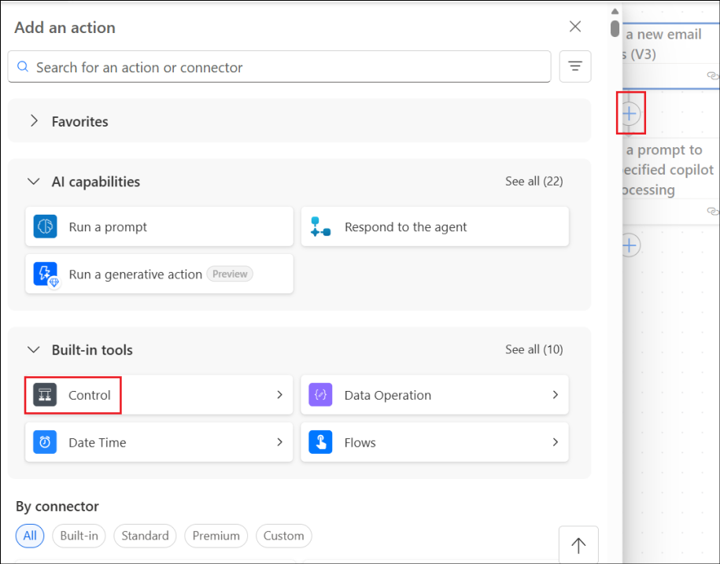

12. Selecione a ação **Condition**.

> 

13. Agora vamos configurar a condição para verificar se o tipo do anexo
    é .PDF. No campo **Choose a value** à esquerda, selecione o **ícone
    de** **raio**.

> 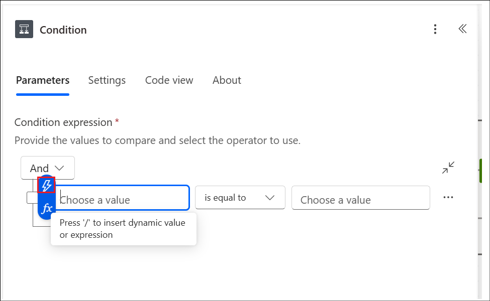

14. No campo **Search**, digite +++content type+++ e selecione o
    parâmetro **Attachments Content-Type** do acionador.

> 

15. Vamos pausar aqui por um momento — você provavelmente percebeu que a
    ação **For each** foi adicionada automaticamente.

> 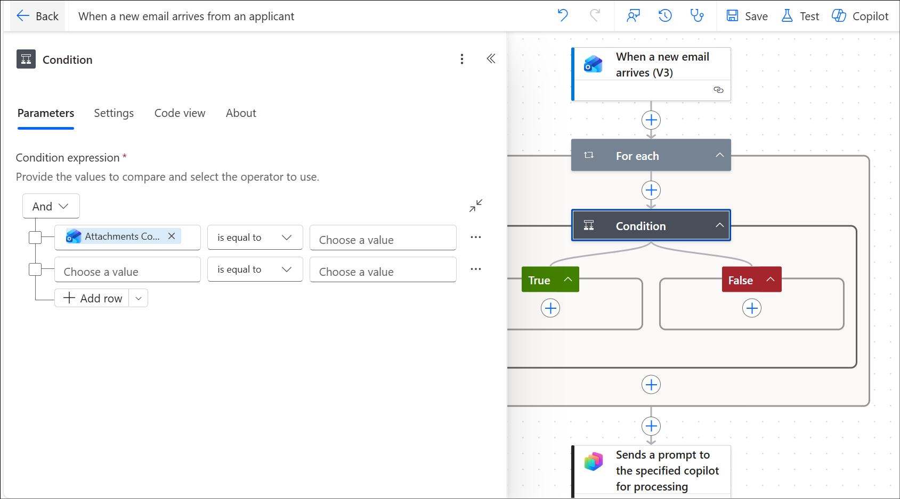
>
> Essa ação representa a iteração por cada anexo do e-mail, já que o
> parâmetro **Attachments Content-Type** está associado a cada anexo
> individualmente.
>
> Do ponto de vista técnico, isso é um array, e é por isso que a ação
> **For each** foi adicionada automaticamente quando selecionamos o
> parâmetro **Attachments Content-Type** na ação **Condition**.

16. Em seguida, no outro campo **Choose a value** à direita no bloco
    **Condition**, digite +++application/pdf+++.

Isso garantirá que, para cada anexo de arquivo, seja verificado se o
formato da extensão do arquivo é .PDF.

> 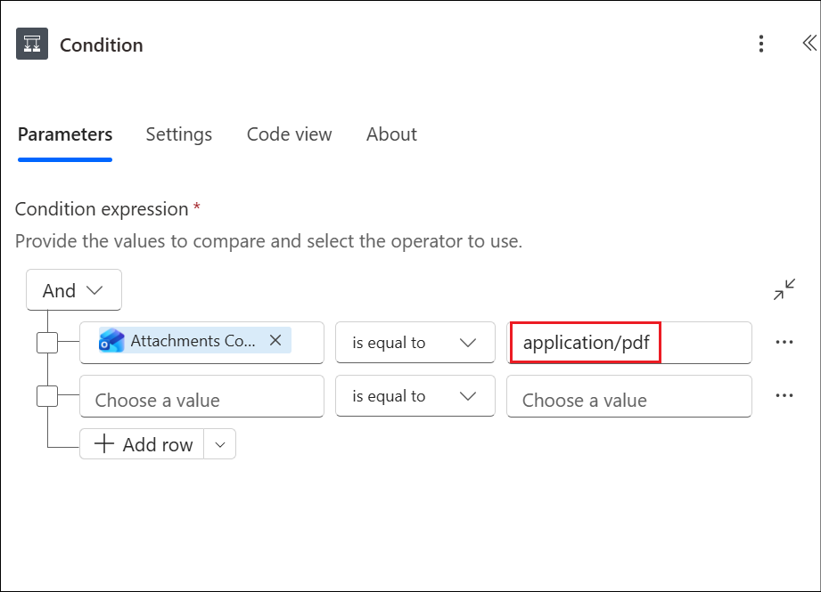

17. Agora vamos configurar o caminho **True** para extrair o arquivo do
    e-mail e carregá-lo na tabela **Resume** do Dataverse.

> Adicione uma nova ação abaixo no caminho **True** e pesquise por html
> to text. Em seguida, procure e selecione a ação **+++Html to
> text+++**.
>
> **Observação:** a ação **HTML to text** no Power Automate é usada para
> converter conteúdo formatado em HTML em texto simples. Isso é
> especialmente útil quando você recebe dados (como e-mails, conteúdo da
> web ou respostas de API) que contêm tags HTML e deseja extrair apenas
> o texto legível, sem qualquer formatação ou código.
>
> 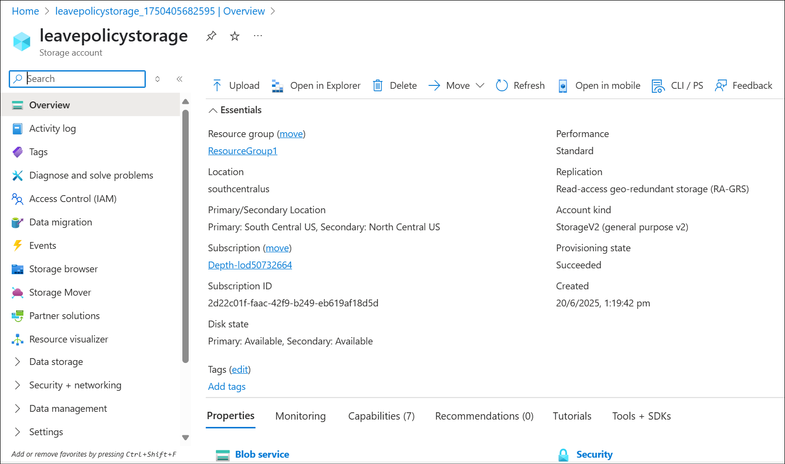

18. Em seguida, precisamos criar uma nova referência de conexão para a
    ação **Html to text** selecionando **Create new**.

> 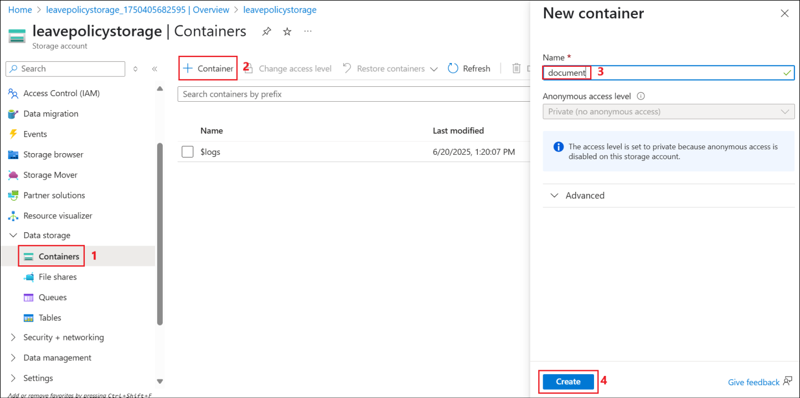

19. A ação agora pode ser configurada. Vamos adicionar o parâmetro
    **Body** do acionador. No campo **Content**, selecione o **ícone
    de** **raio** ou o **ícone fx** à direita.

> 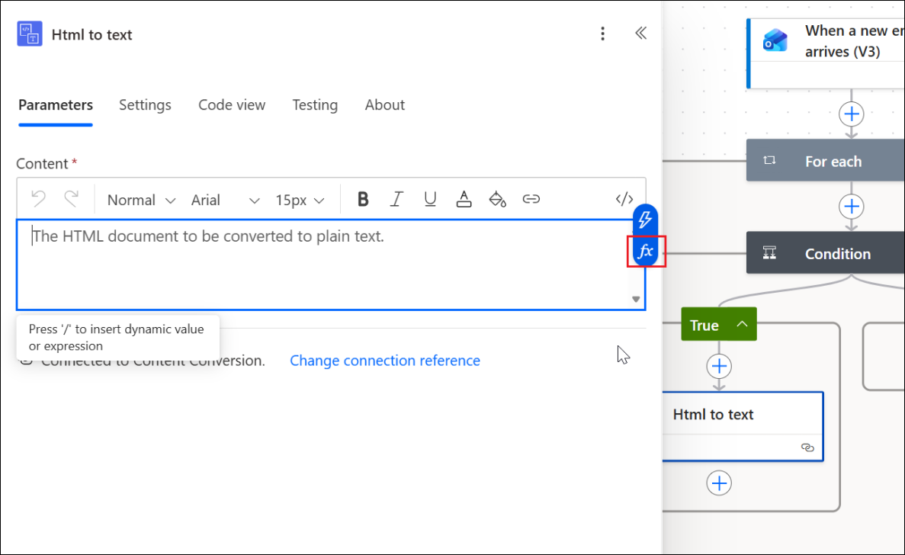

20. Na guia **Dynamic content**, pesquise por +++body+++ e selecione o
    parâmetro **Body**. Em seguida, selecione **Add**.

> 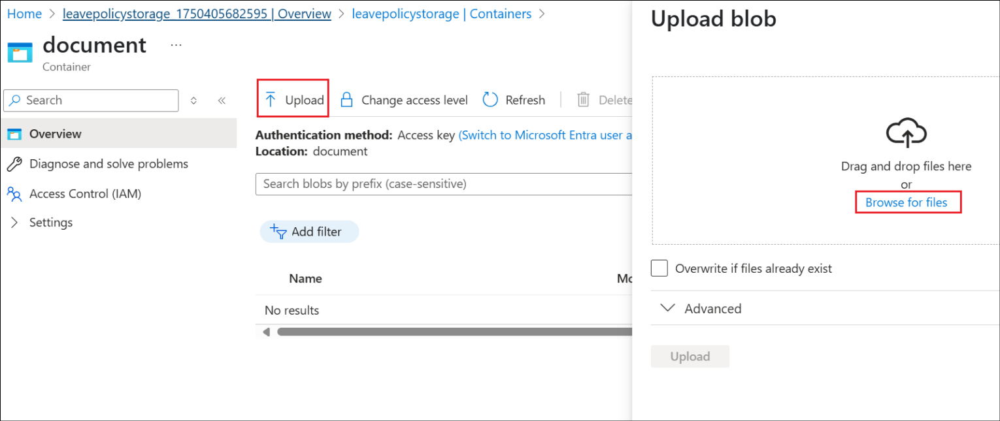

21. Concluímos a configuração dessa ação; portanto, saia da ação
    selecionando os dois colchetes angulares («) apontando para a
    esquerda para recolher o painel.

> 

22. Adicione uma nova ação selecionando o **ícone +** abaixo da ação
    **Html to text**, o que abrirá o painel para adicionar ações.
    Pesquise por **Dataverse add** e selecione a ação **Add a new row**.

> 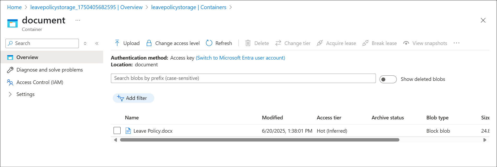

23. Renomeie a ação colando +++Add a new Resume row+++ como nome no
    canto superior esquerdo do painel de propriedades.

Para o parâmetro **Table name**, pesquise por res e selecione a tabela
**Resumes**.

> 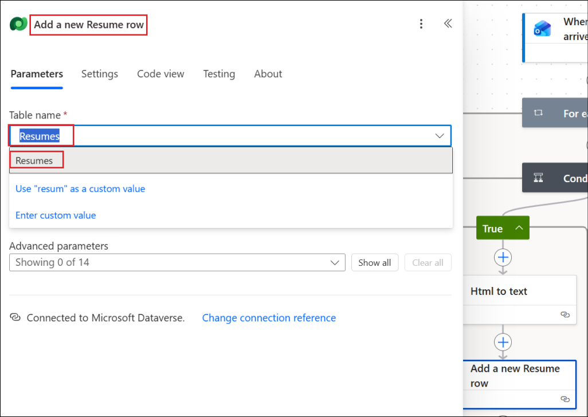

24. Selecione o campo **Resume Title** e, em seguida, selecione o
    **ícone** **fx** à direita.

> 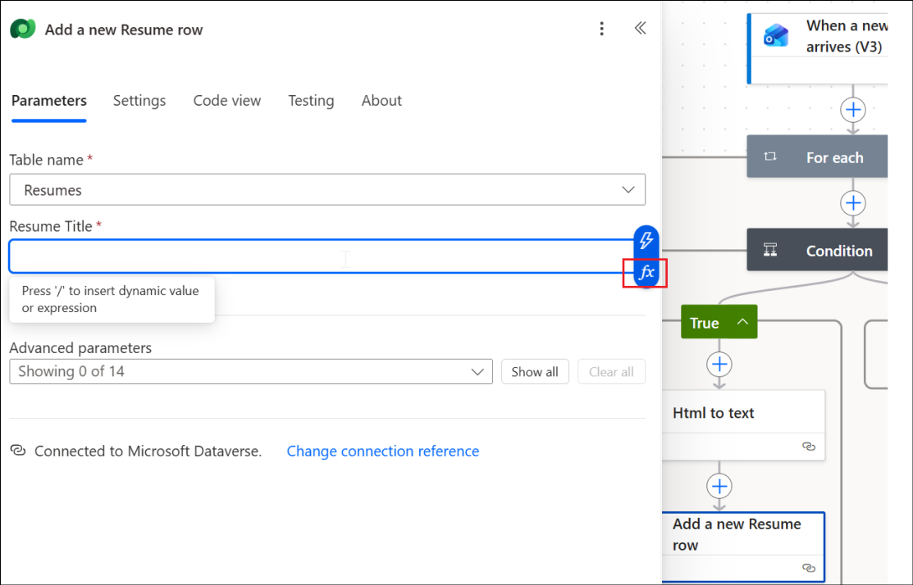

25. Na **guia** **Function**, insira a seguinte expressão que utiliza a
    função item():

+++item()?\['name'\]+++

> Selecione **Add** para adicionar a expressão ao parâmetro **Resume
> Title**.
>
> 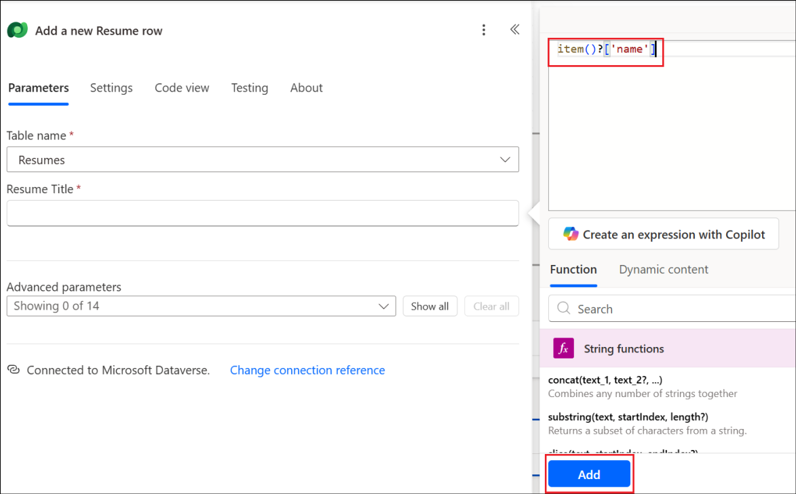

**Observação sobre a função item():**

- Quando você usa uma ação **Apply to each**, o Power Automate percorre
  cada elemento de uma coleção (array).

- Ela é mais frequentemente utilizada dentro de ações como **Apply to
  each** (ou **For each**), **Select** ou **Filter array**.

26. Ainda precisamos configurar vários outros parâmetros; selecione
    **Show all**.

> 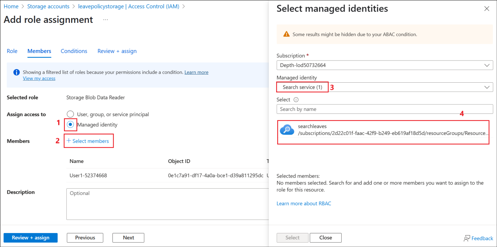

27.  No campo **Cover Letter**, selecione o **ícone fx** à direita.

> Na **guia Function**, insira a seguinte expressão:
>
> +++if(greater(length(body('Html_to_text')), 2000),
> substring(body('Html_to_text'), 0, 2000), body('Html_to_text'))+++
>
> Essa expressão verifica se o texto retornado pela ação **Html to
> text** possui mais de 2000 caracteres e, se for o caso, retorna apenas
> os primeiros 2000 caracteres; caso contrário, retorna o texto
> completo.
>
> 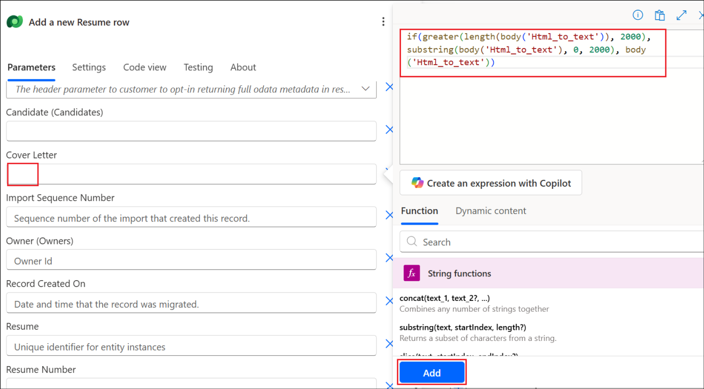

28. A expressão será então adicionada ao campo **Cover Letter**.

> 

29. Para o campo **Source Email Address**, selecione o **ícone de**
    **raio** e escolha o parâmetro **From** do acionador, pois ele
    contém o valor do endereço de e-mail.

> 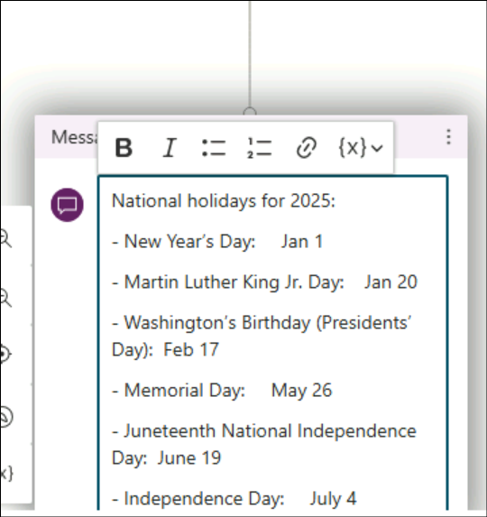

30. Para o campo **Upload Date**, selecione o **ícone fx** à direita. Na
    **guia** **Function**, insira +++utcNow()+++ e selecione **Add.**

**Observação: O que é a função utcNow()?**

- A função utcNow() no Power Automate retorna a data e hora atuais em
  Tempo Universal Coordenado (UTC) no formato ISO 8601, por exemplo:
  2025-09-23T04:32:14Z.

> 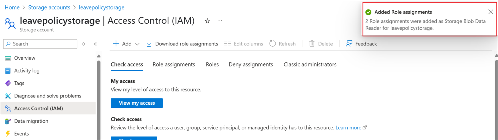

31. Agora concluímos a configuração da ação **Add a new Resume row**;
    portanto, saia do painel recolhendo-o.

> 

32. Adicione uma nova ação selecionando o **ícone +** abaixo da ação
    **Add a new Resume row**, o que abrirá o painel para adicionar
    ações. Pesquise por **+++Dataverse Upload+++** e selecione a ação
    **Upload a file or an image**.

> 

33. Renomeie a ação colando +++Upload Resume File+++ como nome.

> 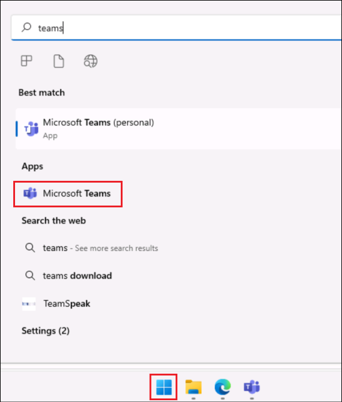

34. Selecione o campo **Content name** (remova a mensagem Untitled, caso
    já esteja presente) e, em seguida, selecione o **ícone** **fx** à
    direita.

> Na **guia Function**, insira a seguinte expressão que utiliza a função
> item(). Essa expressão obtém a propriedade name do item atual (o
> arquivo de anexo).
>
> +++item()?\['name'\]+++
>
> 

35. Para o parâmetro **Table name**, pesquise por +++resumes+++ e
    selecione a tabela **Resumes**.

> 

36. Em seguida, selecione o campo **Row ID** e escolha o **ícone de**
    **raio** à direita.

> Pesquise por +++ID+++ e selecione o parâmetro **Resume** da ação **Add
> a new row** do Dataverse, pois ele contém o valor de ID da linha para
> a qual o arquivo PDF será carregado.
>
> 

37. Selecione o campo **Column name** e escolha a opção **Resume PDF**.

> 

38. Selecione o campo **Content** e, em seguida, selecione o **ícone
    fx** à direita.

> Na guia **Function**, insira a seguinte expressão que utiliza a função
> item(). Essa expressão obtém a propriedade contentBytes do item atual
> (o arquivo de anexo). contentBytes refere-se aos dados binários brutos
> de um arquivo ou anexo, codificados como uma string Base64.
>
> +++item()?\['contentBytes'\]+++
>
> 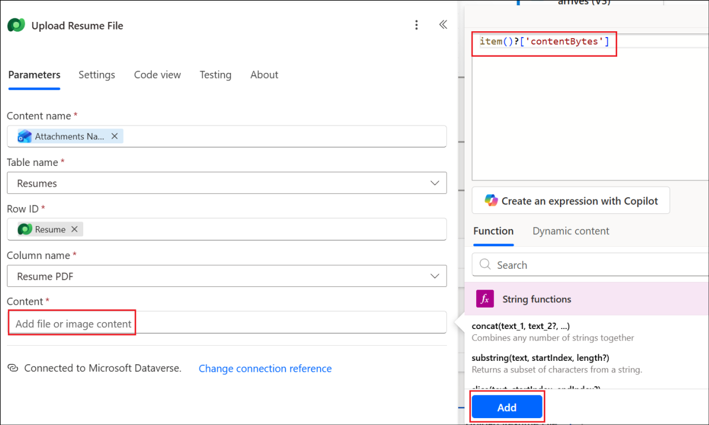

39. Concluímos a configuração dessa ação; portanto, saia da ação
    selecionando os dois colchetes angulares («) apontando para a
    esquerda para recolher o painel.

> 

40. Em seguida, selecione a ação **Sends a prompt to the specified
    copilot for processing** e arraste-a para posicioná-la abaixo da
    ação **Upload Resume File**, no caminho **True** da condição.

> 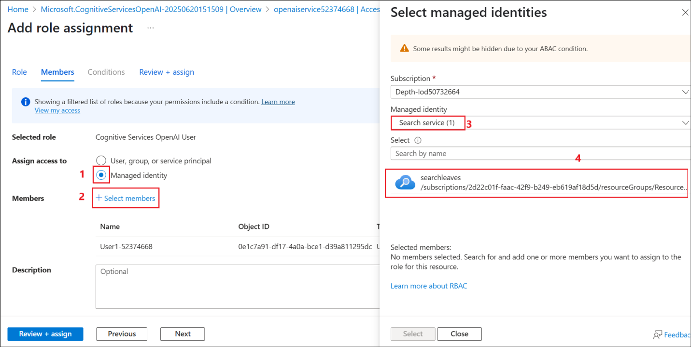

41. Selecione a ação **Sends a prompt to the specified copilot for
    processing** para configurá-la.

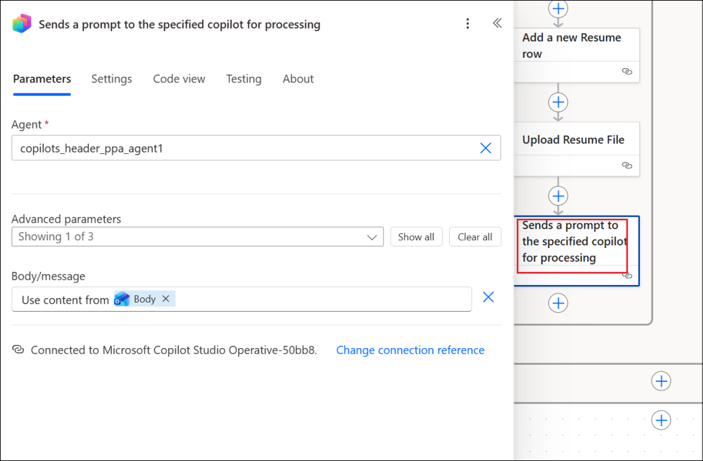

42. No campo **Body/message**, selecione todo o conteúdo do campo e
    limpe/exclua esse conteúdo.

> 

43. Copie e cole o texto a seguir no campo **Body/message** e, em
    seguida, selecione e destaque o texto **RESUME ID PLACEHOLDER** e
    clique no ícone de **raio**.

> Send \[ResumeId (text)\] = "RESUME ID PLACEHOLDER" and \[ResumeTitle
> (text_1)\] = "RESUME TITLE PLACEHOLDER" and \[ResumeNumber (text_2)\]=
> "RESUME NUMBER PLACEHOLDER" to the Tool "Notify Teams Applicant
> channel" in the child agent "Application Intake Agent"
>
> 

44. Pesquise por +++resume+++ e selecione o parâmetro **Resume** da ação
    **Add a new row** do *Dataverse*, pois ele contém o valor de ID do
    registro de currículo que foi criado.

> 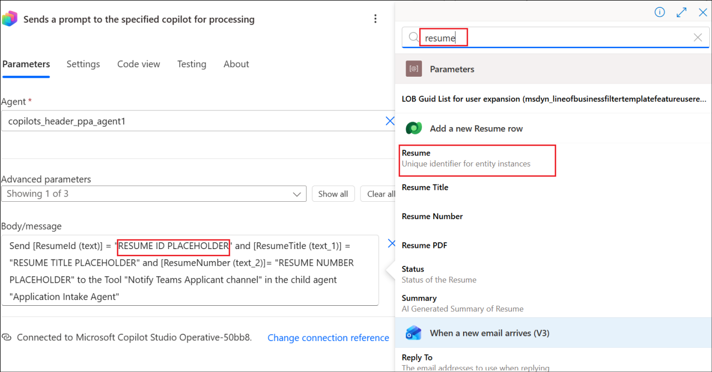

45. Destaque o RESUME TITLE PLACEHOLDER e selecione o **ícone de raio**
    à direita.

> Pesquise por +++title+++ e selecione o parâmetro **Resume Title** da
> ação **Add a new row** do **Dataverse**, pois ele contém o valor do
> título do currículo do registro de Resume que foi criado.
>
> 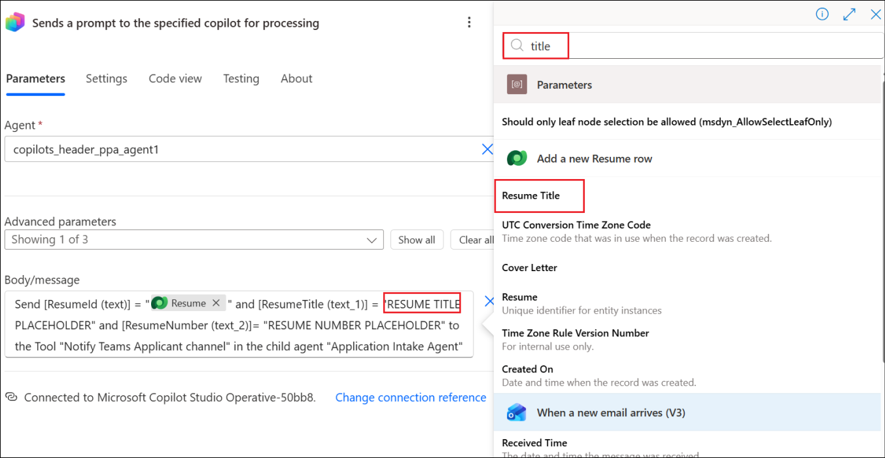

46. Destaque o RESUME TITLE PLACEHOLDER e selecione o **ícone de raio**
    à direita.

> Pesquise por +++resume number+++ e selecione o parâmetro **Resume
> Number** da ação **Add a new row** do **Dataverse**, pois ele contém o
> valor do número do currículo do registro de Resume que foi criado.
>
> 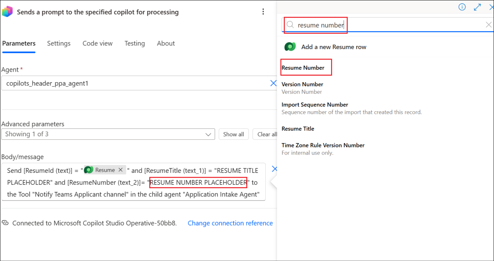

47. Concluímos a configuração desta ação e do fluxo do nosso agente.
    Agora, vamos salvar nosso fluxo do acionador de evento selecionando
    **Save**.

> 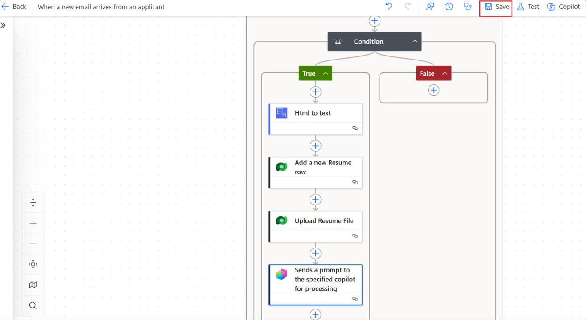

48. Agora precisamos editar os detalhes do fluxo do agente, selecionar
    **Back** após salvar.

> 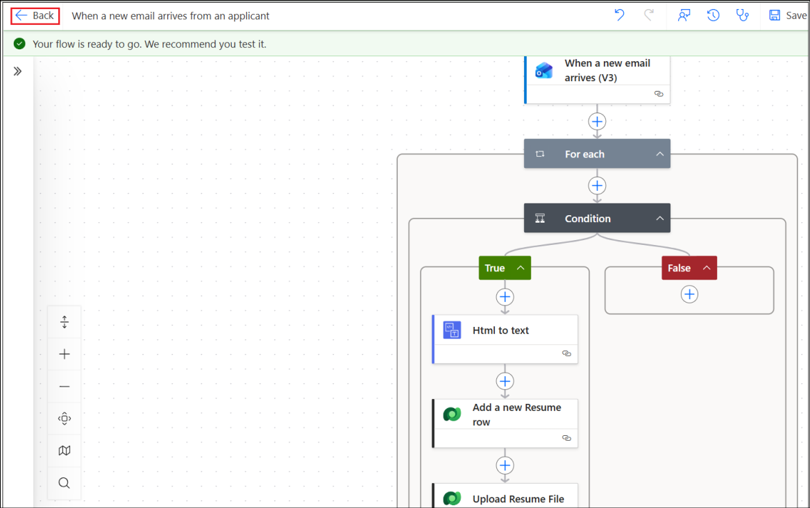

49. Selecione **Edit** na seção **Details** e atualize o **Plan** para a
    opção **Copilot Studio**. Em seguida, selecione **Save**.

> 

50. Uma janela modal será exibida solicitando a confirmação para
    alternar para o plano Copilot Studio. Selecione **Confirm**.

> 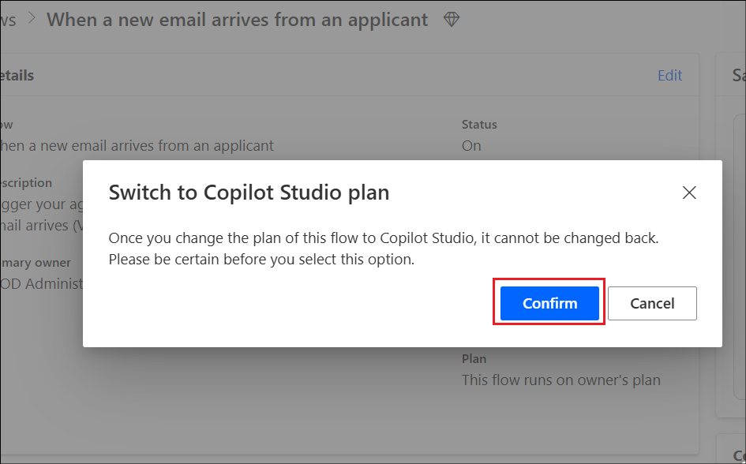

51. O plano agora foi atualizado para **Copilot Studio**. Selecione
    **Edit**, pois precisamos publicar o fluxo do acionador de evento
    para o nosso agente.

> 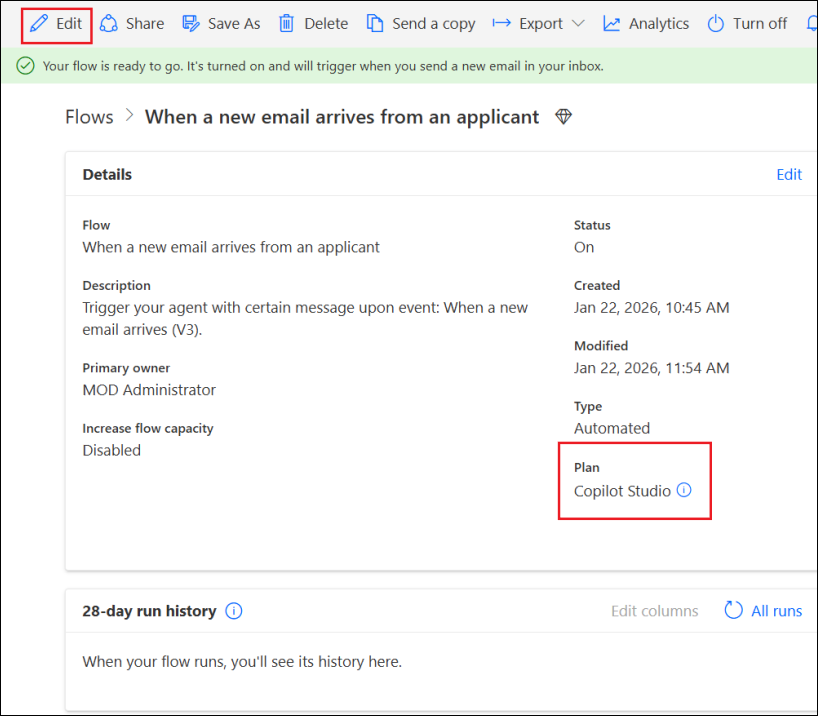

52. Selecione **Publish**.

> 
>
> O fluxo de acionamento do evento agora está publicado.

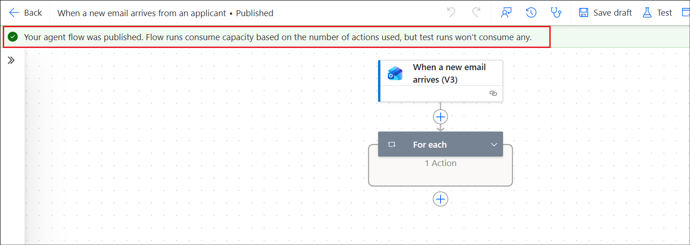

Vamos prosseguir com a criação de um novo fluxo de agente que será
invocado pelo **Agente de Intake de Candidaturas** subordinado.

### Tarefa 2 – Notificar um canal do Teams usando um cartão adaptativo

Agora vamos criar um novo fluxo de agente para o **Agente de Intake de
Candidaturas** subordinado, que utilizará os valores passados pelo
acionador de evento para publicar um cartão adaptativo em um canal do
Microsoft Teams. Esse cartão adaptativo notificará a equipe de
recrutamento de RH sobre o PDF que foi carregado automaticamente, para
que possa ser revisado.

#### Tarefa 2.1 – Criar um canal no Teams

Nesta tarefa, você criará uma equipe e um canal no Microsoft Teams, que
serão utilizados posteriormente neste laboratório.

1.  Faça login em +++https://teams.microsoft.com+++

2.  Selecione o **menu suspenso** **New items** e escolha **New team**.

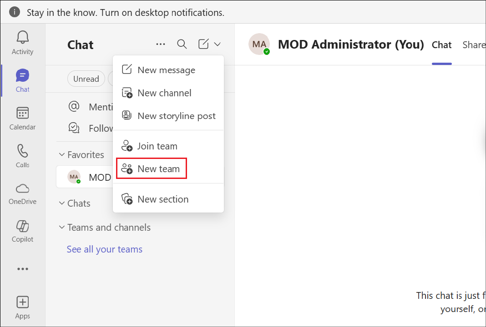

3.  Forneça os detalhes abaixo e selecione Create.

    - Team name - +++HR Team+++

    - First channel name - +++Applicants +++

> 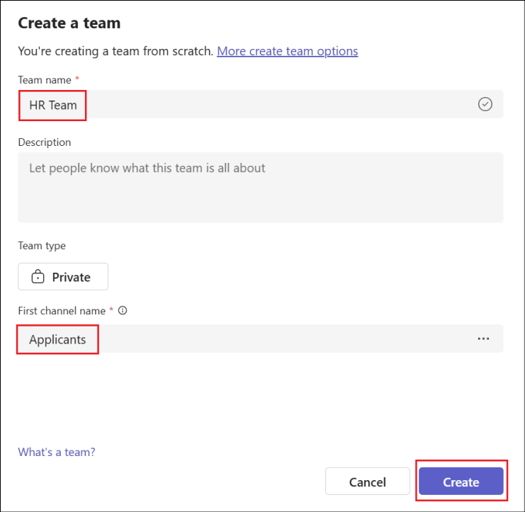

4.  Selecione Skip na próxima tela.

5.  Agora você criou a nova equipe e o novo canal.

#### Tarefa 2.2: Criar o fluxo do agente

1.  De volta ao Copilot Studio, no **Hiring Agent**, selecione a guia
    **Agents** e escolha o **Application Intake Agent.**

2.  Role a página até a seção **Tools** e selecione **+ Add**.

> 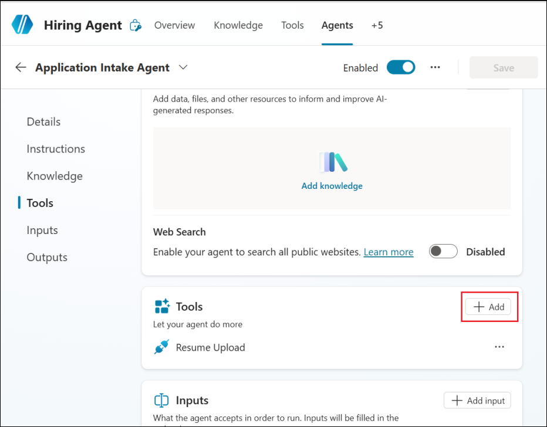

3.  A janela modal **Add tool** será exibida. Selecione **+ New tool**.

> 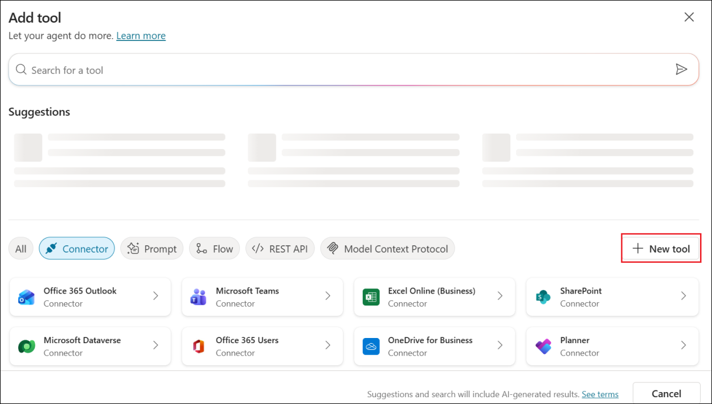

4.  Selecione **Agent flow**.

> 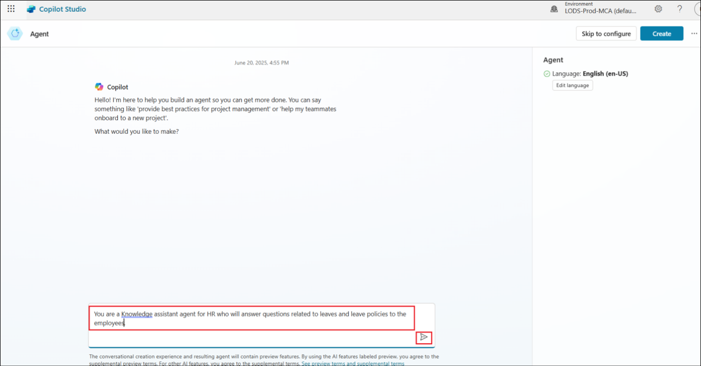

5.  Em seguida, o **agent flow designer** será carregado. No acionador
    **When an agent calls the flow**, selecione **+ Add an input**.

> 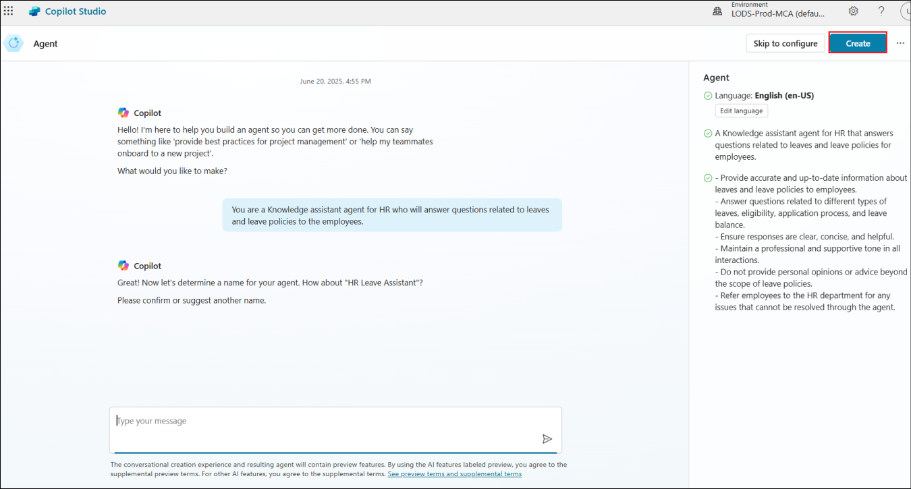

6.  Selecione **Text** como o tipo de entrada do usuário.

> 

7.  No campo de texto da entrada, insira +++ResumeId+++ como o nome do
    parâmetro de entrada.

> 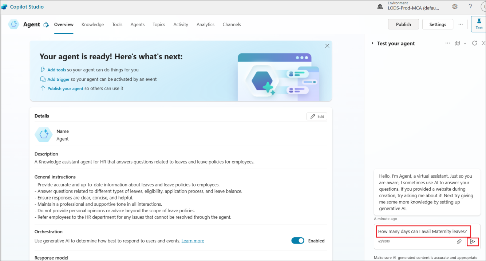

8.  Repita os mesmos passos para os parâmetros abaixo.

Text - +++ResumeTitle+++

Text - +++ResumeNumber+++

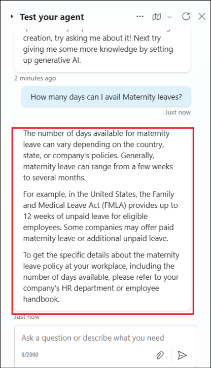

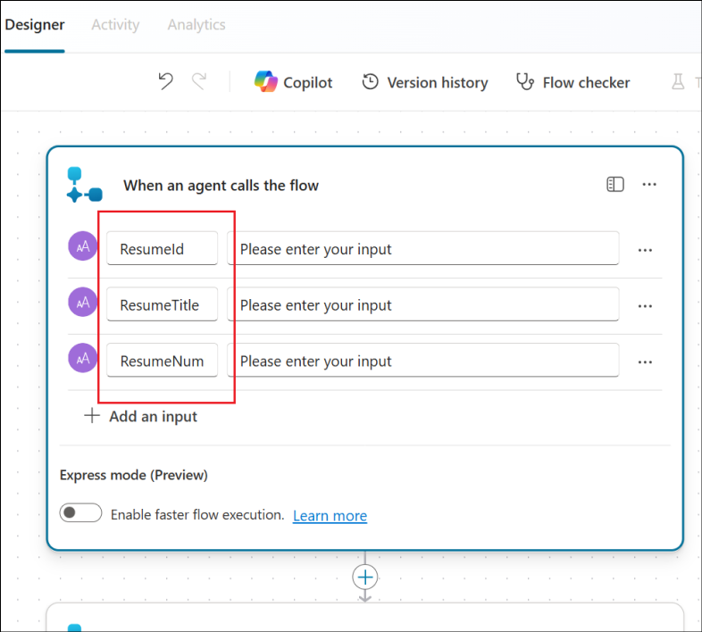

9.  Agora você irá adicionar um cartão adaptativo ao fluxo de agente.
    Vamos adicionar uma nova ação ao fluxo para publicar um cartão
    adaptativo em um canal do Teams.

Selecione o **ícone +** abaixo do acionador.

> 

10. Pesquise por **+++Microsoft Teams post+++** e selecione a ação
    **Post card in a chat or channel**.

> 

11. É necessário criar uma referência de conexão com o Microsoft Teams
    usando sua conta de usuário conectada. Selecione **Sign in**.

> 

12. Selecione sua conta de usuário e, em seguida, selecione **Allow
    access**.

> 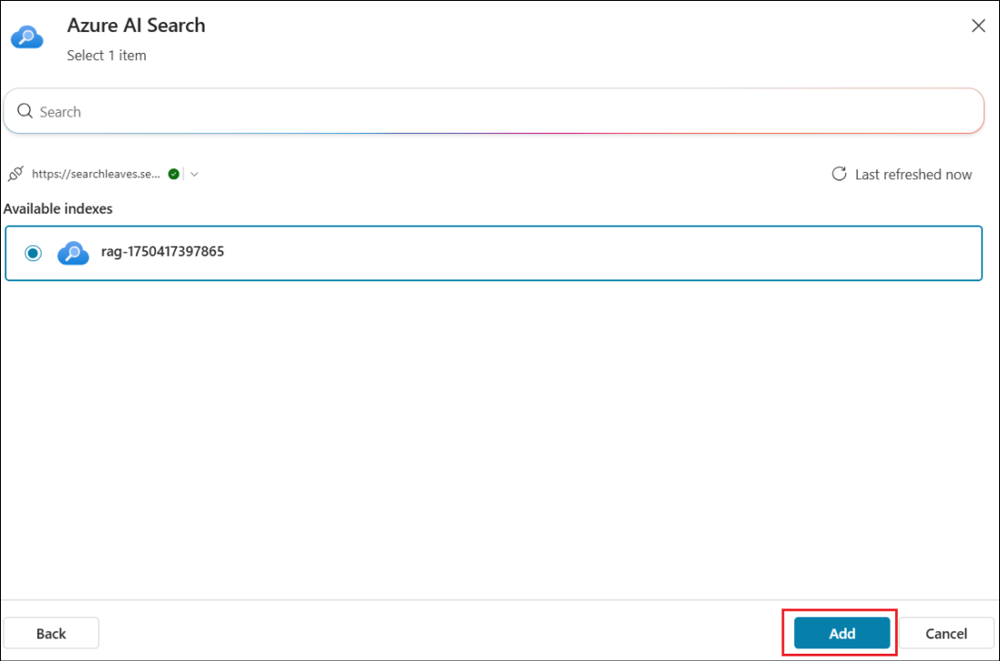

13. Configure de acordo com os seguintes parâmetros de entrada:

[TABLE]

> 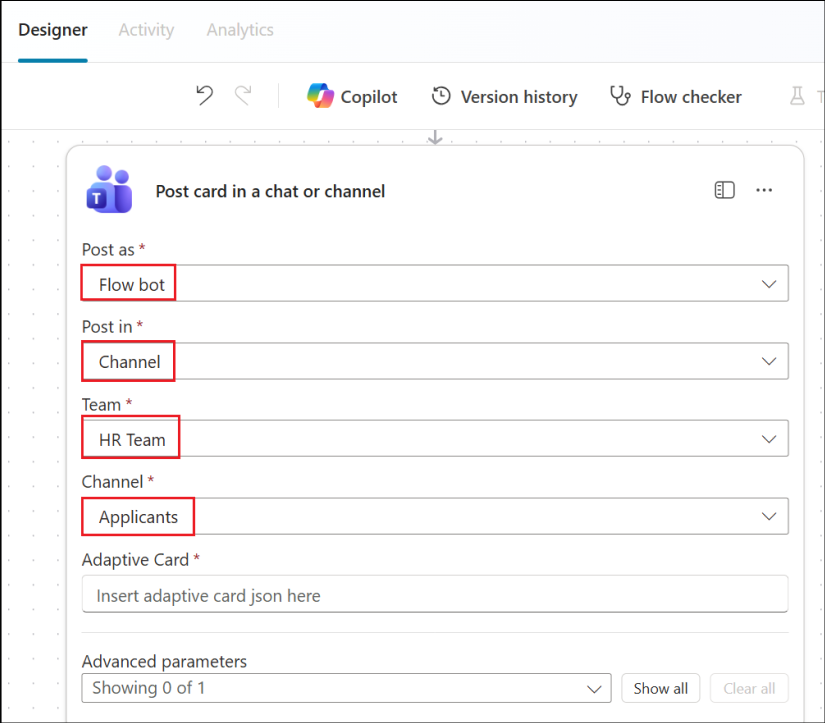

14. Em seguida, vamos configurar o campo **Adaptive Card**. Selecione o
    campo **Adaptive Card**.

> 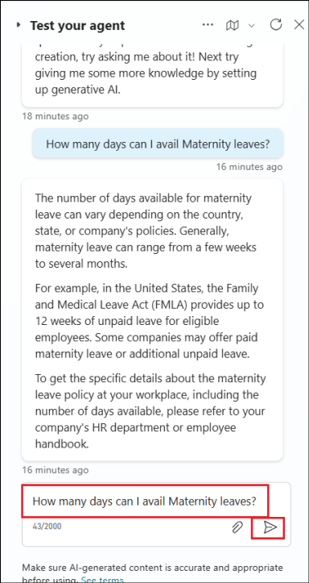

15. Copie o código abaixo e cole-o no campo Adaptive Card.

> {
>
> "type": "AdaptiveCard",
>
> "speak": "New Resume Uploaded",
>
> "body": \[
>
> {
>
> "inlines": \[
>
> {
>
> "type": "TextRun",
>
> "size": "Small",
>
> "text": "Resume table updated",
>
> "selectAction": {
>
> "url": "https://adaptivecards.io",
>
> "type": "Action.OpenUrl"
>
> }
>
> }
>
> \],
>
> "type": "RichTextBlock"
>
> },
>
> {
>
> "columns": \[
>
> {
>
> "width": "auto",
>
> "items": \[
>
> {
>
> "type": "Icon",
>
> "name": "DocumentArrowUp",
>
> "color": "Accent"
>
> }
>
> \],
>
> "type": "Column"
>
> },
>
> {
>
> "width": "stretch",
>
> "items": \[
>
> {
>
> "size": "Large",
>
> "text": "New Resume Uploaded",
>
> "weight": "Bolder",
>
> "wrap": true,
>
> "type": "TextBlock"
>
> }
>
> \],
>
> "verticalContentAlignment": "Center",
>
> "spacing": "Small",
>
> "type": "Column"
>
> }
>
> \],
>
> "spacing": "Small",
>
> "type": "ColumnSet"
>
> },
>
> {
>
> "type": "Table",
>
> "targetWidth": "AtLeast:Narrow",
>
> "columns": \[
>
> {
>
> "width": 1
>
> },
>
> {
>
> "width": 2
>
> }
>
> \],
>
> "rows": \[
>
> {
>
> "type": "TableRow",
>
> "cells": \[
>
> {
>
> "type": "TableCell",
>
> "items": \[
>
> {
>
> "type": "TextBlock",
>
> "text": "Resume Number",
>
> "wrap": true,
>
> "weight": "Bolder"
>
> }
>
> \],
>
> "verticalContentAlignment": "Center"
>
> },
>
> {
>
> "type": "TableCell",
>
> "items": \[
>
> {
>
> "type": "TextBlock",
>
> "text": "RESUME NUMBER PLACEHOLDER",
>
> "wrap": true
>
> }
>
> \],
>
> "verticalContentAlignment": "Center"
>
> }
>
> \]
>
> },
>
> {
>
> "type": "TableRow",
>
> "cells": \[
>
> {
>
> "type": "TableCell",
>
> "items": \[
>
> {
>
> "type": "TextBlock",
>
> "text": "Name",
>
> "wrap": true,
>
> "weight": "Bolder"
>
> }
>
> \],
>
> "verticalContentAlignment": "Center"
>
> },
>
> {
>
> "type": "TableCell",
>
> "items": \[
>
> {
>
> "type": "TextBlock",
>
> "text": "RESUME NAME PLACEHOLDER",
>
> "wrap": true
>
> }
>
> \],
>
> "verticalContentAlignment": "Center"
>
> }
>
> \]
>
> },
>
> {
>
> "type": "TableRow",
>
> "cells": \[
>
> {
>
> "type": "TableCell",
>
> "items": \[
>
> {
>
> "type": "TextBlock",
>
> "text": "Status",
>
> "wrap": true,
>
> "weight": "Bolder"
>
> }
>
> \],
>
> "verticalContentAlignment": "Center"
>
> },
>
> {
>
> "type": "TableCell",
>
> "items": \[
>
> {
>
> "type": "TextBlock",
>
> "text": "Waiting for Review",
>
> "wrap": true
>
> }
>
> \],
>
> "verticalContentAlignment": "Center"
>
> }
>
> \]
>
> },
>
> {
>
> "type": "TableRow",
>
> "cells": \[
>
> {
>
> "type": "TableCell",
>
> "items": \[
>
> {
>
> "type": "TextBlock",
>
> "text": "Due Date",
>
> "wrap": true,
>
> "weight": "Bolder"
>
> }
>
> \]
>
> },
>
> {
>
> "type": "TableCell",
>
> "items": \[
>
> {
>
> "type": "TextBlock",
>
> "text": "May 21, 2023",
>
> "wrap": true
>
> }
>
> \]
>
> }
>
> \]
>
> },
>
> {
>
> "type": "TableRow",
>
> "cells": \[
>
> {
>
> "type": "TableCell",
>
> "items": \[
>
> {
>
> "type": "TextBlock",
>
> "text": "Priority",
>
> "wrap": true,
>
> "weight": "Bolder"
>
> }
>
> \],
>
> "verticalContentAlignment": "Center"
>
> },
>
> {
>
> "type": "TableCell",
>
> "items": \[
>
> {
>
> "type": "ColumnSet",
>
> "columns": \[
>
> {
>
> "type": "Column",
>
> "width": "auto",
>
> "items": \[
>
> {
>
> "type": "Icon",
>
> "name": "Flag",
>
> "color": "Attention",
>
> "size": "xSmall",
>
> "horizontalAlignment": "Center"
>
> }
>
> \]
>
> },
>
> {
>
> "type": "Column",
>
> "width": "stretch",
>
> "items": \[
>
> {
>
> "color": "Attention",
>
> "text": "Important",
>
> "wrap": true,
>
> "spacing": "Small",
>
> "type": "TextBlock"
>
> }
>
> \],
>
> "spacing": "Small"
>
> }
>
> \],
>
> "spacing": "Small"
>
> }
>
> \],
>
> "verticalContentAlignment": "Center"
>
> }
>
> \]
>
> }
>
> \],
>
> "firstRowAsHeaders": false,
>
> "showGridLines": false
>
> },
>
> {
>
> "actions": \[
>
> {
>
> "title": "View Resume",
>
> "type": "Action.OpenUrl",
>
> "url": "https://adaptivecards.io/"
>
> }
>
> \],
>
> "type": "ActionSet",
>
> "targetWidth": "AtLeast:Narrow",
>
> "spacing": "ExtraLarge"
>
> }
>
> \],
>
> "$schema": "https://adaptivecards.io/schemas/adaptive-card.json",
>
> "version": "1.5"
>
> }

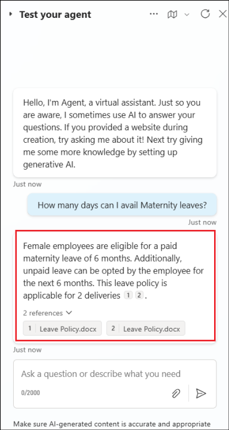

16. Agora, substituiremos os valores existentes na carga JSON por
    valores reais ou conteúdo dinâmico.

> Primeiro, vamos atualizar a **URL** da **propriedade url** dentro da
> propriedade **selectAction**. Essa URL será substituída pela URL da
> exibição do sistema **Resumes** no aplicativo orientado pelo modelo
> **Hiring Hub**. Isso permitirá que o recrutador selecione a ação e
> seja direcionado para a exibição do sistema Currículos no aplicativo
> orientado por modelo.
>
> Destaque o **valor atual da URL** e exclua-o.

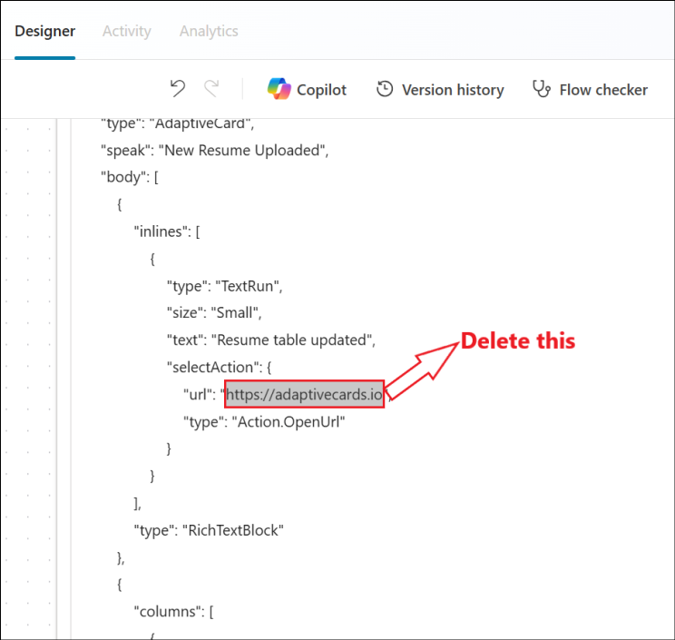

17. No aplicativo orientado por modelo do **Hiring Hub**, navegue até a
    exibição do sistema **Resumes** usando o menu do lado esquerdo e
    copie a URL. Em seguida, **navegue de volta** para o **fluxo do
    agente** e **cole** a **URL copiada** na propriedade **url** dentro
    da propriedade selectAction.

> 

18. Você deverá ver o seguinte, onde o destaque em amarelo são os
    detalhes do seu ambiente do aplicativo orientado por modelo do
    **Hiring Hub**.

[TABLE]

> 

19. Em seguida, adicionaremos valores de conteúdo dinâmico para várias
    propriedades. Vamos começar com o texto que exibirá a referência do
    número do currículo da linha que foi criada pelo acionador de evento
    de forma autônoma.

Selecione o ícone **do painel** para carregar o painel de ação.

20. Role a página para baixo até a linha onde você vê a propriedade de
    texto para RESUME NUMBER PLACEHOLDER. Selecione o valor do
    placeholder, destaque-o e exclua-o.

21. Clique entre as aspas duplas e selecione o **ícone de raio** no lado
    direito.

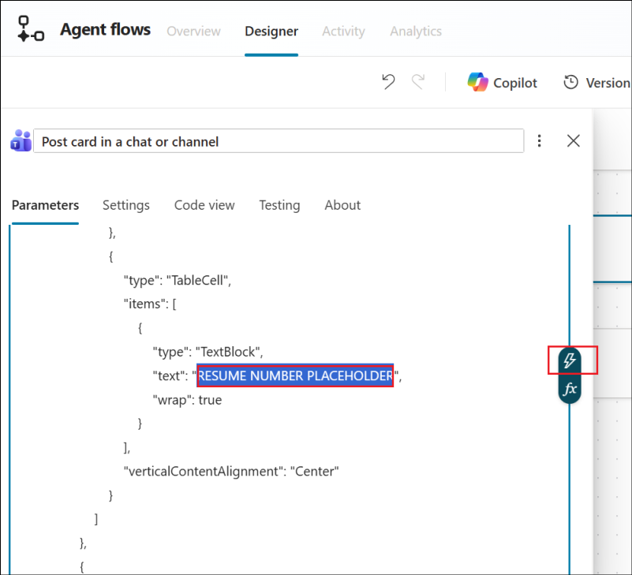

22. Na guia **Dynamic Content,** selecione o parâmetro
    **ResumeNumbe***r*.

> 

23. O parâmetro **ResumeNumber** será agora adicionado como conteúdo
    dinâmico à propriedade de texto.

> 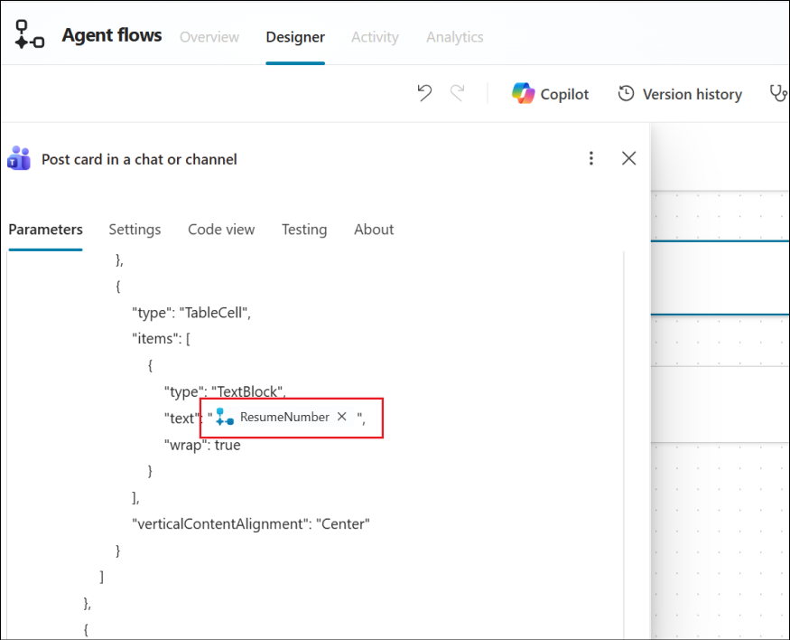

24. Repetiremos as mesmas etapas para o RESUME NAME PLACEHOLDER. Role a
    página para baixo até a linha onde você vê a propriedade de texto
    para RESUME NAME PLACEHOLDER. Selecione o valor do placeholder,
    destaque-o e exclua-o. Clique entre as aspas duplas e selecione o
    **ícone de raio** no lado direito.

> 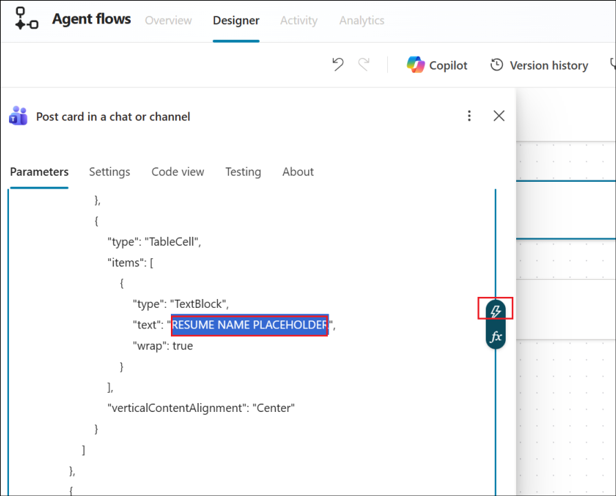

25. Na guia **Dynamic Content**, selecione o parâmetro **ResumeTitle**.

> 

26. O parâmetro **ResumeTitle** será agora adicionado como conteúdo
    dinâmico à propriedade de texto.

> 

27. Repetiremos as mesmas etapas para o valor **Due Date**, que
    representa a data até a qual um recrutador deve revisar o currículo.
    Role a página para baixo até a linha onde você vê a propriedade de
    texto para May 21, 2023.

28. Exclua esse valor de data do placeholder, clique entre as aspas
    duplas e selecione o **ícone fx** no lado direito.

> 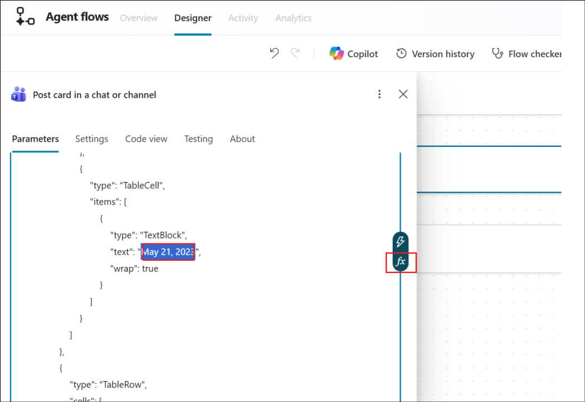

29. Na guia **Function**, insira a seguinte expressão e selecione
    **Add**.

> +++addDays(utcNow(), 3, 'MMM dd, yyyy')+++

Essa expressão utiliza duas funções.

[TABLE]

Para o valor utcNow, estamos formatando a data para ser mês e dia,
seguido pelo ano.

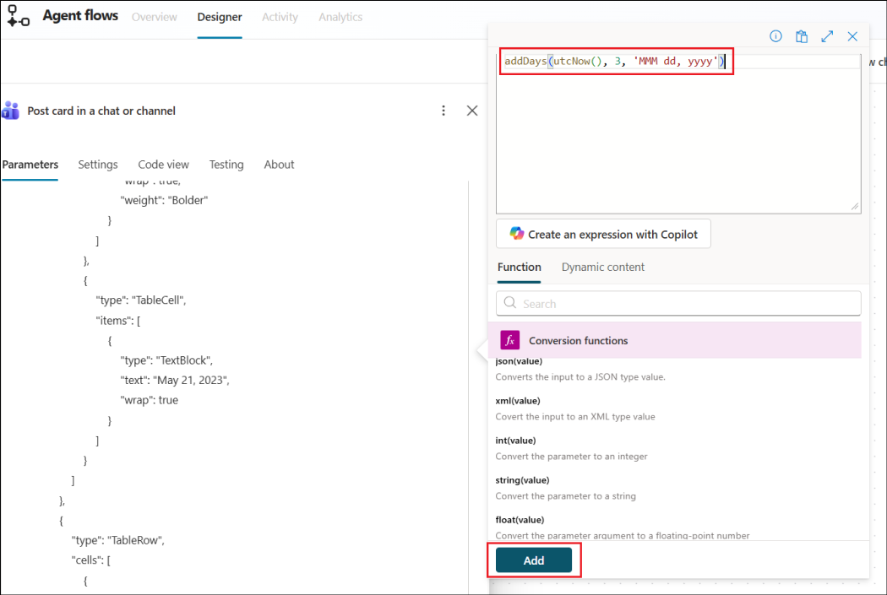

30. A expressão será agora adicionada à propriedade de texto.

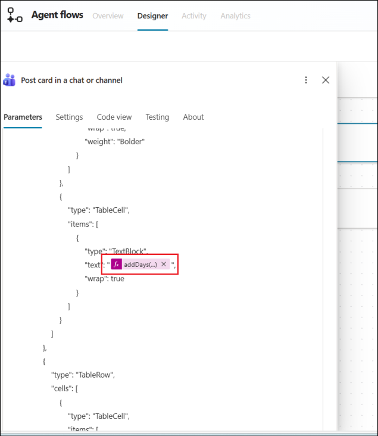

31. Por último, atualizaremos a **URL** da **propriedade url** na
    propriedade **actions** array na parte inferior da carga JSON. A URL
    atual será substituída pela URL do **Resume now** no aplicativo
    orientado por modelo **Hiring Hub**. Isso permitirá que o Recrutador
    selecione a ação **Action.OpenURL** do cartão adaptativo e seja
    **direcionado** para o **Resume** no aplicativo orientado por
    modelo.

> 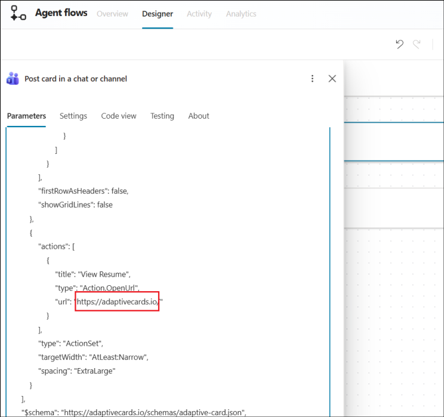

32. No aplicativo orientado por modelo **Hiring Hub**, abra uma linha na
    exibição do sistema **Resumes** usando o menu do lado esquerdo. A
    linha resume será carregada como um formulário no aplicativo
    orientado por modelo.

Copie a URL da linha Resume.

> 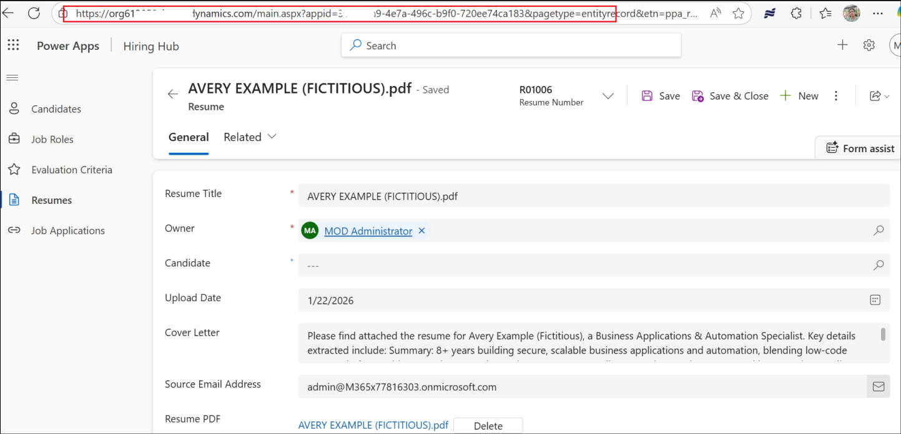

33. Em seguida, volte ao fluxo do agente, destaque o valor atual do URL
    do espaço reservado e **exclua-o**.

> 

34. Em seguida, **cole** a URL **copiada** na propriedade **url**
    correspondente.

> 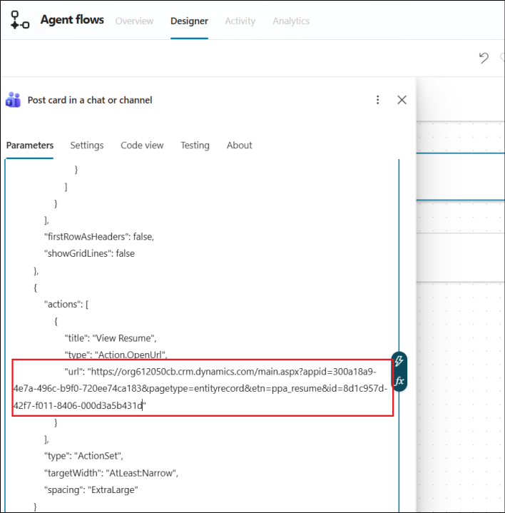

35. Você deverá ver o seguinte. Exclua o valor de Id GUID no final.
    Substituiremos esse conteúdo dinâmico pelo parâmetro **ResumeId**.

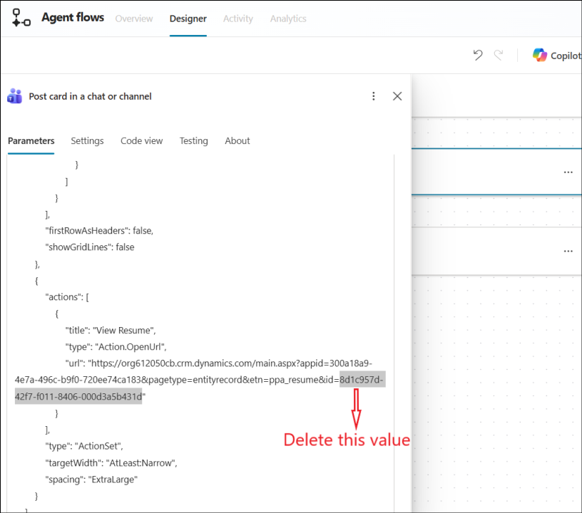

36. **Selecione o ícone de raio** no lado direito.

Na guia **Dynamic Content**, selecione o parâmetro **ResumeId.**

> 

37. O **ResumeId** será adicionado como conteúdo dinâmico. O trecho
    destacado em amarelo corresponde aos detalhes do ambiente do
    aplicativo orientado por modelo do **Hiring Hub**.

[TABLE]

> 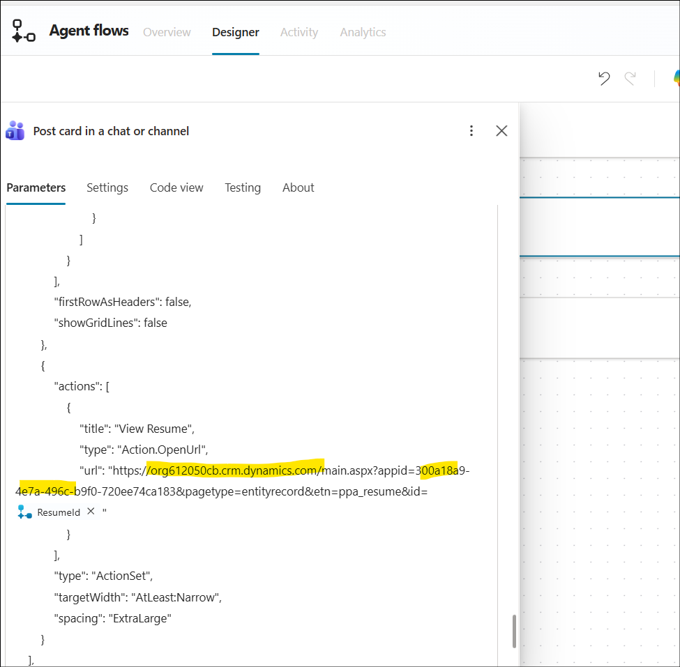

38. Concluímos a configuração da ação **Post card in a chat or channel**
    👏🏻  
    Saia do painel de configuração da ação selecionando o ícone **x**.

> 

39. Por fim, vamos configurar a última ação, **Respond to the agent**,
    enviando um texto de volta ao agente para encerrar o processamento.

Na ação **Respond to the agent**, selecione **+ Add an output**.

> 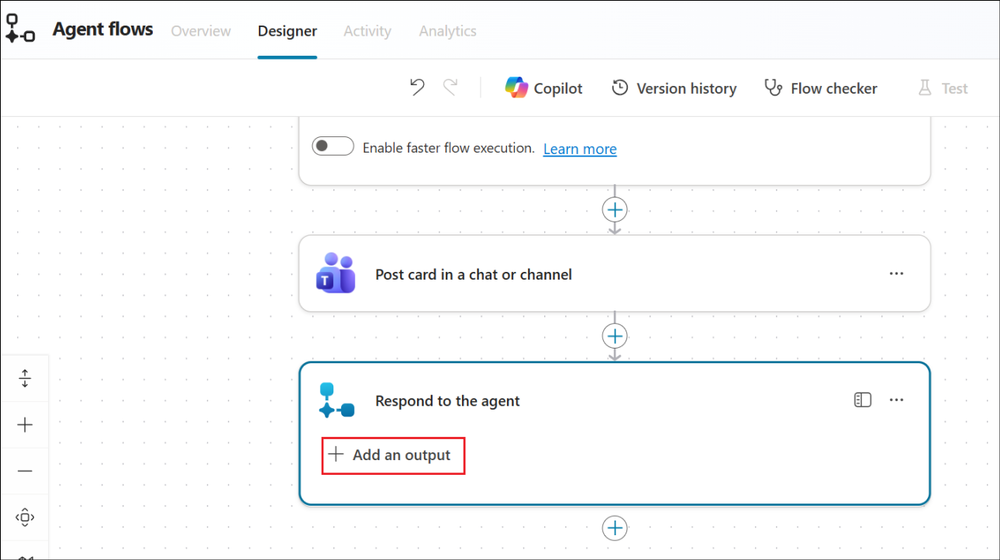

40. Selecione **Text** como o tipo de saída.

> 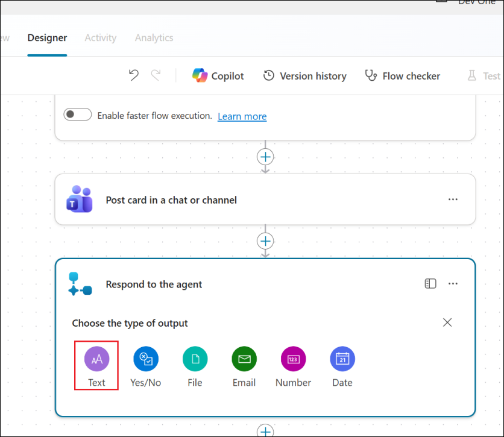

41. Insira os seguintes detalhes.

    - Name - +++EndConversation+++

    - Value - +++ Finished+++

> 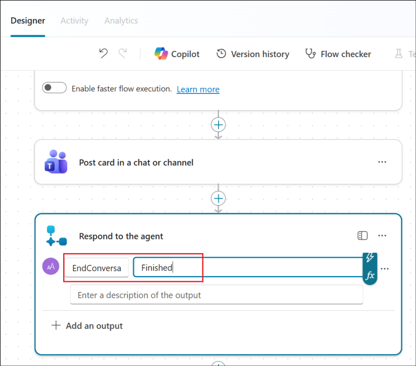

42. Agora concluímos a configuração do fluxo do agente. Selecione **Save
    draft** para salvar o fluxo do agente. Uma mensagem de confirmação
    será exibida após o salvamento.

> 

43. Antes de publicar o fluxo do agente, precisamos atualizar os
    detalhes do fluxo. Selecione a guia **Overview** e, em seguida,
    selecione **Edit**.

> 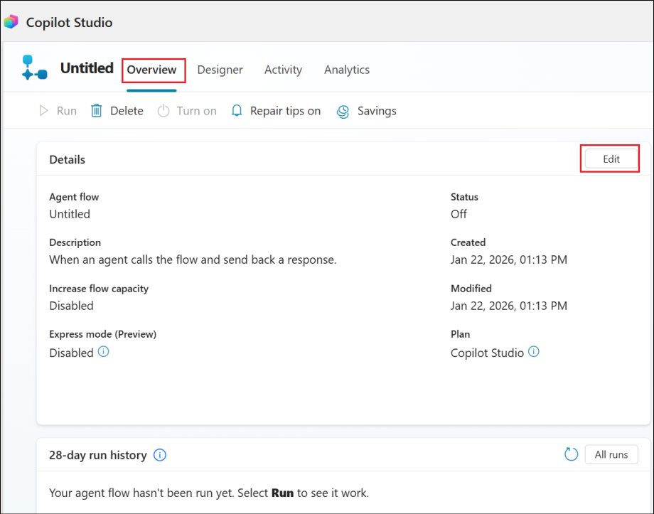

44. Insira o Name como +++Notify Teams Applicant channel+++ e selecione
    o ícone Refresh em Description para atualizá-la usando AI.

45. Após a descrição ser preenchida, selecione **Save** para salvar os
    detalhes atualizados do fluxo de agente.

> 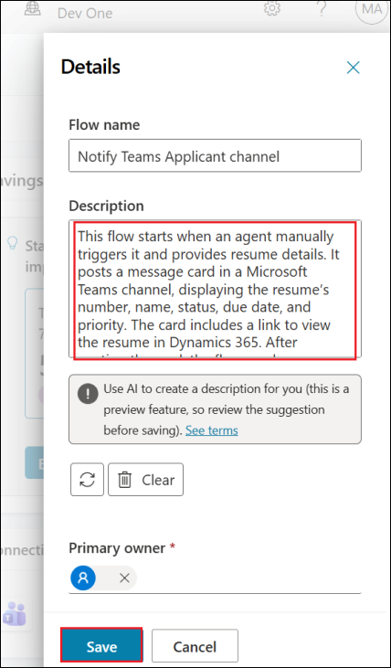

46. Volte para a guia **Designer** e selecione **Publish** para publicar
    o fluxo de agente.

> 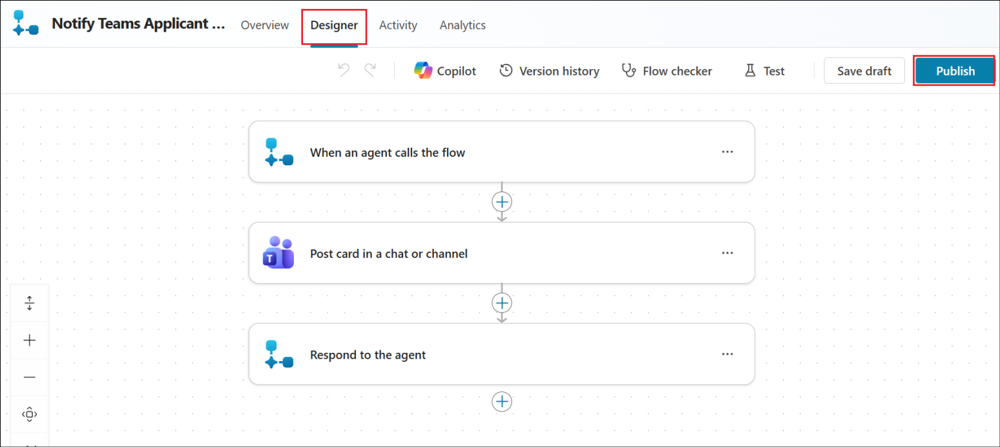

47. Uma mensagem de confirmação será exibida após a publicação.

> 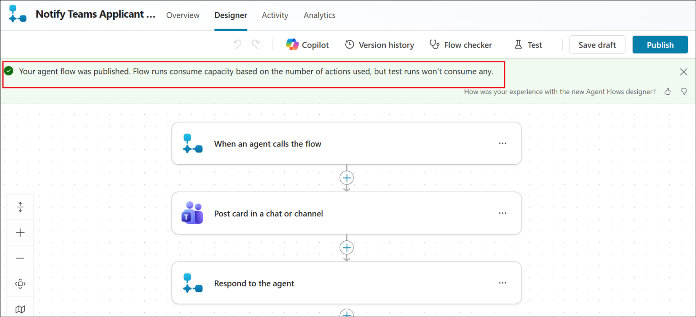

48. O fluxo de agente agora precisa ser adicionado como uma ferramenta
    no **Application Intake Agent**. Volte para o **Hiring Agent** e
    selecione a guia **Agents**; em seguida, selecione **Application
    Intake Agent**.

49. Na seção **Details** do agente, atualizaremos o campo
    **Description**. Copie o texto a seguir e cole-o ao final do texto
    de descrição..

+++and also notifies the Teams Applicant channel+++

Selecione **Save**.

> 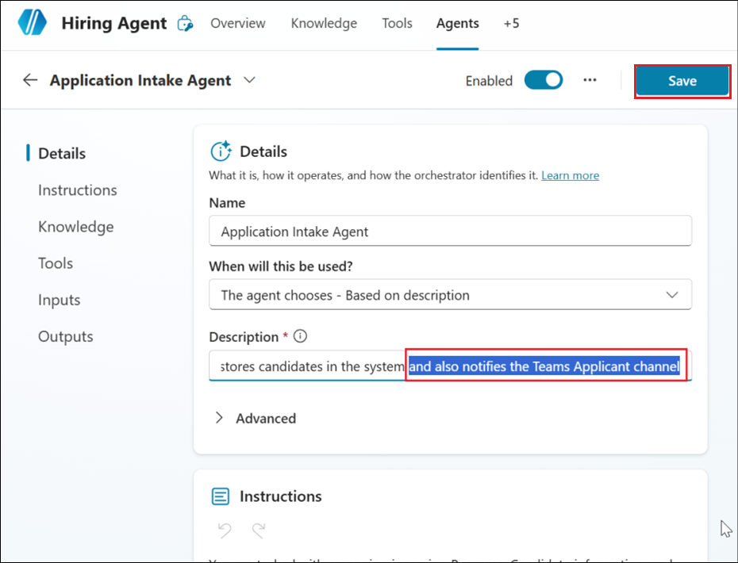

50. Em seguida, adicionaremos o fluxo de agente como uma **ferramenta**.
    Role a página para baixo até a seção tools e selecione **+ Add**.

> 

51. Selecione a guia **Flow** e escolha o fluxo de agente criado
    anteriormente, **Notify Teams Applicant Channel**.

> 

52. Selecione **Add and configure** a seguir.

> 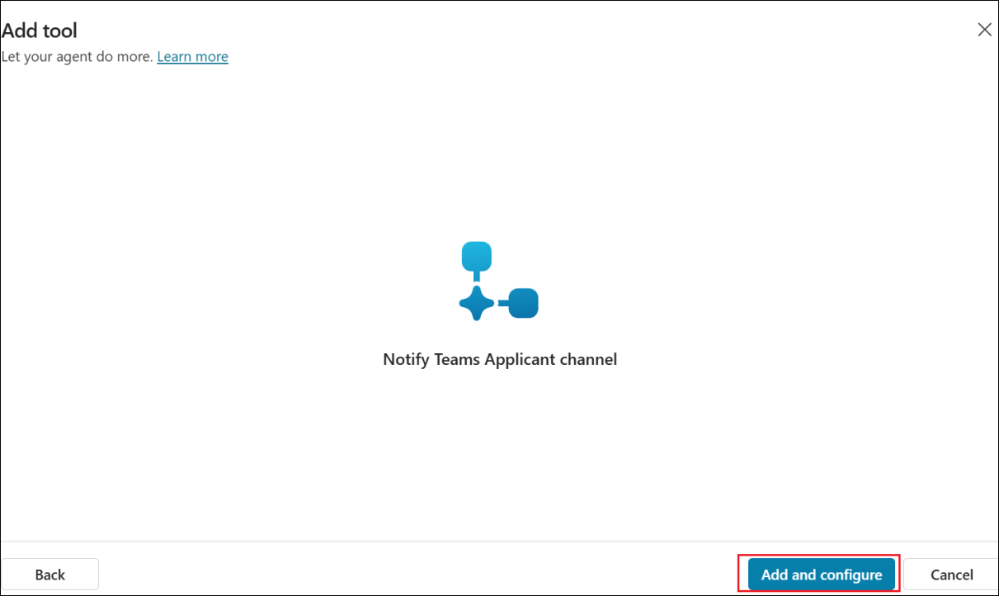

53. Na seção **Inputs**, os três inputs que configuramos anteriormente
    no fluxo de agente estão visíveis. Por padrão, a configuração **Fill
    using** configuration está definida como **Dynamically fill with
    AI**. Manteremos essa configuração como está, pois o prompt do
    acionador de evento conterá os valores de parâmetros que a AI irá
    extrair.

> 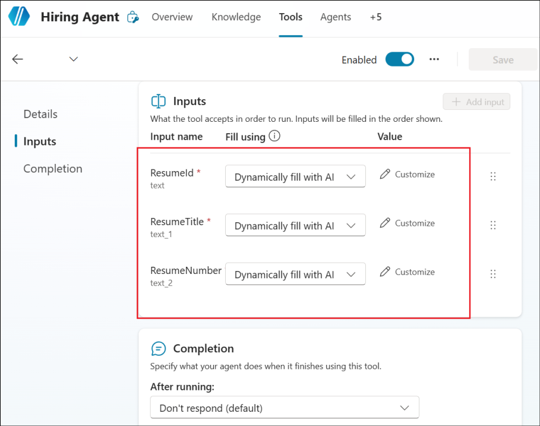

54. Agora que a ferramenta foi adicionada ao **Application Intake
    Agent**, as instruções do agente precisam ser atualizadas. Selecione
    a **seta de** **voltar**.

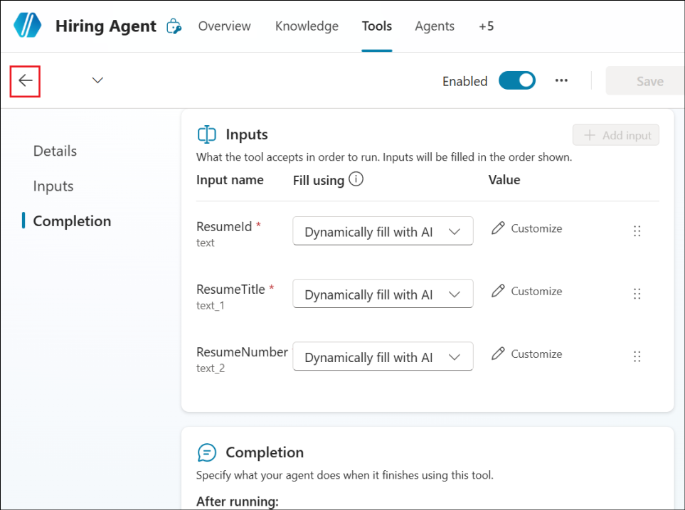

55. Selecione o **Application Intake Agent** na guia **Agents** do
    **Hiring Agent**.

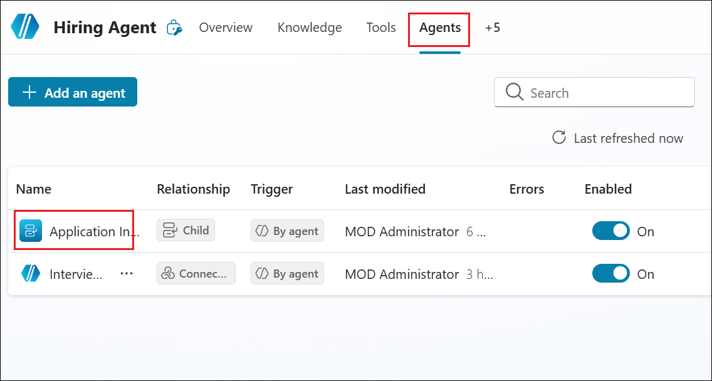

56. No campo **Instructions**, insira uma nova linha após
    **2.Post-Upload** instructions. Copie e cole as instruções a seguir.

> Process for Resume Upload via Email
>
> 1. When you receive a message, \*\*Send \[ResumeId (text)\] =
> "1680265f-5793-f011-b41b-7c1e525be9f7" and \[ResumeTitle (text_1)\] =
> "TAYLOR TESTPERSON (FICTITIOUS).pdf" and \[ResumeNumber (text_2)\]=
> "R01026" to the Tool "Notify Teams Applicant channel"\*\* in the child
> agent "Application Intake Agent", call \[AGENT FLOW PLACEHOLDER\]
>
> 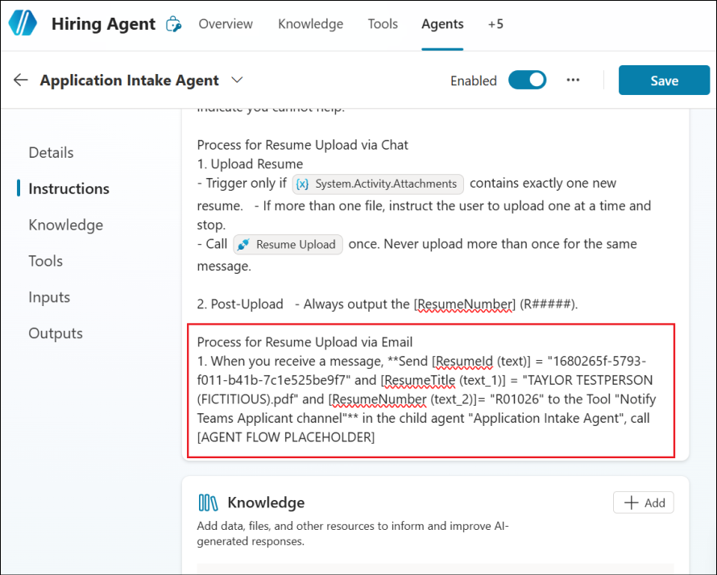

57. Selecione e destaque o texto \[AGENT FLOW PLACEHOLDER\].

> 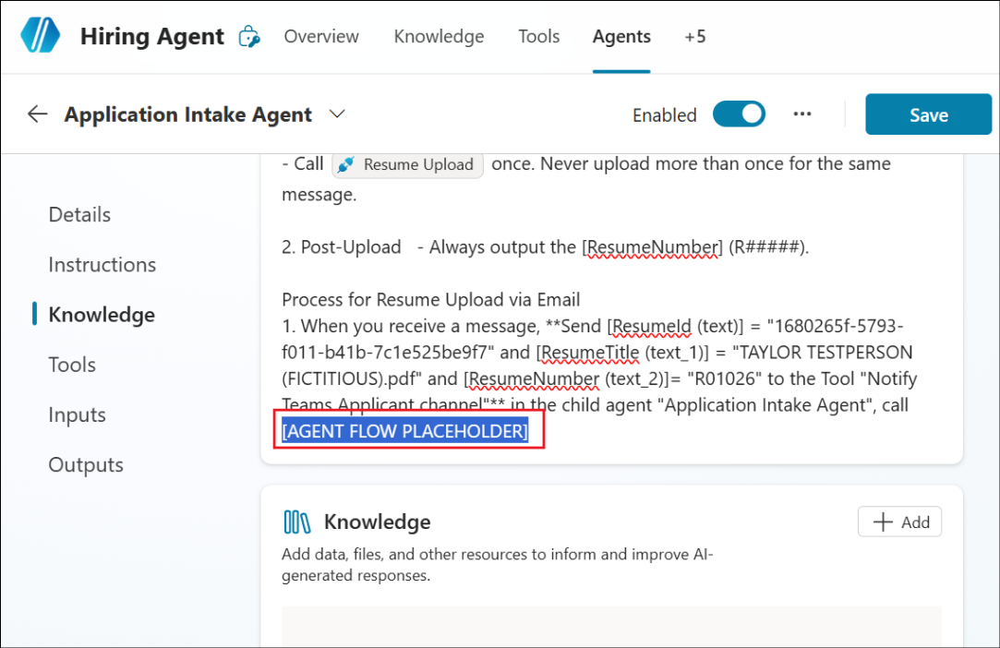

58. Insira o caractere de barra (/ ) e selecione a ferramenta **Notify
    Teams Applicant Channel**.

> 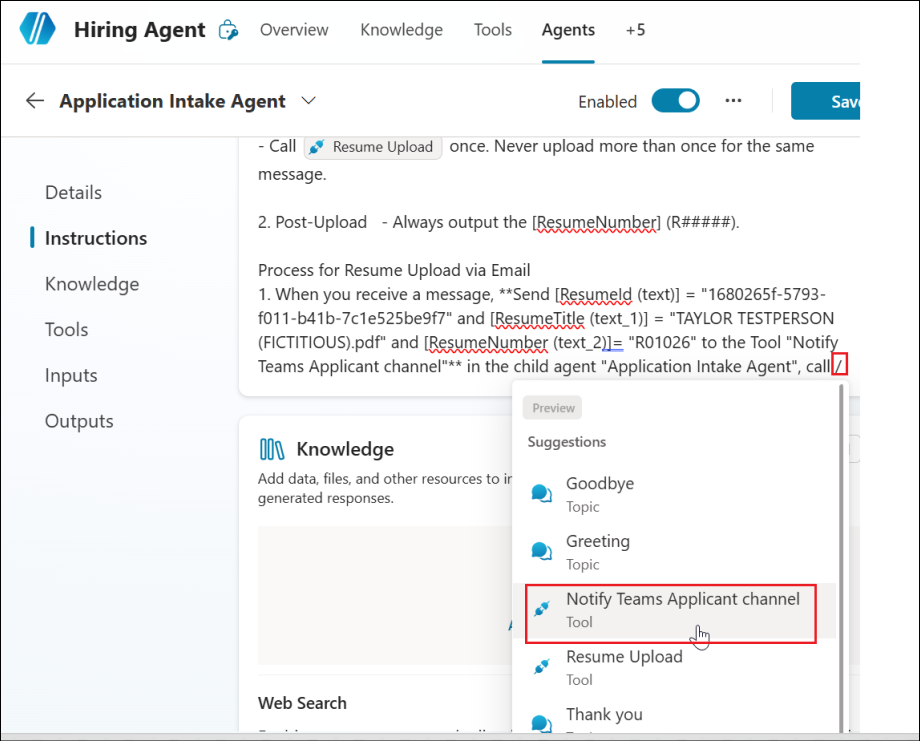

59. O fluxo de agente será agora invocado pelo **Application Intake
    Agent** conforme as instruções, após a última ação (**Sends a prompt
    to the specified copilot for processing**) no acionador de evento
    enviar ao agente o prompt que contém os valores dos parâmetros.

> Selecione **Save** para salvar as instruções atualizadas do
> **Application Intake Agent**.
>
> 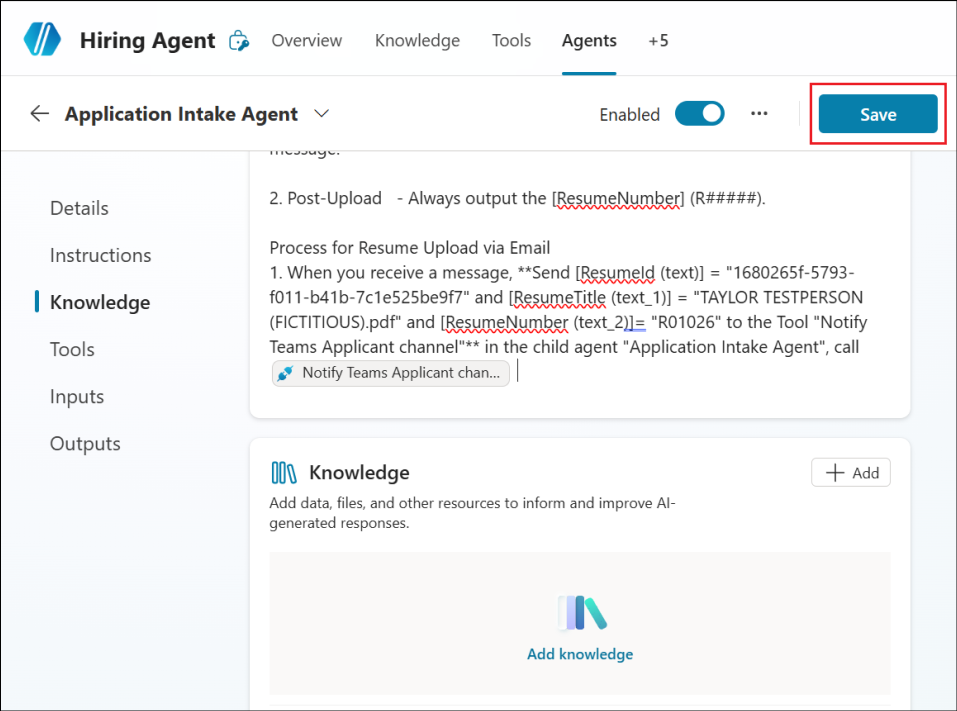

60. As instruções serão atualizadas após o agente ser salvo.

> 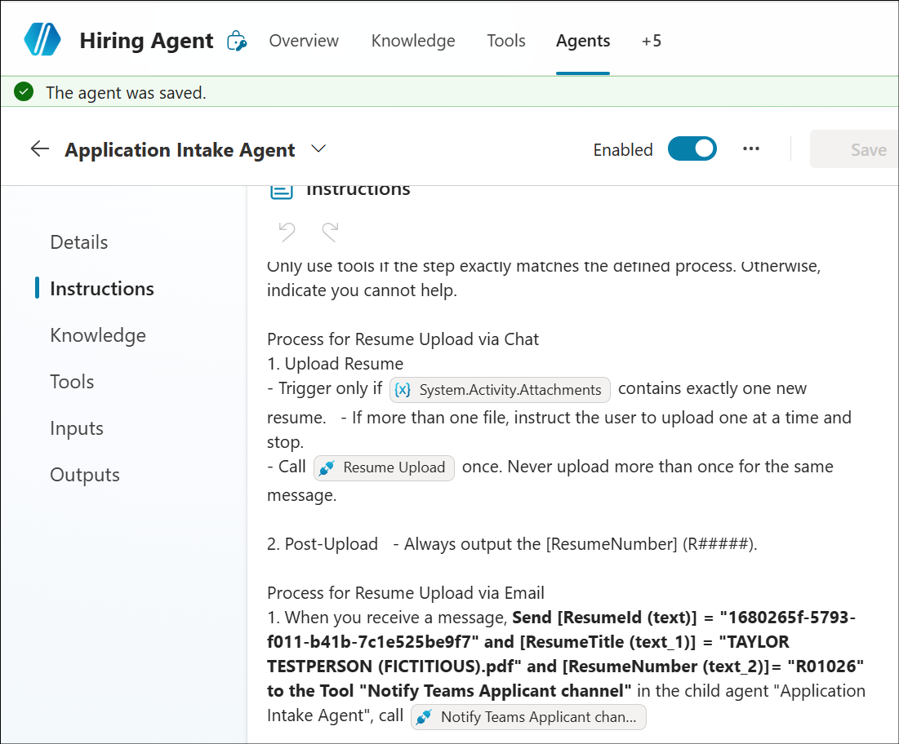

61. Agora precisamos **publicar** o **Hiring Agent**. Selecione
    **Publish** no canto superior direito e, na **janela** **modal
    Publish this agent** que será exibida, selecione **Publish**.

> 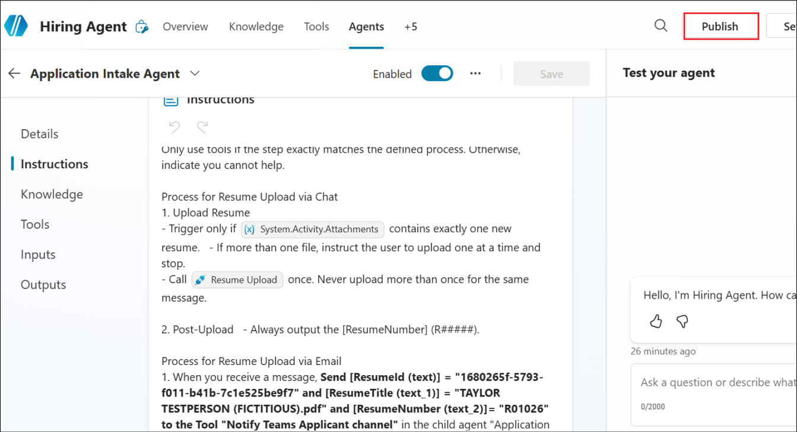
>
> 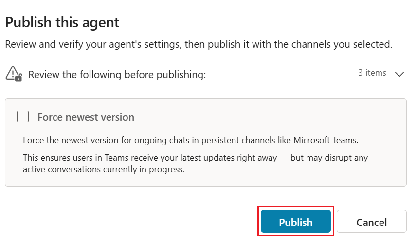

62. Após a publicação, será exibida uma mensagem de confirmação
    informando que o agente foi publicado.

> 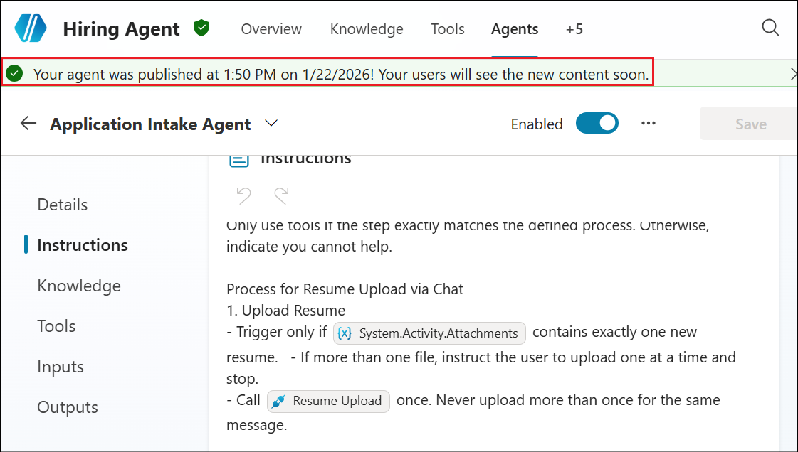

Agora podemos testar o agente!

## Exercício 3: Testar o acionador de evento

Neste exercício, você irá testar o acionador de evento criado neste
laboratório.

1.  Para executar o acionador de evento, é necessário enviar um e-mail
    com um arquivo de currículo em PDF. No Outlook, redija uma nova
    mensagem de e-mail.

[TABLE]

> Dear Hiring Manager,
>
> I am writing to express my interest in the Senior Power Platform
> Engineer position at your organization. With over nine years of
> experience delivering secure and scalable solutions on Microsoft cloud
> platforms, I am confident in my ability to contribute effectively to
> your team.
>
> In my most recent role as Lead Power Platform Engineer, I developed an
> automated resume-intake pipeline, reducing manual triage and improving
> searchability. I have delivered HR case management applications,
> introduced solution-aware flows, and implemented PR checks to enhance
> deployment lead times. My expertise includes Power Apps, Power
> Automate, Power Pages, Dataverse, and a range of Microsoft 365
> services, as well as integration with Graph/REST APIs and Azure
> Functions.
>
> Previously, I developed Teams approvals with adaptive cards, cutting
> approval times to the same day, and created robust error-handling
> frameworks. My background also includes migrating legacy workflows to
> Power Automate and building self-service portals adopted by hundreds
> of employees.
>
> I hold a B.Sc. in Computer Science and am certified as a Power
> Platform Developer (PL-400) and Solution Architect (PL-600). I am also
> passionate about mentoring and have volunteered with local maker
> groups.
>
> Please find my CV attached for your consideration. I would welcome the
> opportunity to discuss how my skills and experience align with your
> needs.
>
> Thank you for your time and consideration.
>
> Kind regards,
>
> Taylor Testperson

2.  **Envie** o e-mail após a composição a partir da sua caixa de
    correio.

> 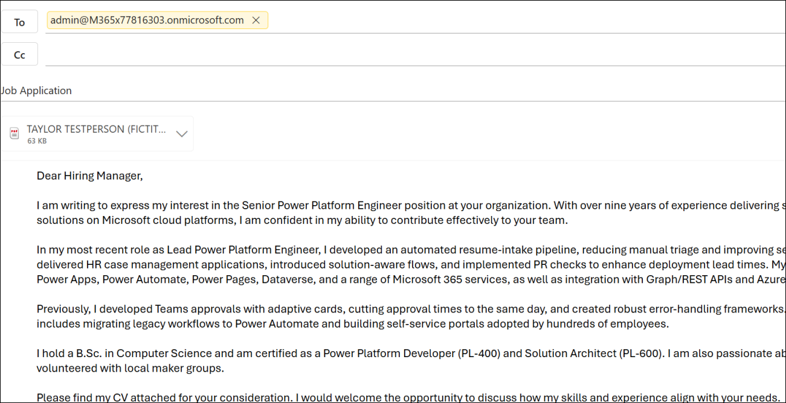

3.  No +++https://make.powerautomate.com/+++ para o fluxo do acionador
    de evento, selecione o ícone Refresh para visualizar a execução do
    fluxo que foi concluída com êxito para o e-mail enviado. Você pode
    ver que o fluxo foi executado com sucesso.

> 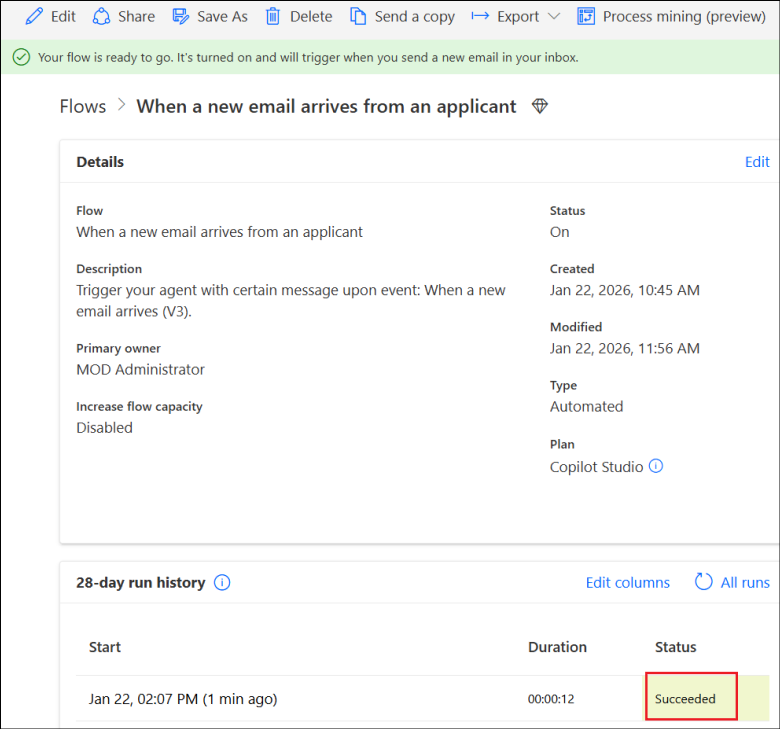

4.  De volta ao Copilot Studio, no Hiring Agent, selecione a guia
    **Activity**. A guia **Activity** será carregada e exibirá todas as
    atividades do **Hiring Agent**. Haverá uma atividade com o valor de
    nome **Automated** e status **Complete**. Essa atividade representa
    o acionador de evento e o fluxo de agente que foram invocados.

> 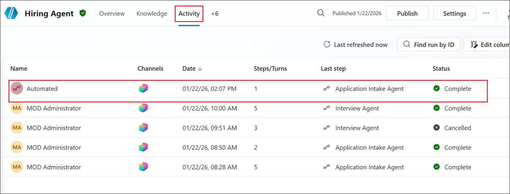

5.  Selecione a atividade e selecione o acionador de evento no mapa de
    atividades. No painel do lado direito, observe como os parâmetros de
    entrada no prompt contêm os valores dos parâmetros: Resume Id,
    Resume Title e Resume Number da linha do **Dataverse** que foi
    criada. Isso foi obtido a partir dos valores de conteúdo dinâmico
    configurados anteriormente em **Automate uploading resumes to
    Dataverse received by email**.

> 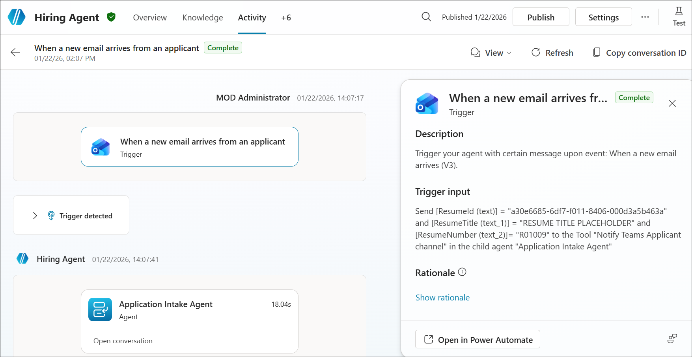

6.  Navegue de volta para o aplicativo orientado por modelo **Hiring
    Hub** e, na exibição do sistema **Resumes**, selecione **Refresh**
    para atualizar a exibição. A linha recém-criada para o currículo
    enviado por e-mail agora será listada, pois foi criada por meio do
    acionador de evento.

> 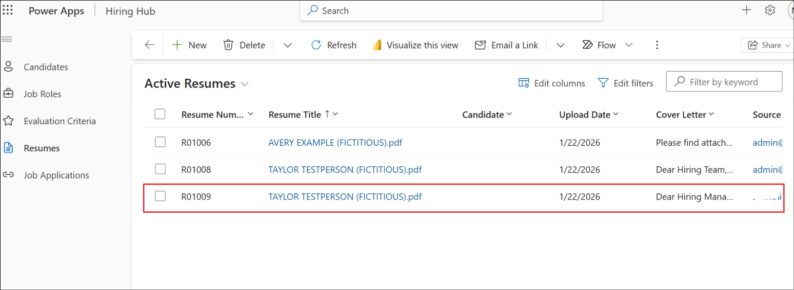

7.  Navegue de volta para o Copilot Studio e selecione o fluxo do agente
    **Notify Teams Applicant Channel** dentro do **Application Intake
    Agent** no mapa de atividades. No painel do lado direito, observe
    como as entradas têm valores da linha do Dataverse. Isso veio do
    prompt enviado pela última ação (**Envia um prompt ao Copilot
    especificado para processamento**) no acionador de evento que contém
    os valores dos parâmetros da linha recém-criada no Dataverse. É
    assim que podemos passar valores de parâmetros de acionadores de
    eventos para fluxos de agentes.

> 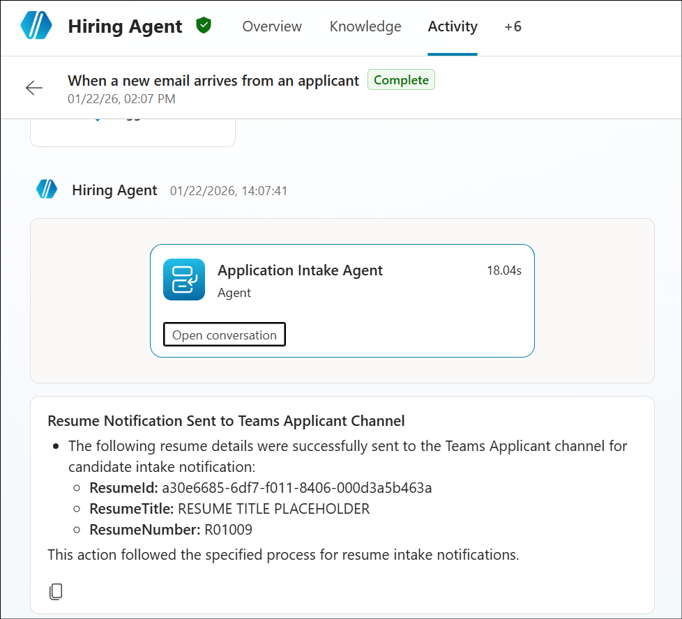

8.  Por fim, vamos dar uma olhada no cartão adaptativo publicado no
    canal no **Microsoft Teams**. No canal, veremos o cartão adaptativo
    que exibe as informações sobre a linha Resume recém-criada no
    Dataverse. Passe o mouse sobre o hiperlink no início do cartão
    adaptativo e observe como a URL é a URL da exibição do sistema
    Resumes que configuramos anteriormente na carga JSON do cartão
    adaptativo.

> 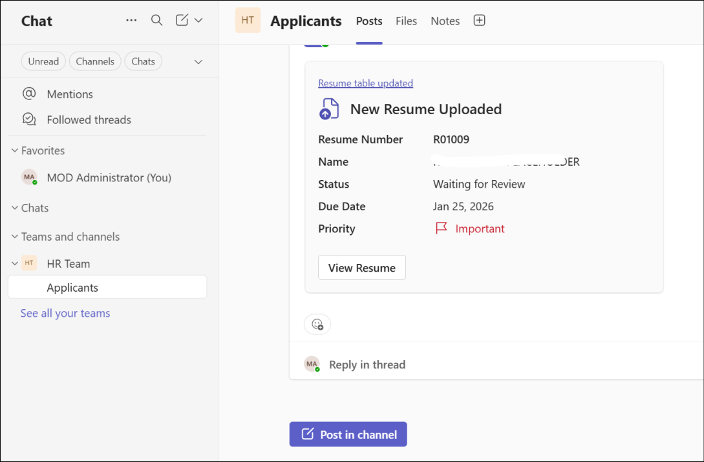

9.  Selecione o hiperlink e você será direcionado para a visualização do
    sistema Resumes no aplicativo orientado por modelo **Hiring Hub** no
    seu navegador.

> 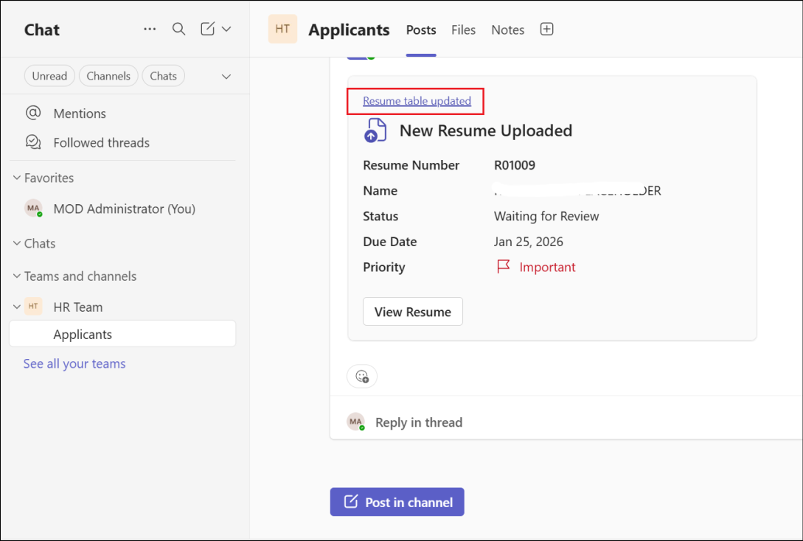

10. Navegue de volta para o cartão adaptativo publicado no canal no
    Microsoft Teams. Desta vez, passe o mouse sobre **View Resume**, que
    é a ação Action.OpenURL do cartão adaptativo. Observe como a URL é a
    linha Resumes que configuramos anteriormente na carga JSON do cartão
    adaptativo.

> 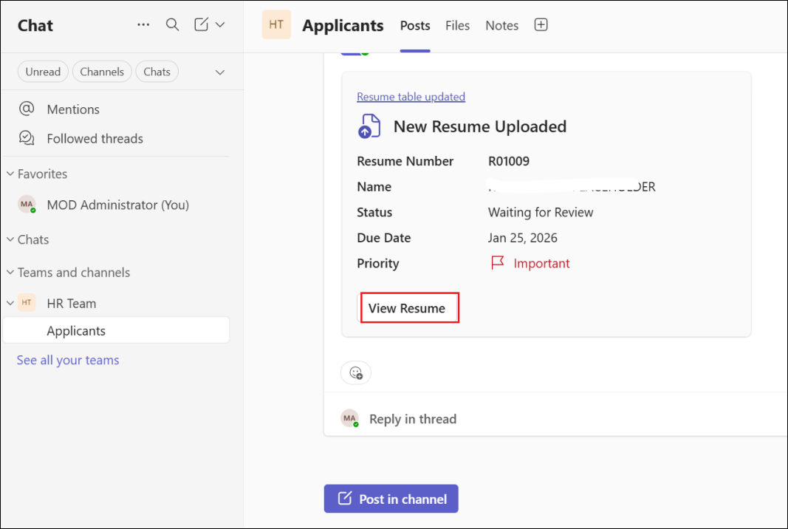

11. Selecione a ação e você será direcionado para o formulário da linha
    Resume no aplicativo orientado por modelo Hiring Hub no seu
    navegador.

> 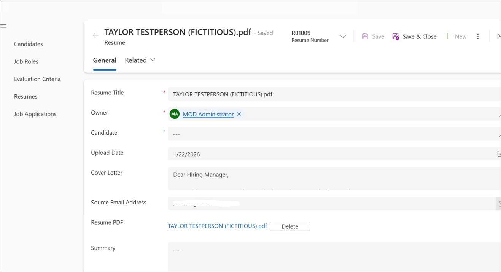

## Resumo

Neste laboratório,

1.  Você criou um acionador de evento que transmite valores de
    parâmetros do Dataverse para um fluxo de agente.

2.  Você criou um fluxo de agente que consome os valores de parâmetros
    do Dataverse para publicar um cartão adaptativo em um canal do
    Microsoft Teams e alertar a equipe de recrutamento de RH.

3.  Você atualizou as instruções do agente subordinado para invocar o
    fluxo após a conclusão do acionador de evento.

4.  Isso permite que o **Hiring Agent** opere de forma autônoma sempre
    que currículos forem recebidos como anexos de e-mail e notifique a
    equipe de recrutamento de RH para revisão manual.
