# Lab 07 – Develop a Personalized Shopping Assistant autonomous agent

## Objective

The objective of this lab is to create a personalized shopping agent for
Contoso Electronics. This will use Dataverse tables as the knowledge
source for the agent. It will suggest product categories to the customer
based on their latest shopping and assist them throughout the shopping
experience.

## Exercise 1 – Create Dataverse tables

In this exercise, you will create tables in the Dataverse to store the
**Customer**, **Product** and **Order** details.

1.  Login to +++https://make.powerapps.com+++ using your admin tenant
    credentials and select Dev One as your environment. Select Tables
    form the eft navigation pane.

2.  Select the drop down next to **+ New table** and select **Create new
    tables** under it.

3.  Select **Import an Excel file or .csv** to create a new table.

4.  Under Export an Excel or .CSV file, select the **Select from
    device** option.

5.  From **C:\Labfiles**, select the excel – **Customers.xlsx**. Select
    **Import** to import the data from the tracker and create the table.

6.  The table gets created with the data from the tracker.

7.  Here, that table name is **Customer Record**. The name might be
    slightly different in your case since it is automatically generated.
    Keep a note of it and use the appropriate Table name throughout the
    lab execution.

8.  Click on the table, and then select **View data** to view the data
    added to the table.

9.  Select **Save and exit**.

10. Click on **Save and exit** in the confirmation dialog.

11. Repeat the steps from 2 to 10 twice, to create tables once using the
    tracker **Product Catalog.xlsx** and the next time using
    **Orders.xls**

12. Now, we will have 3 tables,

    - Customer Record

    - Product Record

    - Orders

## Exercise 2 – Create a Shopping agent

In this exercise, you will create a Shopping agent which will assist
customers while shopping in Contoso Electronics.

### Task 1 – Create the agent

Create the agent in Copilot Studio by using Copilot. Chat with the
Copilot and give it instructions on how the agent should be designed and
how it should behave so that the Copilot will create the agent for you.

1.  Login to the Copilot Studio at
    +++https://copilotstudio.microsoft.com/+++ and select the **Dev
    One** environment.

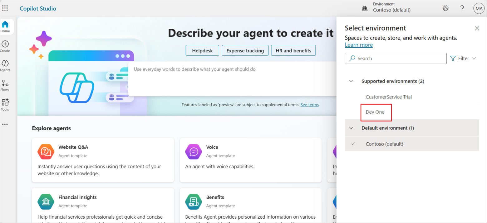

2.  Select **Agents** and then click on **+ New agent**.

3.  Enter the below in the chat and send it.

+++Create an agent that will assist the customers in shopping with
Contoso Electronics. Name it as "Shopping agent".+++

4.  Enter +++Help the users in finding products and their prices, give
    personalized suggestions and track order delivery.+++ and hit
    **Enter**.

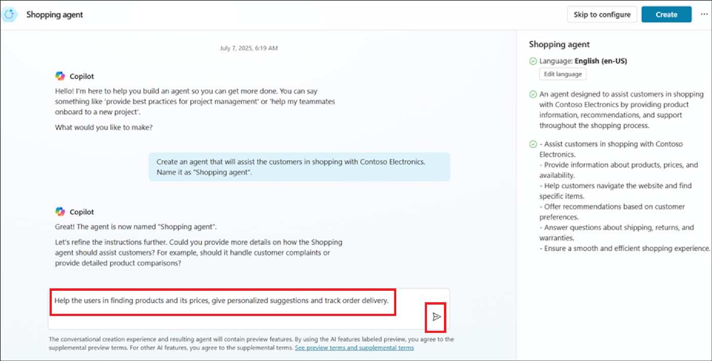

5.  Enter additional instructions as below.

+++Maintain a polite tone+++

6.  Click **Create** to create the **Shopping agent**.

> 

7.  The agent gets set up. This might take a few minutes. Once the agent
    is ready, it gets displayed in Copilot Studio as in the screenshot
    below.

### Task 2 – Add Knowledge

Adding knowledge to the agent makes it grounded to those knowledge
resources enabling it to answer the user queries more effectively. In
this task, you will add the Dataverse table created in the earlier
exercise as a knowledge source to this agent.

1.  Enter +++What is the status of the order o1001?+++ in the Test pane.

2.  The response will be similar the one below since the agent does not
    have any information on this.

3.  Now, we will add knowledge source to the agent. From the **Home**
    page of the agent, select **Add Knowledge** under the **Knowledge**
    section.

4.  Select **Dataverse** from the list of available options.

5.  Search for +++order+++, select the **Order Record** table and click
    **Next**.

6.  Select **Add**.

7.  Wait for a few minutes after the knowledge source is added before
    testing the agent again.

8.  Once the **Order Record** becomes **Ready** under the Knowledge
    section, ask the same question in the Test pane.

You can now see that the agent retrieves the information from the
database and provides it to the user.

### Task 3 – Create Entities

1.  Select **Settings** from the Home screen of the agent.

2.  Select **Entities** from the left pane. Select **Add an entity -\> +
    New entity**

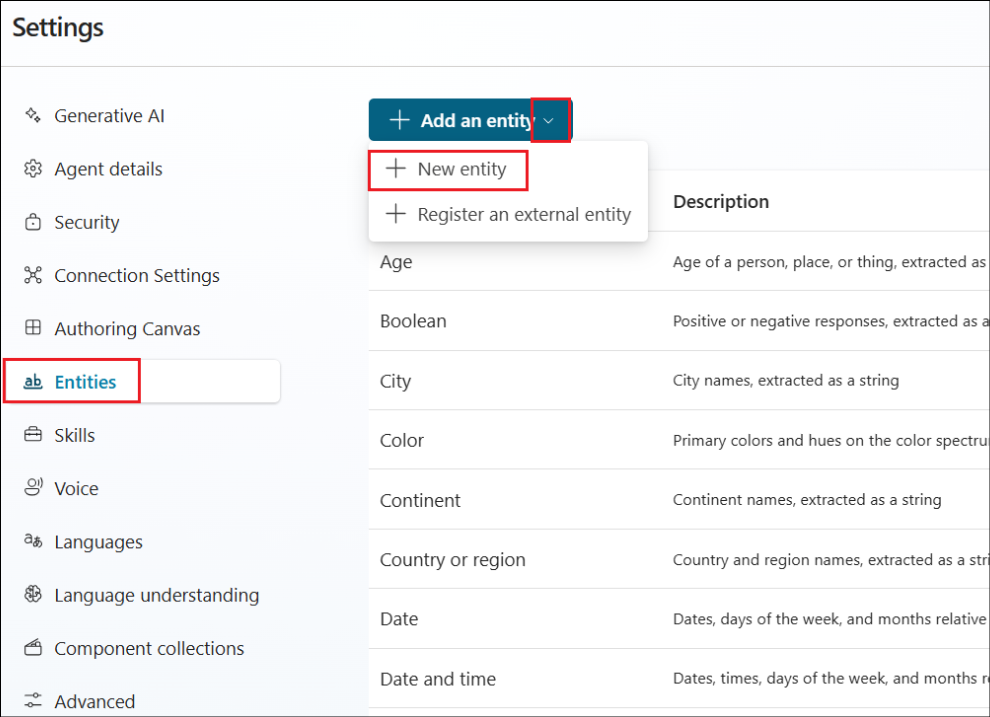

3.  Select **Closed list**.

4.  Enter the below details.

Name - +++Laptop+++

Description - +++Contains products under Laptop category+++

Under **List items**, enter +++Apple MacBook Air M3+++ and click on
**Add**.

5.  Similarly, add the below items and then select **Save**.

+++Dell XPS 13 Plus+++

+++HP Spectre x360 14+++

+++Lenovo ThinkPad X1 Carbon Gen 12+++

+++Asus ROG Zephyrus G14+++

6.  Now, repeat steps 2 to 5 with the below data.

Name - +++Desktop+++

Description - +++Contains products under Desktop category+++

Under **List items**, enter +++Apple iMac+++ and click on **Add**.

7.  Other items to be added in the list,

+++Microsoft Surface Studio 2+++

+++HP Envy Desktop+++

+++Dell Inspiron Desktop+++

+++Lenovo IdeaCentre AIO 5i+++

8.  Again, repeat steps 2 to 5 with the below data.

Name - +++Tablet+++

Description - +++Contains products under Tablet category+++

Under **List items**, enter +++Apple iPad Pro+++ and click on **Add**.

9.  Other items to be added in the list,

+++Samsung Galaxy Tab S9 Ultra+++

+++Microsoft Surface Pro 10+++

+++Lenovo Tab P12 Pro+++

+++Apple iPad Air+++

## Exercise 3 – Create Topics and agent flows and design the agent

Designing Topics is a very important part in creating an agent since it
deals with the logic behind how the user’s questions are answered and
how the flow of the details will be.

### Task 1 – Edit the Conversation Start topic

The Conversation Start topic is the first topic to be invoked when
testing the agent. It is a System Topic available by default in any
agent that you create in the Copilot Studio. Now, you will edit this
topic to continue the conversation from the greeting message from the
agent.

1.  From the **Overview** page of the agent, select the **Topics** tab
    from the top menu bar. Select **System** to view the list of System
    topics. Select the Conversation Start topic from the list.

2.  After the existing Message node, add a **Question node**.

3.  Enter the below message,

+++Welcome to Contoso Electronics. Please enter your **Phone number** to
proceed.+++ in the message area and select **User’s entire response**
under **Identity**. Click on the **Var1** under **Save user response
as** field.

> 

4.  Rename **Var 1** to +++MobileNumber+++ and select **Global** to use
    it across topics and then select **Save**.

### Task 2 – Create a topic to handle the Customer details

1.  From the Overview page of the agent, select the Topics tab from the
    top menu bar. Select the drop down next to **Add a topic -\> From
    blank**.

2.  Name the agent as +++Customer Details+++.

3.  Select **Change trigger** and select **It’s redirected to** as the
    trigger.

4.  Select **Save** to save the topic.

### Task 3 – Create an Agent flow to get the details of the customer

In this task, you will create an Agent flow, to which you will pass the
Phone number entered by the customer as input and design the flow to
check if the user exists or not and retrieve the information and return
the details to the agent.

1.  Below the Trigger node, add a node, select **Add a tool** -\> **New
    Agent flow**.

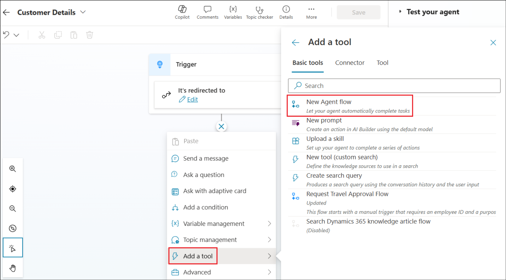

2.  The Agent flow designer opens up. Select **Save draft** to save the
    flow.

3.  Select **Overview** from the top menu, click on **Edit** and enter
    the name of the flow as +++GetCustomer+++. Then select **Save**. 

4.  Navigate to the **Designer** tab again to design the flow. Select
    the node **When an agent calls the flow** and then select **+ Add an
    input**.

5.  Select **Text**.

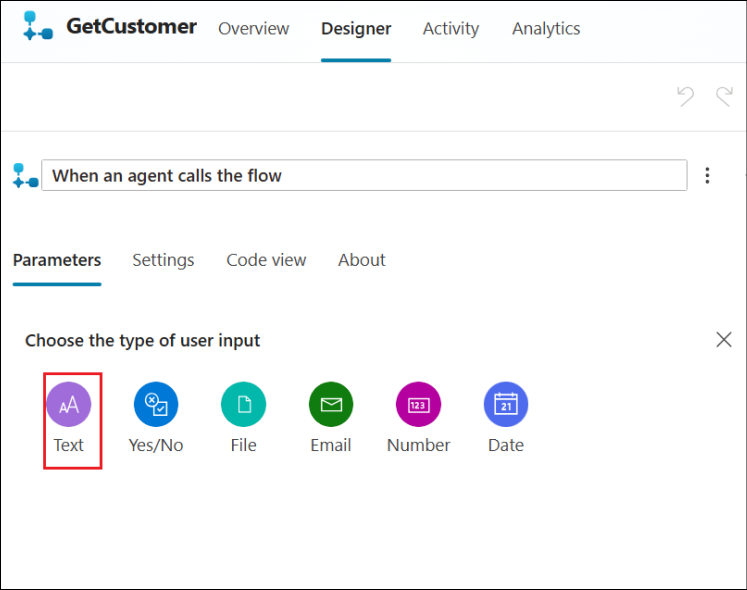

6.  Enter the input as +++Phone number+++ and then collapse the
    **Parameters** tab.

7.  Click on **Add an action** between the 2 nodes in the flow. Search
    for +++List rows+++ and select the **List rows** action under
    **Microsoft Dataverse**.

8.  Enter the connection name as +++**Dataverse**+++ and click **Sign
    in**.

9.  **Sign in** using your admin tenant credentials and click on **Allow
    access** if prompted.

10. Navigate to PowerApps at +++https://make.powerapps.com/+++ and open
    the **Customer Record** table. Click on the drop down next to the
    **Mobile number** field and select **Edit column**.

11. Scroll down and under **Advanced options**, there is a field named
    **Logical name**. Make a note of its value in a note pad.

**Important:** Each filed will have an associated Logical name to it in
Dataverse. And while using it in the Agent flow, you will have to
specify only the logical names for all the fields.

12. In this case, for Phone number, it is **cr6dd_mobilecontact**. Make
    a note of it

13. Navigate back to the Copilot Studio – Agent flow tab. Open the
    Getcustomer flow and select the **List rows** action.

14. Under Filter rows, enter **\<Logical name of Mobile number\> eq '
    '**. Replace **\<Logical name\>** with the value you retrieved in
    the earlier step. Keep the cursor inside the quotes and add the
    Phone number – dynamic variable.

In this case, it will be **cr6dd_mobilecontact eq 'Phone number'**

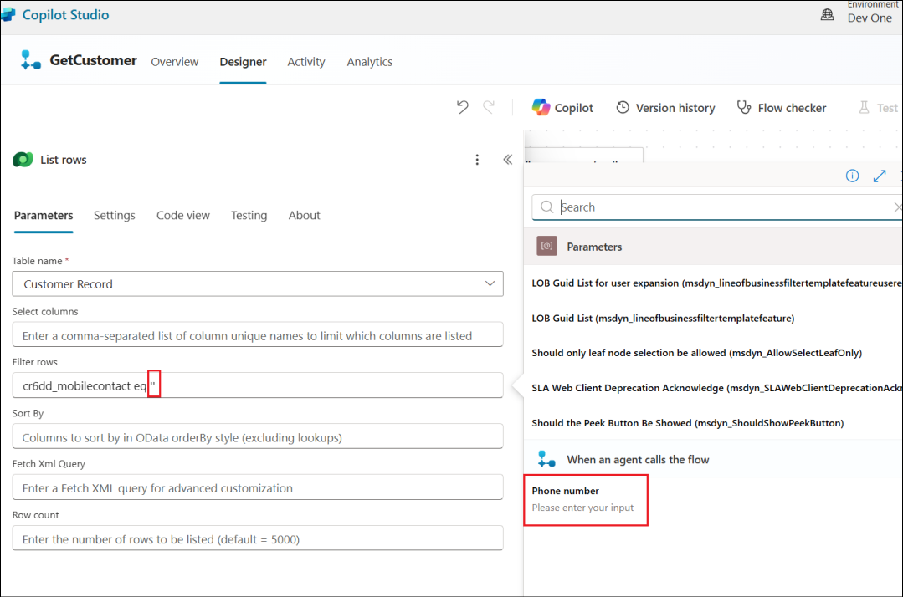

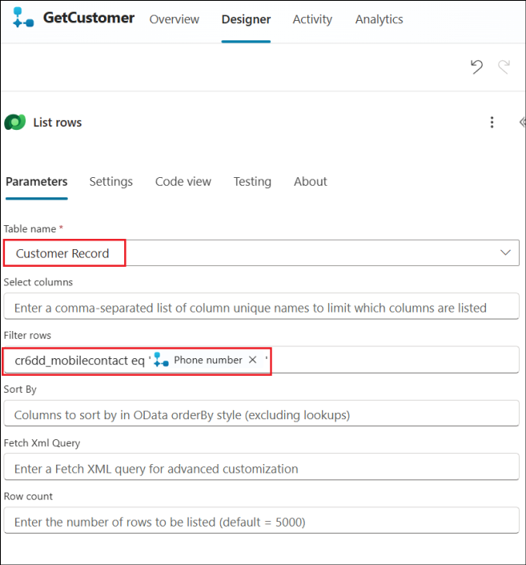

15. Below the List rows node, add a **Condition** node.

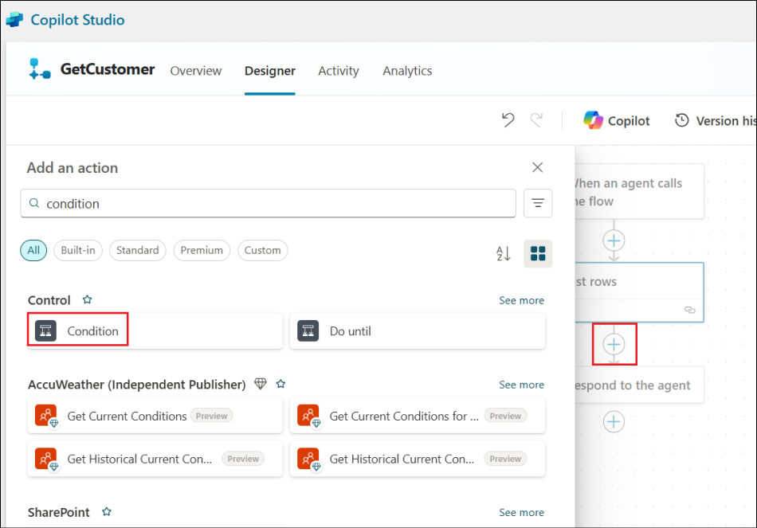

16. Enter **/** and select **Insert expression**.

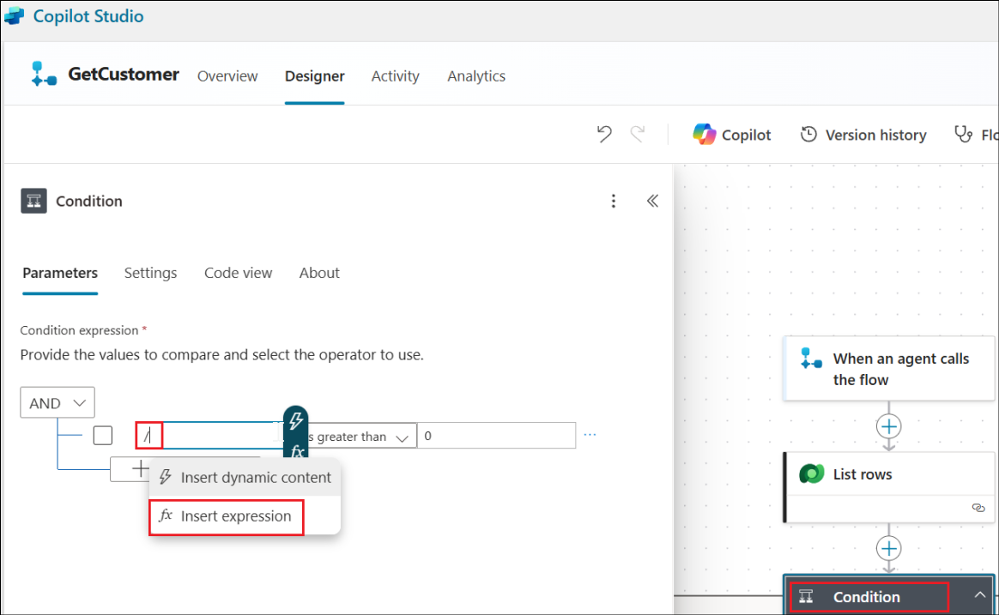

17. Enter +++length(outputs('List_rows')?\['body'\]?\['value'\])+++ in
    the function and select **Add**. This will check if the List rows
    returns a value or not.

18. Click on **Add an action** under the **True** branch of the
    condition added and add a new **Condition** node.

19. Enter +++not(empty(first(outputs('List_rows')?\['body/value'\])?\[
    cr6dd_lastpurchasedproduct '\]))+++ in the function area of the
    condition.

> **Important** – Make sure to replace the
> **cr6dd_lastpurchasedproduct** with the **logical name** of the field
> **Recent Products Purchased** from the **Customer Record** table
>
> 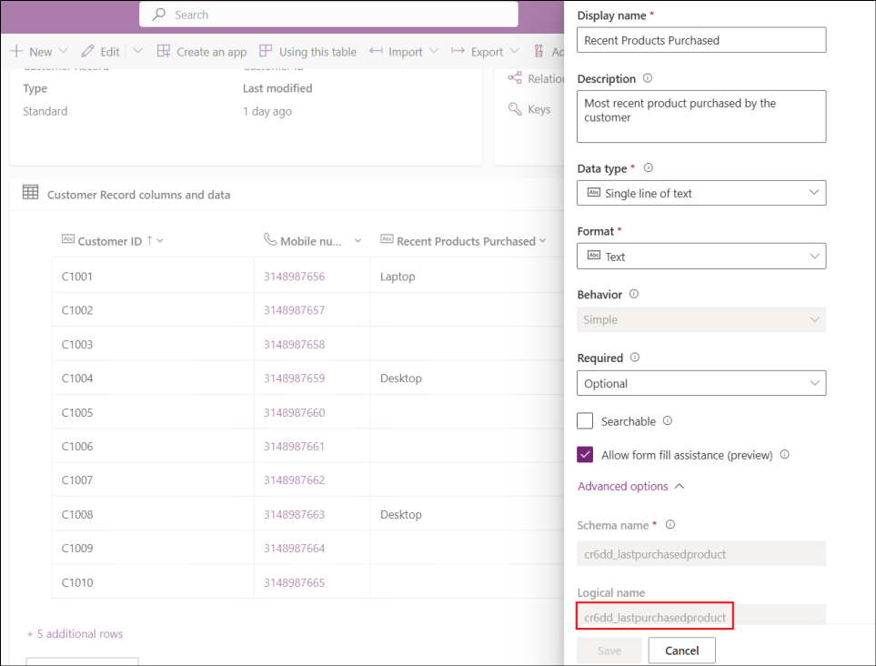

20. Set the condition as **is equal to true**

21. Add a new action below the **True** path of **Condition1** and
    select the **Respond to the agent** node.

22. Select the added **Respond to the agent node** and rename it to
    +++If the customer has made a previous purchase+++ and select **+
    Add an output**.

23. Select **Text**.

24. Enter +++Customer ID+++ as the name and click on **Insert
    expression**.

25. Enter
    +++first(outputs('List_rows')?\['body/value'\])\['cr6dd_customeridentifier'\]
    +++ The **cr6dd_customeridentifier** is the logical name of the
    Customer ID of the Customer Record table. **Replace** it with your
    value.

26. Select **Add**.

27. Similarly, add the below output variables and expressions to each
    one of it. For each variable, make sure to replace the logical name
    with yours.

- +++Customer Name+++ -
  +++first(outputs('List_rows')?\['body/value'\])\['cr6dd_fullname'\]+++

- +++Product Category+++ -
  +++first(outputs('List_rows')?\['body/value'\])\['cr6dd_lastpurchasedproduct'\]+++

28. The **Respond to the agent** node will have 3 output variables as in
    the screenshot below.

29. Add a Respond to the agent node under the **False** path of the
    **Condition1** node. Rename it to +++If the customer has not made a
    previous purchase+++. Click on **+ Add an output**.

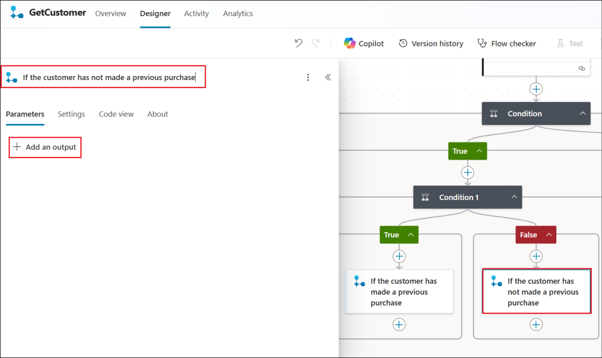

30. Enter the below output variables replacing the column logical names
    with your logical names for the corresponding columns.

- +++Customer ID+++ -
  +++first(outputs('List_rows')?\['body/value'\])\['cr6dd_customeridentifier'\]
  +++

- +++Customer Name+++ -
  +++first(outputs('List_rows')?\['body/value'\])\['cr6dd_fullname'\]+++

- +++Product Category+++ - +++’1’+++

31. The **Respond to the agent** node under the **False** path will look
    like the one in the screenshot below.

32. Now, add a **Respond to the agent** node under the **False** path of
    the Condition node, rename it to +++If the customer does not
    exist+++ and add outputs to it as below.

- +++Customer ID+++ - +++’1’+++

- +++Customer Name+++ - +++’1’+++

- +++Product Category+++ - +++’1’+++

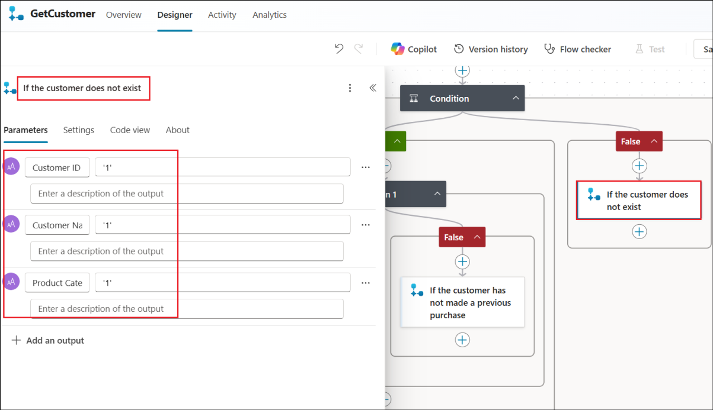

33. The **GetCustomer** flow will look like the one in the screenshot
    below.

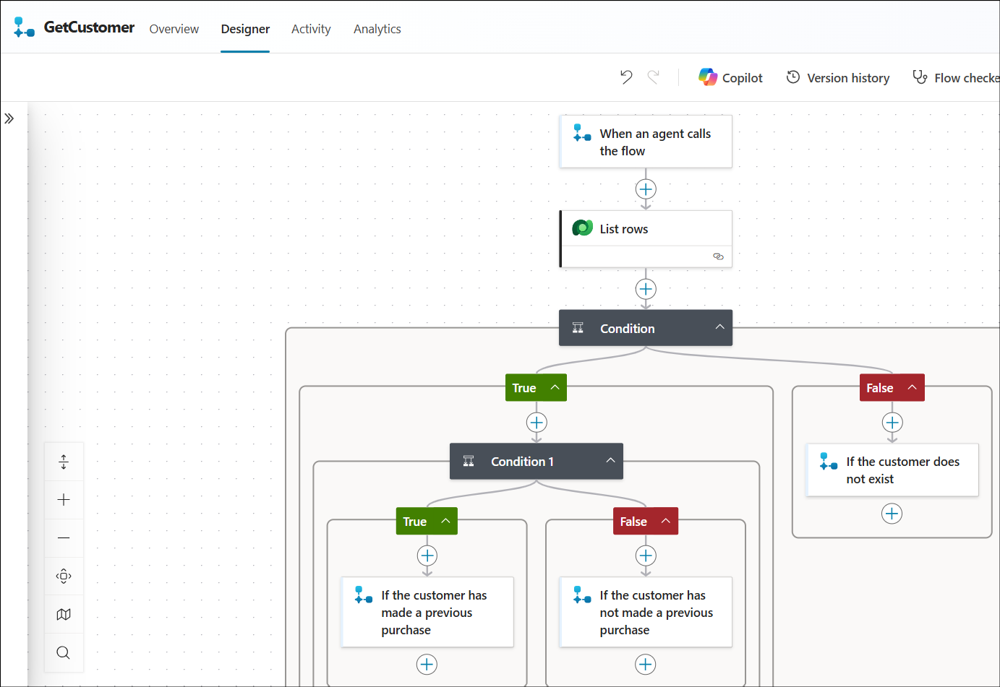

34. Right click on the **Respond to the agent** that is there as a
    common one at the end of the flow and select **Delete** to delete
    it.

35. Select **Save Draft** to save the lab. Once saved, click on
    **Publish** to publish the flow.

### Task 4 – Create Agent flow to add customer

In this task, you will create an Agent flow to add a new customer into
the Dataverse when the customer is a new customer.

1.  From **Agent flows** tab, select **+ New agent flow.**

2.  Select **Add a trigger** node and replace it with **When an agent
    calls the flow** node.

3.  Select **+ Add an input** and add a **Text** input.

4.  Enter +++Name+++ as the input name.

5.  Similarly, add the following input values.

+++Phone Number+++

+++Email ID+++

+++Address+++

> 

6.  Add an action below the node and select **Add a new row**.

7.  Select the Table Name as **Customer Record** and then select **Show
    all** in Advanced parameters.

8.  Click in the **Address** field, select the **Dynamic value** and
    then select the **Address** dynamic value.

9.  Similarly, add the dynamic values for

- Customer Name – Name

- Email ID – Email ID

- Mobile Number - Phone Number

10. Ewqewqewq Open the insert expression for **Customer ID**, enter
    +++guid()+++ and select **Add**. This is to add a unique value as
    the ID for the customer.

11. Add a new action and select **Respond to the agent**.

12. Add a output value named +++Customer ID+++ and insert an expression
    and enter
    +++string(outputs('Add_a_new_row')?\['body/cr6dd_customeridentifier'\])+++
    as the value.

Replace **cr6dd_customeridentifier** with your logical name for the
column **Customer ID**.

Select **Add**.

13. Select **Save draft** to save the flow.

14. Once the flow is saved, select **Publish** to publish the flow.

15. Select **Overview** tab. **Click on Edit.** Enter the name of the
    flow as +++Add Customer+++ and then select **Save**.

### Task 5 – Add the flow and design the Customer Details topic

In this task, you will design the Customer Details topic which will get
the phone number of the customer, check if the detail is already present
in the Dataverse and add it if not already present.

1.  Navigate back to the **Customer Details** topic.

2.  Add a node under the Trigger node, select **Add a tool -\>
    GetCustomer**.

3.  In the Inputs, select the variable **MobileNumber**.

4.  Select the **output** variables and mark the Customer ID and
    ProductCategory as **Global** as in the screenshot below.

5.  Below the **Action** node, add a **condition** node.

6.  Select **CustomerID** in **Select a variable**.

7.  Select the condition as **is not equal to** and enter +++ '1'+++ in
    the **Value** field. This checks if the customer detail is already
    existing in the database.

8.  Under the condition node, add a **Set a variable** node.

9.  Click on **Select a variable** and select **Create a new variable**.

10. Name the variable as +++IsNewCustomer+++ and mark it as **Global**.

11. Set the value as +++‘No’+++. This means that the customer is an old
    customer whose data is already present in the Dataverse.

12. You will add a new node next to the variable node and give a Welcome
    message to the customer.

13. Select Add a node and select **Send a message** node. In the message
    area, type +++Welcome+++ and then click on the {x} icon to select
    the variable. Select the **Customer Name** variable.

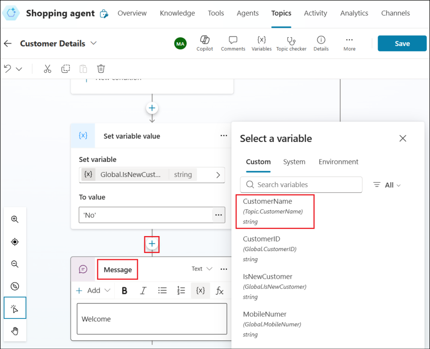

Now, we have invoked the Agent flow **GetCustomer**, checked if the
customer record already exist and if yes, Added a Welcome message to the
customer.

Now, we will design the part of the topic if the customer record does
not already exist.

13. Under the **All other conditions** node, add a Set a variable node
    and set the value for **isNewCustomer** variable as +++’Yes’+++.

14. Next to the variable node, add a **Message** node and enter +++We do
    not have your details in our system. Please fill in your details
    below to help us serve you better.+++

15. Next to the Message node, add an **Ask with adaptive card** node.

16. Click on the 3 dots on the top right of the screen and select
    **Properties**.

17. Select **Edit adaptive card**.

18. Enter the below **JSON** in the **Card payload editor** area. Select
    **Save**.

> {
>
> "type": "AdaptiveCard",
>
> "body": \[
>
> {
>
> "type": "TextBlock",
>
> "size": "Medium",
>
> "weight": "Bolder",
>
> "text": "Please enter your details"
>
> },
>
> {
>
> "type": "Input.Text",
>
> "id": "Name",
>
> "label": "Name"
>
> },
>
> {
>
> "type": "Input.Text",
>
> "id": "Mobile Number",
>
> "label": "Mobile Number"
>
> },
>
> {
>
> "type": "Input.Text",
>
> "id": "Email ID",
>
> "label": "Email ID"
>
> },
>
> {
>
> "type": "Input.Text",
>
> "id": "Address",
>
> "label": "Address"
>
> }
>
> \],
>
> "actions": \[
>
> {
>
> "type": "Action.Submit",
>
> "title": "Submit"
>
> }
>
> \],
>
> "version": "1.5",
>
> "$schema": "https://adaptivecards.io/schemas/adaptive-card.json"
>
> }
>
> 

19. Select **Close** to close the editor.

20. Expand the Outputs section of the created Adaptive card node, select
    the Mobile Number value and select the Global.MobileNumber variable
    to save the user entered Phone number value in it.

21. Leave the other values to the default ones.

22. The Adaptive card is ready with the form to get the customer
    details.

23. Next to the Adaptive card node, invoke the flow **Add Customer.**

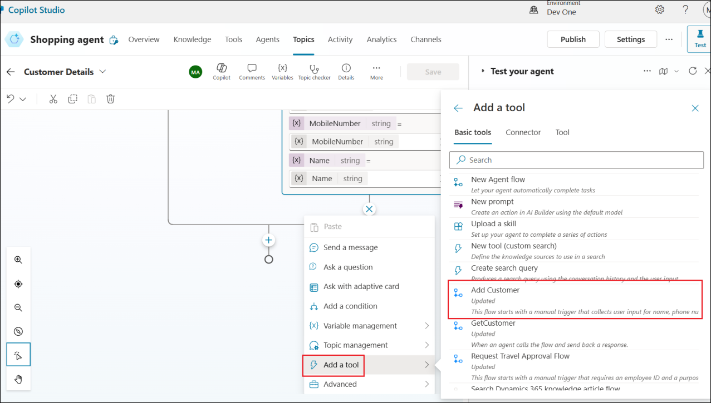

24. Click on the **three dots** in the **Enter or select a value** and
    select **CustomerName** variable.

25. Similarly, add the input variables for the other fields to be passed
    to the flow.

26. Select **Global.CustomerID** as the output variable to which the
    output from the flow will be saved.

27. After the action node, add a **Message node** and enter the value,
    +++Thank You! Customer detail has been added to the database. Please
    select a product type to shop.+++

28. **Save** the topic.

29. Open the Conversation Start topic and invoke the Customer Details
    topic from there.

30. Add a node after the Question node in the topic. Select **Topic
    management -\> Go to another topic**.

31. Select the **Customer Details** topic.

32. Select **Save** to save the topic.

### Task 6 – Create an agent flow to get the product details

In this task, you will create an agent flow which will fetch the Product
details from the Dataverse based on the selected product.

1.  Select the **Flows** tab from the Copilot Studio and select **+ New
    agent flow**.

2.  Select the trigger node and select **When an agent calls the flow**
    action.

3.  Add a Text input and name it as +++Product Name+++

4.  Select **Save draft** to save the flow.

5.  Select the **Overview** tab and click on **Edit**. Enter the name as
    +++GetProductDetails+++ and select **Save**.

6.  Navigate back to the **Designer** tab and select **Add an action**
    below the **When an agent calls the flow** node. Search for +++list
    rows+++ and select the **List rows** action under **Microsoft
    Dataverse**.

7.  Enter the below values

- **Table name –** Select **Product Record**

- Filter rows – +++cr6dd_producttitle eq '**\<Product Name\>**'+++
  Replacing \<Product Name\> with the dynamic value ProductName.

> 

8.  Add a **Respond to the agent** node under the **List rows** node.
    Select **+ Add an output** and add a text output variable. Enter the
    below values and click Add in **insert expression.**

    - Enter a name – Enter +++Product Name+++

    - Expression -
      +++first(outputs('List_rows')?\['body/value'\])\['cr6dd_producttitle'\]+++
      (Replace **cr6dd_producttitle** with the logical name of tha
      column Product Name in your table.

> 

9.  Similarly, add another output node with the below details

- Enter a name – Enter +++Price+++

- Expression -
  +++first(outputs('List_rows')?\['body/value'\])\['cr6dd_productprice'\]+++
  Replace **cr6dd_productprice** with the logical name of the column
  **Price** in your table

> The node should now look like this.
>
> 

10. Select **Save draft** to save the topic and then **Publish** to
    Publish the flow.

### Task 7 – Create a topic to retrieve the Product category from the customer

1.  From the Copilot Studio Topics tab, select **+ Add a topic -\> From
    blank**.

2.  Rename the topic to +++Place Order+++. Change the trigger of the
    trigger node to **It’s redirected to**.

3.  **Save** the topic.

4.  From the Copilot Studio Topics tab, select **+ Add a topic -\> From
    blank**.

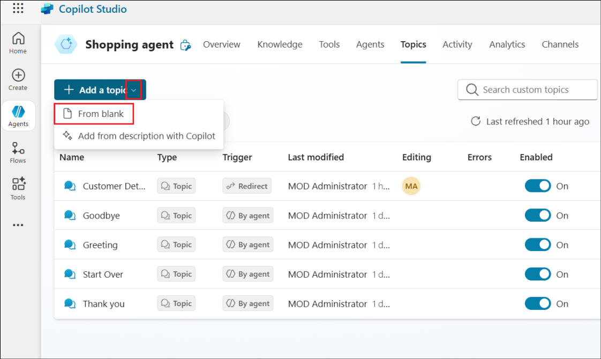

5.  Rename the topic as +++Get Product Categories+++. Select the
    **Change trigger** option in the **Trigger** node and select **It’s
    redirect to** option.

6.  Below the **Trigger** node, add a **Condition** node.

Select the Global variable **IsNewCustomer** and add the condition,
**IsNewCustomer** **is equal to** +++**'Yes'**+++.

Select **+ New condition.**

7.  Select **Or**.

Under the Or condition, select the Global variable **ProductCategory**
add the condition, is equal to +++'1'+++

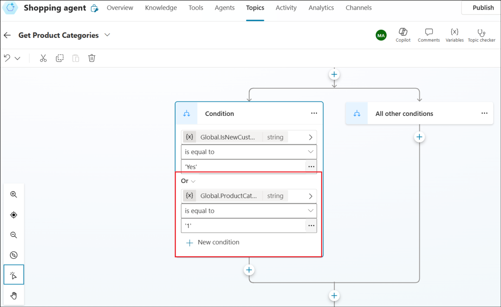

8.  Under the Condition node, add a question node and enter +++Select a
    category+++ and select **+ New option**.

9.  Enter the option +++Laptop+++ and select + New option again.

10. Similarly add two other options +++**Desktop**+++ and
    +++**Tablet**+++. Select the variable under **Save user response
    as**, and name the variable as +++**ProdCatchoice**+++

11. Under the question node, add a **Set a variable value** node to
    convert the choice received from the question node to String.

12. Select the Global variable **ProductCategory** under Set variable.
    In the **To value** field, click on the 3 dots, select the
    **Formula** tab. Enter the expression
    +++Text(Topic.ProdCatchoice)+++ and select **Insert**.

13. Below the Set variable value node, add a new node, **Topic
    management** -\> **Go to another topic** -\> **Place Order**.

14. Now, one path is fully complete. It will get the category from the
    user and invoke the Place Order topic.

15. Navigate back to the start of this topic. Under all other
    conditions, add a **Question** node. Add the message +++Based on
    your recent purchase we suggest you products in \<Product Category\>
    category. Would you like to continue?+++

In the message replace **\<Product Category\>** with the
**Global.ProductCategory** variable.

> 

16. Add 2 options, +++Yes+++ and +++No+++. Click on the variable under
    Save user response as and rename it to +++Userschoiceofcategory+++

17. Under the **question** node, add a **condition** node.

Set the first condition as **Userschoiceofcategory is equal to Yes**.

36. Under this node, add a **Topic management node** and invoke the
    **Place Order** topic.

18. In the condition node, select the three dots in the top right corner
    of the condition node and select **Insert new condition**.

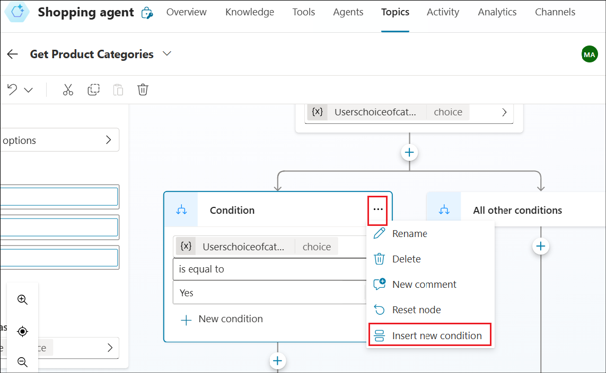

19. Add a condition, **Userschoiceofcategory is equal to No**.

20. Under the Condition node, add a question node and enter +++Select a
    category+++ and select **+ New option**.

21. Enter the option +++Laptop+++ and select + New option again.

22. Similarly add two other options +++**Desktop**+++ and
    +++**Tablet**+++.

23. Under the question node, add a **Set a variable value** node to
    convert the choice received from the question node to String.

24. Select the Global variable **ProductCategory** under Set variable.
    In the **To value** field, click on the 3 dots, select the
    **Formula** tab. Enter the expression +++Text(Topic.Var1)+++ and
    select **Insert**.

25. Below the Set variable value node, add a new node, **Topic
    management** -\> **Go to another topic** -\> **Place Order**.

26. Select **Save** to save the topic.

27. Open the Topic **Customer Details** and move to the last node.

28. **Add a new node** to invoke the topic **Get Product Categories**.

29. Select **Save** to save the topic.

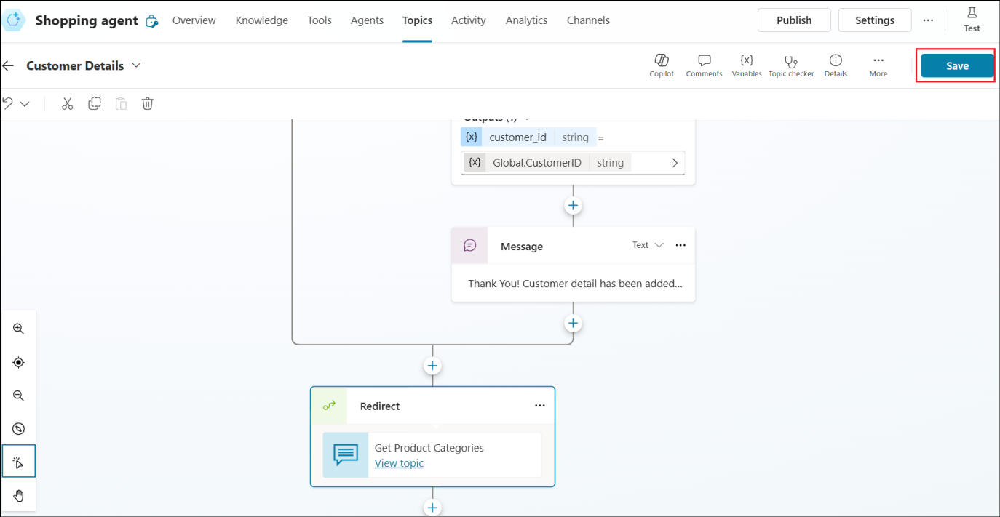

### Task 8 – Create Agent flow to place the order

In this task, you will create an Agent flow to place the order based on
the product chosen by the customer.

1.  From **Agent flows** tab, select **+ New agent flow.**

2.  Click on the **Add a trigger node** and select **When an agent calls
    the flow** node.

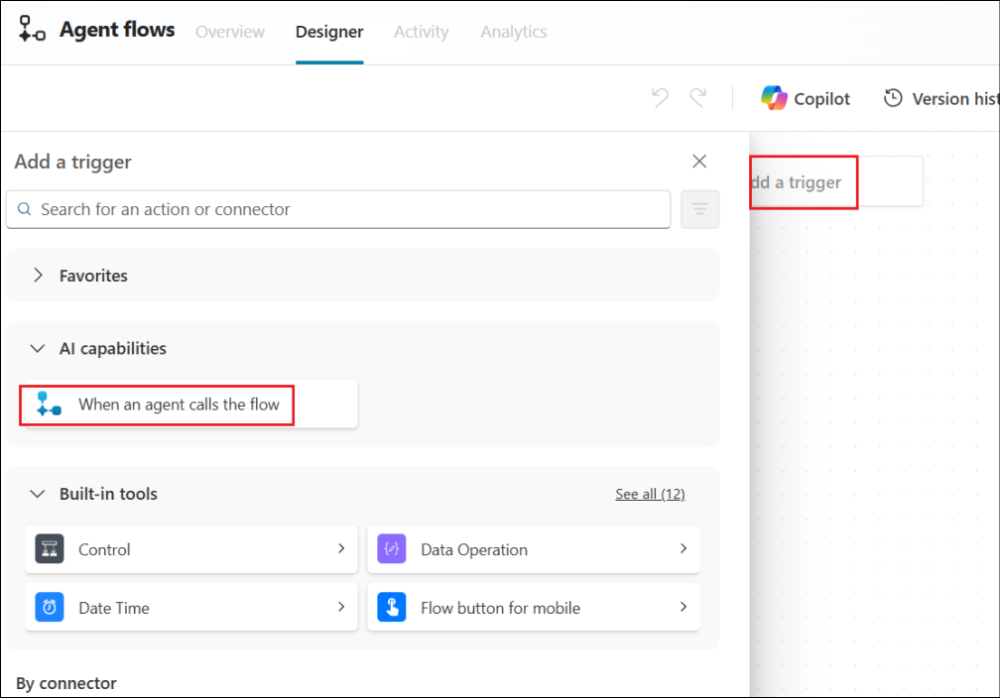

3.  Add 2 **Text** variables +++Product Name+++ and +++Customer ID+++ as
    **Input**.

4.  Click on **Save Draft** to save the flow.

5.  Select **Overview** from the top menu, click on **Edit** and enter
    the name of the flow as +++PlaceOrder+++. Then select **Save**.

6.  Navigate back to the **Designer** tab. Select Add a new action and
    select **Add a new row** under Dataverse.

7.  Select the Table name as **Order Record** and then click on **Show
    all** under Advanced parameters.

8.  Enter the below values.

Customer Identifier - **Customer ID** (Dynamic value)

Order identifier – Enter guid() in Insert expression

Order Status - +++**Order Placed**+++

9.  Add a node, **Respond to the agent**.

10. Add a output Text variable and name it as +++Order ID+++.

Enter its value as +++
string(outputs('Add_a_new_row')?\['body/cr6dd_orderidentifier'\])+++
(Replace **cr6dd_orderidentifier** with the logical name value of the
column Order ID from the Order Record table.

> 

11. Click on **Save draft** to save the flow and then click on
    **Publish** to publish the flow.

### Task 9 – Design the Place Order topic 

In this task, you will design the topic to place the order and update
the Dataverse table.

1.  Open the topic **Place Order** from the Agent’s **Topic** tab.

2.  Add a message node with the message +++Options based on the category
    will be listed below.+++

3.  Add a condition node. Enter the condition as ProductCategory(Global
    variable) is equal to +++Laptop+++.

4.  Under the node, add a question node and enter the message +++Select
    a Laptop product+++. Select **Laptop** under **Identity**.

5.  Click on **Select** options for user and select all the 5 available
    options.

6.  Enter the variable name as +++ProdNameLapChoice+++

7.  Now, follow the same procedure and add condition nodes for
    ProductCategory is equal to +++Desktop+++ and +++Tablet+++.

8.  Save the values in variable names.

9.  Select a **Set variable value** node under the **Select a Laptop
    product** question node.

10. Rename the created variable to +++ProdNameSelected+++ and set it as
    **Global**.

11. Set the value in the Formula field as
    +++Text(Topic.ProdNameLapChoice)+++ (Replace the variable name, if
    you have used a different one)

12. Similarly, add a **Set variable value** node under **Desktop** and
    **Tablet** branches. Select the **Set variable** value as
    **ProdNameSelected** and insert the expression for the To value
    field with the variable name as per the one you used.

13. Add an Action node under all these nodes in common and invoke the
    GetProductDetails flow.

14. Select **ProdNameSelected** input variable to be passed to the flow.
    Leave the other values as default.

15. Add a Message node below the Action and enter the below message.
    Replace \<roductName\> and \<Price\> with the corresponding variable
    names

Product Details

- Product Name - \<ProductName\>

> ​

- Price - \<Price\>

​

16. Below the message node, adda **Question node** with a message,
    +++Would you like to place order for this item?+++ in it. Add
    options **Yes** and **No** to it and name the variable as
    +++PlaceOrder+++.

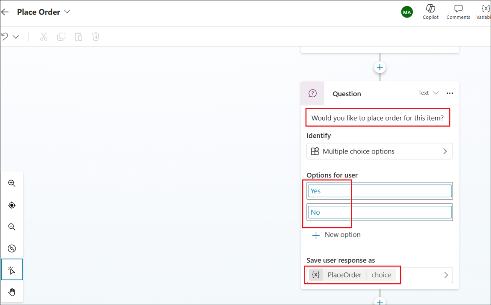

17. Under the Question node, add a condition node and in one branch, add
    a condition **PlaceOrder isequal to Yes** and **all other
    conditions** will be the **second branch**.

18. Invoke the flow **PlaceOrder** as the next step.

19. Select the **ProductName** and **CustomerID** as the input to the
    flow.

20. Now, add a message node below this with the message, +++Your order
    is placed. This is your Order ID for reference -\<OrderID\>+++
    (Replace **\<OrderID\>** with the **variable OrderID** (the output
    variable from the flow).

21. With this the **PlaceOrder isequal to Yes** branch is **complete**.
    Now, navigate to **all other conditions branch**.

22. Below that, add a Question node with the message, +++Do you want to
    go to the main menu?+++ with options **Yes** and **No**. Name the
    variable as +++**GoToMainMenu**+++.

23. Under this node, add a condition node and in one branch add a
    condition with **GoToMainMenu is equal to Yes**. The other branch of
    this condition will be **All other conditions**.

24. Under this condition node, add a question node with message
    +++**Select Product Category**+++ and add 3 options,
    +++**Laptop**+++, +++**Desktop**+++ and +++**Tablet**+++.

Make a note of the variable name to which the result is saved. We will
convert it to text in the next step.

25. Add a **Set variable value** node and select **ProductCategory**
    variable under **set variable** and enter the value as
    +++**Text(Topic.Var1)**+++ under the **Formula** tab.

Replace **Var1** with your variable name if it is different.

> 

26. Under the Set variable value node, add a **Go to step** node.

27. After adding the node, you will have to select the **step**, to
    which the **control should pass** on at this point. **Scroll up**
    and select the **Message node at the starting of this topic** since,
    you have got the **ProductCategory** from the customer now and need
    to execute from the beginning.

28. Add a common message node at the end with the message +++Thank you
    for shopping with us! Please visit again!+++ Then select **Save** to
    save the topic.

## Exercise 4 – Add a trigger 

In this exercise, you will add a trigger to get initiated when the Order
table is added with a new row or an existing row is modified and send an
email to the customer automatically. This defines the autonomous
capability of the agent in this scenario,

1.  Select the Overview tab of the agent.

2.  Scroll down the page and select **Add trigger.**

3.  Select **When a row is added, modified or deleted** option and then
    select **Next**.

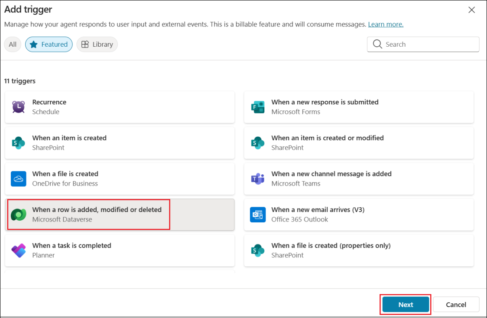

4.  Once the **Microsoft Copilot Studio** and **Dataverse** are
    connected, click on **Next**.

5.  Select the below options, leave the rest as default and select
    **Create trigger**.

- Change Type – Added or Modified or Deleted

- Table name – Order Record

- Scope - Organization

6.  This might take a few minutes to get completed. Once done, select
    **Close** in the Add trigger dialog.

7.  From the Trigger section in the **Overview** page of the agent,
    click on the **3 dots** next to the added trigger and select **Edit
    in Power Automate**.

8.  Select the first node in the flow and add the column names,
    +++cr6dd_orderidentifier, cr6dd_customeridentifier+++ under **Select
    columns**. (**Replace** them with **your logical names** of the
    **Order ID** and **Customer ID** columns from the **Order Record
    table**).

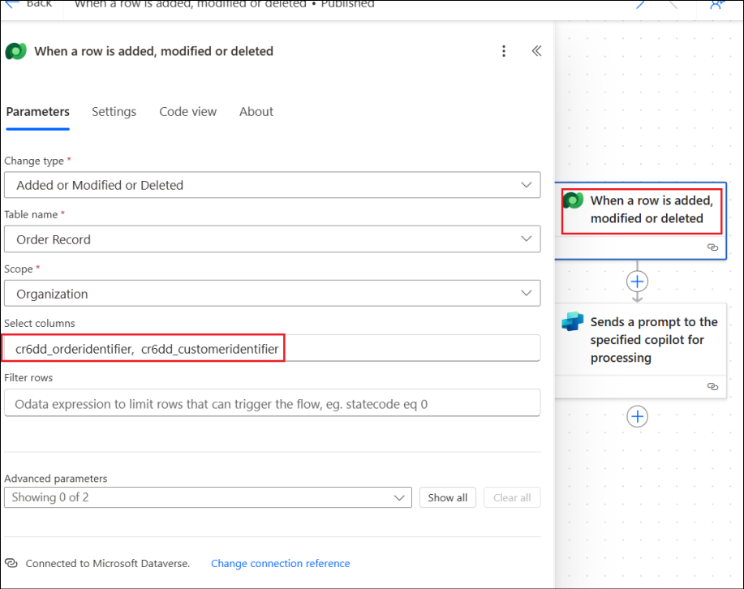

9.  Add a new node and select **List rows** action in it.

10. In the List rows action, select **Table name** as **Customer
    Record**.

Under **Filter rows**, enter +++**cr6dd_customeridentifier eq ''**+++,
replacing the column name with your **Customer ID’s logical name**. Keep
the **cursor** **inside** the **single quotes**.

11. Select Insert expression, enter
    +++String(triggerOutputs()?\['body/cr6dd_customeridentifier'\])+++,
    replacing **cr6dd_customeridentifier** with your CustomerID’s
    logical name and select **Add**.

12. Next to the **List rows**, add an action **Send an email (V2).**

13. Click on **Sign in** and sign in with your credentials.

14. In the **To** field, insert expression and enter
    +++first(outputs('List_rows')?\['body/value'\])\['cr6dd_emailaddress'\]+++,
    replacing **cr6dd_emailaddress** with the logical name of your email
    id field from Customer Record table and then select **Add**.

15. Enter the below details,

Subject - +++Order Placement+++

Body –

Hi,

This is to update you that your order has been placed. Thank you for
shopping with us.

Thank You.

16. Save the flow and then Publish it.

17. Back in the Copilot Studio agent page, select **Publish** to publish
    the agent.

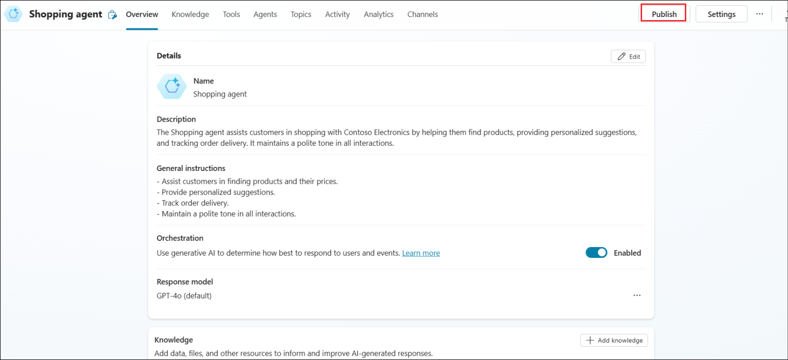

18. Select **Publish** in the confirmation dialog.

19. ewqewqew

## Exercise 5 – Test the agent

In this exercise, you will test how the agent works.

1.  From the agent page, select **Test** to open the Test pane.

2.  Enter +++3148987666+++. This is the Phone number of an existing
    customer.

3.  Select **Yes** from the given options.

4.  Select a **product** from the given options.

5.  Select Yes from the given options.

6.  The order gets placed and the reference id is provided to the
    customer.

7.  You can also ask other questions like track the order delivery for
    the id you received. Though we have not configured the topics for
    that, it will give you reply based on the knowledge source.

Test the other scenarios by selecting different options. Add a new
customer and check that you have received a mail in your email id that
gets added to the Customer Record table.

8.  After testing for some time, click on the **Analytics** tab to know
    the details of usage of topics and knowledge sources. This might
    take some time to reflect.

## Summary:

In this lab, you have learnt to design an autonomous shopping agent.
Topics covered include,

- Variables

- Entities

- Topics

- Agent flows

- Trigger

- Analytics

- Knowledge sources

