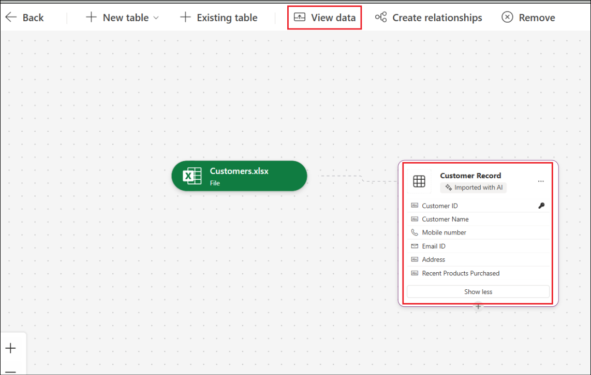
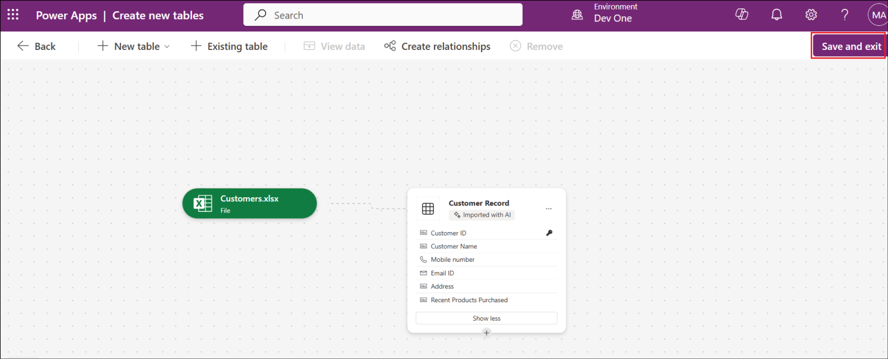
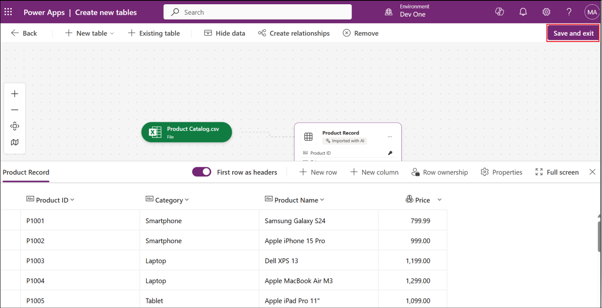
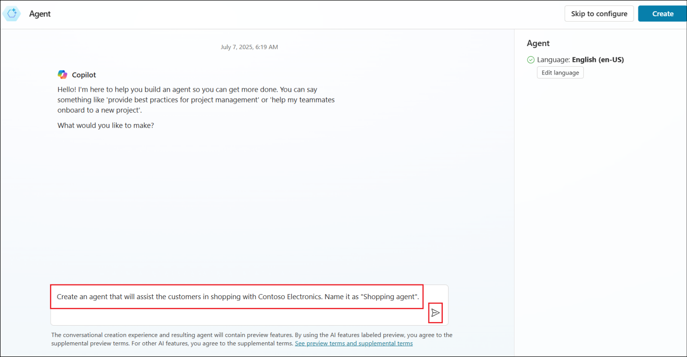
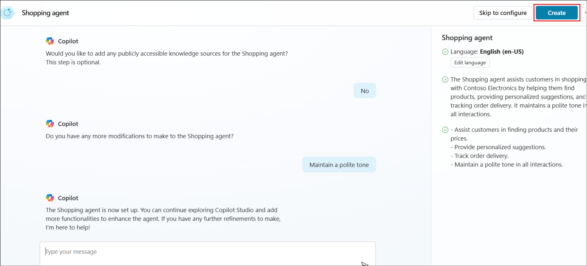
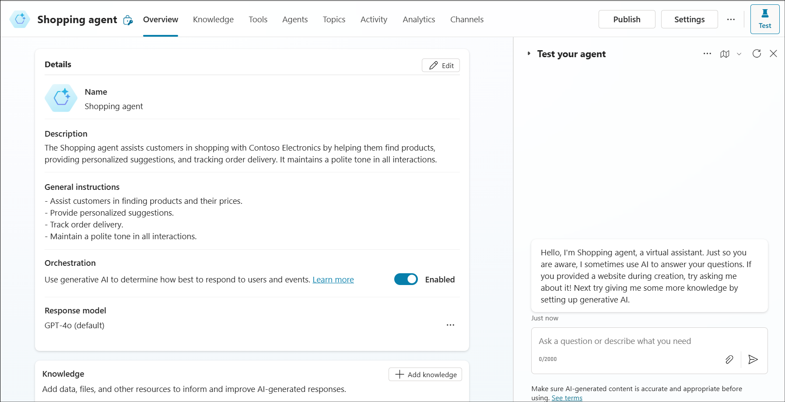
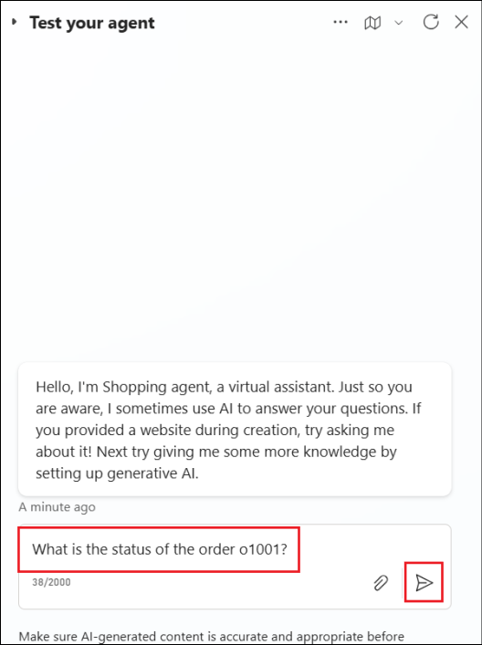
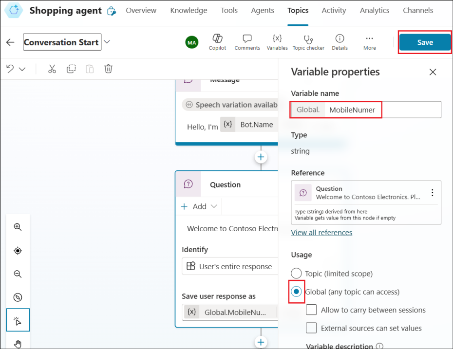
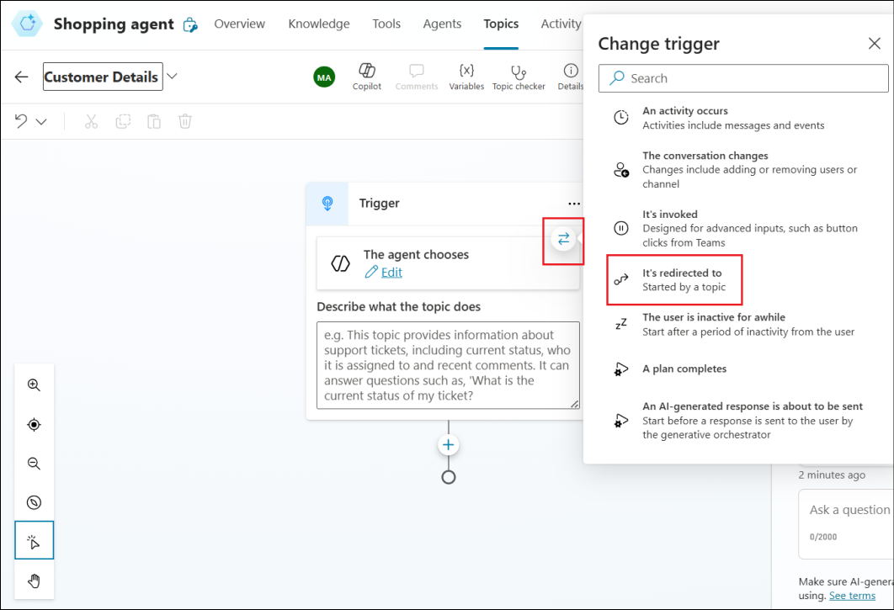

# **实验 7_ 将消息从 Copilot（经典）发送到 Teams 频道**

**实验室持续时间** – 30 分钟

**目的：**

在本实验中，我们将通过调用流将消息从 Copilot 发送到 Teams 频道。

## **练习 1：在 Microsoft Teams 中添加频道和团队**

1.  从 VM 打开 **Microsoft
    Teams**，并使用租户凭据登录（如果已关闭）。选择 **Teams** 选项。

2.  从 Teams 中，选择 **More options** ，然后选择 **+ -\> Create team**.

3.  将团队命名为 +++**HR Team**+++，将频道命名为 +++**HR
    Experts**+++，然后选择 **Create**。

4.  在“Add members to HR Team”窗口中选择 **Skip**。

5.  在“Add members to the HR Experts channel”窗口中选择 **Skip**。

## **练习 2：通过升级到 HR 专家来增强主题以处理复杂查询**

1.  在 Teams 应用中，选择 Copilot Studio 应用（Power Virtual
    Agents），选择 **Copilots** 选项卡并打开 **HR Support Copilot**。

> 
>
> **注意：**如果未找到 Copilot Studio 快捷方式，请在“应用程序”下搜索
> **Copilot Studio/Power Virtual Agents**，然后选择 **Open**）
>
> 

2.  从左侧窗格中选择 **Topics** ，然后返回到您之前创建的主题 **(Employee
    time off)** 并转到创作区域。

> 

3.  在 **Ask a question** 节点中，添加名为 **Extended leave** 的选项。

> 

4.  在 Extended leave 的 Condition
    节点下，添加一个问题节点，要求提供问题的描述，并添加文本 +++**How
    would you would describe the issue？***+++*

> 

5.  在 Identity 下选择 **User's entire response，**并将描述保存在名为
    +++**Description**+++ 的变量中。

> 

6.  选择 **Save**。

7.  在问题下添加一个节点，然后选择 **Call an action**。 选择 **Create a
    flow**，以便在 Teams 的 Copilot Studio 中启动 Power Automate。

8.  选择 **Power Virtual Agents Flow Template** 选项。

9.  通过单击第一步中的 **+ Add an input** 来添加 **Text** 输入字段。将
    Input by **Description** 替换为 Input。

10. 插入 **new step** ，然后选择 **Add an action**。

11. 在 **Choose an operation**下选择 **Microsoft Teams**。

12. 选择 **Post message in a chat or channel**。

13. 提供以下详细信息:

- Post as – **User**

- Post in – **Channel**

- Team – **HR Team**

- Channel – **HR Experts**

- Message **– Description** from **Dynamic Content**

14. 将流重命名为 +++**Send a message to HR team**+++，然后单击
    **Save**。

> 

15. 单击 **Close** 关闭 Power Automate 并返回到 Authoring （创作）
    画布。

16. 从 Authoring 画布中，添加一个节点 – **call an action** \> **Send a
    message to HR team**.

17. 将输入添加为 **Description**。

18. 添加消息节点，其中包含消息 +++**We notify the expert。They’ll reach
    out shortly**+++。

19. 结束对话 \> 结束调查。

20. 单击 **Save** 以保存主题。

21. 获取 **Topic saved** 的成功消息。

## **练习 3：测试您的 chatbot**

1.  从左侧窗格中选择 Test your chatbot。

2.  发送消息 +++ **I need help with time off** +++，然后选择 延长休假
    chatbot。

3.  描述您延长休假的原因。在这里，我们给出了 +++ **I need extended leave
    of one month for travelling** +++。

4.  Bot 回复“We notified an expert.....”消息。

> 

## **练习 4：在 Teams 中检查消息。**

1.  单击 MS Teams app 左侧菜单中的 Teams。

2.  选择 **HR Team** 团队下的 **HR Experts** 频道
    。请注意，从用户到机器人的消息已在此处发送。

## **练习 5：发布 Copilot – Teams**

1.  返回 Microsoft Copilot Studio 应用程序。选择聊天机器人 **HR Support
    Copilot**。

2.  从左侧窗格中选择 Publish。

3.  单击 **Publish**。

4.  在 **Publish latest content？**中选择发布

5.  获得成功消息，如下面的屏幕截图所示。单击 **Availability options**。

6.  **Add to** **Contoso** 选项将机器人添加到特定团队。

7.  **Show to my team mates and shared users** 使 bot 显示在 Built by
    colleagues 部分下。

8.  **Show to everyone in the organization** 向管理员提交请求，以获取
    **Built by org** 部分下列出的机器人。

**总结:**

在本实验中，我们学习了从机器人向 Teams 渠道发布消息。
