# Laboratorio 8 : Crear un agente en Copilot Studio con Dataverse MCP Server

Cree y configure un Copilot Agent en Copilot Studio con integración de
Dataverse MCP Server para optimizar los flujos de trabajo empresariales.

Al completar este laboratorio, los participantes podrán crear y
configurar un Copilot Agent en Copilot Studio, integrar Dataverse MCP
Server para leer y actualizar información de cuentas desde las tablas
Account y Contact, estructurar las respuestas del agente para claridad y
valor empresarial, y aplicar estas habilidades para resolver desafíos
empresariales comunes.

## Tarea 1: Crear y configurar Copilot Agent

Cree un Copilot Agent que se conecte a Dataverse a través del MCP Server
para un acceso fluido a los datos.

En está sección, aprenderá a crear un nuevo Copilot Agent en Copilot
Studio, configurarlo con instrucciones adecuadas y prompts sugeridos, e
integrar Dataverse MCP Server para la conectividad de datos en tiempo
real.

1.  Inicie sesión en Copilot Studio en
    +++https://copilotstudio.microsoft.com+++ con sus credenciales si
    aún no lo ha hecho y asegúrese de estar en el entorno Dev One.

2.  Seleccione la ficha **Create an agent** para crear un nuevo agente.

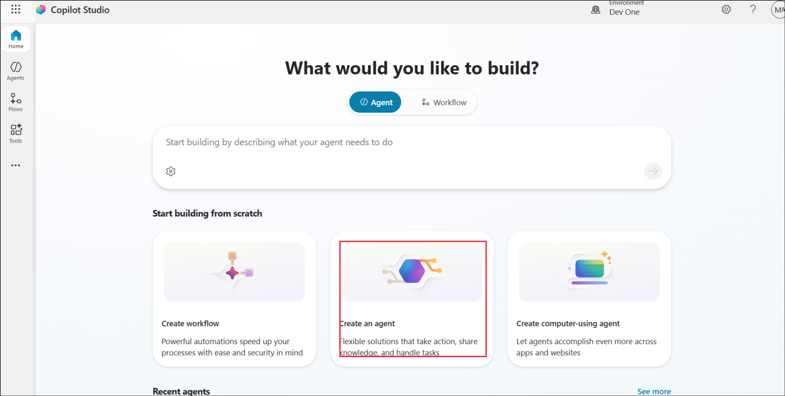

3.  Una vez aprovisionado el agente, seleccione **Edit** en el panel
    **Details**.

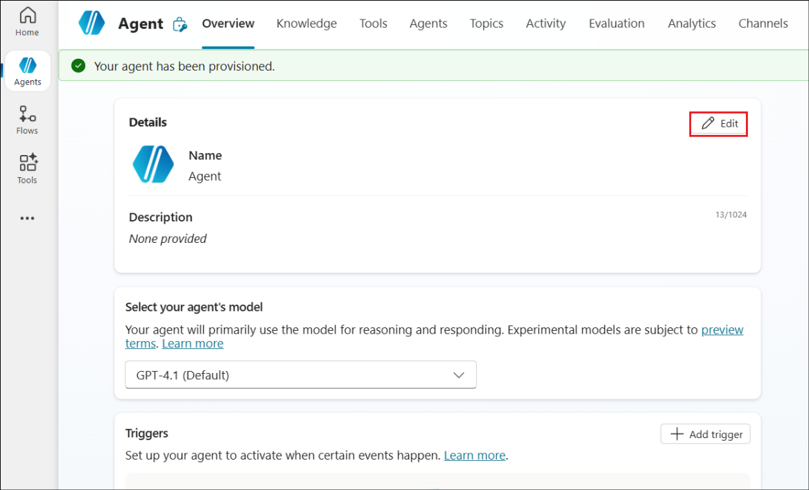

4.  Ingrese los siguientes datos y seleccione **Save**.

- Name - +++Contoso Agent+++

- Description - +++This agent will help Contoso sales reps update their
  accounts and contacts using the Dataverse MCP Server+++

> 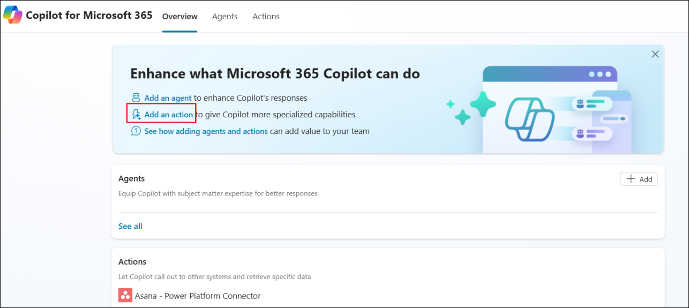

5.  **Edite** Instructions e ingrese el siguiente conjunto de
    instrucciones, luego seleccione **Save**.

Este agente realizará lo siguiente: leer información de cuentas y
contactos de las tablas Account y Contact en Dataverse usando Dataverse
MCP Server; actualizar información de cuentas y contactos de las tablas
Account y Contact en Dataverse usando Dataverse MCP Server; crear nuevas
cuentas e información de contacto en las tablas Account y Opportunity en
Dataverse usando Dataverse MCP Server. No utilizar conocimientos
externos. Solo usar Dataverse MCP Tool para crear, leer, actualizar y
eliminar.

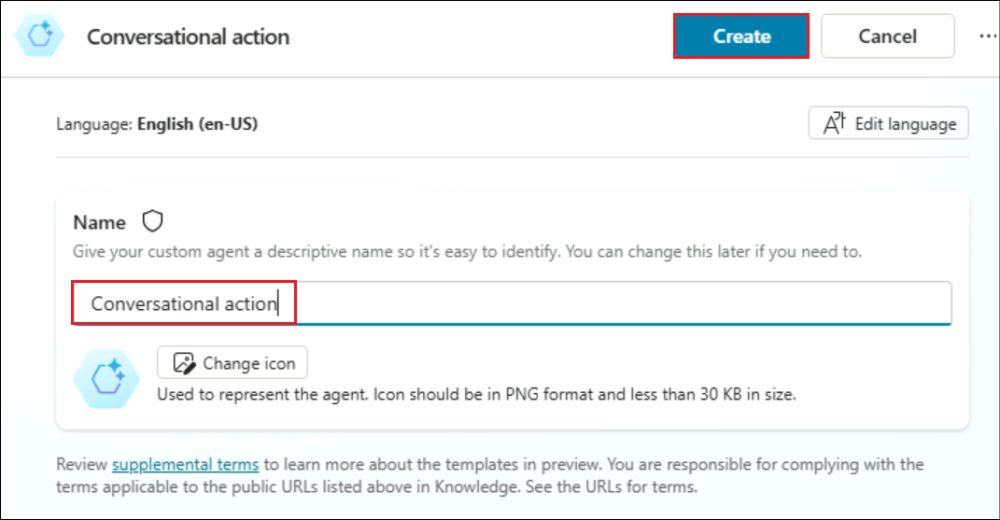

6.  Desplácese hacia abajo y seleccione **+ Add suggested prompts** en
    la sección **Suggested prompts**.

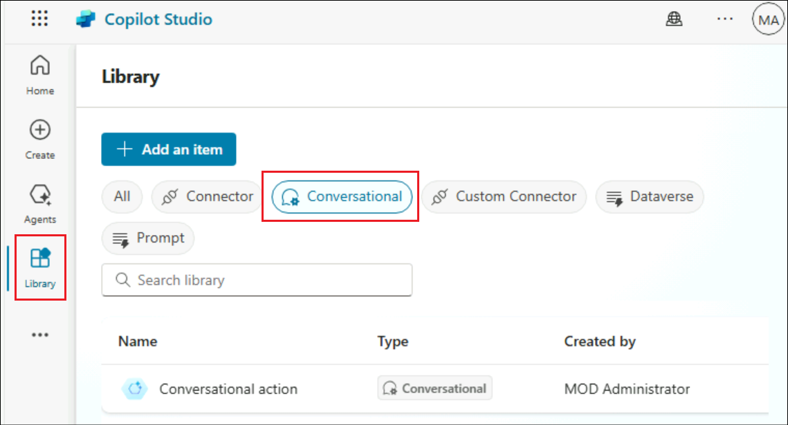

7.  Agregue los siguientes prompts y luego haga clic en **Save**.

- **Title**: +++Account Search+++ **Prompt**: +++List all accounts in
  Redmond+++

- **Title**: +++Contact Search+++ **Prompt**: +++List all contacts from
  Coho Winery+++

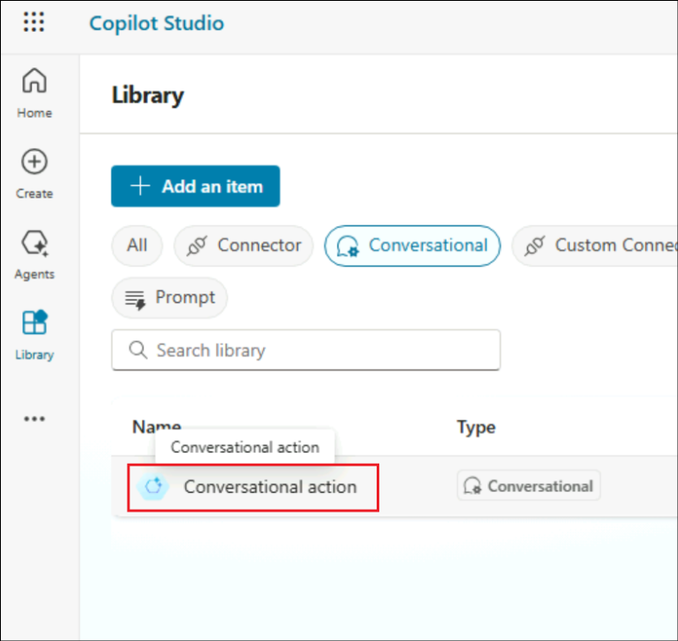

8.  Seleccione **+ Add tool** en la sección Tools.

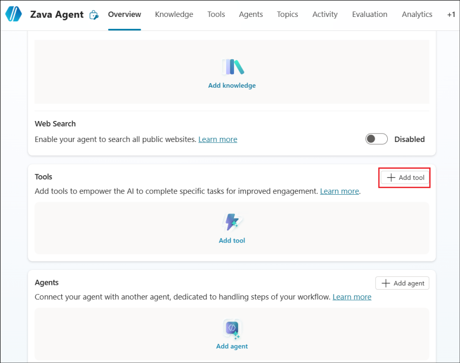

9.  Seleccione la pestaña **Model Context Protocol**, busque
    +++**Dataverse MCP Server**+++ y seleccione **Microsoft Dataverse
    MCP Server**.  
    **Nota:** Seleccione la opción que no esté en Preview. No seleccione
    **Microsoft Dataverse MCP Server
    (Preview).**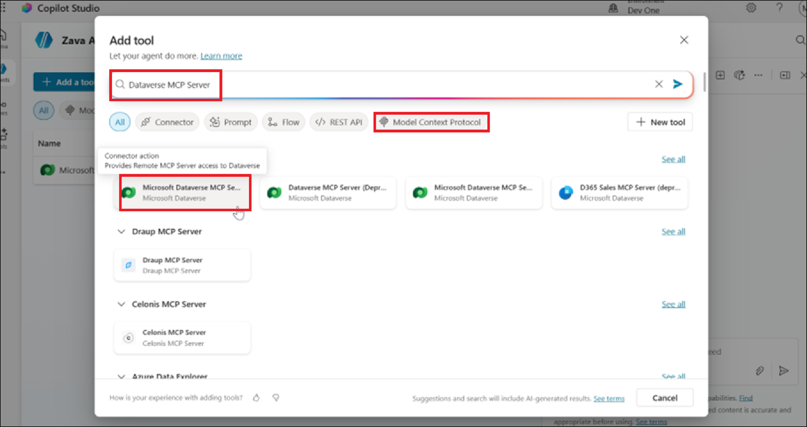

10. Seleccione **Add and configure**.

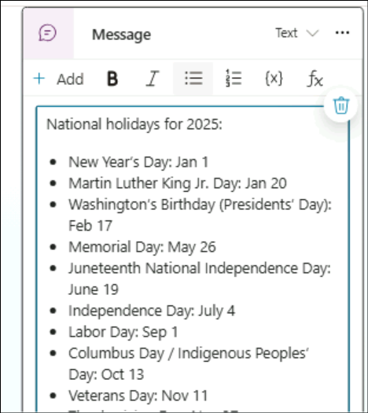

**Note:** Dataverse MCP Server permitirá acceso en lenguaje natural a
sus tablas en Dataverse. Se cuenta con datos de ejemplo en las tablas
Accounts y Contacts que se utilizarán. Las herramientas disponibles son:
list tables, describe table, read data, create record, update record,
list prompts, execute prompt, list knowledge sources y retrieve
knowledge.

11. Revise las herramientas disponibles para Dataverse MCP Server. Puede
    seleccionar o deseleccionar cuáles estarán disponibles para el
    agente. Cuando se ejecuta la herramienta, la lista se actualiza
    dinámicamente desde MCP Server. Por esta razón, no se puede llamar a
    un MCP Server desde un Topic.

12. Ingrese +++**List the accounts in the state of WA**+++ en el panel
    **Test** y haga clic en **Send**.

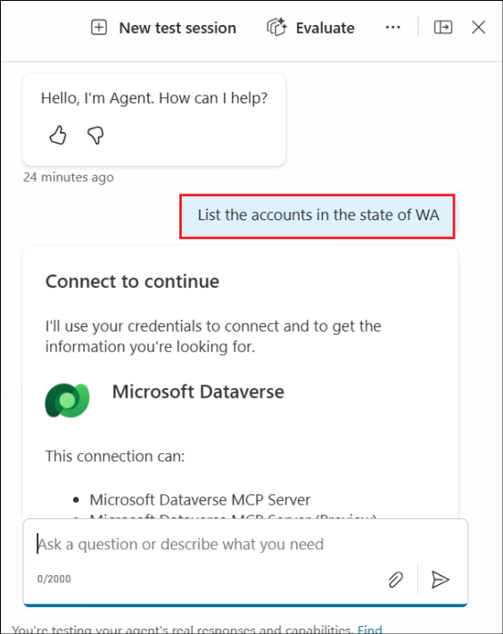

13. En la primera ejecución, aparecerá un cuadro de diálogo de
    consentimiento, ya que por defecto la herramienta está configurada
    para usar “**End user credentials**”. Haga clic en **Allow** para
    continuar.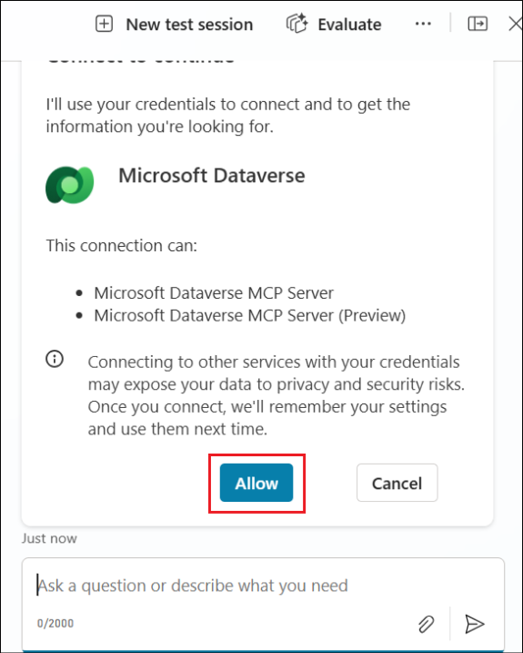

14. Observe la serie de acciones que se realizan y el resultado
    proveniente del MCP Server.

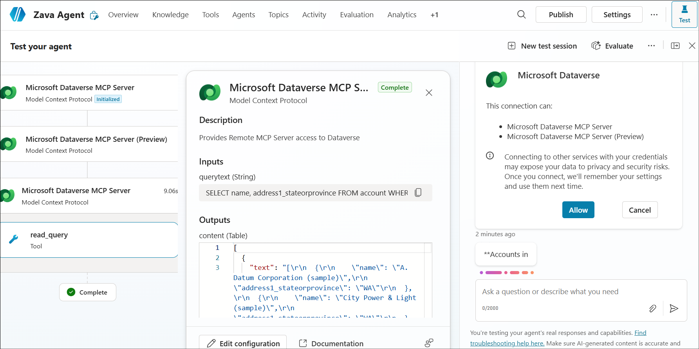

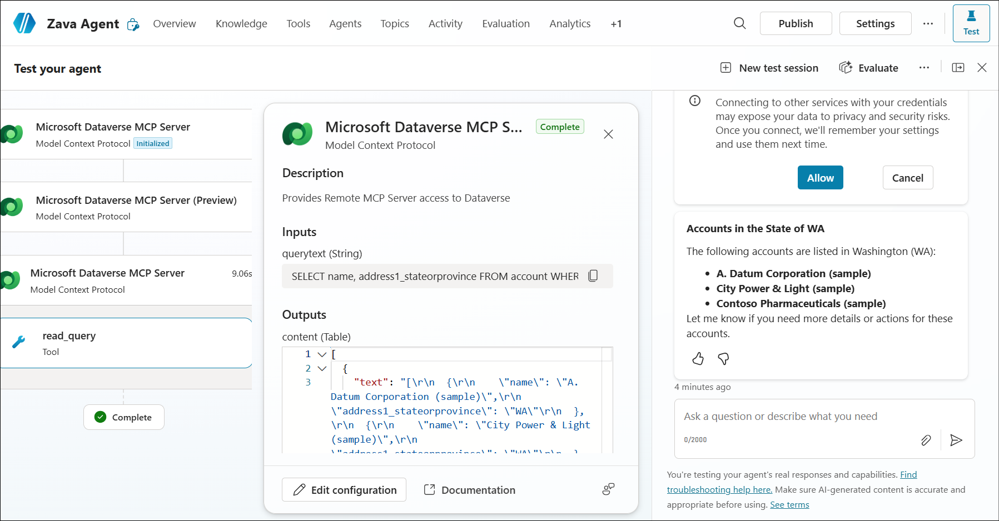

15. Si hace clic en la herramienta utilizada, podrá ver los Inputs y
    Outputs de la herramienta.

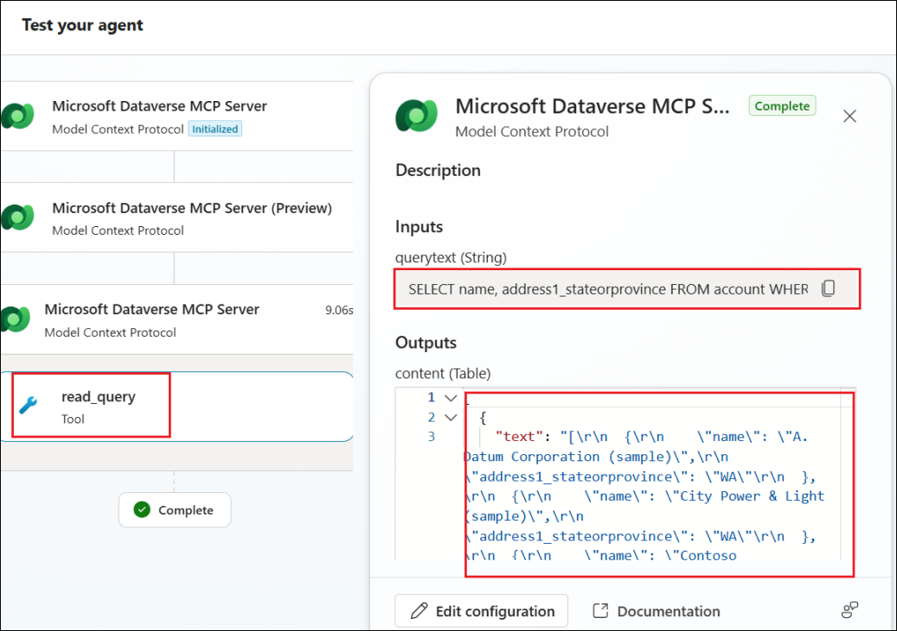

## Tarea 2: Estructurar las respuestas del agente con prompts personalizados

Cree prompts personalizados para garantizar respuestas consistentes y
estructuradas de su agente que proporcionen información relevante para
el negocio.

1.  Si ha realizado algunas pruebas en Copilot, habrá notado que se
    obtienen distintos atributos para cuentas y contactos. Si desea una
    respuesta más estructurada, puede crear un **prompt** en **Tools**.
    En la pestaña **Tools**, haga clic en **+ Add a tool** y luego en
    **+ New tool**.

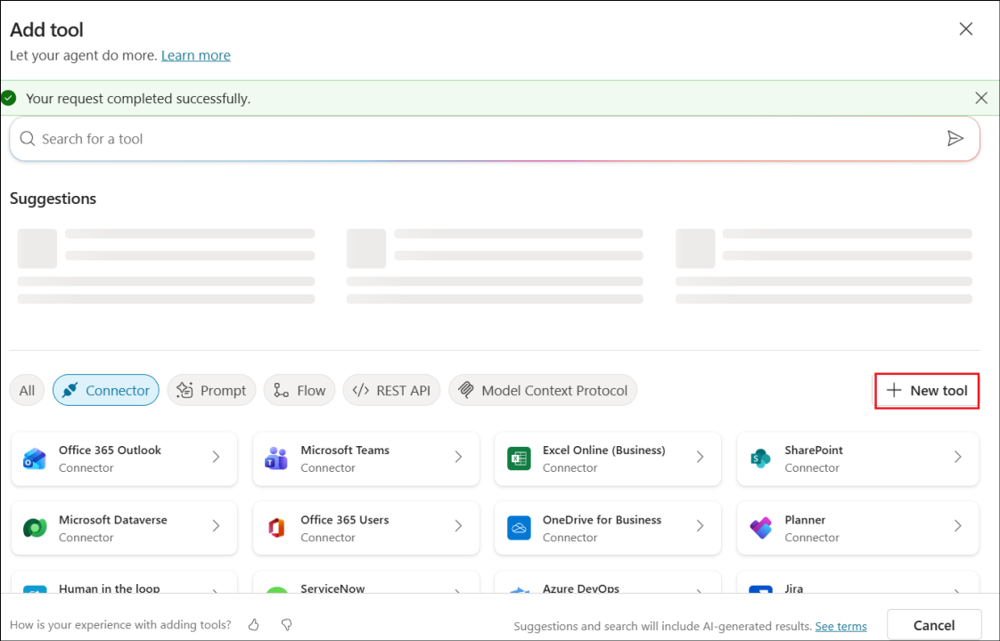

2.  Seleccione Prompt.

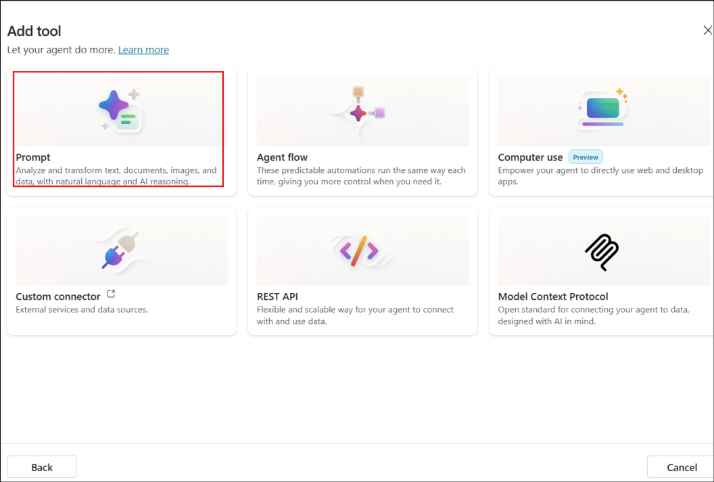

3.  Cambie el nombre del prompt en la parte superior a +++**Show Account
    Details**+++.  
    Luego, en las instrucciones, ingrese +++**Find account which
    contains**+++ y haga clic en **+ Add content** para pasar el nombre
    de la cuenta que está buscando. Seleccione **Text** para el
    **Input** y llámelo +++**Account Name**+++. Haga clic en **Close**.

> 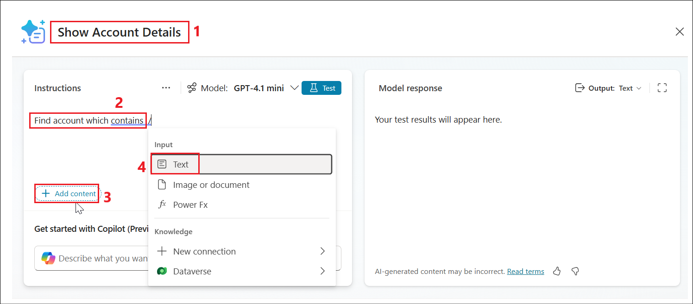

4.  Ahora podemos obtener campos específicos de Dataverse para
    mostrarlos a los usuarios finales en el chat. Haga clic nuevamente
    en las instrucciones e ingrese +++and find relevant details
    like:+++, luego haga clic en **+ Add content**. Esta vez seleccione
    **Dataverse** y algunos de los campos de la tabla **Account** que
    considere relevantes para los usuarios finales..

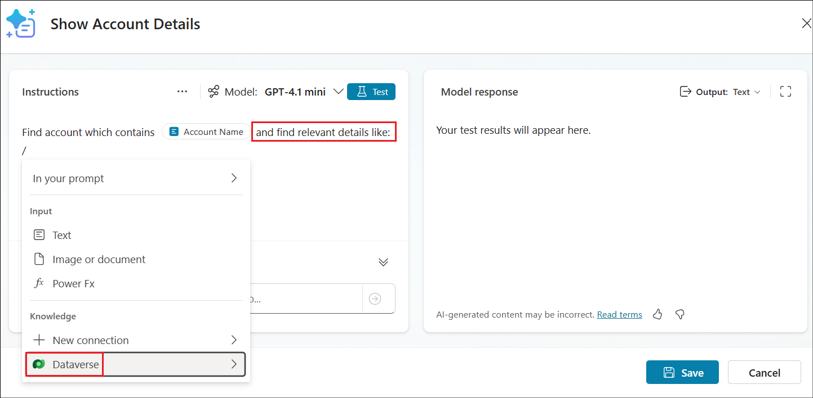

5.  Seleccione los siguientes campos en el desplegable: **Account Name,
    Account Number, Address 1, Annual Revenue, Email y Main Phone**.
    Haga clic en **Add** y luego en **Save.**

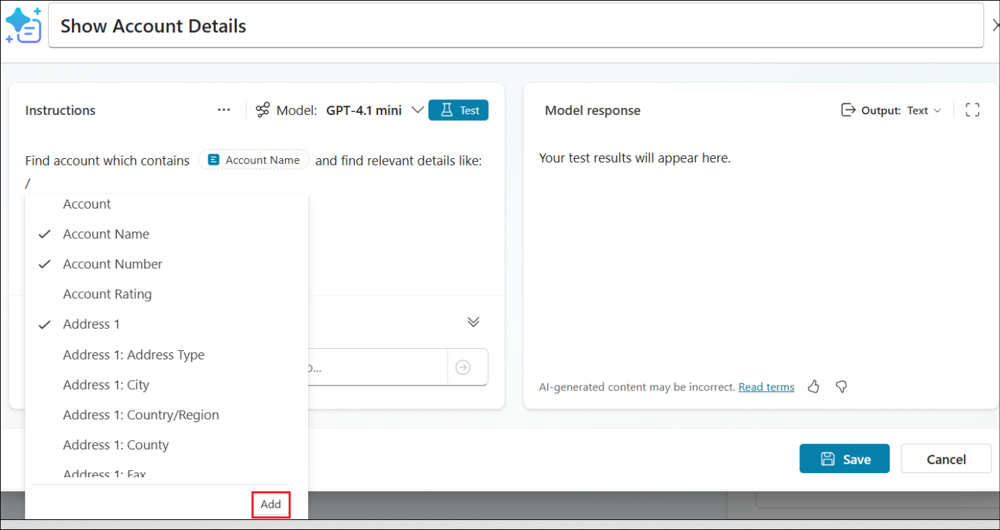

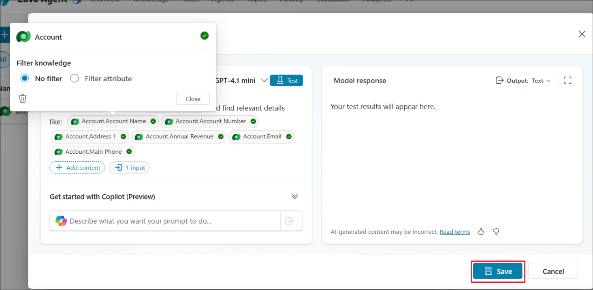

6.  Seleccione **Add and configure**.

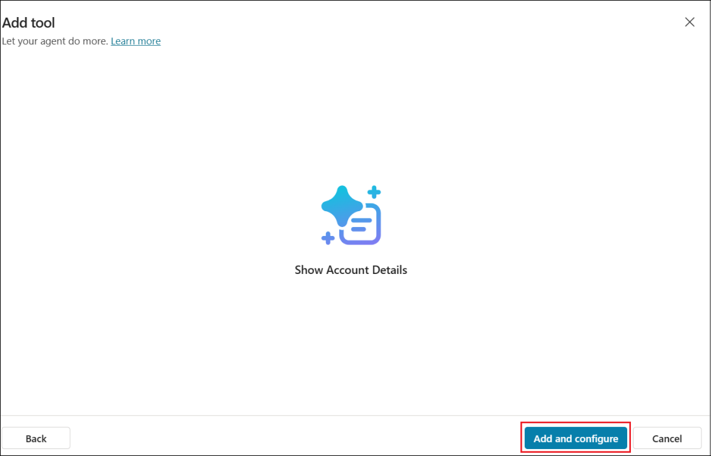

7.  Ahora podemos probar nuestro prompt. Regrese a su agente y pruebe
    nuevamente en el panel Test.

8.  Ingrese +++Show account Details for Fourth Coffee+++ y haga clic en
    **Send**. Podrá ver que la respuesta está estructurada según el
    prompt personalizado creado.

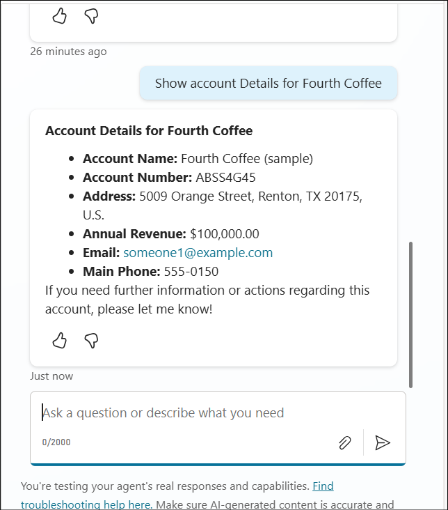

## Resumen

En este laboratorio, construyó un Copilot Agent en Microsoft Copilot
Studio que se integra con **Dataverse MCP Server** para acceder y
gestionar datos empresariales de manera segura utilizando lenguaje
natural. Configuró el agente para leer, crear y actualizar registros en
tablas de **Dataverse como Accounts, Contacts y Opportunities**, sin
depender de conocimientos externos ni APIs personalizadas.

También aprendió a estructurar las respuestas del agente mediante
prompts personalizados, asegurando resultados consistentes y orientados
al negocio que muestran los campos de datos más relevantes para los
usuarios finales. Al finalizar el laboratorio, podrá diseñar un agente
que optimice los flujos de trabajo de ventas y gestión de cuentas,
entregue información clara y estructurada, y demuestre cómo los agentes
potenciados por MCP pueden resolver desafíos empresariales reales con
datos empresariales en vivo.
