# 실습 9 - AI 에이전트를 테스트, 측정 및 개선하기

AI 에이전트가 비즈니스 프로세스에서 중요한 역할을 맡게 됨에 따라, 신뢰할
수 있고 반복 가능한 테스트의 필요성이 필수적이 되었습니다. 에이전트
평가는 에이전트의 실제 시나리오를 시뮬레이션하는 테스트를 생성할 수 있게
해줍니다. 이 시험들은 수동적이고 사례별 시험보다 더 많은 문제를 더
빠르게 다룹니다. 그 다음, 에이전트가 접근할 수 있는 정보를 바탕으로
질문에 대한 답변의 정확성, 관련성, 품질을 측정할 수 있습니다. 테스트
세트 결과를 활용하면 에이전트의 행동을 최적화하고 에이전트가 비즈니스 및
품질 요구사항을 충족하는지 검증할 수 있습니다.

**목표**

이 실습에서는 Copilot Studio에 내장된 평가 및 분석 기능을 활용해 AI
에이전트를 체계적으로 테스트하고 평가하는 방법을 배우게 됩니다. 실제
사용자 시나리오를 시뮬레이션하고, 에이전트 응답의 품질과 정확성을
측정하며, 성능 데이터를 분석하여 격차와 개선 기회를 파악하는 자동화된
테스트 세트를 생성합니다. 실습이 끝날 때쯤이면, 에이전트가 비즈니스
기준, 신뢰성, 품질 기준을 충족하는지 생산 사용 전에 검증할 수 있습니다.

## 작업 1: 에이전트를 평가할 테스트 세트를 생성하기

AI 에이전트를 실제 비즈니스 워크플로우에 배치하기 전에, 현실적인 사용자
질문에 얼마나 잘 반응하는지 검증하는 것이 매우 중요합니다. 수동 테스트는
시간이 많이 걸리고 종종 예외 사례를 놓치기도 합니다. 이 작업에서는
Copilot Studio의 에이전트 평가 기능을 사용해 실제 시나리오를
시뮬레이션하는 테스트 세트를 자동으로 생성합니다. 이 테스트를 에이전트와
대비하고, 합격 및 불합격 결과를 검토하며, 정확성, 관련성 또는 개선이
필요한 행동의 격차를 찾아냅니다.

1.  Copilot Studio에서 **Hiring agent**를 선택하세요.

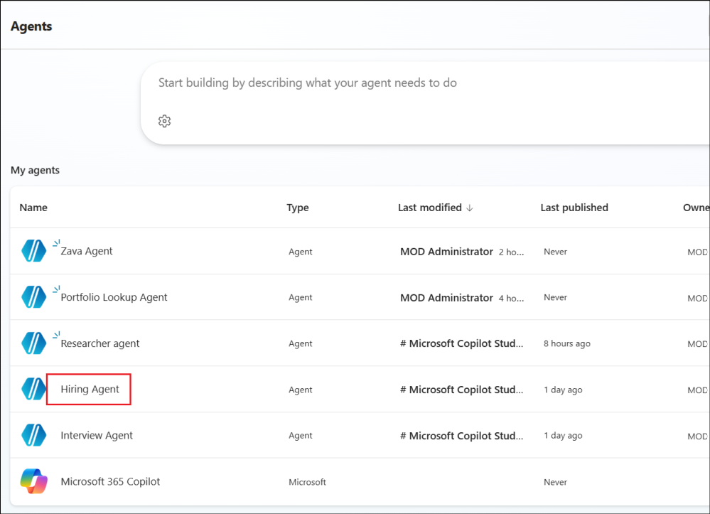

2.  상단 메뉴 바에서 **Evaluation**을 선택하세요. **Create a test
    set**를 선택하세요.

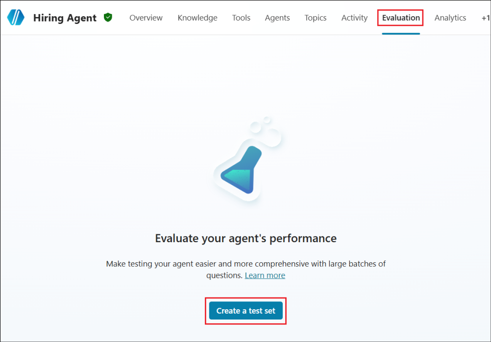

3.  테스트 세트를 생성할 수 있는 옵션은 몇 가지 없습니다. 이 경우
    **Generate 10 questions**를 선택하세요.

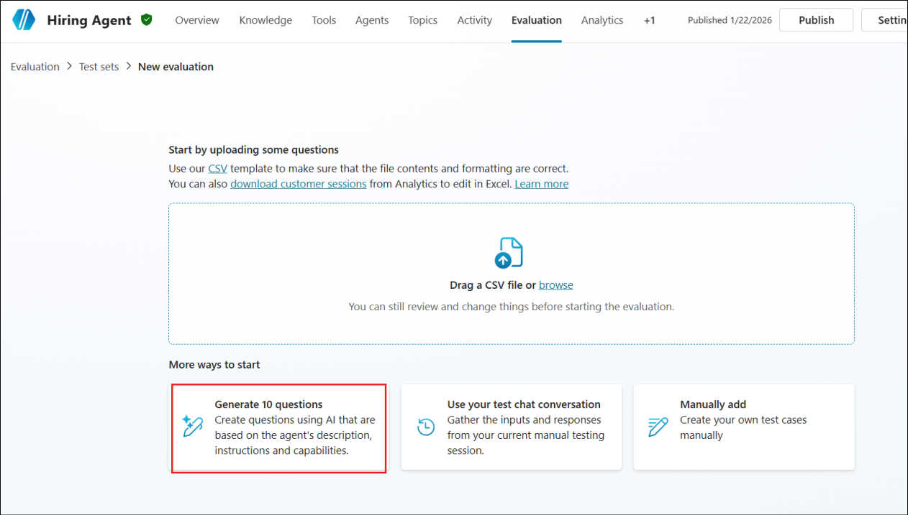

4.  테스트 세트를 **Review**하고 테스트 세트를 **Save**하세요.

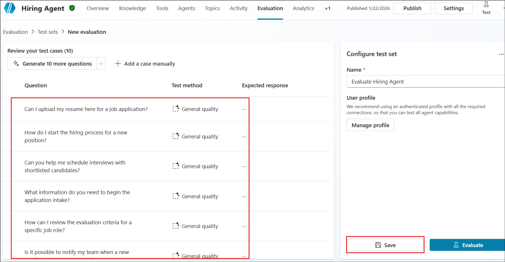

5.  에이전트를 평가하려면 **Evaluate**를 클릭하세요.

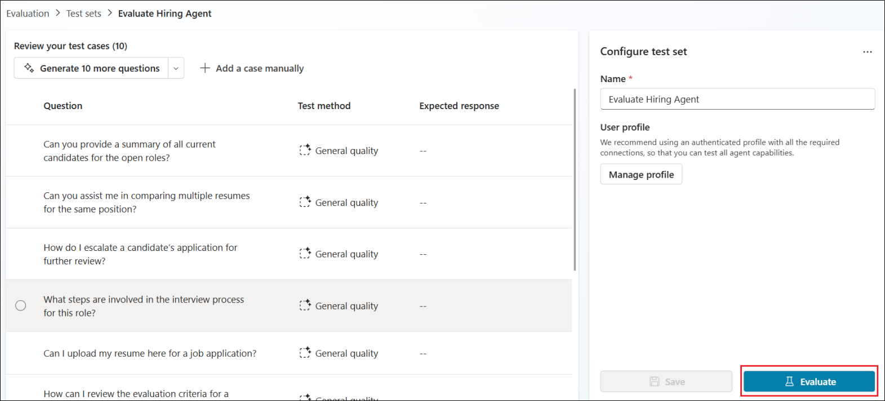

6.  테넌트 id를 선택하고 **Run**을 클릭하세요.

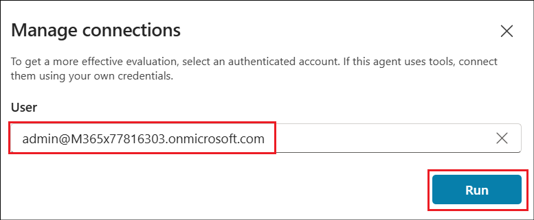

7.  실행이 끝날 때까지 기다리세요.

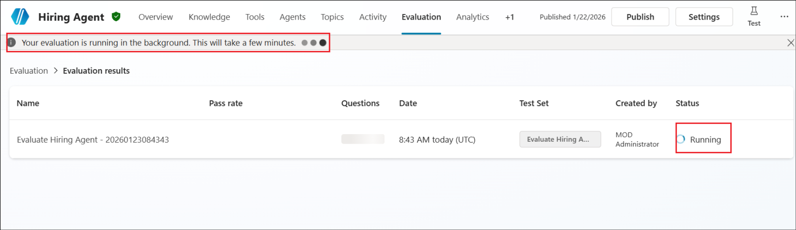

8.  평가가 완료되면 클릭하여 세부 정보를 확인하세요.

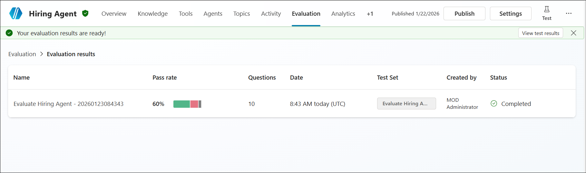

9.  각 문제를 살펴보고 왜 실패했는지, 어떤 문제가 통과되었는지
    확인하세요. 이렇게 하면 필요에 따라 에이전트를 더 잘 활용할 수
    있습니다.

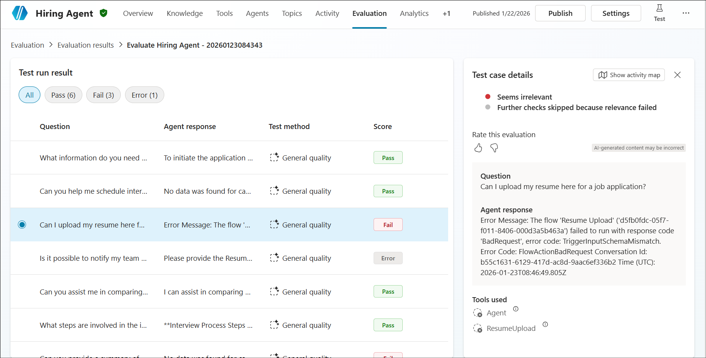

## 작업 2: 에이전트 분석으로 인사이트를 얻기

에이전트가 평가되고 적극적으로 사용되면, 대규모에서 일관된 성능과
신뢰성을 보장하기 위해 지속적인 모니터링이 필수적입니다. 이 작업에서는
Copilot Studio의 분석 기능을 탐색하여 에이전트 사용, 실행 추세, 구성
요소 활용도에 대한 인사이트를 얻게 됩니다. 분석 데이터가 성능 병목을
현상을 식별하고, 사용자 상호적용 패턴을 이해하며, 시간이 지남에 따하
애이전트의 지속적인 최적화를 안내하는 데 어떻게 도움이 되는지 배울 수
있습니다.

1.  상단 메뉴 바에서 **Analytics**를 선택하세요.

> 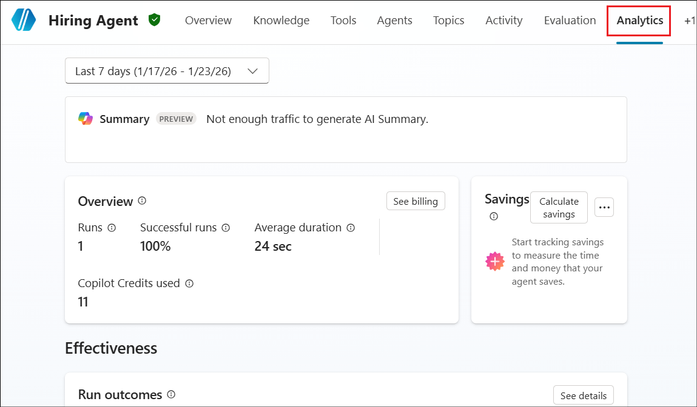

2.  실행 횟수가 많아지고 에이전트가 점점 더 많이 사용될수록 트래픽이
    증가하며, AI 요약은 Analytics 탭에서 찾을 수 있습니다.

> 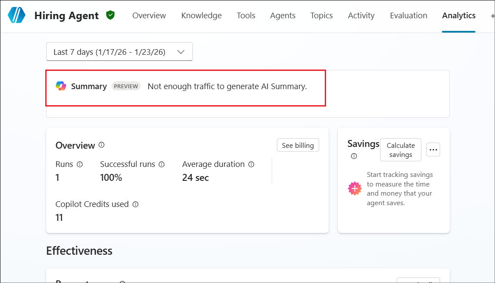

3.  **Overview** 섹션은 연속 기록과 크레딧에 대한 전반적인 그림을
    제공합니다.

> 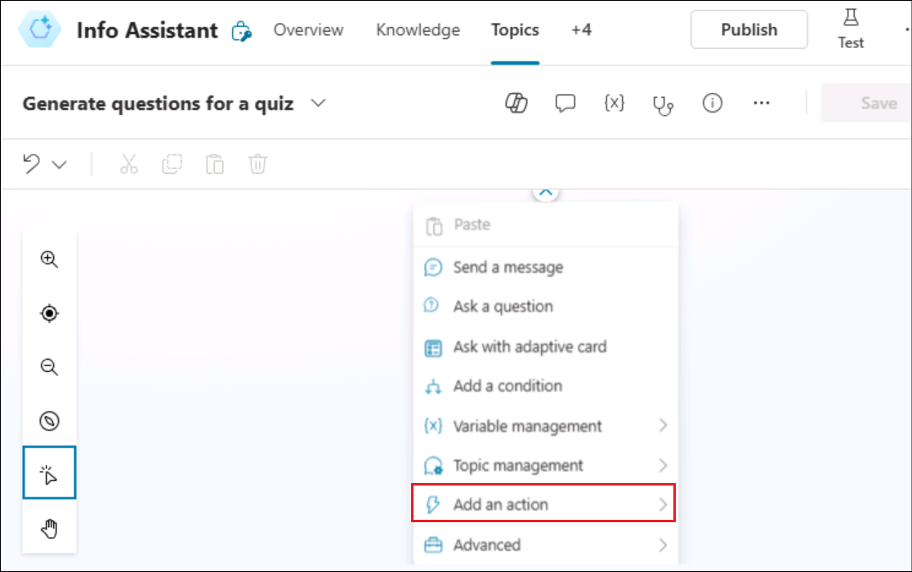

4.  Run 결과는 평균 지속 시간 추세를 제공합니다.

> 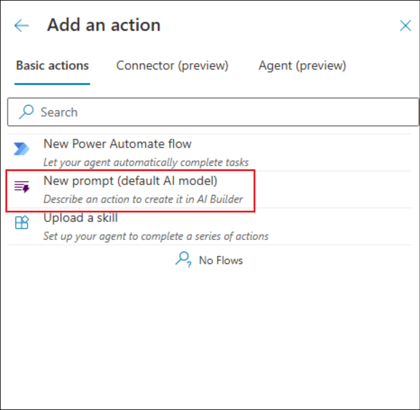

5.  아래로 스크롤하여 Use 섹션 아래에서 트리거, 도구, 지식 소스의
    사용법을 확인할 수 있습니다.

> 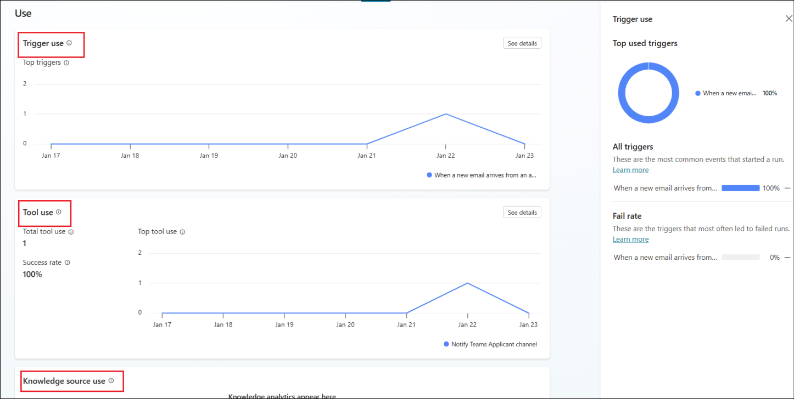

6.  각 기능은 에이전트의 각 구성 요소 사용을 평가하고 에이전트 기능을
    적절히 업그레이드, 향상 또는 수정하는 데 도움을 줍니다.

## 요약

이 실습에서는 AI ㅇ에이전트의 품질과 신뢰성을 평가하기 위해 자동화된
평가 및 분석을 도입했습니다. 현실적인 사용자 상호적용을 시뮬레이션하는
테스트 세트를 생성하고, 응답 정확도와 관련성을 측정하기 위한 평가를
수행했으며, 개선이 필여한 부분을 찾기 위해 합격/불합격 결과를
검토했습니다.

또한 에이전트 분석을 통해 트리거, 도구, 지식 소스 전반에 걸친 사용 패턴,
실행 추세, 구성 요소 활용도를 이해하셨습니다. 이 기능들이 결합되면, 수동
테스트를 넘어 확장 가능하고 데이터 기반 에이전트 검증 방식을 채택할 수
있습니다. 이 실습은 자동화된 테스트와 분석이 어떻게 에이전트가 신뢰할 수
있고 성능이 뛰어나며 실제 비즈니스 시나리오에 대비하도록 돕는지
보여줍니다.
