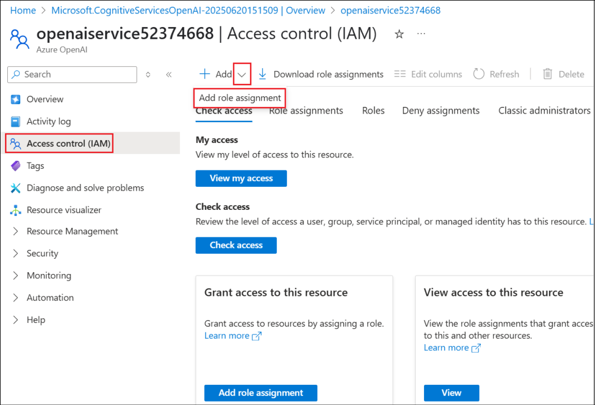
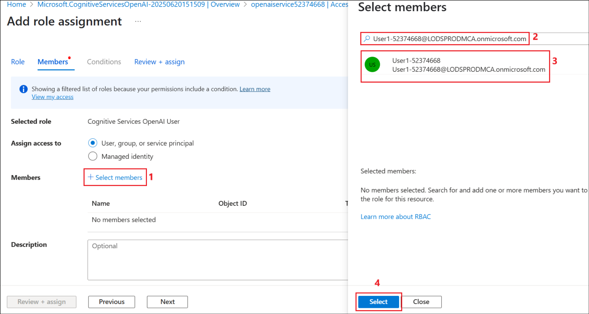
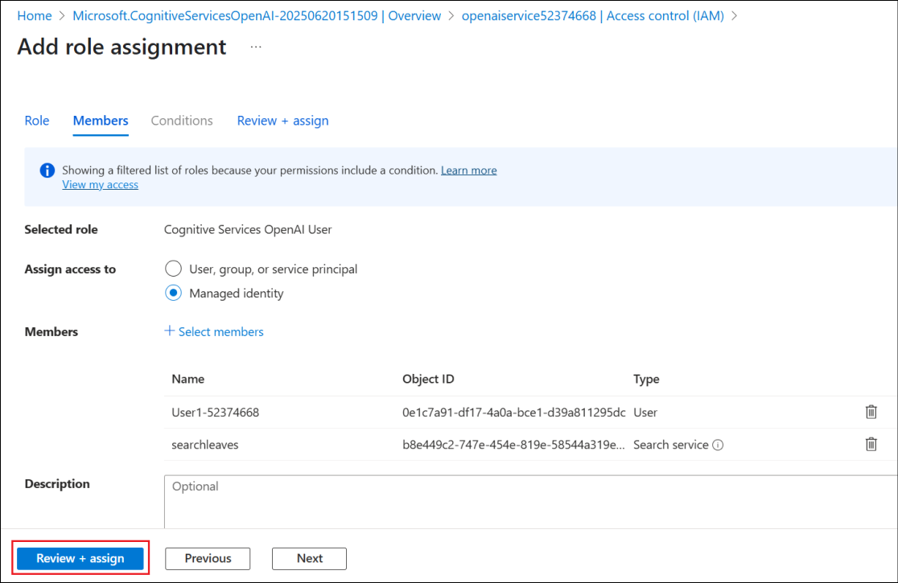

# 實驗 10 - 在利用 Azure AI 搜索的 Copilot Studio 中創建 HR 知識助手代理

## 目的

一家大型企業希望減少員工在 SharePoint、PDF、內部 Wiki 和文檔中搜索 HR
相關信息（政策、福利、休假指南等）所花費的時間。

為了克服這個問題，在本實驗中，您將在 **Copilot Studio** 中構建一個
**Knowledge assistant agent**，該代理使用 **Azure AI Search** 在企業 HR
文檔中進行索引和語義搜索。

## 練習 1：創建 Azure AI 搜索資源

1.  在 Azure 門戶的主頁中，選擇 **Azure AI Foundry。**

2.  在 **AI Foundry** 頁面中，從左側窗格中選擇 **AI Search**，然後選擇
    **+ Create**。

3.  輸入以下詳細信息，然後選擇 **Review + create**。

- Subscription – 選擇您的 **assigned subscription**

- Resource group – 選擇您的 **assigned Resource group**
  (**ResourceGroup1**)

- 存儲帳戶名稱 – +++**searchleaves**+++

- 位置 – 選擇您的 **assigned region**

4.  驗證通過後，選擇 **Create** 。

5.  部署需要幾分鐘時間。創建 搜索服務後，選擇 **Go to resource**。

6.  在 **Overview** 頁面中，複製 Url
    值並將其保存在記事本中，以便在將來的練習中使用。

7.  選擇 **Keys** 下 **Settings** 從左側窗格中。複製 **Primary admin
    key** 並將其保存在記事本中，以便在即將到來的練習中使用。

8.  在 左側窗格中的 **Settings** 下選擇 **Identity**。

9.  將 狀態 切換為 **On** 在 系 **System assigned** 下，然後單擊
    **Save**。

10. 在“**Enable system assigned managed
    identity**”對話框中選擇“**Yes**”。

## 練習 2：創建存儲帳戶

1.  通過 +++https://portal.azure.com/+++ 登錄到 Azure
    門戶，並使用您的憑據登錄。從主屏幕中選擇 Storage accounts。

2.  選擇“**+ Create**”以創建新的存儲帳戶。

3.  輸入以下詳細信息，接受其他字段中的默認值，然後單擊 **Review +
    create**。

- Subscription – 選擇您的 **assigned subscription**

- Resource group – 選擇您的 **assigned Resource group**
  (**ResourceGroup1**)

- Region – 選擇您的 **assigned region**

- 存儲帳戶名稱 – +++**leavepolicystorage**+++

- 主要服務 – 選擇 **Azure Blob Storage or Azure Data Lake Storage Gen
  2**

> 

4.  驗證通過後，單擊 **Create**。

5.  資源創建成功後，單擊 **Go to resource**。

6.  在 **Data storage** 下選擇 **Containers**。選擇 **+
    Container**，輸入名稱 +++**document**+++，然後單擊 **Create**
    創建容器。

7.  選擇創建的容器 **document** ，將休假策略文檔上傳到其中。

8.  單擊 **Upload**，然後選擇 **Browse for files**。

9.  從 **C：\Labfiles** 中選擇 **LeavePolicy.docx**，然後單擊
    **Upload**。

10. 導航到 **leavepolicystorage** 存儲帳戶（從 Azure 門戶的 **Home
    page** 中選擇 **Storageaccounts**，然後選擇
    leavepolicystorage），**Access Control (IAM)**。選擇 **Add -\> Add
    role assignment**。

11. 搜索 **+++Storage Blob Data Reader+++**，選擇它，然後單擊“
    **Next**”。

12. 點擊 **+Select members**，搜索並選擇您的 **user id**，選擇列出的
    **user id**，然後單擊 **Select**。這會將“存儲 Blob
    數據讀取者”角色添加到你的用戶 ID 中。

13. 選擇“**Managed identity**”，然後選擇**+ Select
    members**”。在“**Managed identity**”下選擇“**Search
    service**”，然後選擇列出的 **searchleaves** 搜索服務。

14. 單擊 **Select** 以選擇搜索服務。

15. 返回 Add role assignment 屏幕，單擊 **Review + assign**。

16. 在下一個屏幕中再次選擇 **Review + assign**。

17. 添加角色後，請繼續執行下一步。

在本練習中，我們創建了一個 Storage 帳戶，並向其添加了文檔和所需的 Role
權限。

## 練習 3：創建 Azure OpenAI 服務並部署模型 

1.  在 Azure 門戶主頁中，搜索選擇“+++Azure OpenAI++”。

2.  選擇 **+ Create**。

3.  輸入以下詳細信息，然後選擇 **Next**。

- Subscription – 選擇您的 **assigned subscription**

- Resource group – 選擇您的 **assigned Resource group**
  (**ResourceGroup1**)

- Region – 選擇您的 **assigned region**

- 名字 – +++**openaiservice52374668**+++

- 定價層 – Select **Standard**

4.  在接下來的 2 個屏幕中選擇 **Next**，在 **Review + submit**
    屏幕中選擇 **Create**。

5.  創建服務後**，**單擊 **Go to resource**。

6.  從 左側窗格中選擇 **Access control （IAM），**然後選擇 **Add -\> Add
    role assignment**。

7.  搜索 **+++Cognitive Services OpenAI User+++**，選擇角色，然後單擊
    **Next**。

8.  選擇 **+ Select members**，搜索您的 **user id**，選擇它，然後單擊
    **Select**。

9.  返回 **Add role assignment** 屏幕，選擇 **Managed
    identity**。然後選擇 **+ Select members**。在 **Select managed
    identities** 屏幕中，選擇 **Managed identity** 下的 **Search
    service**，然後選擇 **seachleaves** 服務。

10. 選擇後，單擊 **Select**。

11. 在接下來的 2 個屏幕中選擇 Review + assign。

12. 請等待有關 角色添加的 **success** 消息，然後再繼續執行下一個任務。

13. 在 Azure OpenAI 服務資源的“**Overview**”頁中，選擇“**Go to Azure AI
    Foundry portal**”，在其中打開 Azure OpenAI 服務並部署模型。

14. 從 左側窗格中選擇 Deployments。

15. 選擇 **+ Deploy model -\> From base models**。

16. 搜索 **+++text-embedding+++**，選擇 **text-embedding-3-large**
    ，然後選擇 **Confirm**。

17. 在 Deploy text-embedding-3-large 中選擇 **Deploy**。

18. 模型將部署，並且屏幕將加載部署詳細信息。

## 練習 4：創建向量索引

1.  轉到 **searchleaves** AI Search 服務資源。選擇 **Import and
    vectorize data**。

2.  選擇 **Azure Blob Storage** 選項。

3.  在“**What scenarios are you targeting?**”屏幕中選擇 **RAG** 選項。

4.  輸入以下詳細信息，接受其他值作為默認值，然後單擊 **Next**。

- Subscription – 選擇您的 **assigned subscription**

- 存儲帳戶 - 選擇 **leavepolicystorage**

- Blob 容器 – 選擇 **document**

5.  在 Vectorize your text 屏幕中，訂閱和 Azure OpenAI
    資源詳細信息已預先填充。輸入以下詳細信息，然後單擊 **Next**。

- 模型部署 – 選擇 **text-embedding-3-large**

- Authentication type – 選擇 **System assigned identity**

- 選中複選框以確認 Azure OpenAI 的成本警報。

6.  在 **Vectorize and enrich your images** 屏幕中選擇 下一步
    ，因為我們在這裡不處理圖像，然後在 **Advanced settings** 屏幕中選擇
    **Next** 。

7.  在 **Review + create** 屏幕中選擇 **Create** 。

8.  單擊 成功對話框中的 **Close**。

## 練習 5：創建知識助手代理

1.  使用您的登錄憑證登錄 +++https://copilotstudio.microsoft.com+++。

2.  從 左側窗格中選擇 **Create**。

3.  選擇 **+ New agent** 創建新代理。

4.  輸入 +++ You are a Knowledge assistant agent for HR who will answer
    questions related to leaves and leave policies to the
    employees.+++，然後選擇 **Send**。

> 

5.  Copilot 向代理建議一個名稱。單擊 **Create** 以創建代理。

6.  創建代理後，在 Test 窗格中輸入 +++How many days I can avail PARITIES
    leaves？+++，然後單擊 **Send。**

7.  它給出了一個通用的回答，如下面的屏幕截圖所示。

## 練習 6：將 Azure AI 搜索添加為知識源

1.  從 代理的 **Overview** 頁面中，選擇 **Add knowledge**。

2.  從可用知識源列表中選擇 Azure AI 搜索。

3.  單擊下一個屏幕中 **Not connected**旁邊的 **drop down**
    菜單，然後選擇 **Create new connection**。

4.  輸入 我們在上一個練習中保存到記事本的 **Endpoint url** 和 **Admin
    key** 值，然後單擊 **Create** 以創建連接。

5.  建立連接後，將列出可用索引並已選中。單擊 **Add**。

6.  AI Search 服務已作為知識源添加到代理，現在處於 **Ready** 狀態。

7.  現在，讓我們使用之前嘗試的相同問題來測試代理。

8.  在 Test 窗格中，輸入 +++How many days I can avail
    falls？+++，然後單擊 **Send。**

9.  您可以看到，代理現在的響應來自在 AI Search 服務中上傳的文檔。

## 總結

在本實驗中，我們學習了如何將代理連接到作為知識源的 Azure AI
搜索服務，並根據源測試代理。

