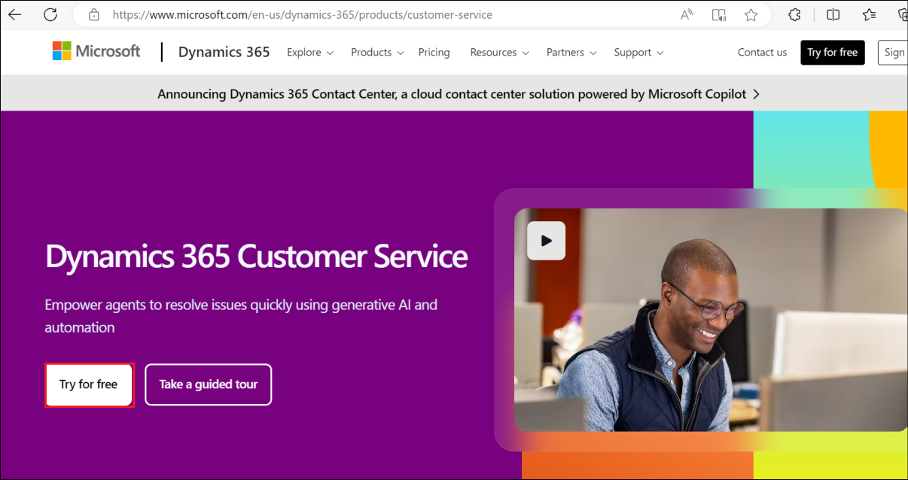
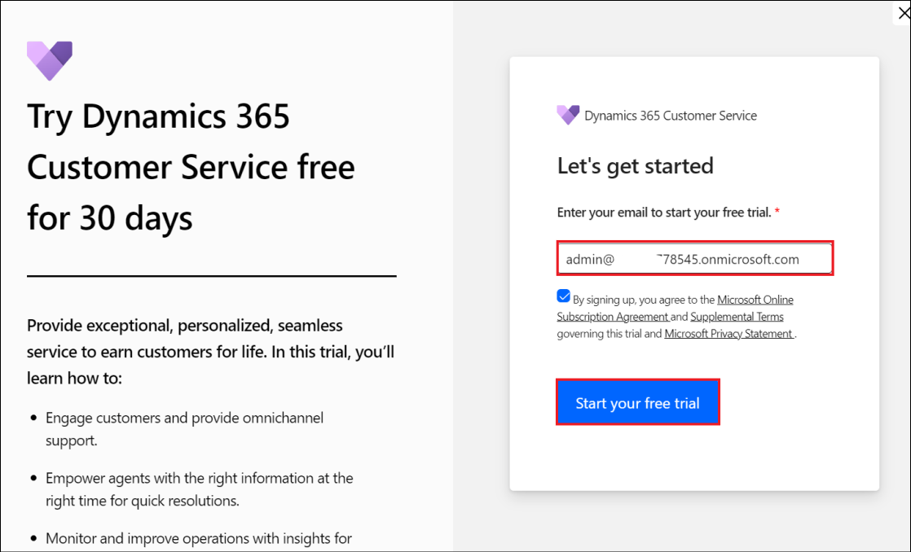
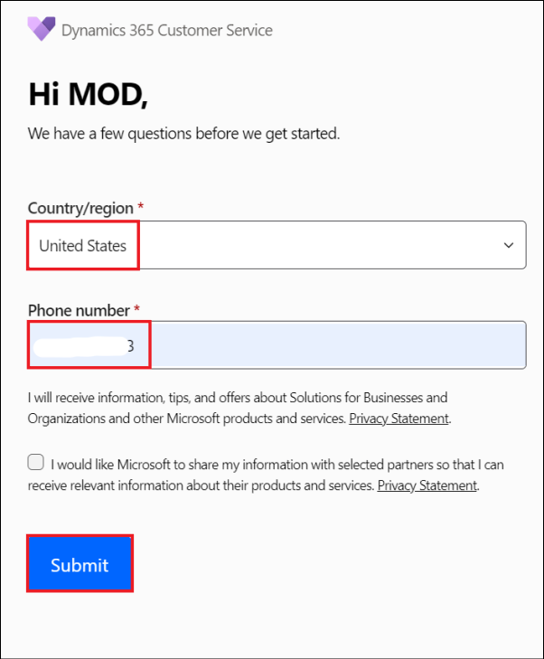

# Lab 02 - Configure the Dynamics 365 Customer Service

## Objective

In this lab, you will create a security group in Azure to update
settings in Copilot Studio and then activate the **Dynamics 365 Customer
Service trial**.

## Task 1: Create Security Group in Entra ID and Configure Copilot Studio Authors

1.  Navigate to +++https://portal.azure.com/+++ azure portal and login
    with your login credentials.

    

    

    

2.  Select **Next** in the Keep your account secure window and follow
    the **prompts**.

    

3.  Download the Authenticator app in your phone if you do not have it
    already.

    

4.  Follow the prompts and complete the setup.

    

    

    

    

5.  In the Azure welcome screen, select **Get Started**.

    

6.  Search for and select +++Microsoft EntraID+++.

    

7.  From the left pane, select **Manage** -\> **Groups**.

    

8.  Select **New group** to create a new security group.

    

9.  Enter the below details

    - Group type – Select **Security**

    - Group name – Enter +++**copilotagentsecurity**+++

    - Microsoft Entra roles can be assigned to the group – Select **Yes**

    

10. Select **No owners selected**, select the **MOD Administrator** from
    the **Add owners** page and click on **Select**.

    

    

11. Similarly, select **No members selected**, and add the **MOD
    Administrator** from the list and click on **Select**.

    

12. Select **No roles selected**.

    

13. Search for and select +++**Global admin**+++ and select **Select**.

    

14. Select **Create** once all the details are added and select **Yes**
    in the confirmation dialog.

    

    

15. Ensure that you get a **success** message.

    

16. From a new tab, navigate to
    +++https://powerplatform.microsoft.com+++. Select **Manage** from
    the left pane and then select the **Tenant Settings** option.

    

17. Select **Copilot Studio Authors** from the list available.

    

18. Click on the **Edit** icon to edit the settings.

    

19. Search for and select the **copilotagentsecurity** group that you
    created earlier.

    

20. Select **Save** to save the settings.

    

## Task 2: Sign up for Dynamics 365 Customer Service trial

1.  Login to
    +++https://dynamics.microsoft.com/en-us/customer-service/overview/+++

2.  Login using the **Office 365 Tenant details** from the **Resources** tab
    if prompted.

3.  Click on **Try for free**

    

4.  Enter your **Office 365 Administrative Username** from
    the **Resources** tab, select the check box and click on **Start
    your free trial**.

    

5.  Enter the region as **United States**, enter your **Phone
    number** and click on **Submit**.

    

6.  If you see an option to Launch Trial for Engage customers, click
    on **Launch Trial**.

    

7.  Once activated, your Customer Service workspace will get opened.

    

## Summary

In this lab, we have activated the Dynamics 365 Customer Service which
will be used in the **Lab 04 - Integrate an agent with the Dynamics 365
Customer Service app and implement automated case escalation to the live
agent**.
