# Lab 02 - Configure the Dynamics 365 Customer Service

## Objective

In this lab, you will create a security group in Azure to update tenant settings in Copilot Studio and then activate the **Dynamics 365 Customer Service trial**.

## Task 1: Create Security Group in Entra ID and Configure Copilot Studio Authors
1.	Navigate to +++https://portal.azure.com/+++ azure portal and login with your login credentials.

  	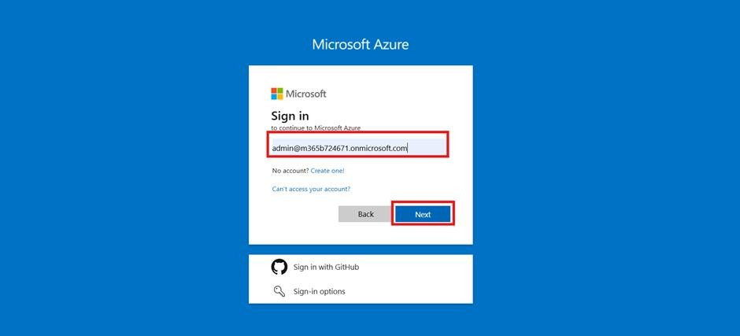

    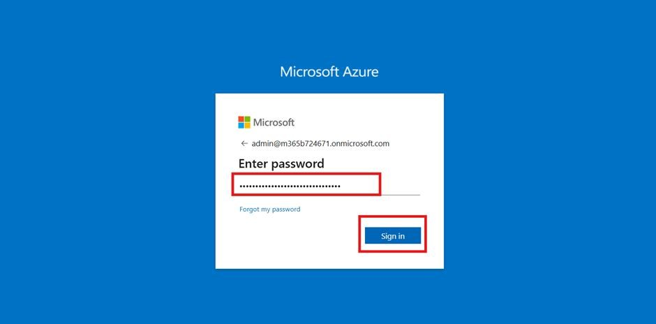
  	
3.	Click **Yes** to stay signed in.
   
    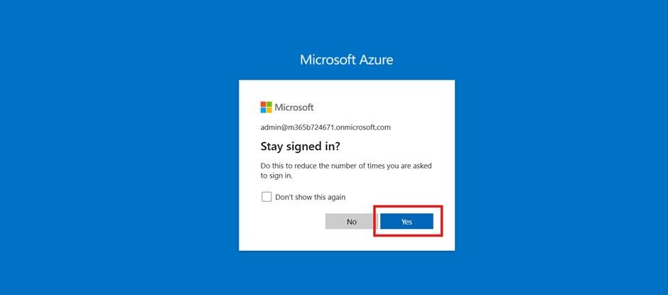
  	
5.	Click **Postpone MFA** to delay multi-factor authentication.

    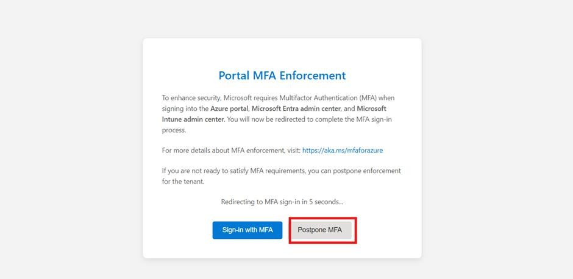
  	
7.	Click **Confirm** postpone.

    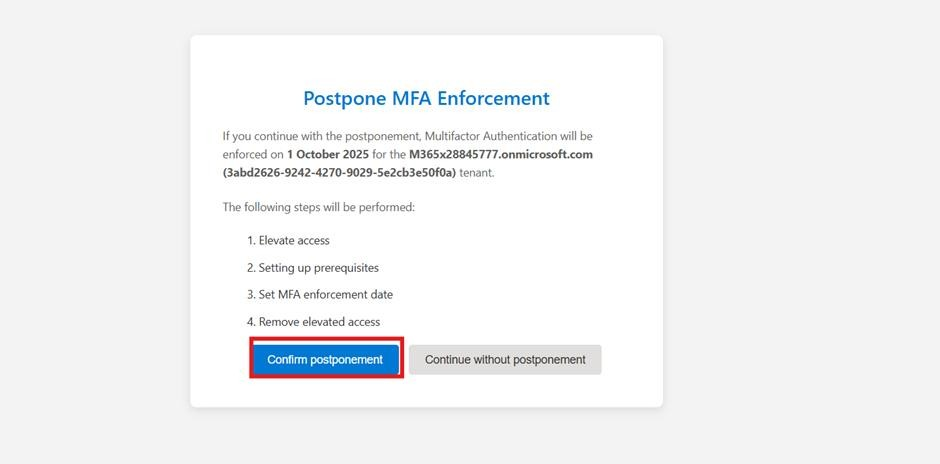
  	
9.	Click **Continue sign in without MFA**.

    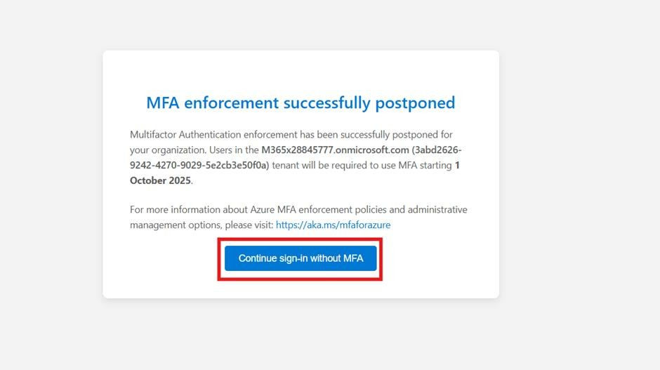
  	
11.	Click **Get started** to proceed.

    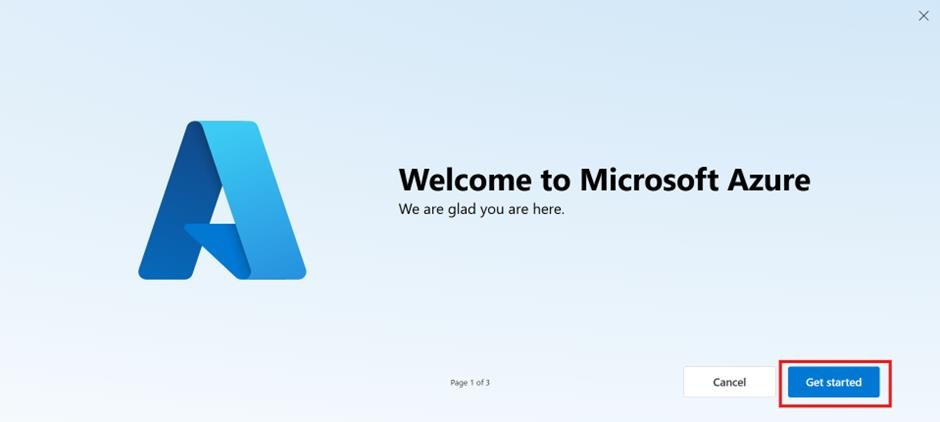
   	
13.	Click **Skip**, then click **Skip** again.

    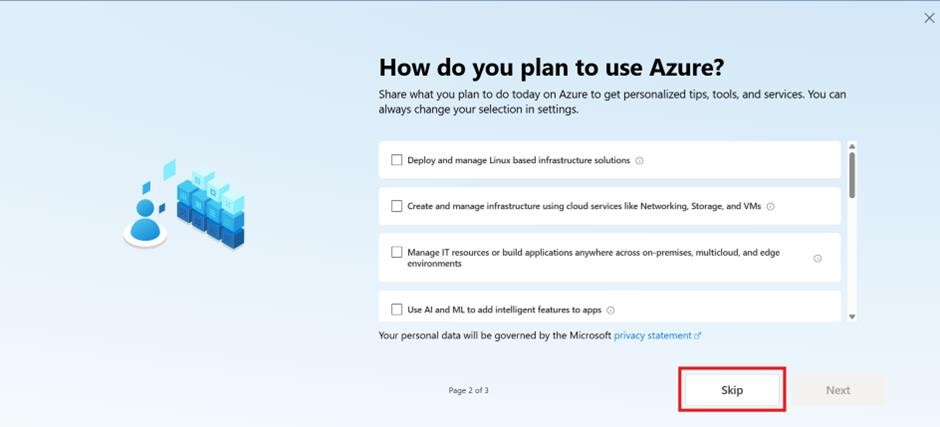

    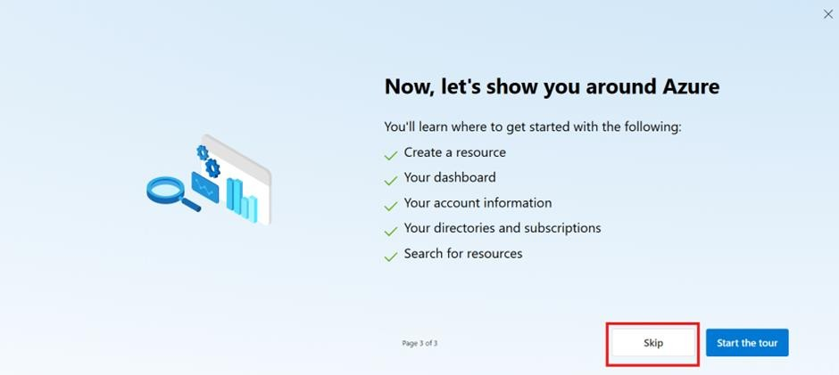
   	
15.	From the Azure home page, search for and  select +++**Microsoft Entra ID**+++.

    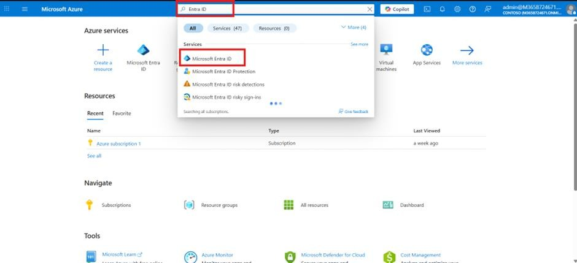
   	
17.	Under **Manage**, select **Groups** to create a new security group.

     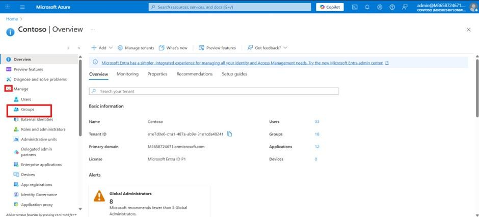
   	
19.	Click **New group** from the top bar.

    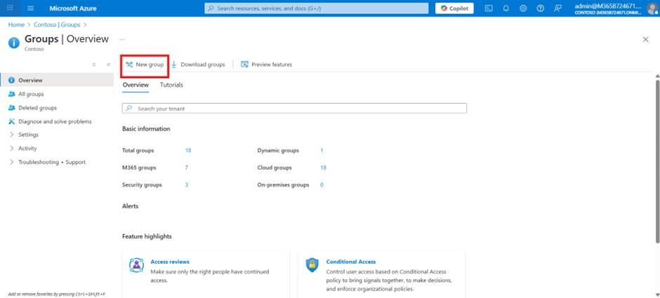
   	
21.	Select **Security** as the group type.
22.	In the Group name field, enter +++copilotagentsecurity+++.
23.	Set the Role assign to group option to **Yes**.
24.	Click **No owner selected**, enter MOD, select MOD Administrator, and click **Select**.    
25.	Click **No role selected**, enter MOD, select MOD Administrator as a member, and click **Select**.  
26.	Click **No member selected**, enter MOD, select MOD Administrator as a member, and click **Select**.  
27.	Enter +++Global Admin+++ in the field and select **Global Administrator Role**. From the bottom click on the **Select** button.  
28.	Click **Create** to create the new Entra group.  
29.	Click **Yes** to confirm.  
30.	Navigate to +++https://admin.powerplatform.microsoft.com/+++ power platform admin center and login with your credentials.
 
31.	Click **Yes** to stay signed in.  
32.	From the left menu, select **Manage**, then **Tenant settings**, and choose **Copilot Studio authors (preview)** setting.  
33.	Select **Edit** icon to add a security group.  
34.	Enter **+++copilotagentsecurity+++** in the field, select the security group, and click **Done**.  
35.	Click **Save** to apply the settings.  

## Task 2: Sign up for Dynamics 365 Customer Service trial

1.  Open a browser and login to
    +++https://dynamics.microsoft.com/en-us/customer-service/overview/+++

2.  Login using your tenant credentials.

    - Username - +++@lab.CloudPortalCredential(User1).Username+++
    
    - Password - +++@lab.CloudPortalCredential(User1).Password+++

4.  Click on **Try for free**

    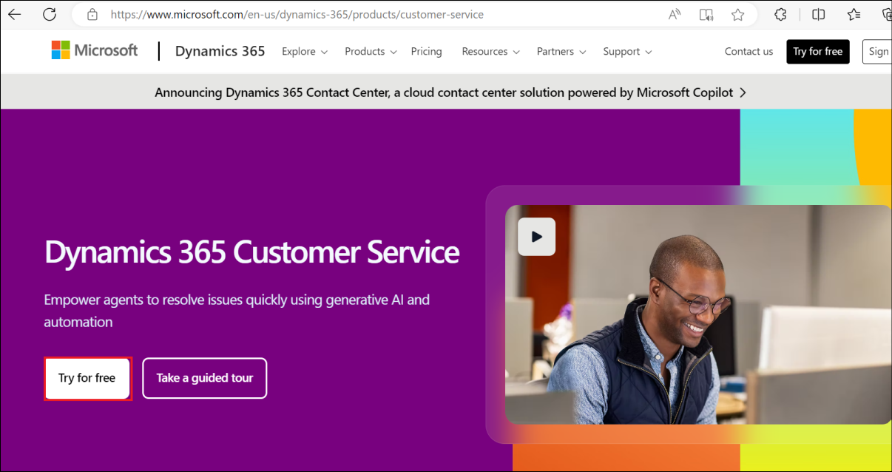

5.  Enter your Username, +++@lab.CloudPortalCredential(User1).Username+++, **select** the **check box** and click on **Start your free trial**.

    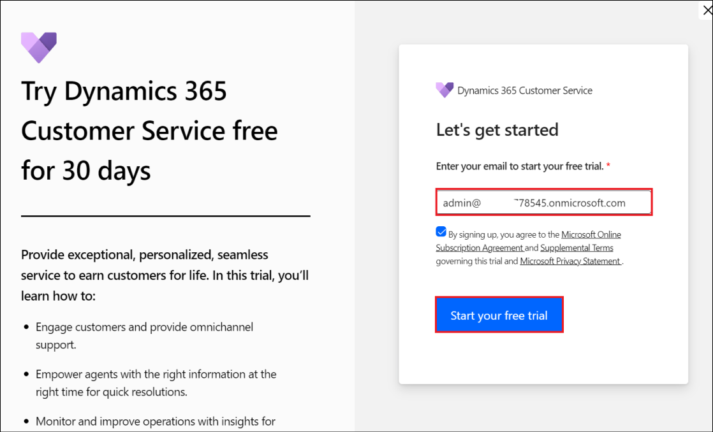

6.  Enter the region as **United States**, enter your **Phone number** and click on **Submit**.

    

7.  If you see an option to Launch Trial for Engage customers, click
    on **Launch Trial**.

    

8.  Once activated, your Customer Service workspace will get opened.

    

## Summary

In this lab, we have activated the Dynamics 365 Customer Service which
will be used in the **Lab 04 - Integrate an agent with the Dynamics 365
Customer Service app and implement automated case escalation to the live
agent**.

